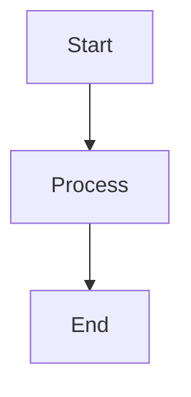
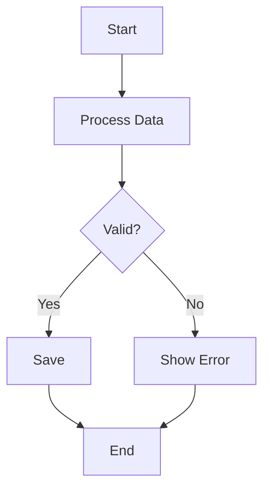
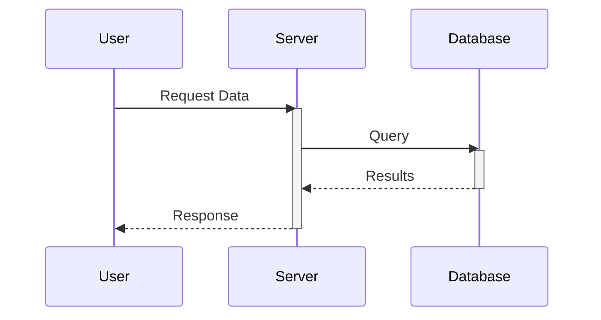
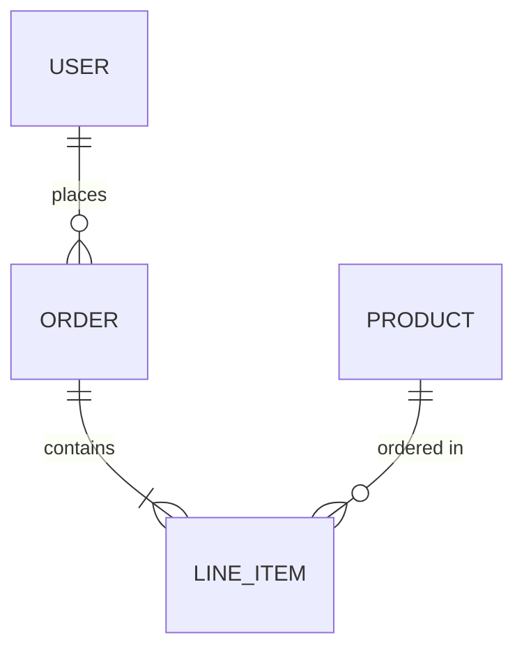
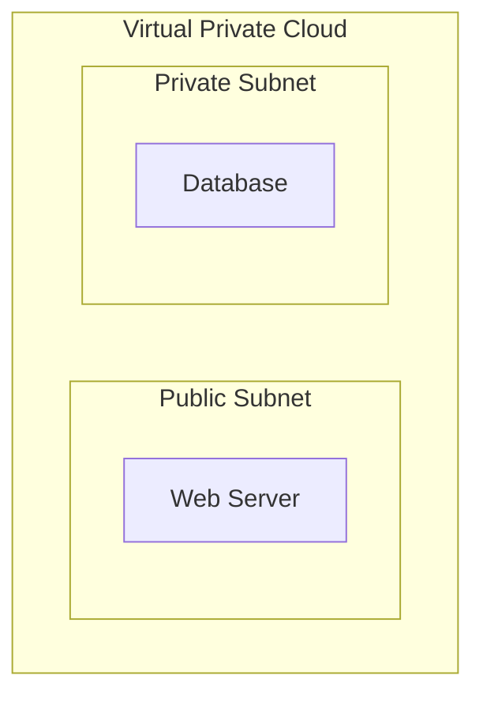
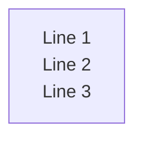
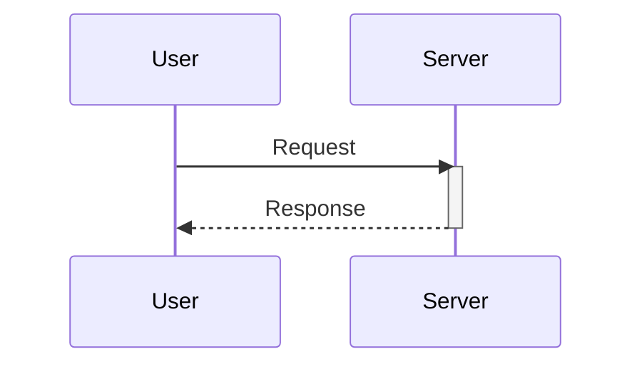

# Contributing to Sujith's Library

Thank you for your interest in contributing to Sujith's Library! This project is an open-source knowledge base for computer science and software engineering topics. We welcome contributions from developers, students, and educators to help build a comprehensive resource for learning and reference.

## Ways to Contribute

- **Add new content**: Write tutorials, explain concepts, share code examples
- **Improve existing content**: Fix errors, clarify explanations, update outdated information
- **Enhance the site**: Improve documentation, fix bugs, add features
- **Report issues**: Help identify problems or suggest improvements

## Getting Started

1. Fork the repository
2. Clone your fork: `git clone https://github.com/your-username/library.git`
3. Install dependencies: `npm ci`
4. Start development server: `npm run docs:dev`
5. Make your changes
6. Test your changes
7. Submit a pull request

## Content Guidelines

All content must follow our formatting standards to maintain consistency and readability. Please review the [Content Style Guide](STYLE_GUIDE.md) before contributing.

## Adding New Content

### Where to Place Pages

All content pages are stored in the `docs/` directory. Pages are organized by topic in subfolders:

- `docs/c/` - C programming
- `docs/java/` - Java programming  
- `docs/java-script/` - JavaScript
- `docs/python/` - Python
- `docs/os/` - Operating Systems
- `docs/dbms/` - Database Management
- `docs/dev-cloud/` - Cloud & DevOps
- And other topic folders as needed

### Creating a New Page

1. **Create the Markdown file** in the appropriate `docs/` subfolder:
   ```
   docs/java-script/new-topic/my-page.md
   ```

2. **Add an entry to the sidebar** in the corresponding `*Sections.ts` file:
   ```typescript
   // docs/.vitepress/theme/data/fileStructures/jsSections.ts
   { label: 'My Page', link: '/java-script/new-topic/my-page' }
   ```

3. **Test locally** by running `npm run docs:dev` and checking that your page appears in the sidebar and loads correctly.

### File and Folder Naming Conventions

- **Folders**: Use lowercase with hyphens for folder names: `java-script/`, `dev-cloud/`, `data-structures/`
- **Files**: Use descriptive names with optional numeric prefixes for ordering: `01_basics.md`, `02_advanced.md`, `algorithms.md`
- **Links**: Use root-relative paths with leading slash in sidebar configurations: `/java-script/new-topic/my-page`
- **Consistency**: Match existing naming patterns in each topic folder

### Content Organization Tips

- Place related content in the same subfolder
- Use clear, descriptive filenames that indicate the topic
- If creating a new topic folder, follow the existing structure and update the sidebar configuration accordingly
- Check existing pages in the same topic for style and organization reference

## Code of Conduct

This project follows a code of conduct to ensure a welcoming environment for all contributors. Be respectful, constructive, and collaborative.

## License

By contributing to this project, you agree that your contributions will be licensed under the same license as the project (see LICENSE file).

---

# Content Style Guide

This section defines the formatting standards for all Markdown content in this project.

## Heading Hierarchy

| Level | Usage | Example |
|-------|-------|---------|
| `#` (h1) | Page title — **one per page** | `# Custom VPC Configuration` |
| `##` (h2) | Main sections | `## Create a New VPC` |
| `###` (h3) | Subsections, multi-step processes | `### Option A: Using Console` |
| `####` (h4) | Deep nesting within subsections | `#### Configuration Details` |

### Rules

- **One h1 per page** — The page title only.

- **No bold in headings** — Use plain text: `## Create Instance` not `## **Create Instance**`

- **No separators before h2** — VitePress auto-creates visual separators for `##` headings. Do not add `---` before them.

## Line Spacing

In Markdown, two consecutive lines without a blank line between them will render as a single line.

**Incorrect** (renders as one line):

```markdown
This is line one.
This is line two.
```

**Correct** (renders as separate lines):

```markdown
This is line one.

This is line two.
```

Always leave at least one blank line between paragraphs or elements that should appear separately.

## Lists

### Unordered Lists

Use `-` for bullet points with consistent indentation:

```markdown
- First item
- Second item
    - Nested item (4 spaces indent)
    - Another nested item
- Third item
```

### Ordered Lists

Use `1.` for all items (Markdown auto-numbers):

```markdown
1. First step
2. Second step
3. Third step
```

## Tables

Use proper Markdown table syntax with alignment:

```markdown
| Feature | Description | Status |
|---------|-------------|--------|
| VPC | Virtual Private Cloud | ✅ Active |
| Subnet | Network subdivision | ✅ Active |
| NAT Gateway | Outbound internet access | ⚠️ Paid |
```

---

# Callout Blocks (Notes, Warnings, Tips)

VitePress supports GitHub-flavored callout blocks. Use these for important information.

## Syntax

> [!NOTE]
> This is helpful information.
> Informational notes for additional context.

> [!TIP]
> This is a helpful tip.
> Helpful tips and best practices.

> [!IMPORTANT]
> This is important information.
> Critical information users should know.

> [!WARNING]
> This warns about potential issues.
> Potential issues or things to watch out for.

> [!CAUTION]
> This warns about dangerous actions.
> Dangerous actions that could cause problems.

## Syntax Rules

- **Capitalize the keyword**: Use `[!NOTE]` not `[!note]` or `[!Note]` for consistency.

- **With titles**: You can add a title after the keyword:

  ```markdown
  > [!NOTE] Developer's Note
  > This is additional context for developers.
  ```

---

# Code Blocks

## Basic Syntax

Always specify the language for syntax highlighting:

````markdown
```bash
npm run docs:dev
```

```typescript
const config = defineConfig({ ... })
```

```json
{
  "name": "vu-library",
  "version": "1.0.0"
}
```
````

## Supported Languages

Common languages used in this project:

| Language | Identifier |
|----------|------------|
| Bash/Shell | `bash` or `sh` |
| JavaScript | `javascript` or `js` |
| TypeScript | `typescript` or `ts` |
| Python | `python` or `py` |
| Java | `java` |
| C | `c` |
| JSON | `json` |
| HTML | `html` |
| CSS | `css` |
| SQL | `sql` |
| Markdown | `markdown` or `md` |
| Plain text | `text` or `plaintext` |

## Code Block Features

### Line Numbers

Line numbers are enabled globally in `config.mts`. No additional markup needed.

### Line Highlighting

Highlight specific lines:

````markdown
```js{2,4-5}
const a = 1
const b = 2  // highlighted
const c = 3
const d = 4  // highlighted
const e = 5  // highlighted
```
````

### Code Groups

Group related code in tabs:

````markdown
::: code-group

```bash [npm]
npm install package-name
```

```bash [yarn]
yarn add package-name
```

```bash [pnpm]
pnpm add package-name
```

:::
````

---

# Mermaid Diagrams

## Theme-Aware Diagrams

All Mermaid diagrams are **automatically theme-aware**. Colors adapt to light/dark mode via CSS variables defined in `docs/.vitepress/theme/mermaid.css`. You do not need to add `classDef` or `style` directives — the theme handles styling consistently.

## Basic Usage

Embed diagrams using fenced code blocks with `mermaid` language:

````markdown

````

## Layout Direction

| Direction | Use Case |
|-----------|----------|
| `flowchart TD` | **Default** — Top to Down, best for complex diagrams |
| `flowchart LR` | Left to Right — only for simple linear flows (5-6 nodes max) |
| `flowchart BT` | Bottom to Top — rarely used |
| `flowchart RL` | Right to Left — rarely used |

> [!IMPORTANT]
> Avoid `flowchart LR` for diagrams with many nodes or subgraphs — they become too small horizontally.

## Best Practices

1. **Do NOT hardcode colors** — Let the CSS handle styling for theme consistency.

2. **Keep diagrams simple** — Break complex flows into multiple smaller diagrams.

3. **Use descriptive node IDs** — `UserAuth` instead of `A` for readability.

4. **Avoid reserved keywords** — Don't use `end`, `start`, `graph`, `subgraph` as node IDs.

5. **Wrap special characters** — Use quotes: `A["Node with (parentheses)"]`

## Supported Diagram Types

The theme covers all common Mermaid diagram types:

| Type | Syntax Start | Use Case |
|------|--------------|----------|
| Flowchart | `flowchart TD` | Process flows, decision trees |
| Sequence | `sequenceDiagram` | API calls, interactions |
| Class | `classDiagram` | OOP class structures |
| State | `stateDiagram-v2` | State machines |
| ER | `erDiagram` | Database schemas |
| Gantt | `gantt` | Project timelines |
| Pie | `pie` | Data distribution |
| Mindmap | `mindmap` | Hierarchical concepts |
| Git Graph | `gitGraph` | Branch visualization |

## Common Diagram Examples

### Flowchart



### Sequence Diagram



### Entity Relationship



## Subgraph Styling

Subgraphs are automatically styled. Just define them:



## Mermaid Syntax Tips

### Line Breaks in Nodes

Use `<br>` for multi-line text:



### Sequence Diagram Activation

Use explicit `activate`/`deactivate` keywords:



## Theme Color Reference

The CSS provides these semantic color categories (applied automatically):

| Category | Light Mode | Dark Mode | Applied To |
|----------|------------|-----------|------------|
| Default | Soft blue | Deep blue | Standard nodes |
| Primary | Indigo | Navy blue | Highlighted nodes |
| Secondary | Green | Emerald | Success/secondary |
| Tertiary | Pink | Magenta | Alternative nodes |
| Accent | Yellow | Amber | Decision points |
| Success | Green | Green | Success states |
| Warning | Orange | Warm orange | Warnings |
| Danger | Red | Red | Errors |

> [!NOTE]
> Colors rotate automatically across nodes for visual variety. No manual assignment needed.

## Standardization (Automatic)

The CSS enforces these standards across all diagrams:

| Aspect | Standard | Notes |
|--------|----------|-------|
| Border radius | 6px | Rounded corners on rectangles |
| Stroke width | 1.5px | Consistent line thickness |
| Font family | System fonts | -apple-system, Segoe UI, Roboto |
| Node text | 13px | Standard readability |
| Edge labels | 11px | Slightly smaller |
| Root/title | 14px bold | Emphasis on hierarchy roots |

## Tips for Cleaner Diagrams

1. **Avoid `::icon()` syntax** — Font Awesome icons may not render consistently; use emoji or text labels instead.

2. **Use simple node shapes** — Stick to `[]` rectangles, `{}` rhombus, `()` rounded, `(())` circles.

3. **Keep labels concise** — Long text wraps poorly; use `<br>` for controlled line breaks.

4. **Limit nesting depth** — Keep subgraphs/mindmaps to 3 levels for clarity.

---

# Math Equations (KaTeX)

## Inline Math

Wrap inline equations with single `$`:

```markdown
The formula $E = mc^2$ describes energy-mass equivalence.
```

## Block Math

Wrap block equations with double `$$`:

```markdown
$$
\int_{a}^{b} f(x) \, dx = F(b) - F(a)
$$
```

---

# Format Quick Reference

## Structure Rules

| Element | Rule |
|---------|------|
| Headings | One `#` per page, no bold inside headings |
| Separators | No `---` before `##` headings |
| Line spacing | Blank line between separate elements |
| Code blocks | Always specify language identifier |
| Callouts | Capitalize keyword: `[!NOTE]` |
| Diagrams | Theme-aware, no manual colors needed |
| Node IDs | Avoid reserved keywords (`end`, `start`, `graph`) |

---

# Configuration Reference

## Key Files

| File | Purpose |
|------|---------|
| `docs/.vitepress/config.mts` | Site configuration, plugins, theme |
| `docs/.vitepress/theme/mermaid.css` | Theme-aware Mermaid diagram styling |
| `docs/.vitepress/theme/data/fileStructures/*.ts` | Sidebar data structures |
| `docs/.vitepress/theme/utils/transformSectionsToSidebar.ts` | Sidebar generation utility |
| `package.json` | Dependencies and npm scripts |

## Do Not Modify

- `docs/.vitepress/dist/` — Generated build output
- `docs/.vitepress/cache/` — Build cache
- `docs/.vitepress/.temp/` — Temporary files