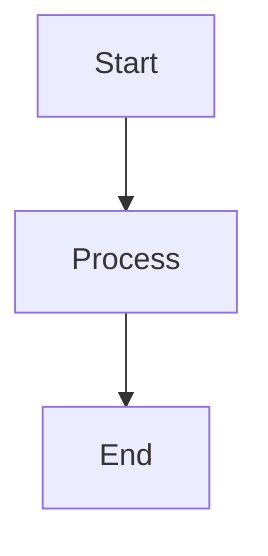
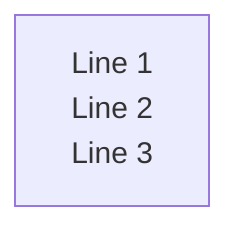
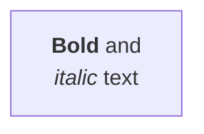
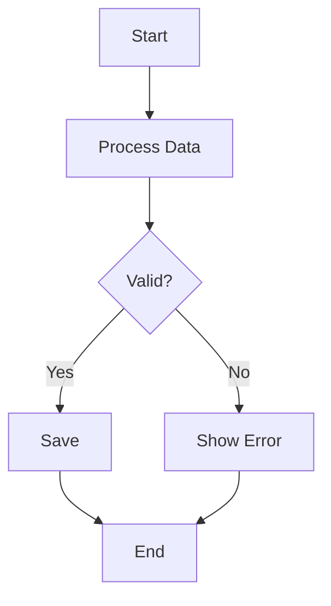
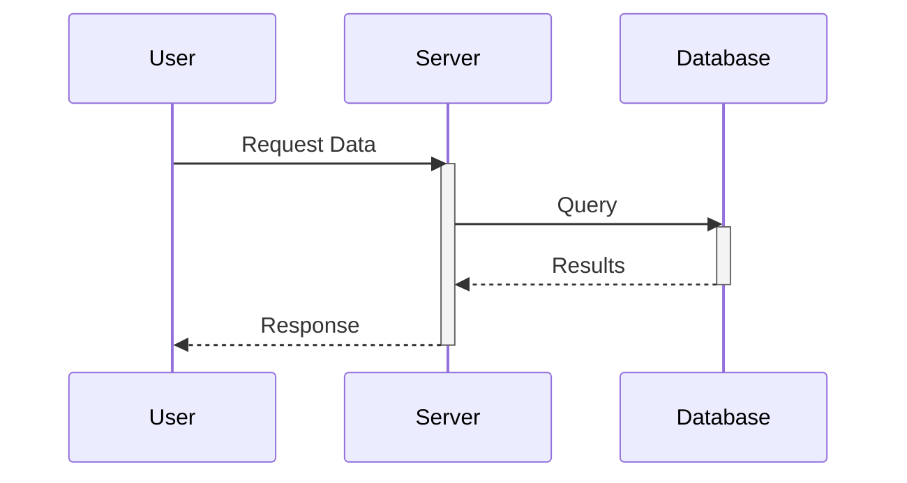
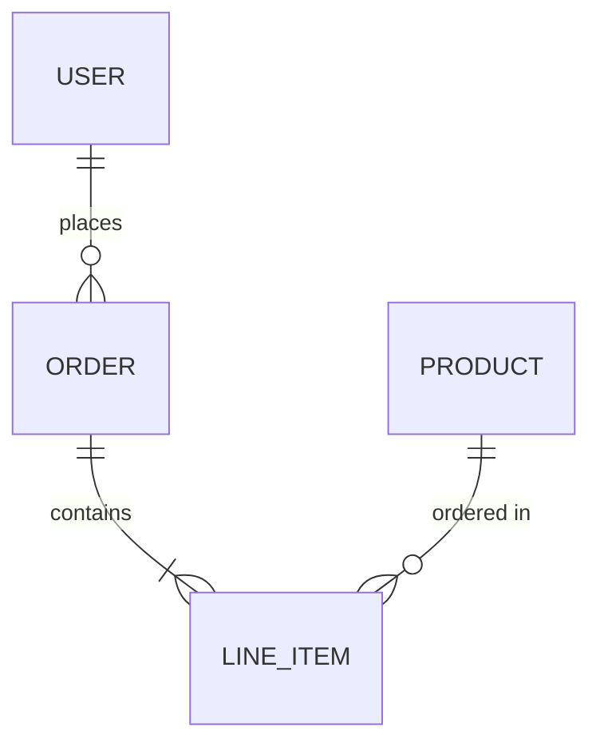
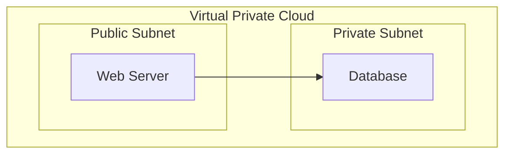
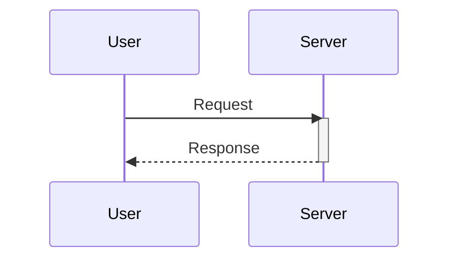

# Mermaid Diagrams

## Theme-Aware Diagrams

All Mermaid diagrams are **automatically theme-aware**. Colors adapt to light/dark mode via CSS variables defined in `docs/.vitepress/theme/mermaid.css`. You do not need to add `classDef` or `style` directives — the theme handles styling consistently.

## Basic Usage

Embed diagrams using fenced code blocks with `mermaid` language:

````markdown

````

## Layout Direction

| Direction | Use Case |
|-----------|----------|
| `flowchart TD` | **Default** — Top to Down, best for complex diagrams |
| `flowchart LR` | Left to Right — only for simple linear flows (5-6 nodes max) |
| `flowchart BT` | Bottom to Top — rarely used |
| `flowchart RL` | Right to Left — rarely used |

> [!IMPORTANT]
> Avoid `flowchart LR` for diagrams with many nodes or subgraphs — they become too small horizontally.

## Best Practices

1. **Do NOT hardcode colors** — Let the CSS handle styling for theme consistency.

2. **Keep diagrams simple** — Break complex flows into multiple smaller diagrams.

3. **Use descriptive node IDs** — `UserAuth` instead of `A` for readability.

4. **Avoid reserved keywords** — Don't use `end`, `start`, `graph`, `subgraph` as node IDs.

5. **Wrap special characters** — Use quotes: `A["Node with (parentheses)"]`

6. **Define all nodes first, then connections** — For cleaner, more readable code.

## Multi-line Text in Nodes

Use actual newlines inside double quotes "" or inside "``"  for multi-line labels. Avoid `<br/>` or `\n` as they may not render correctly with `htmlLabels: false`.



**For Markdown formatting**, use backticks inside quotes:



## Supported Diagram Types
The theme covers all common Mermaid diagram types:

| Type | Syntax Start | Use Case |
|------|--------------|----------|
| Flowchart | `flowchart TD` | Process flows, decision trees |
| Sequence | `sequenceDiagram` | API calls, interactions |
| Class | `classDiagram` | OOP class structures |
| State | `stateDiagram-v2` | State machines |
| ER | `erDiagram` | Database schemas |
| Gantt | `gantt` | Project timelines |
| Pie | `pie` | Data distribution |
| Mindmap | `mindmap` | Hierarchical concepts |
| Git Graph | `gitGraph` | Branch visualization |

## Common Diagram Examples

### Flowchart



### Sequence Diagram



### Entity Relationship



## Subgraph Styling

Subgraphs are automatically styled. Just define them:



## Mermaid Syntax Tips

### Sequence Diagram Activation

Use explicit `activate`/`deactivate` keywords:



### Sequence Diagram Notes

For multi-line notes in sequence diagrams, avoid indented continuation lines as they may cause parsing issues. Instead, use proper `Note` statements with newlines inside quotes or separate `Note` lines.

## Theme Color Reference

The CSS provides these semantic color categories (applied automatically):

| Category | Light Mode | Dark Mode | Applied To |
|----------|------------|-----------|------------|
| Default | Soft blue | Deep blue | Standard nodes |
| Primary | Indigo | Navy blue | Highlighted nodes |
| Secondary | Green | Emerald | Success/secondary |
| Tertiary | Pink | Magenta | Alternative nodes |
| Accent | Yellow | Amber | Decision points |
| Success | Green | Green | Success states |
| Warning | Orange | Warm orange | Warnings |
| Danger | Red | Red | Errors |

> [!NOTE]
> Colors rotate automatically across nodes for visual variety. No manual assignment needed.

## Standardization (Automatic)

The CSS enforces these standards across all diagrams:

| Aspect | Standard | Notes |
|--------|----------|-------|
| Border radius | 6px | Rounded corners on rectangles |
| Stroke width | 1.5px | Consistent line thickness |
| Font family | System fonts | -apple-system, Segoe UI, Roboto |
| Node text | 13px | Standard readability |
| Edge labels | 11px | Slightly smaller |
| Root/title | 14px bold | Emphasis on hierarchy roots |

## Tips for Cleaner Diagrams

1. **Avoid `::icon()` syntax** — Font Awesome icons may not render consistently; use emoji or text labels instead.

2. **Use simple node shapes** — Stick to `[]` rectangles, `{}` rhombus, `()` rounded, `(())` circles.

3. **Keep labels concise** — Long text wraps poorly; use actual newlines in quotes for controlled line breaks.

4. **Limit nesting depth** — Keep subgraphs/mindmaps to 3 levels for clarity.

5. **Define nodes before connections** — Improves readability and maintainability.
