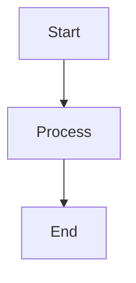
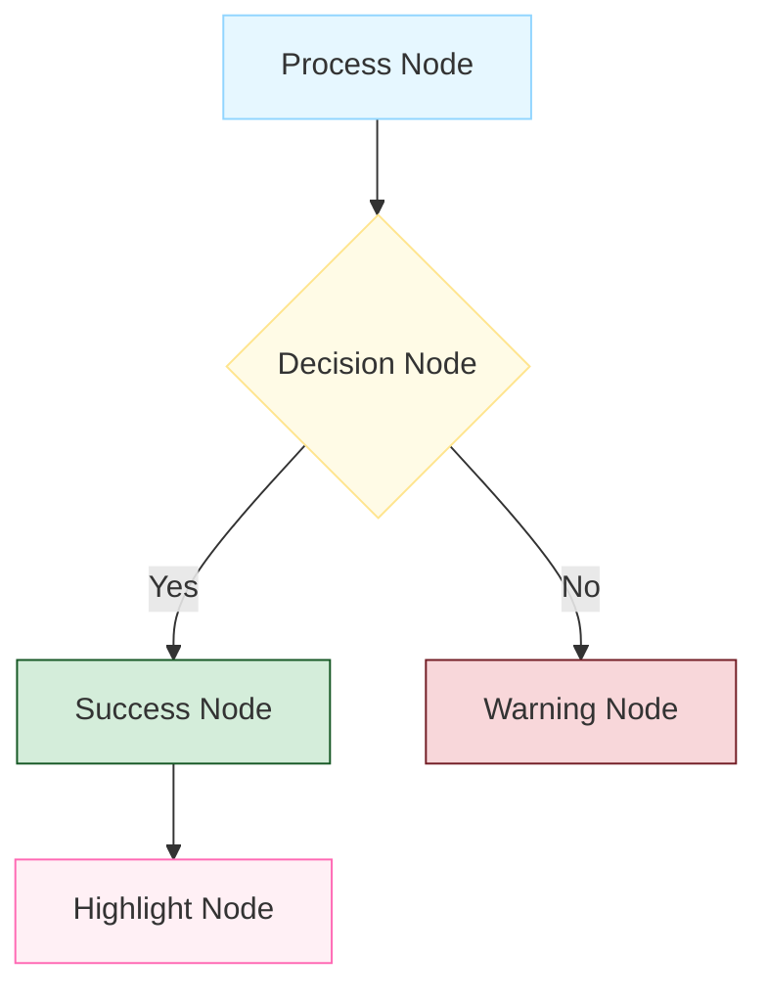
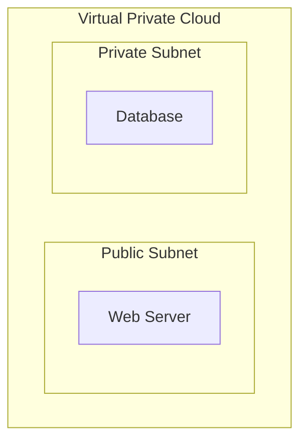
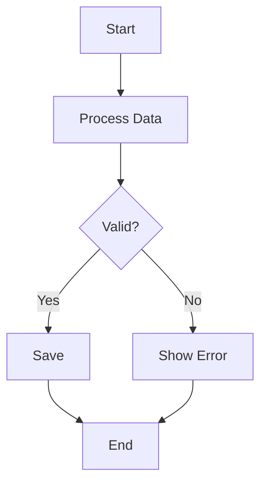
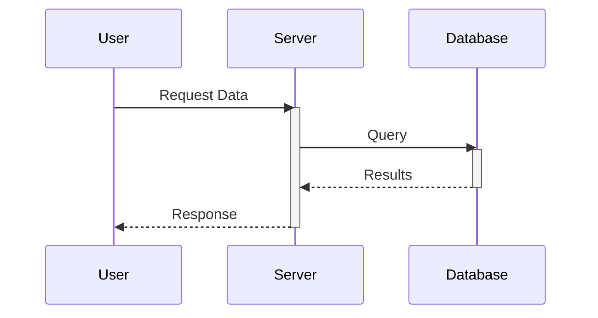
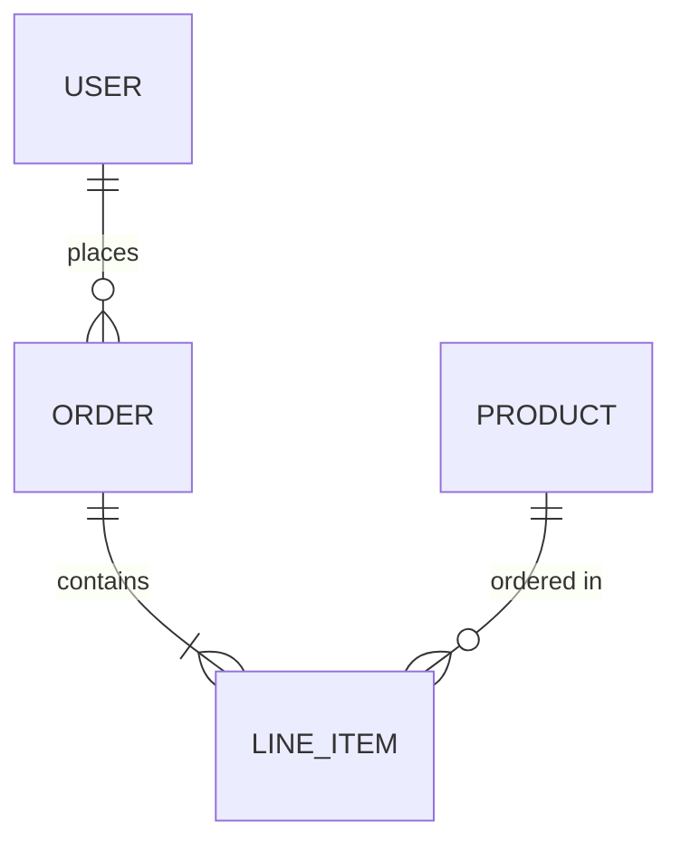
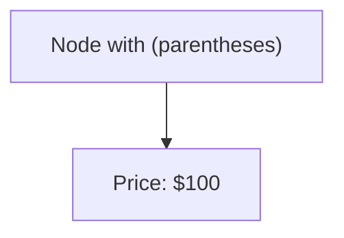
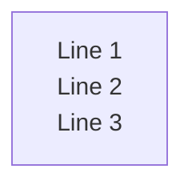
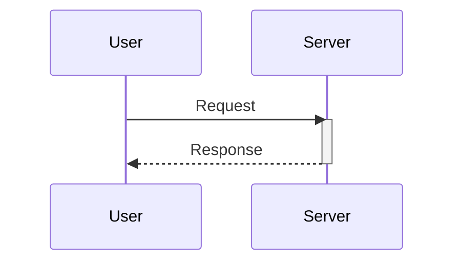

# Sujith's Library

A personal knowledge base and portfolio site built with VitePress, featuring a comprehensive collection of notes on computer science and software engineering topics.

## Technology Stack

| Technology | Purpose |
|------------|---------|
| [VitePress](https://vitepress.dev/) | Static site generator framework |
| TypeScript | Configuration and utilities |
| Vue.js | UI components and theme customization |
| [Mermaid.js](https://mermaid.js.org/) | Diagrams via `vitepress-plugin-mermaid` |
| [KaTeX](https://katex.org/) | Math rendering via `markdown-it-katex` |

## Project Structure

```
vu-library/
├── docs/                          # All Markdown content
│   ├── .vitepress/
│   │   ├── config.mts             # Site configuration
│   │   ├── theme/                 # Theme customizations
│   │   │   ├── components/        # Custom Vue components
│   │   │   ├── data/fileStructures/  # Sidebar data files (*Sections.ts)
│   │   │   └── utils/             # Utilities (transformSectionsToSidebar.ts)
│   │   └── sidebar/               # Generated sidebar configs
│   ├── c/                         # C programming
│   ├── java/                      # Java programming
│   ├── java-script/               # JavaScript
│   ├── python/                    # Python
│   ├── os/                        # Operating Systems
│   ├── dbms/                      # Database Management
│   ├── dev-cloud/                 # Cloud & DevOps
│   └── ...                        # Other topic folders
├── public/                        # Static assets (images, logos)
├── package.json                   # Dependencies and scripts
└── README.md                      # This file
```

## Getting Started

### Prerequisites

- Node.js (v18 or higher recommended)
- npm

### Installation

```bash
# Clone the repository
git clone https://github.com/sujith-eag/vu-library.git
cd vu-library

# Install dependencies
npm ci
```

### Development

```bash
# Start local dev server
npm run docs:dev

# Build for production
npm run docs:build

# Preview production build
npm run docs:preview
```

> **Note:** The build script uses `node --max-old-space-size=4096` for handling large builds.

## Adding Content

### Create a New Page

1. Create a Markdown file in the appropriate `docs/` subfolder:
   ```
   docs/java-script/new-topic/my-page.md
   ```

2. Add an entry in the corresponding `*Sections.ts` file:
   ```typescript
   // docs/.vitepress/theme/data/fileStructures/jsSections.ts
   { label: 'My Page', link: '/java-script/new-topic/my-page' }
   ```

3. Run `npm run docs:dev` to test locally.

### File Naming Conventions

- Use lowercase with hyphens for folders: `java-script/`, `dev-cloud/`
- Use descriptive names with optional numeric prefixes for ordering: `01_basics.md`, `02_advanced.md`
- Links in sidebar use root-relative paths with leading slash: `/java-script/new-topic/my-page`

---

# Content Style Guide

This section defines the formatting standards for all Markdown content in this project.

## Heading Hierarchy

| Level | Usage | Example |
|-------|-------|---------|
| `#` (h1) | Page title — **one per page** | `# Custom VPC Configuration` |
| `##` (h2) | Main sections | `## Create a New VPC` |
| `###` (h3) | Subsections, multi-step processes | `### Option A: Using Console` |
| `####` (h4) | Deep nesting within subsections | `#### Configuration Details` |

### Rules

- **One h1 per page** — The page title only.

- **No bold in headings** — Use plain text: `## Create Instance` not `## **Create Instance**`

- **No separators before h2** — VitePress auto-creates visual separators for `##` headings. Do not add `---` before them.

## Line Spacing

In Markdown, two consecutive lines without a blank line between them will render as a single line.

**Incorrect** (renders as one line):

```markdown
This is line one.
This is line two.
```

**Correct** (renders as separate lines):

```markdown
This is line one.

This is line two.
```

Always leave at least one blank line between paragraphs or elements that should appear separately.

## Lists

### Unordered Lists

Use `-` for bullet points with consistent indentation:

```markdown
- First item
- Second item
    - Nested item (4 spaces indent)
    - Another nested item
- Third item
```

### Ordered Lists

Use `1.` for all items (Markdown auto-numbers):

```markdown
1. First step
2. Second step
3. Third step
```

## Tables

Use proper Markdown table syntax with alignment:

```markdown
| Feature | Description | Status |
|---------|-------------|--------|
| VPC | Virtual Private Cloud | ✅ Active |
| Subnet | Network subdivision | ✅ Active |
| NAT Gateway | Outbound internet access | ⚠️ Paid |
```

---

# Callout Blocks (Notes, Warnings, Tips)

VitePress supports GitHub-flavored callout blocks. Use these for important information.

## Syntax

> [!NOTE]
> This is helpful information.
> Informational notes for additional context.

> [!TIP]
> This is a helpful tip.
> Helpful tips and best practices.

> [!IMPORTANT]
> This is important information.
> Critical information users should know.

> [!WARNING]
> This warns about potential issues.
> Potential issues or things to watch out for.

> [!CAUTION]
> This warns about dangerous actions.
> Dangerous actions that could cause problems.

## Syntax Rules

- **Capitalize the keyword**: Use `[!NOTE]` not `[!note]` or `[!Note]` for consistency.

- **With titles**: You can add a title after the keyword:

  ```markdown
  > [!NOTE] Developer's Note
  > This is additional context for developers.
  ```

---

# Code Blocks

## Basic Syntax

Always specify the language for syntax highlighting:

````markdown
```bash
npm run docs:dev
```

```typescript
const config = defineConfig({ ... })
```

```json
{
  "name": "vu-library",
  "version": "1.0.0"
}
```
````

## Supported Languages

Common languages used in this project:

| Language | Identifier |
|----------|------------|
| Bash/Shell | `bash` or `sh` |
| JavaScript | `javascript` or `js` |
| TypeScript | `typescript` or `ts` |
| Python | `python` or `py` |
| Java | `java` |
| C | `c` |
| JSON | `json` |
| HTML | `html` |
| CSS | `css` |
| SQL | `sql` |
| Markdown | `markdown` or `md` |
| Plain text | `text` or `plaintext` |

## Code Block Features

### Line Numbers

Line numbers are enabled globally in `config.mts`. No additional markup needed.

### Line Highlighting

Highlight specific lines:

````markdown
```js{2,4-5}
const a = 1
const b = 2  // highlighted
const c = 3
const d = 4  // highlighted
const e = 5  // highlighted
```
````

### Code Groups

Group related code in tabs:

````markdown
::: code-group

```bash [npm]
npm install package-name
```

```bash [yarn]
yarn add package-name
```

```bash [pnpm]
pnpm add package-name
```

:::
````

---

# Mermaid Diagrams

## Basic Usage

Embed diagrams using fenced code blocks with `mermaid` language:

````markdown

````

## Layout Direction

| Direction | Use Case |
|-----------|----------|
| `flowchart TD` | **Default** — Top to Down, best for complex diagrams |
| `flowchart LR` | Left to Right — only for simple linear flows (5-6 nodes max) |
| `flowchart BT` | Bottom to Top — rarely used |
| `flowchart RL` | Right to Left — rarely used |

> [!IMPORTANT]
> Avoid `flowchart LR` for diagrams with many nodes or subgraphs — they become too small horizontally.

## Standard Color Palette

Use these `classDef` styles for consistent appearance:



### Color Reference

| Style | Fill | Stroke | Use For |
|-------|------|--------|---------|
| `process` | `#e6f7ff` | `#91d5ff` | Standard steps, activities |
| `decision` | `#fffbe6` | `#ffe58f` | Decision points, conditionals |
| `success` | `#d4edda` | `#155724` | Completion, success states |
| `warning` | `#f8d7da` | `#721c24` | Errors, failures, warnings |
| `highlight` | `#fff0f5` | `#ff69b4` | Emphasis, important items |

## Subgraph Styling

Style subgraphs for visual grouping:



## Diagram Layout Rules

- Use `flowchart TD` for complex diagrams with many nodes.

- Use `flowchart LR` only for simple linear flows (5-6 nodes maximum).

- Avoid reserved keywords as node IDs (`end`, `start`, `graph`).

## Common Diagram Types

### Flowchart



### Sequence Diagram



> [!NOTE]
> Sequence diagrams do not support `classDef` styling. Use `themeVariables` in frontmatter for global styling.

### Entity Relationship



## Mermaid Syntax Reference

### Reserved Keywords

Do not use as node IDs: `end`, `start`, `graph`, `subgraph`, `direction`

```mermaid
flowchart TD
    A --> endNode[End]  %% Correct: use endNode, not end
```

### Special Characters

Wrap text with special characters in quotes:



### Line Breaks in Nodes

Use `<br>` for multi-line text:



### Sequence Diagram Activation

Use explicit `activate`/`deactivate` keywords instead of `+`/`-` modifiers:



---

# Math Equations (KaTeX)

## Inline Math

Wrap inline equations with single `$`:

```markdown
The formula $E = mc^2$ describes energy-mass equivalence.
```

## Block Math

Wrap block equations with double `$$`:

```markdown
$$
\int_{a}^{b} f(x) \, dx = F(b) - F(a)
$$
```

---

# Format Quick Reference

## Structure Rules

| Element | Rule |
|---------|------|
| Headings | One `#` per page, no bold inside headings |
| Separators | No `---` before `##` headings |
| Line spacing | Blank line between separate elements |
| Code blocks | Always specify language identifier |
| Callouts | Capitalize keyword: `[!NOTE]` |
| Diagrams | Use `flowchart TD` for complex diagrams |
| Node IDs | Avoid reserved keywords (`end`, `start`, `graph`) |

---

# Configuration Reference

## Key Files

| File | Purpose |
|------|---------|
| `docs/.vitepress/config.mts` | Site configuration, plugins, theme |
| `docs/.vitepress/theme/data/fileStructures/*.ts` | Sidebar data structures |
| `docs/.vitepress/theme/utils/transformSectionsToSidebar.ts` | Sidebar generation utility |
| `package.json` | Dependencies and npm scripts |

## Do Not Modify

- `docs/.vitepress/dist/` — Generated build output
- `docs/.vitepress/cache/` — Build cache
- `docs/.vitepress/.temp/` — Temporary files

---

## License

© 2025 Sujith. Made with ❤️ for learning and sharing knowledge.
