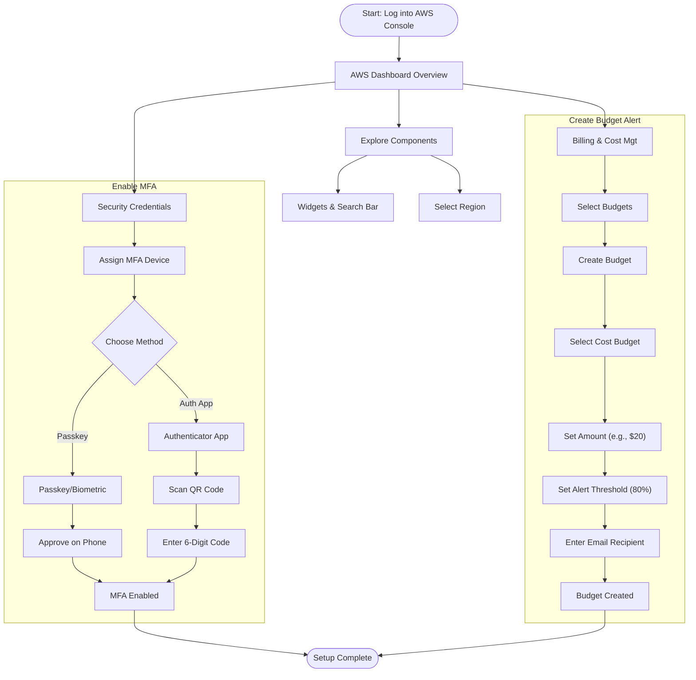
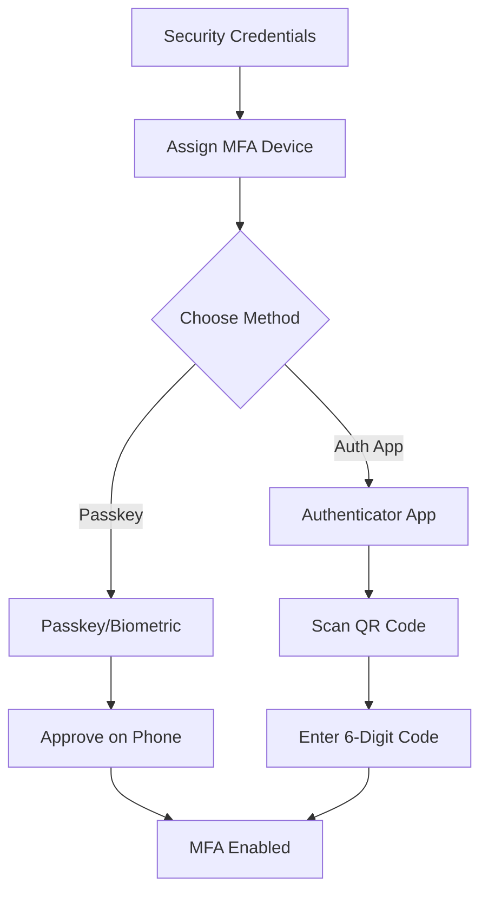
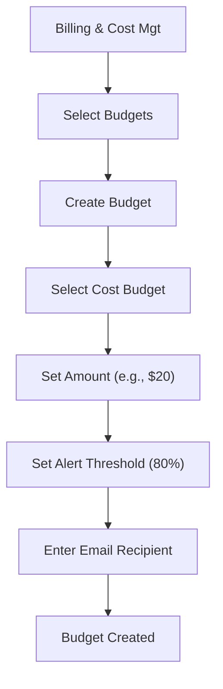

# AWS Account Setup and Configuration

Topics: AWS Console Overview, Enable MFA, Create AWS budget alert

Date: 8-10-2025

## Account Setup Workflow

This diagram illustrates the two main workflows described in the text: securing the account via MFA and setting up cost controls via Budgets.

## AWS Console Overview

- **Widgets:** Default view/ Add or remove widgets - small panels on the dashboard showing metrics or shortcuts; users can add or remove them as needed.
    
- **Region:** Specifies the geographical data center location where your AWS resources are deployed.
    
- **Services:** A categorized list of all AWS offerings such as Compute, Storage, Database, etc.
    
- **Search bar:** A quick-access bar to search and pin frequently used services for faster access.
    
- Pin the most used services to the console by clicking on the star next to the service name.
    

## Enable MFA

> Notes
> Make sure your phone is unlocked, Bluetooth is on, and it uses a screen lock (fingerprint/PIN).

### Option 1: Add a Passkey for Easier Login

**Step 1:** Go to Security Credentials:

- Sign in to AWS console.
    
- Go to your username → Security credentials.
    

**Step 2:** Under Multi-factor authentication (MFA) click “Assign MFA device.”

**Step 3:** Choose “Passkeys and security keys” → Next.

**Step 4:** On the next screen choose “Phone or tablet”.

**Step 5:** AWS will show a browser pop-up asking to use a device.

**Step 6:** Select your phone (or “Use another device” if it prompts).

**Step 7:** Look at your phone — you should get a “Use passkey” or biometric prompt.

**Step 8:** Approve using fingerprint or phone PIN.

**Step 9:** Back in AWS, click Finish. The passkey is now your MFA method.

### Test the Login

1. Sign out of AWS.
    
2. Go to the login page.
    
3. Choose “Sign in with a passkey” → Select your phone.
    
4. Approve the prompt on your phone — you should be signed in without any MFA codes.

### Option 2: Authenticator App

This uses a 6-digit code from Google Authenticator / Authy / Microsoft Authenticator.

1. In Security credentials, click “Assign MFA device.”
    
2. Select “Authenticator app” → Next.
    
3. A QR code appears.
    
4. Open your authenticator app on your phone → Add account → Scan QR code.
    
5. The app shows a 6-digit code.
    
6. Enter that code back in AWS → Assign MFA.
    
7. You'll use the 6-digit code from the app each time you log in.
    

## Create AWS budget alert

Allows you to create a simple budget and to send alarms to a registered email.

Example: if you are close to or exceeding your designated budget.

By setting a budget you can monitor budget thresholds from the start.

### Creating a budget

**Step 1:** In the search bar type budgets and under the search results:

- Select ‘Budgets’ from the Features group, which is essentially a feature of the Billing and Cost Management service.
    

**Step 2:** After the ‘Budgets’ page loads:

- Click on the Create Budget button.
    
- Under Budget setup select the ‘Customize’ option.
    
- Under Budget types select the ‘Cost budget’ option.
    
- Click on the Next button.
    

**Step 3:** Set your budget page loads and fill in the details: MyBudget, Monthly, Recurring budget, set Month and Year, select Fixed – Budgeting method - Enter your budgeted amount – 20.00, select ‘All AWS services’ Scope options.

**Step 4:** Advanced options – leave it on default. Click on the Next button.

**Step 5:** Configure alerts:

- Click on Add an alert threshold.
    
- Under Set alert threshold.
    
- Set Threshold: 80 and Trigger: Actual.
    
- Email recipients: enter your email id.
    
- Click on the Next button.
    

**Step 6:** Under Attach actions – leave it on default. Click on the Next button.

**Step 7:** In the review page – check and review all the options are set to what is desired.

**Step 8:** Click on the Create budget button. Now, the budget has been created.

