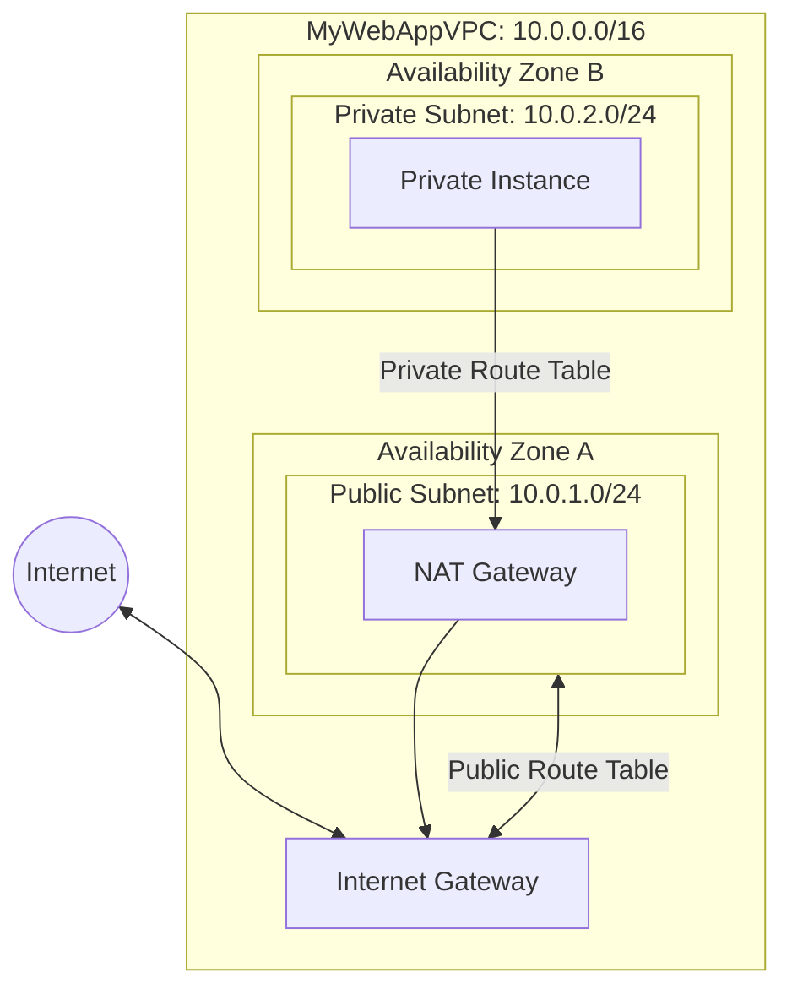

# Custom VPC Configuration

**Date:** 12-11-2025

This lab covers creating and configuring a Custom AWS Virtual Private Cloud (VPC) with a two-tier architecture including public and private subnets, Internet Gateway, NAT Gateway, and Route Tables.

## Create a New VPC

**Step 1:** Open AWS Management Console → VPC

**Step 2:** Click `Create VPC`

**Step 3:** Choose `VPC only` option

**Step 4:** Enter configuration:

- Name → `MyWebAppVPC`
- IPv4 CIDR block → `10.0.0.0/16`
- Tenancy → `Default`

> You must enable **"Enable DNS hostnames"**. If you don't do this, your EC2 instances will get a Public IP (e.g., `54.1.2.3`), but they won't get a Public DNS name (e.g., `ec2-54-1-2-3.compute-1.amazonaws.com`). Many applications and scripts rely on this DNS name.

**Step 5:** Click `Create VPC`

> **Note:** The `10.0.0.0/16` CIDR block is a standard choice from the private IP range. It gives you 65,536 total IP addresses to use within this VPC.

## Create Subnets

Create two subnets inside the VPC.

### Public Subnet

**Step 1:** Go to `Subnets` → `Create subnet`

**Step 2:** Select VPC: `MyWebAppVPC`

**Step 3:** Choose Availability Zone A

**Step 4:** Enter configuration:

- Name → `PublicSubnet`
- Availability Zone: e.g., `ap-south-1a`
- IPv4 CIDR block → `10.0.1.0/24`

**Step 5:** Click `Create subnet`

>[!NOTE] Auto-Assign Public IP
>Creating a "Public Subnet" doesn't automatically give instances a Public IP.
>After creating the subnet, you must Select Subnet -> Actions -> **Edit subnet settings** -> Check **"Enable auto-assign public IPv4 address"**. 
>
>Without this, every time you launch an instance, you have to manually request an IP.
   
### Private Subnet

**Step 1:** Click `Create subnet`

**Step 2:** Select same VPC: `MyWebAppVPC`

**Step 3:** Choose Availability Zone B

**Step 4:** Enter configuration:

- Name → `PrivateSubnet`
- Availability Zone: e.g., `ap-south-1b`
- IPv4 CIDR block → `10.0.2.0/24`

**Step 5:** Click `Create subnet`

> **Note:** Using `/24` gives each subnet 256 IPs. The CIDR blocks cannot overlap. Different AZs provide high availability — if `ap-south-1a` fails, `ap-south-1b` remains online.

## Create and Attach Internet Gateway

**Step 1:** In the left navigation pane, click "Internet Gateways"

**Step 2:** Click `Create Internet Gateway`

- Name: `MyWebApp-IGW`

**Step 3:** Click `Create Internet Gateway`

### Attach to VPC

**Step 1:** Select the IGW you just created

**Step 2:** Click Actions → "Attach to VPC"

**Step 3:** Select `MyWebAppVPC`

**Step 4:** Click `Attach Internet Gateway`

> **Note:** The IGW is the "front door" to the internet for your VPC. Attaching it doesn't automatically give everything internet access — a route table is still needed.

## Configure Public Route Table

**Step 1:** Go to `Route Tables` → `Create route table`

- Name → `PublicRT`
- VPC → `MyWebAppVPC`

**Step 2:** Under `Routes` → `Edit routes` → `Add route`

- Destination: `0.0.0.0/0`
- Target: Internet Gateway (`MyWebApp-IGW`)

**Step 3:** Under `Subnet Associations` → `Edit subnet associations`

- Select `PublicSubnet` → `Save`

Now the `PublicSubnet` has internet access.

>[!NOTE] 
>When you create a VPC, AWS creates a "Main" route table automatically. Leave the "Main" table empty (no routes to IGW). Explicitly associate your subnets to your custom tables. This prevents accidental public exposure if you create a new subnet and forget to configure it.

## Create NAT Gateway

>[!IMPORTANT] NAT Tax 
>NAT Gateways are **NOT Free Tier eligible**. As soon as you finish this lab, **delete the NAT Gateway**. It charges you even if no data is passing through it.
>

NAT Gateway must always be created in a public subnet. 

**Step 1:** Go to `NAT Gateways` → `Create NAT Gateway`

**Step 2:** Configure:

- Name → `NAT-GW`
- Subnet → `PublicSubnet`
- Elastic IP Allocation ID → Click `Allocate Elastic IP`

> **Elastic IP Limits:** By default, you can only have 5 Elastic IPs per region.

**Step 3:** Click `Create NAT Gateway`

> **Note:** The NAT Gateway needs to be in the public subnet to access the IGW. Using an Elastic (static) IP ensures the public IP never changes even if underlying hardware fails.

## Configure Private Route Table

**Step 1:** Create another Route Table → Name `PrivateRT`

**Step 2:** Under `Routes` → `Edit routes` → `Add route`

- Destination: `0.0.0.0/0`
- Target: NAT Gateway (`NAT-GW`)

**Step 3:** Under `Subnet Associations` → Select `PrivateSubnet` → `Save`

`PrivateSubnet` traffic goes through the NAT Gateway.

> **Note:** Each subnet can be associated with only one route table. If not explicitly associated, it uses the Main Route Table.

## VPC Concepts Reference

### Default VPC vs Custom VPC

|Feature|Default VPC|Custom VPC|
|-------|-----------|----------|
|Best For|Beginners, quick testing|Production, enterprise setups|
|Creation|Automatic by AWS|Manual by user|
|Ready to Use|Yes, immediately|Requires configuration|
|CIDR Block|Always `172.31.0.0/16`|User-defined (e.g., `10.0.0.0/16`)|
|Subnets|One default public per AZ|User-defined public or private|
|Internet Connectivity|Pre-configured with IGW|Manual IGW creation required|
|Route Table|Auto-configured|Manual configuration|
|Security|Default SGs and NACLs|Custom SGs and NACLs required|

### Core VPC Components

|Component|Description|
|---------|-----------|
|CIDR Block|Overall IP range for VPC (e.g., `10.0.0.0/16`)|
|Subnets|Smaller divisions inside VPC, each tied to one AZ. **Public:** routes to IGW. **Private:** no direct internet|
|Internet Gateway|Connects VPC to Internet. Supports bi-directional communication|
|NAT Gateway|Enables private subnet outbound internet access without inbound exposure. One-way: Private → Internet|
|Route Tables|Rules determining where traffic is directed. **Public:** `0.0.0.0/0` → IGW. **Private:** `0.0.0.0/0` → NAT|
|Security Groups|Instance-level firewall. **Stateful:** return traffic auto-allowed|
|Network ACLs|Subnet-level firewall. **Stateless:** inbound/outbound rules separate|
|Elastic IP|Static public IPv4 address. Remains constant even if instance stopped|
|VPC Peering|Connects two VPCs for private communication|

### Security Groups vs Network ACLs

| Aspect | Security Groups | Network ACLs |
|--------|-----------------|--------------|
|Level|Instance|Subnet|
|Stateful|Yes|No|
|Use Case|Fine-grained control|Border checkpoint|

> **Note:** For 99% of use cases, Security Groups provide sufficient control. Most leave default "allow all" NACL as-is.

