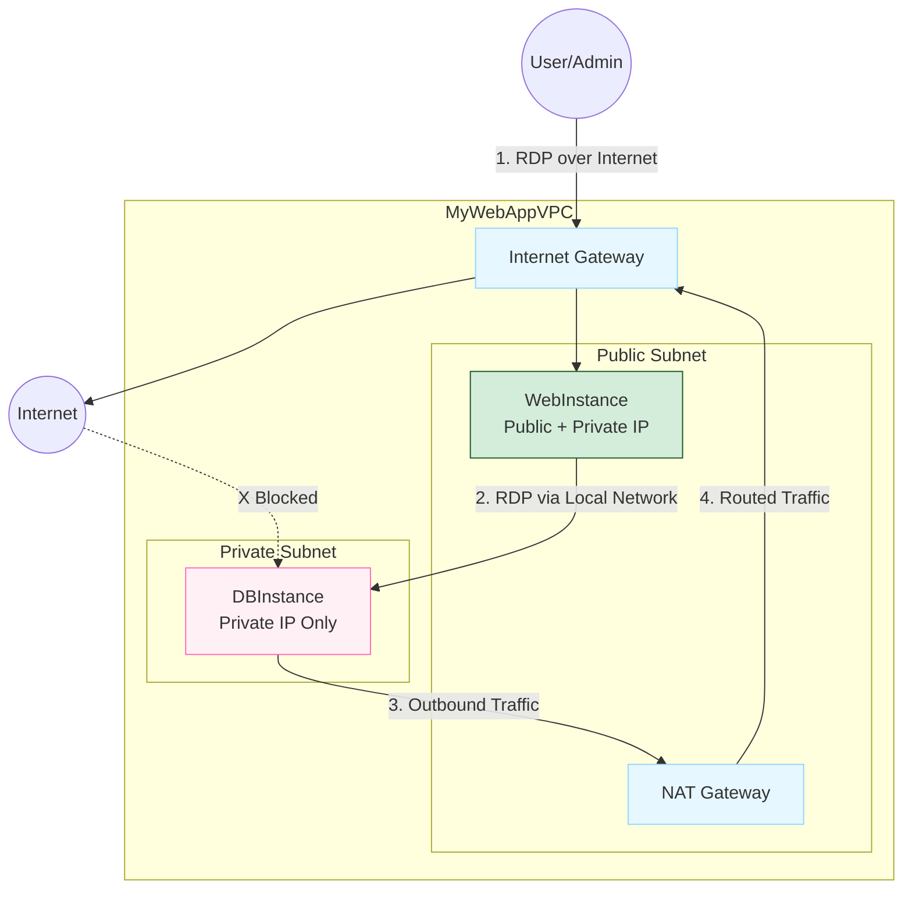

# EC2 Instances in Public and Private Subnets

**Date:** 14-11-2025

This lab demonstrates launching and configuring EC2 instances for a Web Server in a Public Subnet and a Database Server in a Private Subnet, including secure connectivity between them.



## Launch Windows Instance in Public Subnet

**Step 1:** Go to EC2 → Launch Instance

**Step 2:** Choose configuration:

- AMI → Windows Server (Free tier eligible)
- Instance type → `t2.micro` / `t3.micro`

**Step 3:** Select network settings:

- VPC → `MyWebAppVPC`
- Subnet → `PublicSubnet`
- Auto assign Public IP → **Enable**

**Step 4:** Configure Security Group:

- Create `WebInstance-SG`
- Allow RDP (3389) → Anywhere (for practice)

**Step 5:** Launch instance using key pair (.pem)

## Launch Windows Instance in Private Subnet

**Step 1:** Click Launch Instance

**Step 2:** Choose Windows Server AMI

**Step 3:** Select network settings:

- VPC → `MyWebAppVPC`
- Subnet → `PrivateSubnet`
- Auto assign Public IP → **Disable**

**Step 4:** Configure Security Group:

- Create `DBInstance-SG`
- Allow RDP only from `WebInstance-SG`

**Step 5:** Launch instance

The `DBInstance` is now **fully isolated** and cannot be accessed directly from the internet.

## Connect to Public Windows Instance

**Step 1:** Select `WebInstance` → Click Connect

**Step 2:** Choose RDP Client tab

**Step 3:** Click Get Password

**Step 4:** Upload your `.pem` key pair

**Step 5:** Copy the decrypted Windows Administrator password

**Step 6:** Copy the Public IP for later use

### Connect Using RDP

**Step 1:** Open Remote Desktop Connection (`mstsc`)

**Step 2:** In the dialog:

- Computer → Public IP of `WebInstance`

**Step 3:** Click Connect

**Step 4:** Enter credentials:

- Username → Administrator
- Password → Paste decrypted password

**Step 5:** Click OK

You are now inside the public Windows instance.

## Connect to Private Windows Instance

You cannot connect directly from your laptop — the instance has no Public IP. You must connect from within WebInstance (jump server / bastion host).

### Remote Login from WebInstance to DBInstance

**Step 1:** While logged into `WebInstance`, open Remote Desktop Connection (`mstsc`)

**Step 2:** Enter:

- Computer → Private IP of `DBInstance`

**Step 3:** Click Connect

**Step 4:** Enter credentials:

- Username → Administrator
- Password → Paste the decrypted password (same key pair)

**Step 5:** Click OK

You are now inside the private Windows instance.

## Test NAT Gateway Connectivity

### From WebInstance (Public Subnet)

Open a browser → Internet should work (through IGW)

### From DBInstance (Private Subnet)

Open browser → Internet should also work (through NAT Gateway)

Internet icon will show "Internet Access"

### Security Verification

| Test | Expected Result |
|------|-----------------|
|DBInstance outbound to internet|Allowed via NAT|
|Internet inbound to DBInstance|Blocked|
|WebInstance to DBInstance RDP|Allowed|

### Test Outbound from Private Subnet

**Step 1:** Connect to `DBInstance` (using RDP from `WebInstance`)

**Step 2:** Open Command Prompt inside `DBInstance`

**Step 3:** Type:

```bash
ping google.com
```

**Expected Result:**

```
Reply from 142.250.xxx.xxx: bytes=32 time=20ms TTL=115
```

This works because outbound traffic is allowed from Private Subnet → NAT Gateway → Internet.

### What Will NOT Work

- From DBInstance: `ping <Your Own Public IP>`
- Anyone trying to: `ping <DBInstance Private IP>`

Both fail because:

- Inbound traffic is blocked
- DBInstance has no Public IP
- Security Group allows inbound only from WebInstance-SG

| Direction | Result |
|-----------|--------|
|Private instance → Internet|**YES** (via NAT Gateway)|
|Internet → Private instance|**NO** (fully blocked)|

NAT Gateway is **one-way** only.

## Elastic IP Address

An Elastic IP address is a static, public IPv4 address that you can allocate to your AWS account.

| Feature | Description |
|---------|-------------|
|Static|Permanent address that doesn't change|
|Region-specific|Must be used in a specific Region|
|Source|Comes from Amazon's pool of IPv4 addresses|
|Association|Can be associated with instance or network interface|
|Reassignment|Can be disassociated and associated with different resources|
|Billing|Charged for all Elastic IPs, whether associated or not|

**Use Cases:**

- Web Servers: Domain always points to correct server
- NAT Gateways: Fixed outbound IP for whitelisting
- Load Balancers: Consistent endpoint
