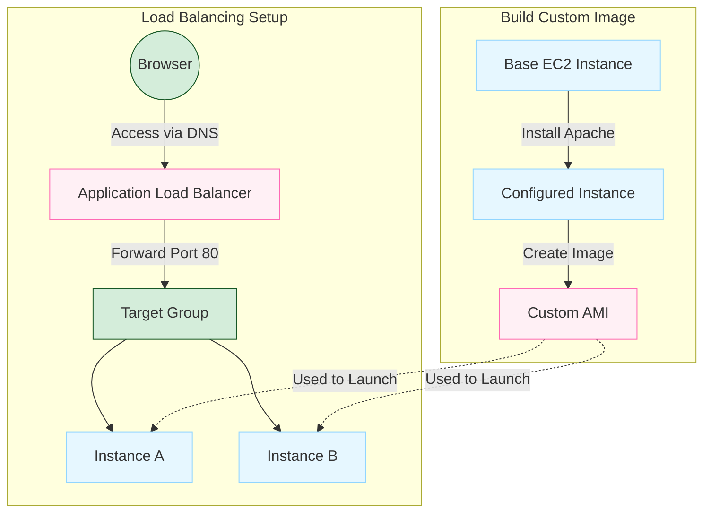
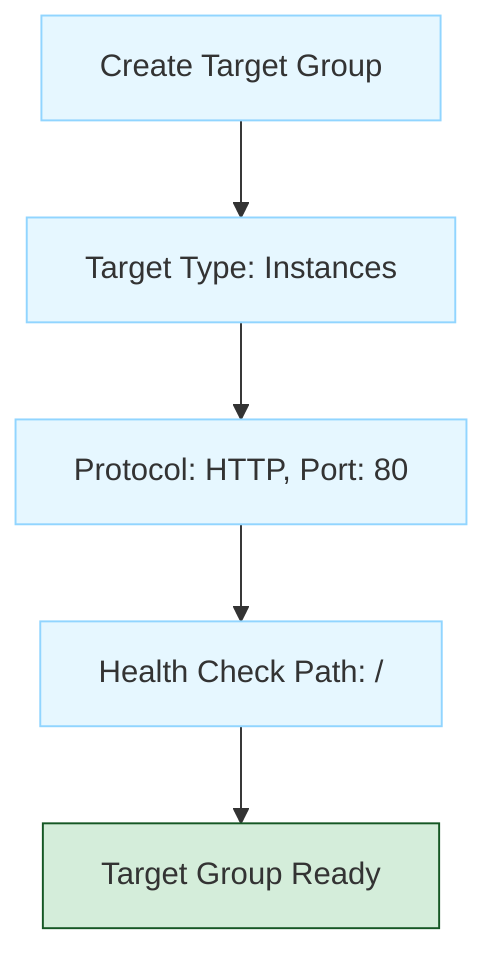

# Load-Balanced Web Application with ALB and ASG

**Date:** 19-11-2025

This lab demonstrates deploying a scalable and highly available web application on AWS by configuring EC2 web servers, Custom AMI, Target Group, Application Load Balancer (ALB), and Auto Scaling Group (ASG).



## Component Overview

| Component | Purpose |
|-----------|---------|
|EC2 Web Server|Hosts web application files, serves content through ALB|
|Custom AMI|Snapshot of configured EC2 (Apache + website), ensures identical instances|
|Target Group|Collection of EC2 instances that ALB forwards traffic to|
|Application Load Balancer|Distributes HTTP traffic across multiple EC2 instances|
|Auto Scaling Group|Automatically launches/terminates instances based on demand|
|CPU-Based Scaling|Rules that add/remove instances based on CPU thresholds|
|Launch Template|Reusable blueprint (AMI, instance type, key pair, security group)|

## Launch Base EC2 Instance

**Step 1:** Open AWS Console → EC2 → Launch Instance

**Step 2:** Configure instance:

- Name: `Base-WebServer`
- AMI: Amazon Linux 2
- Instance type: `t3.micro`
- Key Pair: your `.pem` file

**Step 3:** Configure Security Group:

- HTTP (80) → Anywhere
- SSH (22) → My IP

**Step 4:** Launch the instance

## Install Apache and Create Web Page

**Step 1:** SSH into the instance

**Step 2:** Install Apache:

```bash
sudo yum install httpd -y
sudo systemctl start httpd
sudo systemctl enable httpd
```

**Step 3:** Move to Web Root Folder:

```bash
cd /var/www/html
```

**Step 4:** Create a webpage with hostname:

```bash
echo "<h1>Hello from Instance 1 - $(hostname)</h1>" | sudo tee /var/www/html/index.html
```

**Step 5:** Test in browser using the instance's public IP

## Create Custom AMI

**Step 1:** Go to EC2 → Instances

**Step 2:** Select `Base-WebServer`

**Step 3:** Actions → Image and Templates → Create Image

**Step 4:** Configure:

- Name: `WebServer-AMI`

**Step 5:** Click Create

**Step 6:** Wait until AMI status = **Available**

This AMI now contains Apache + your `index.html`.

## Create Target Group



**Step 1:** EC2 → Target Groups → Create Target Group

**Step 2:** Configure:

- Target type: **Instances**
- Name: `WebApp-TG`
- Protocol: HTTP
- Port: 80
- Health Check Path: `/`

**Step 3:** Click Create (do not register instances manually)

The Target Group holds the list of EC2 instances behind the Load Balancer.

## Create Application Load Balancer

**Step 1:** EC2 → Load Balancers → Create Load Balancer

**Step 2:** Choose **Application Load Balancer**

**Step 3:** Configure:

- Name: `WebApp-ALB`
- Scheme: Internet-facing
- Listeners: HTTP (80)
- Select two public subnets
- Security Group: allow HTTP (port 80)
- Forward to Target Group → `WebApp-TG`

**Step 4:** Click Create

## Test the Load Balancer

**Step 1:** Go to AWS Console → EC2 → Load Balancers

**Step 2:** Select your ALB: `WebApp-ALB`

**Step 3:** Copy the ALB DNS Name:

```
WebApp-ALB-123456789.ap-south-1.elb.amazonaws.com
```

**Step 4:** Open a Browser and enter:

```
http://<your-alb-dns-name>
```

**Expected Output:**

```
Hello from Instance 1 - ip-xx-xx-xx-xx
```

This confirms:

- The ALB is working
- The Target Group is routing traffic
- The instance from your custom AMI is serving the web page

**Step 5:** Refresh Multiple Times (with Auto Scaling)

- If using Auto Scaling with multiple instances
- Clicking Refresh shows different hostnames
- This confirms load balancing across multiple servers
