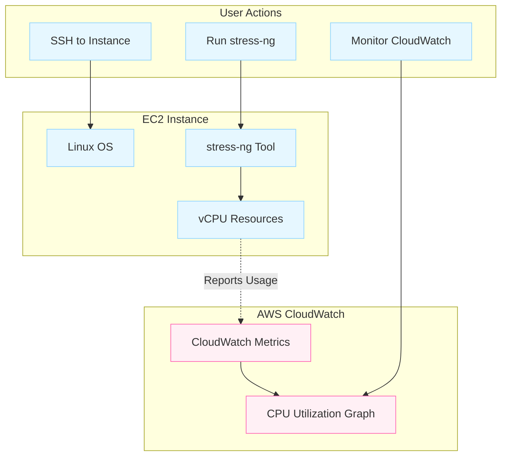
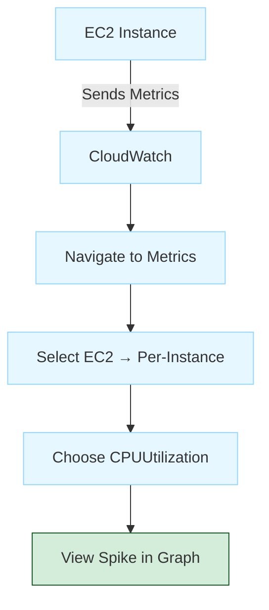

# Stress Testing a Linux EC2 Instance

**Date:** 20-11-2025

This lab demonstrates how to generate high CPU load on an Amazon EC2 Linux instance using the `stress-ng` tool and observe CPU utilization in CloudWatch.



## Launch a Linux EC2 Instance

**Step 1:** Log in to the AWS Console.

**Step 2:** Go to EC2 → Instances → Launch Instance.

**Step 3:** Configure instance details:

- Name: `StressTest-EC2`
- AMI: Amazon Linux 2023 (Free Tier eligible)
- Instance type: `t2.micro` / `t3.micro`
- Key pair: Select or create a `.pem` key

**Step 4:** Configure Security Group:

- Allow SSH (22) from My IP
- Allow HTTP (80) from anywhere (optional)

**Step 5:** Launch the instance.

## Connect to the EC2 Instance

Use Windows PowerShell. Navigate to the folder where the `.pem` file is located:

```bash
ssh -i "your-key.pem" ec2-user@<public-ip>
```

## Install Apache (Optional)

To verify the instance is working:

```bash
sudo yum install httpd -y
sudo systemctl start httpd
sudo systemctl enable httpd
```

Create a test web page:

```bash
echo "<h1>EC2 Stress Test Demo - $(hostname)</h1>" | sudo tee /var/www/html/index.html
```

## Install the Stress Testing Tool

For Amazon Linux 2023 EC2 Instances, move to the `ec2-user` home directory:

```bash
cd ~
```

Install stress-ng (Amazon Linux 2023 includes it directly through dnf):

```bash
sudo dnf install stress-ng -y
```

## Run the CPU Stress Test

Generate high CPU load using 4 CPU workers for 2 minutes:

```bash
stress-ng --cpu 4 --timeout 120
```

**Expected Output:**

- Terminal becomes busy during the 120-second load test
- After completion: `successful run completed in 120.02s`
- CPU usage spikes to 90–100% (check using `top`)

## Observe CPU Utilization in CloudWatch



**Step 1:** Go to CloudWatch → Metrics → EC2 → Per-Instance Metrics.

**Step 2:** Select CPUUtilization → InstanceId → your instance.

**Step 3:** View graph in 1-minute or 5-minute intervals.

You should see a sharp spike during the 2-minute stress period.

## Stop or Terminate the Instance

To avoid charges:

### Option A: Stop the Instance (Safe)

Actions → Instance State → Stop

### Option B: Terminate (Permanently Delete)

Actions → Instance State → Terminate

## Expected Results

| Metric | Expected Value |
|--------|---------------|
|CPU Utilization in CloudWatch|90–100%|
|Stress test completion|Without errors|
|Understanding gained|How CPU load affects EC2 metrics|