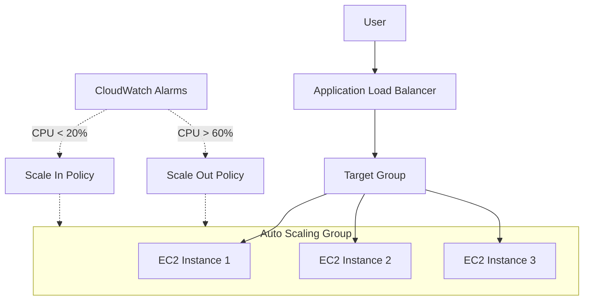

# Mini Project: Load-Balanced Web Application

Deploy a Load-Balanced Web Application using Application Load Balancer (ALB), Auto Scaling Group (ASG), Custom AMI, and Target Group on AWS.

## Project Overview

Deploying a Load-Balanced Web Application using **Application Load Balancer (ALB)**, **Auto Scaling Group (ASG)**, **Custom AMI**, and **Target Group** on AWS with **CloudWatch Alarms** & **Stress Testing** for Auto Scaling Validation.

### Key Concepts

| Component | What it is | Why we use it |
|-----------|------------|---------------|
| **ASG** | Automatically launches/terminates EC2 instances based on demand | Provides scalability to handle variable traffic |
| **CPU Scaling** | Rules that add/remove instances based on CPU thresholds | Ensures performance during load and saves cost during idle time |
| **Stress Testing** | Artificially increasing CPU load using tools like `stress-ng` | Validates if the Auto Scaling Group triggers correctly |

### Prerequisites

- A custom AMI (`AMI-WebServer`) created from a base instance with a web server (e.g., Apache or Nginx) installed and configured to serve a simple HTML page (e.g., displaying instance ID and IP)
- An Application Load Balancer (ALB) and Target Group (`TG-WebServer`) already created and configured
- VPC with internet access (e.g., via Internet Gateway or NAT Gateway) for installing packages on instances
- Existing key pair and security group allowing SSH (Port 22) and HTTP (Port 80)

## Architecture Overview



## Step A: Create Launch Template

**Path:** EC2 → Launch Templates → Create launch template

**Configuration:**

- **Template Name:** `LT-WebServer`
- **Application and OS Images (AMI):**
  - Click **My AMIs**
  - Select your custom AMI: `AMI-WebServer`
- **Instance Type:** `t3.micro`
- **Key Pair:** Select your existing key pair (e.g., `pemfile1.pem`)
- **Network Settings (Security Group):**
  - Select existing security group (e.g., `launch-wizard-1`)
  - Ensure it allows: **SSH (Port 22)** and **HTTP (Port 80)**
- **Storage:** Leave default (`8 GiB gp3` root volume)

> [!NOTE]
> The Launch Template is now ready for the Auto Scaling Group.

## Step B: Create Auto Scaling Group (ASG)

**Path:** EC2 → Auto Scaling Groups → Create Auto Scaling Group

**1. Name & Template:**

- Name: `ASG-WebServer`
- Template: `LT-WebServer`

**2. Network Configuration:**

- VPC: `vpc-0c952a6cabfbe594b` (Default VPC)
- Subnets: Select any **2** (e.g., `ap-south-1a` and `ap-south-1b`)

**3. Load Balancing:**

- Option: **Attach to an existing load balancer**
- Selection: **Choose from your load balancer target groups**
- Target Group: `TG-WebServer`

**4. Group Size & Scaling:**

- **Desired Capacity:** 1
- **Minimum Capacity:** 1
- **Maximum Capacity:** 3
- Scaling Policies: Select **No scaling policies** (we will add these in next Step)

**5. Review & Create:**

Verify settings and click **Create Auto Scaling Group**.

### Verification

Check the **Activity** tab in your ASG. You should see "Successful — Launching a new EC2 instance." The **Instances** tab should show one instance in a **Running** state.

Additionally, check ALB health: EC2 → Load Balancers → Select ALB → Targets tab (instances should be 'healthy').

## Step C: Configure Auto Scaling Policies

### Part 1: Create High-CPU Alarm (Scale-OUT)

**Path:** CloudWatch → Alarms → All alarms → Create alarm

**Configuration:**

- **Metric:** EC2 → By Auto Scaling Group → `ASG-WebServer` → `CPUUtilization`
- **Statistic:** Average | **Period:** 1 minute
- **Conditions:** Threshold Type: Static | Greater than: `60`
- **Actions:** Skip (Do not add SNS or ASG actions here)

> [!IMPORTANT]
> On Configure actions page, do NOT add anything. Just click Next. If a popup says "No actions configured", click Proceed without actions.

**Name and create:**

- **Name:** `ASG-CPU-High-60`

Click Next, then Create alarm. You now have one metric alarm with no actions.

### Part 2: Attach Scale-OUT Policy to ASG

**Path:** EC2 → Auto Scaling groups → ASG-WebServer → Automatic scaling

Click Create dynamic scaling policy.

**Configuration:**

- **Policy Type:** Simple scaling
- **Name:** `ScaleOut-CPU60`
- **CloudWatch Alarm:** `ASG-CPU-High-60`
- **Action:** Add `1` capacity units
- **Cooldown:** 300 seconds

Click Create.

### Part 3: Create Low-CPU Alarm (Scale-IN)

**Path:** CloudWatch → Alarms → Create alarm

**Configuration:**

- **Metric:** Same as Part 1 (`CPUUtilization` for `ASG-WebServer`)
- **Conditions:** Threshold Type: Static | Lower than: `20`
- **Name:** `ASG-CPU-Low-20`

### Part 4: Attach Scale-IN Policy to ASG

**Path:** EC2 → Auto Scaling groups → ASG-WebServer → Automatic scaling

**Configuration:**

- **Policy Type:** Simple scaling
- **Name:** `scalein-cpu20`
- **CloudWatch Alarm:** `ASG-CPU-Low-20`
- **Action:** Remove `1` capacity units
- **Cooldown:** 300 seconds

Click Create.

## Step D: Stress Testing & Validation

To artificially increase CPU load on EC2 instances and observe automatic scaling behavior triggered by CloudWatch alarms.

### Part A & B: Setup Stress Tool

Connect to the **ASG-launched instance** via EC2 Instance Connect and run:

```bash
# Install stress-ng
sudo dnf install stress-ng -y

# Verify installation
stress-ng --version
```

> [!NOTE]
> Ensure your VPC has internet access (e.g., via NAT Gateway) for `dnf install` to work.

### Part C & D: Trigger Scale Out

Run the following command to spike CPU load:

```bash
stress-ng --cpu 4 --timeout 120
```

**Monitor the following:**

- **ASG Activity:** A new instance should be launched
- **EC2 Console:** A second instance will appear in the list
- **CloudWatch:** `ASG-CPU-High-60` alarm should turn red (ALARM state)

> [!TIP]
> Scaling may take **2–4 minutes**. Refresh page to see updates.

### Part E: Test Load Balancing

Copy the **ALB DNS Name** (Found in EC2 → Load Balancers) and paste it into your browser. Refresh several times to see traffic shifting between instances:

- _Output 1:_ Hello from Instance 1 — IP: XX.XX.XX.XX
- _Output 2:_ Hello from Instance 2 — IP: AA.AA.AA.AA

> [!NOTE]
> Confirms ALB is distributing traffic across multiple instances.

### Part F: Scale In

Once the stress test ends, wait 3-5 minutes. The CPU will drop below 20%, the `ASG-CPU-Low-20` alarm will trigger, and the ASG will terminate the extra instance.

## Knowledge Base & FAQs

**What is a Target Group?**

A Target Group is a collection of EC2 instances that receive traffic from the Application Load Balancer (ALB). It defines:

- Which instances to send traffic to
- On which port (example: 80)
- Health check rules (path /, interval, threshold)

In simple words: Target Group = list of servers behind the load balancer.

**Why do we need two steps: Create Launch Template and Create Auto Scaling Group?**

Because both have different roles:

**Launch Template = WHAT to launch**

It contains the configuration of one EC2 instance, such as:

- AMI
- Instance type
- Security Group
- Key pair
- Storage
- User data

This is just a blueprint.

**Auto Scaling Group = WHEN & HOW MANY to launch**

The ASG uses the Launch Template to automatically:

- Launch new instances
- Remove instances
- Maintain desired capacity
- Scale based on CPU/memory demand

**Where to find ALB DNS Name?**

You can find the ALB DNS Name in the AWS Console:

Path: EC2 → Load Balancers → Select your ALB → Description tab

There you will see: DNS name: `mywebapp-alb-12345678.ap-south-1.elb.amazonaws.com`

Use it in your browser as: `http://mywebapp-alb-12345678.ap-south-1.elb.amazonaws.com`

This is the public URL of your Load Balancer.

**What is ALB DNS?**

ALB DNS is the publicly accessible DNS name automatically created by AWS for your Application Load Balancer.

Example: `myapp-alb-123456789.ap-south-1.elb.amazonaws.com`

When a user types this URL:

- Traffic goes to the ALB
- ALB forwards to Target Group
- Target Group sends request to one of the EC2 instances

ALB DNS = The website URL of your Load Balancer.

**What is DNS?**

DNS means Domain Name System.

DNS is a system that converts domain names to IP addresses.

Example: `www.amazon.com → 52.95.120.1`

A DNS Server is only one part of this system.

- DNS = System that translates names to IPs
- DNS Server = Machine that performs the translation

**Why do we NEED CloudWatch alarms for ASG scaling exercise?**

We are using "Simple Scaling"

- Based on CPU > 60 and CPU < 20
- Which requires manually created CloudWatch alarms

Without the alarms, ASG has NO trigger, so it cannot scale.

## Clean-Up Procedure

> [!WARNING]
> Delete resources in this exact order to avoid dependency errors (e.g., ALB cannot be deleted if ASG is attached).

1. **Auto Scaling Group:** Terminate instances first
2. **Launch Template:** Delete the blueprint
3. **Application Load Balancer:** Stop hourly charges
4. **Target Group:** Clean up routing
5. **Custom AMI & Snapshots:** Delete from AMIs and Snapshots sections
6. **Manual Instances:** Terminate any remaining base instances

## Summary Checklist

- [ ] Custom AMI created with web server
- [ ] ALB and Target Group configured
- [ ] Launch Template created
- [ ] ASG created and attached to Target Group
- [ ] CloudWatch alarms for CPU high/low created
- [ ] Scaling policies attached to ASG
- [ ] Stress testing performed and scaling observed
- [ ] Load balancing tested via ALB DNS
- [ ] Resources cleaned up in correct order

## Troubleshooting Guide

**Common "Health Check" Issues:**

- **Issue:** Instances show "unhealthy" in Target Group
  - **Cause:** Web server not running or health check path incorrect
  - **Fix:** SSH into instance, check if web server is active (`sudo systemctl status httpd`), and ensure health check path (e.g., /) returns 200

- **Issue:** ALB DNS not accessible
  - **Cause:** Security group blocks HTTP or ALB not properly configured
  - **Fix:** Verify security group allows 0.0.0.0/0 on port 80, and check ALB listeners/target groups

- **Issue:** Scaling not triggering
  - **Cause:** Alarms not in ALARM state or policies not attached
  - **Fix:** Check CloudWatch alarms and ASG scaling policies; ensure metrics are being collected
