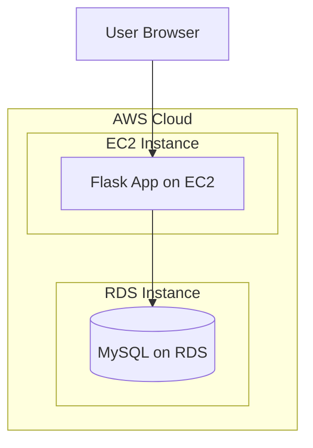

# Flask Web App with Registration & Login Using AWS RDS

Full Deployment on AWS EC2 + AWS RDS (MySQL)

## Prerequisites

- Active AWS account with billing enabled
- Basic knowledge of Python, Flask, SQL, and AWS (EC2, RDS)
- IAM permissions for EC2 and RDS creation
- Free-tier eligible for EC2; note RDS incurs costs

## Objectives

To design and deploy a Python Flask web application on an AWS EC2 instance that allows:

1. **User Registration:** Store Name and Password in an AWS RDS MySQL database
2. **User Login:** Validate user credentials from the RDS database
3. **Welcome Page:** Display a message upon successful login

This exercise demonstrates a complete cloud-based web application workflow using **Flask + MySQL (RDS)**.

## System Architecture

**Flow:** Browser → Flask App (on EC2) → MySQL Database (RDS)



**Components:**

- **Frontend:** HTML templates (registration, login, welcome, success, error)
- **Backend:** Python Flask application running on EC2
- **Database:** AWS RDS (MySQL engine)
- **Hosting:** Linux EC2 instance
- **Web Server:** Flask's built-in development server (Port 5000)

## Folder Structure

On EC2 instance:

```text
FlaskLoginApp/
├── app.py
├── db_config.py
└── templates/
    ├── register.html
    ├── login.html
    ├── success.html
    ├── error.html
    └── welcome.html
```

## Database Schema

Execute these commands once connected to your RDS instance via the MySQL client on your EC2.

```sql
CREATE DATABASE flaskdb;
USE flaskdb;

CREATE TABLE users (
    id INT AUTO_INCREMENT PRIMARY KEY,
    name VARCHAR(50) NOT NULL,
    password VARCHAR(50) NOT NULL
);
```

**Schema Details:**

- `id`: Unique identifier (Auto-increment)
- `name`: Username (Required)
- `password`: Stored as plain text

> [!WARNING]
> Use password hashing for production systems. This is for educational purposes only.


## Flask Application Code

### db_config.py

This file stores the RDS MySQL connection details. Use environment variables for security.

```python
import os

db_config = {
    'host': os.environ.get('RDS_HOST', 'your-rds-endpoint.amazonaws.com'), 
    'user': os.environ.get('RDS_USER', 'admin'), 
    'password': os.environ.get('RDS_PASSWORD', 'YourPasswordHere'), 
    'database': os.environ.get('RDS_DB', 'flaskdb')
}
```

### app.py

The main application logic handling routing and database connectivity.

```python
from flask import Flask, request, render_template
import mysql.connector
from db_config import db_config

app = Flask(__name__)

def get_connection():
    try:
        return mysql.connector.connect(**db_config)
    except mysql.connector.Error as err:
        print(f"Database connection error: {err}")
        return None

@app.route('/')
def home():
    return render_template('register.html')

@app.route('/register', methods=['POST'])
def register():
    name = request.form.get('uname')
    password = request.form.get('pwd')
    if not name or not password:
        return "Error: Both fields required", 400
    
    conn = get_connection()
    if not conn:
        return "Database error", 500
    try:
        cur = conn.cursor()
        cur.execute("INSERT INTO users (name, password) VALUES (%s, %s)", (name, password))
        conn.commit()
        return render_template('success.html')
    except mysql.connector.Error as err:
        return f"Registration error: {err}", 500
    finally:
        cur.close()
        conn.close()

@app.route('/login')
def login():
    return render_template('login.html')

@app.route('/validate', methods=['POST'])
def validate():
    name = request.form.get('uname')
    password = request.form.get('pwd')
    if not name or not password:
        return "Error: Both fields required", 400
    
    conn = get_connection()
    if not conn:
        return "Database error", 500
    try:
        cur = conn.cursor()
        cur.execute("SELECT * FROM users WHERE name = %s AND password = %s", (name, password))
        user = cur.fetchone()
        if user:
            return render_template('welcome.html', username=name)
        else:
            return render_template('error.html')
    except mysql.connector.Error as err:
        return f"Login error: {err}", 500
    finally:
        cur.close()
        conn.close()

if __name__ == "__main__":
    app.run(host='0.0.0.0', port=5000, debug=False)  # Debug=False for security
```


## HTML Templates

Place these files inside the `templates/` folder.

| File | Purpose |
|------|---------|
| `register.html` | Form with `action="/register"` to accept user details |
| `login.html` | Form with `action="/validate"` to check credentials |
| `welcome.html` | Displays `{{ username }}` upon successful login |
| `success.html` | Confirmation message after registration |
| `error.html` | "Invalid Username or Password" message |


## Deployment Steps

### Phase 1: Launch EC2 Linux Instance

1. **Navigate:** Open AWS Management Console → **EC2** → **Launch instance**

2. **Configuration Settings:**
   - **Name:** `FlaskLoginServer`
   - **AMI:** Amazon Linux 2023 (Free Tier eligible)
   - **Instance type:** `t3.micro` (Free Tier)
   - **Key pair:** Create or select an existing one
   - **Network:** Default VPC and any public subnet
   - **Auto-assign Public IP:** Enable

3. **Security Group (Inbound Rules):**

| Type | Port | Source | Purpose |
|------|------|--------|---------|
| SSH | 22 | My IP | To connect via SSH/EC2 Connect |
| Custom TCP | 5000 | 0.0.0.0/0 | To test Flask app in browser |

4. **Outbound:** Allow all traffic

5. **Finalize:** Click **Launch instance**

---

### Phase 2: Connect to EC2 and Install Dependencies

1. **Connect:** Go to EC2 → Instances → Select instance → **Connect**
   - Choose **EC2 Instance Connect** (browser-based SSH) OR use PowerShell/Terminal via SSH command

2. **Update Packages:**

```bash
sudo yum update -y
```

3. **Check Python Version:** (Amazon Linux 2023 includes Python 3)

```bash
python3 --version
```

4. **Install pip:**

```bash
sudo dnf install python3-pip -y
```

5. **Install Flask & MySQL Connector:**

```bash
pip3 install flask
pip3 install mysql-connector-python
```

---

### Phase 3: Create Flask Project Structure on EC2

1. **Create Folders:**

```bash
mkdir FlaskLoginApp
cd FlaskLoginApp
mkdir templates
```

2. **Create Files (using nano):**
   - `nano db_config.py` → paste connection code
   - `nano app.py` → paste main application code
   - `nano templates/register.html` → paste registration page HTML
   - `nano templates/login.html` → paste login page HTML
   - `nano templates/welcome.html` → paste welcome page HTML

> [!TIP]
> Save each file using `CTRL + O` → `Enter` → `CTRL + X`

---

### Phase 4: Create RDS MySQL Instance

1. **Navigate:** AWS Console → **RDS** → **Databases** → **Create database**

2. **Settings:**
   - **Engine type:** MySQL
   - **Templates:** Free tier
   - **DB instance identifier:** `flaskdb-instance`
   - **Credentials:** Master username: `admin` | Master password: `<your-password>`
   - **DB instance class:** `db.t3.micro`
   - **Storage:** 20 GB

3. **Connectivity (Crucial Step):**
   - **Connect to an EC2 compute resource:** Select **YES**
   - **EC2 Instance:** Select your `FlaskLoginServer`

> [!IMPORTANT]
> AWS will automatically configure the VPC, RDS security group, and inbound rule for MySQL (3306) from the EC2 security group.

4. **Public access:** No

5. **Finalize:** Click **Create database** and wait for the status to reach **Available**

---

### Phase 5: Verify RDS Security Group

1. **Check Security:** Go to RDS → Databases → `flaskdb-instance` → **Connectivity & security**

2. **Review Rules:** Click the linked security group name under VPC security groups

3. **Verify Inbound Rule:**

| Type | Port | Source |
|------|------|--------|
| MySQL / Aurora | 3306 | EC2 Security Group |

---

### Phase 6: Create Database and Table in RDS from EC2

1. **Install MySQL Client:**

```bash
sudo dnf install mariadb105 -y
```

2. **Connect to RDS:**

```bash
mysql -h <RDS-endpoint> -u admin -p
```

3. **Run SQL Commands:**

```sql
CREATE DATABASE flaskdb;
USE flaskdb;
CREATE TABLE users (
   id INT AUTO_INCREMENT PRIMARY KEY,
   name VARCHAR(50) NOT NULL,
   password VARCHAR(50) NOT NULL
);
```

4. **Exit:** `exit;`

---

### Phase 7: Configure Flask and Run Application

1. **Edit Config:**

```bash
nano db_config.py
```

2. **Ensure correct details:**

```python
db_config = {
   'host': 'your-rds-endpoint.amazonaws.com',
   'user': 'admin',
   'password': 'YourPasswordHere',
   'database': 'flaskdb'
}
```

3. **Start App:**

```bash
python3 app.py
```

_Expect to see:_ `* Running on http://0.0.0.0:5000`

---

### Phase 8: Test the Application

1. **Access:** Open your browser and navigate to `http://<EC2-public-IP>:5000`

2. **Workflow:**
   - **Register:** Enter details. It should trigger a success message and save data to RDS
   - **Login:** Enter the credentials. It should redirect to the Welcome Page
   - **Verify DB:** Run `SELECT * FROM users;` in the MySQL prompt to see the records

### Expected Output Summary

- **Registration:** Successful insertion into RDS
- **Login Match:** SELECT query validates credentials
- **Welcome Page:** Displays "Welcome, `<username>`! You have successfully logged in."
- **Error Page:** Displays "Invalid Username or Password" for incorrect details


## Cost Considerations

- **EC2 t3.micro:** Free-tier eligible (750 hours/month)
- **RDS db.t3.micro:** ~$0.017/hour (~$12/month) + storage (~$0.115/GB/month)
- **Total Estimate:** $10-20/month if not free-tier. Monitor via AWS Cost Explorer

## Cleanup Procedure

To avoid charges:

1. Terminate EC2 instance: EC2 → Instances → Select → Terminate
2. Delete RDS database: RDS → Databases → Select → Delete (create final snapshot if needed)
3. Delete security groups if custom


## Troubleshooting

### Connection Errors

- **VPC Mismatch:** Ensure EC2 and RDS are in the same VPC/subnet
- **Security Groups:** Verify RDS allows MySQL (3306) from EC2 SG
- **Credentials:** Check [db_config.py](db_config.py) for correct endpoint, user, password
- **Public Access:** RDS should not have public access; connect via private IP
- **MySQL Client:** Ensure mariadb105 is installed on EC2
- **Firewall:** Check EC2 allows outbound to RDS on 3306


## Result

A fully working cloud-based registration and login system was successfully deployed using **Flask** (Backend), **EC2** (Application Server), and **AWS RDS** (Database).
