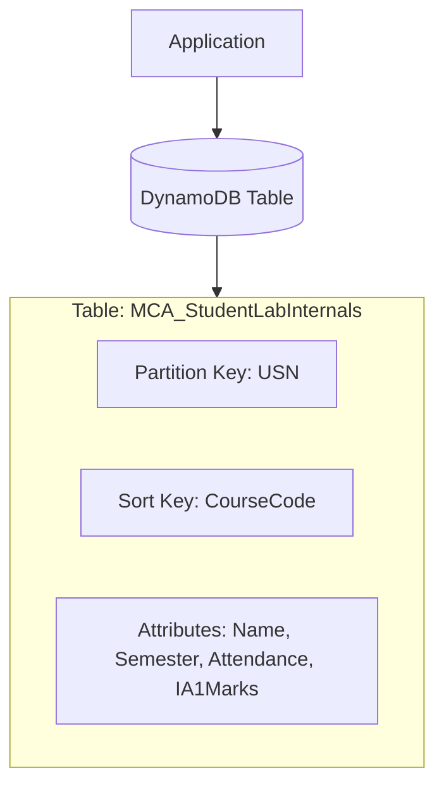

# Creating and Operating a NoSQL Database with Amazon DynamoDB

## Prerequisites

- Active AWS account with billing enabled
- IAM permissions for DynamoDB (e.g., DynamoDBFullAccess policy)
- Basic understanding of NoSQL databases and key-value stores

## Objective

To create an Amazon DynamoDB table and perform CRUD operations (Create, Read, Update, Delete) using the AWS Management Console. This exercise helps in understanding Partition Keys, Sort Keys, the difference between Query vs. Scan, and table cleanup procedures.

## DynamoDB Architecture

**Key Concepts:**

- **Partition Key (PK):** Primary identifier (`USN`)
- **Sort Key (SK):** Secondary identifier for grouping (`CourseCode`)
- **Composite Primary Key:** Combination of PK + SK for unique identification
- **Attributes:** Additional data fields

## Phase 1: Create DynamoDB Table

We will create a table to store Student Records including USN, Name, Semester, Course, Attendance, and IA1 Marks.

### Step 1: Open DynamoDB

- Login to AWS Console
- Search for **DynamoDB** and open the service

### Step 2: Create a Table

- Navigate to the left menu and select **Tables**
- Click **Create table**
- **Table details:**
  - **Table name:** `MCA_StudentLabInternals`
  - **Partition key (PK):** `USN` (Type: String)
  - **Sort key (SK):** `CourseCode` (Type: String)

> [!IMPORTANT]  
> Since one student can enroll in multiple courses, the **Sort Key** separates records per course for the same USN. This creates a **Composite Primary Key** (PK + SK).

### Step 3: Table Settings

- Choose **Default settings** (recommended for lab)
- Ensure **Capacity mode** is set to **On-demand**

### Step 4: Finalize Table

- Click **Create table**
- Wait until the status changes to **Active**
- **Verification:** Check table details for PK/SK and item count (should be 0)

## Phase 2: Insert Items (Create Data)

### Step 5: Open Table and Add Items

- Click on the table name: `MCA_StudentLabInternals`
- Click **Explore table items** → **Create item**

### Step 6: Add Item 1 (Student 1 - Course 1)

- **USN:** `1MS24MCA001`
- **CourseCode:** `CCL301`
- Click **Add new attribute** for the following:
  - **Name (String):** `Arun`
  - **Semester (Number):** `3`
  - **Attendance (Number):** `86`
  - **IA1Marks (Number):** `18`
- Click **Create item**

### Step 7: Add Item 2 (Same student - another course)

- Repeat the process for:
  - **USN:** `1MS24MCA001` | **CourseCode:** `DBS301`
  - **Name:** `Arun` | **Semester:** `3` | **Attendance:** `88` | **IA1Marks:** `20`

### Step 8: Add Item 3 (Another student)

- Repeat the process for:
  - **USN:** `1MS24MCA002` | **CourseCode:** `CCL301`
  - **Name:** `Chitra` | **Semester:** `3` | **Attendance:** `74` | **IA1Marks:** `14`

**Verification:** Check table item count (should be 3) and view items to confirm data.

## Phase 3: Read Data (Get / Query / Scan)

### Step 9: Get a Single Item (Exact PK + SK)

- In **Explore table items**, use the filter
- Provide **USN:** `1MS24MCA001` and **CourseCode:** `CCL301`

> [!NOTE]
> To uniquely identify an item in a PK+SK table, you must provide **both**.

### Step 10: Query – Fetch All Courses for One Student

- Select **Run query**
- **Partition key condition:** `USN` equals `1MS24MCA001`
- **Expected Output:** Both course records (`CCL301` and `DBS301`) for Arun

> [!TIP]
> Query is highly efficient; it only looks at the specific partition key.

### Step 11: Scan (Not for large tables)

- Select **Scan**
- Run the scan without filters
- **Expected Output:** All 3 items (Arun + Chitra)

> [!WARNING]
> Scan reads the **entire** table, which is slow and costly for large datasets.

**Verification:** Confirm query returns 2 items, scan returns 3.

## Phase 4: Update Data

### Step 12: Update Marks for Chitra

- Open the item: **USN:** `1MS24MCA002` | **CourseCode:** `CCL301`
- Click **Edit**
- Change **IA1Marks** from `14` to `16`
- Click **Save changes** and verify the update

**Verification:** Check the item to confirm IA1Marks is now 16.

## Phase 5: Delete Data

### Step 13: Delete a Record

- Select the item: **USN:** `1MS24MCA001` | **CourseCode:** `DBS301`
- Click **Delete** → **Confirm delete**
- Verify that the total item count has reduced

**Verification:** Item count should now be 2.

## Phase 6: Cleanup

### Step 14: Delete the Table

- Navigate to **DynamoDB** → **Tables**
- Select `MCA_StudentLabInternals`
- Click **Delete**
- Type the requested confirmation text and click **Delete**
- Ensure the table is removed from the list

## Query vs Scan Comparison

| Operation | How it Works | Performance | Use Case |
|-----------|--------------|-------------|----------|
| **Query** | Searches using Partition Key (+ optional Sort Key) | Fast, efficient | Fetch specific student's all courses |
| **Scan** | Reads entire table sequentially | Slow, expensive | Search across all students (avoid for large tables) |

## Cost Considerations

- **On-Demand Pricing:**
  - Reads: ~$0.25/million
  - Writes: ~$1.25/million
  - Storage: ~$0.25/GB/month
- **Best Practice:** Delete tables after lab to avoid charges

## Troubleshooting

- **Table Creation Fails:** Check IAM permissions for DynamoDB
- **Item Not Found:** Ensure both PK and SK are provided for queries
- **Slow Performance:** Use Query instead of Scan when possible
- **Unexpected Charges:** Enable AWS Budget alerts and delete unused tables

## Key Takeaways

1. **Partition Key + Sort Key** creates a composite primary key
2. **Query** is efficient for targeted searches
3. **Scan** should be avoided for large datasets
4. DynamoDB is serverless and scales automatically
5. Always clean up resources to avoid unexpected costs
