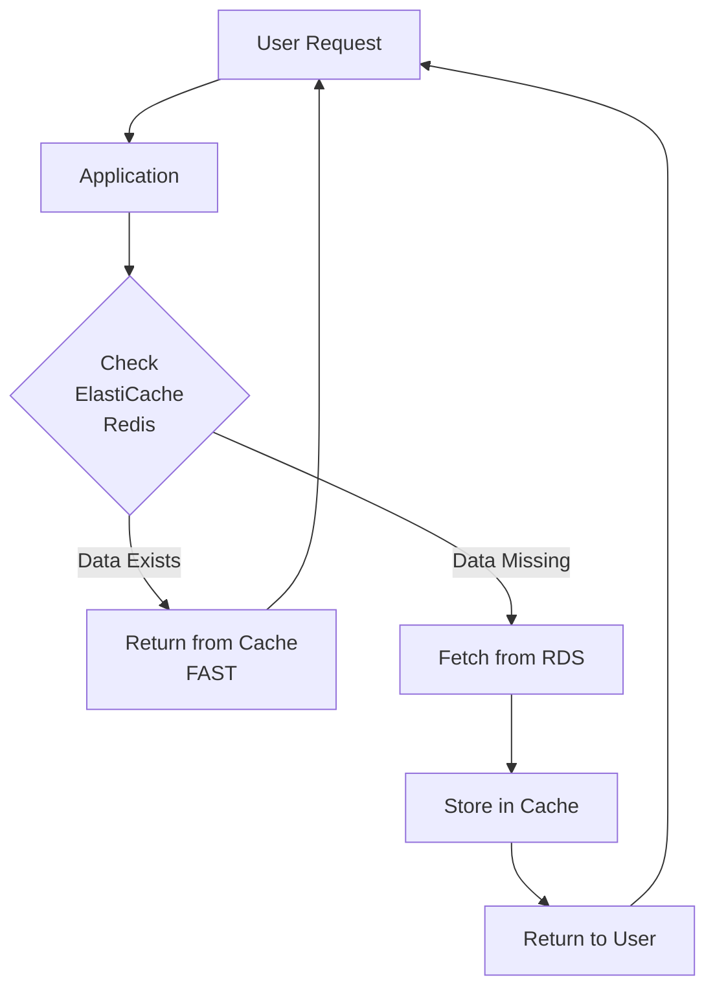

# ElastiCache (Redis) as an In-Memory Cache

## Prerequisites

- Active AWS account with billing enabled
- IAM permissions for ElastiCache and EC2
- Basic knowledge of Redis and caching concepts

## Objective

To implement Amazon ElastiCache (Redis) as an in-memory caching service by deploying a Redis cluster and performing basic cache operations from an EC2 instance.

## Application-Level Data Flow



**Why use ElastiCache?**

Redis improves performance by serving frequently accessed data from memory. In real-world applications, it is typically used in front of databases.

| Feature | RDS | ElastiCache |
|---------|-----|-------------|
| **Storage** | Disk | RAM |
| **Data lifetime** | Permanent | Temporary |
| **Access speed** | Slower | Very fast |
| **TTL support** | No | Yes |

## Phase 1: Launch EC2 Client using Amazon Linux 2023

**Purpose:** To create an EC2 instance that will act as a client machine to connect to ElastiCache using `valkey-cli`.

### Step 1: Select Region

Choose **ap-south-1 (Mumbai)**. Ensure EC2 and ElastiCache stay in the same region.

### Step 2: Launch Instance

- **Name:** `RedisClient-AL2023`
- **AMI:** Amazon Linux 2023 AMI
- **Instance Type:** `t3.micro` (Free Tier)
- **Key Pair:** Select an existing `.pem` file

### Step 3: Network & Security Group

- **VPC:** Default VPC
- **Security Group Name:** `SG-RedisClient`
- **Inbound Rules:**

| Type | Port | Source |
|------|------|--------|
| SSH | 22 | 0.0.0.0/0 |

> [!IMPORTANT]
> Do NOT add Redis (6379) here. The client does not listen on 6379.

- **Outbound rules:** Allow all (default)

### Step 4: Connect & Install Client

Connect via EC2 Instance Connect and run:

```bash
sudo dnf update -y
sudo dnf install -y valkey
# Verify installation
valkey-cli --version
```

> [!NOTE]
> Amazon Linux 2023 uses **Valkey**, which is fully Redis-protocol compatible.

**Verification:** Confirm EC2 status is "Running" and valkey-cli version displays.


## Phase 2: Create Amazon ElastiCache (Redis OSS) Cluster

**Purpose:** To create an Amazon ElastiCache Redis OSS cluster that will act as an in-memory cache, accessible from the EC2 client created in Phase-1.

### Step 1: Confirm AWS Region

- Ensure you are in the **same region** used in Phase-1
- EC2 and ElastiCache must be in the **SAME region and VPC**

### Step 2: Open ElastiCache Console

1. AWS Console → **Services**
2. Select **ElastiCache**
3. Click **Create cache**

### Step 3: Select Cache Engine

- **Engine:** Redis OSS

### Step 4: Choose Deployment Settings

- **Deployment option:** Node-based cluster
- **Creation method:** Easy create

> [!TIP]
> Easy create is used to avoid advanced production settings.

### Step 5: Select Configuration

- **Configuration:** Demo
- This automatically selects:
  - A small, low-cost node (e.g., `cache.t4g.micro`)
  - Suitable for labs and practice

### Step 6: Provide Cluster Information

- **Cache name:** `lab-redis`
- **Description:** Optional (`lab-redis`)

### Step 7: Configure Network and Subnet Group

- **Network type:** IPv4
- **Subnet Group:** Select **Create a new subnet group**
  - **Subnet group name:** `redis-subnet-group`
  - **VPC:** Default VPC
  - **Subnets:** Leave AWS auto-selected subnets unchanged

### Step 8: Configure Security

- **Security Group:** Create or select a security group named **SG-RedisCache**
- **Inbound Rule for Redis:** Add **one inbound rule** to SG-RedisCache:

| Type | Port | Source |
|------|------|--------|
| Custom TCP | 6379 | SG-RedisClient |

> [!NOTE]
> This allows only the EC2 client to access Redis.

### Step 9: Authentication

- **Authentication:** Disabled

### Step 10: Create Cache

1. Review all settings
2. Click **Create**
3. Wait until **Status = Available** (This may take a few minutes)

### Step 11: Note the Redis Endpoint

1. Click on the cache name `lab-redis`
2. Copy the **Configuration Endpoint**
   - Example: `lab-redis.xxxxxx.cache.amazonaws.com`
3. This endpoint will be used in Phase-3 to connect from EC2

> [!NOTE]
> We have created an in-memory Redis cache using Amazon ElastiCache. It runs inside the AWS VPC and does not have a public IP. Only our EC2 client is allowed to access it using port 6379.

**Verification:** Confirm cluster status is "Available" and endpoint is noted.


## Phase 3: Connect EC2 to ElastiCache Redis and Execute Cache Commands

**Purpose:** To connect the EC2 client (Amazon Linux 2023) to the ElastiCache Redis OSS cluster using valkey-cli and demonstrate basic in-memory cache operations.

### Pre-checks

Before connecting, confirm:

- EC2 and ElastiCache are in the same AWS region
- EC2 security group = `SG-RedisClient`
- Redis security group = `SG-RedisCache`
- Redis security group allows port 6379 from `SG-RedisClient`
- Redis Status = **Available**
- You have copied the **Primary/Configuration Endpoint**

### Step 1: Connect to EC2

1. AWS Console → **EC2**
2. Select instance `RedisClient-AL2023`
3. Click **Connect**
4. Choose **EC2 Instance Connect** and click **Connect**
5. You are now inside the EC2 terminal

### Step 2: Verify Valkey Client

Run:

```bash
valkey-cli --version
```

**Expected Output (example):** `valkey-cli 8.x.x`

> [!NOTE]
> This confirms the EC2 is ready to act as a Redis-compatible client.

### Step 3: Connect to ElastiCache Redis

Use the Configuration Endpoint from Phase-2:

```bash
valkey-cli -h <Configuration_ENDPOINT> -p 6379
```

**Example:**

```bash
valkey-cli -h lab-redis.xxxxxx.cache.amazonaws.com -p 6379
```

**Expected Result:** You should see a prompt like `lab-redis.xxxxxx.cache.amazonaws.com:6379>`. This means the connection is successful.

### Step 4: Execute Redis / Valkey Commands

These commands simulate what an application does internally.

#### 4.1 Test Connectivity

```
PING
```

**Expected Output:** `PONG`

#### 4.2 Store and Retrieve Data (SET / GET)

```
SET course "Cloud Computing"
GET course
```

**Expected Output:** `"Cloud Computing"`

> [!NOTE]
> Demonstrates key–value storage in memory.

#### 4.3 Counter Example (INCR)

```
INCR visits
INCR visits
GET visits
```

**Expected Output:** `"2"`

> [!TIP]
> Common real-world use - page views, hit counters.

#### 4.4 Set Data with Expiry (TTL)

```
SET notice "Results Published" EX 60
TTL notice
GET notice
```

**Expected Output:**

- TTL shows a value ≤ 60
- GET returns "Results Published"

#### 4.5 Verify Automatic Expiry

Wait ~60 seconds, then run:

```
GET notice
```

**Expected Output:** `(nil)`

> [!NOTE]
> Confirms data is automatically removed from memory.

#### 4.6 Delete Data Manually

```
DEL course
GET course
```

**Expected Output:** `(nil)`

### Step 5: Exit Redis Client

```
EXIT
```

> [!TIP]
> The application first checks Redis. If data is present, it is returned immediately from memory. If not present, the application fetches data from the database and stores it in Redis with a TTL. Redis automatically removes the data after expiry.

**Verification:** Confirm all commands executed as expected (e.g., GET returns values, TTL expires).


## Phase 3 Outcome

- EC2 successfully connected to ElastiCache Redis
- In-memory key–value operations verified
- Temporary storage and TTL behavior observed
- Redis used as a cache, not as a primary database


## Common Errors & Quick Fix

| Problem | Reason | Fix |
|---------|--------|-----|
| Connection timeout | Wrong SG or region | Check SG-RedisCache inbound rule |
| Command hangs | Redis not Available | Wait & retry |
| (nil) output | Key expired | Expected behavior |
| TLS errors | Missing --tls flag | Add --tls to valkey-cli command |
| Subnet group issues | VPC mismatch | Ensure same VPC for EC2 and ElastiCache |


## Cost Considerations

- **Pricing:** ElastiCache ~$0.02/hour for cache.t4g.micro; no free tier
- **Tip:** Delete clusters immediately after lab to avoid charges. Monitor via CloudWatch


## Cleanup (Mandatory)

**Step 1: Delete Redis Cluster**

ElastiCache → Select `lab-redis` → **Delete** (Disable snapshots)

**Step 2: Terminate EC2 Instance**

EC2 → Instances → **Terminate** `RedisClient-AL2023`

**Step 3: Optional**

Delete unused security groups


## Redis Commands Explanation

- `SET course "Cloud Computing"`: Stores frequently accessed data in cache
- `GET course`: Retrieves data from memory
- `EXPIRE course 30`: Sets a 30-second timer for the data
- `TTL course`: Checks remaining time before the data is removed

> [!NOTE]
> The above commands simulate application caching behavior. Cached data is temporary and stored in memory. After expiry, the application would fetch fresh data from the database again.


## Integrating with RDS for Full Workflow

To test the complete "database + cache" setup:

1. Create an RDS MySQL instance (as in Lab 17)
2. On EC2, install Python and run a script that checks Redis first, then fetches from RDS if missing
3. Example Python snippet:

```python
import redis
import mysql.connector

r = redis.Redis(host='lab-redis.xxxxxx.cache.amazonaws.com', port=6379)
db = mysql.connector.connect(host='rds-endpoint', user='admin', password='pwd', database='mydb')

def get_data(key):
    if r.exists(key):
        return r.get(key)
    else:
        # Fetch from RDS
        cursor = db.cursor()
        cursor.execute("SELECT value FROM table WHERE id=%s", (key,))
        data = cursor.fetchone()
        r.set(key, data, ex=300)  # Cache for 5 mins
        return data
```

This demonstrates real-world caching.
