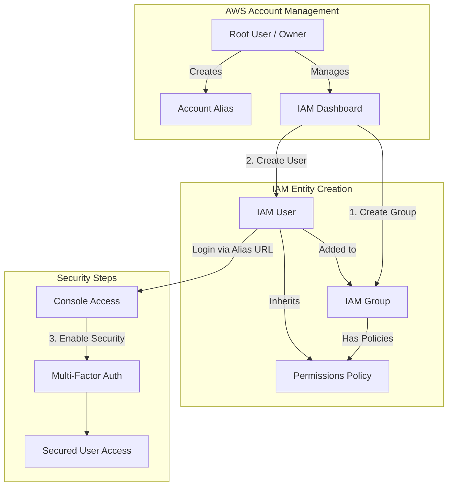
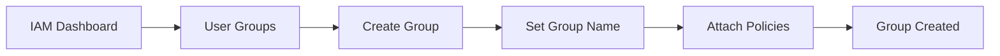
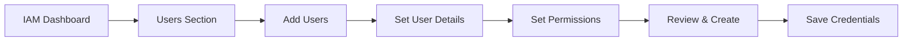
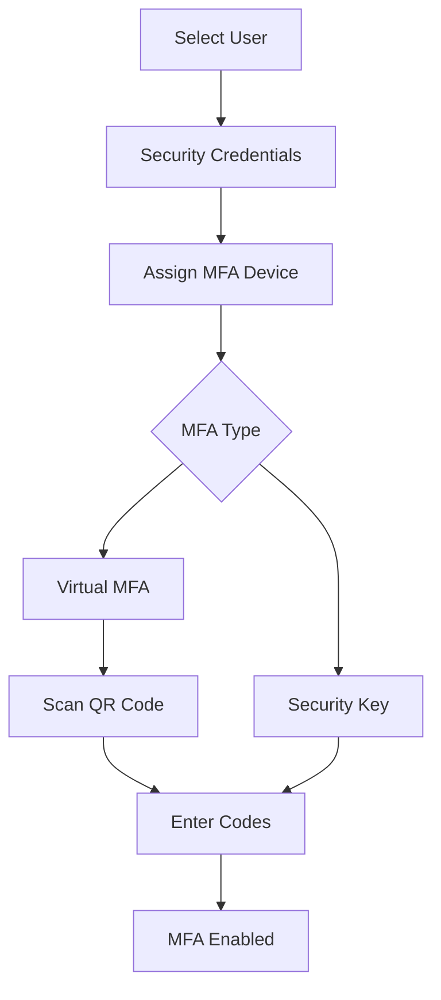

# AWS Identity Access Management (IAM)

Topics: IAM User/Group Creation, Enable IAM MFA, Create AWS Account Alias

Date: 9-10-2025

## IAM Workflow Overview

This diagram illustrates the relationship between the Root user and IAM entities, and the workflow for securing a new user.

AWS Identity and Access Management (IAM) is a security service that helps you control who can access your AWS resources and what actions they can perform. It is a global AWS service. It allows you to securely manage users, groups, roles, and permissions in your AWS account.

### IAM Concepts

|**Concept**|**Description**|
|---|---|
|**Root User**|The account owner who created the AWS account. Has full access and should be used only for account setup.|
|**Group**|A collection of IAM users that share the same permissions. For example, a “Developers” group or “Students” group.|
|**User**|A person or application that interacts with AWS (e.g., student1, admin, developer). Each user has its own username, password, and access keys.|
|**Policy**|A JSON document that defines what actions are allowed or denied (e.g., “allow S3 read access”).|
|**Role**|A set of permissions that can be temporarily assumed by a user, service, or application — often used by EC2 instances or Lambda functions.|

## IAM User Group Creation

**Step 1:** Sign in to AWS Console

Log in to your AWS Management Console using an administrator account.

**Step 2:** Open Groups Section

- From the Services menu, search for IAM and open it.
    
- In the IAM dashboard, look at the left sidebar.
    
- Click on "User groups" → then click "Create group".

**Step 3:** Name the Group

- Enter a Group name (example: Developers, Admins, Students, etc.).
    
- Group names must be unique within your account.

**Step 4:** Attach Permissions Policies

- You can attach IAM policies to define what members of the group can do. Select the following:
    
    - `AdministratorAccess` → Full access to all services.
        
    - `IAMUserChangePassword`

**Step 5:** Review and Create

- Review all details (group name + permissions).
    
- Click "Create group" to finalize.

**Step 6:** Group Successfully Created

- The new group now appears in the IAM dashboard.
    
- Any user added to this group automatically inherits all permissions attached to the group.

## IAM User Creation

**Step 1:** Sign in to AWS Management Console

- Login to the AWS Management Console using your root user credentials.
    
- In the search bar, type IAM and open IAM service.

**Step 2:** Navigate to Users Section

- In the IAM dashboard's left panel (info panel), click on Users.
    
- Then click on the "Add users" button.

**Step 3:** Set User Details

- Enter a user name.
    
- Checkbox – ‘Provide user access to the AWS Management Console’.
    
- Select 'I want to create an IAM user' option.

**Step 4:** Set Permissions

- You can grant permissions to the new user in three ways:
    
    - Add user to group – Assign predefined permission groups.
        
    - Copy permissions from an existing user.
        
    - Attach existing policies directly.
        
- **Recommended:** Use IAM groups to manage permissions easily.

**Step 5:** Set User Details and Tags (Optional)

- Add tags like Department: MCA or Role: Faculty/Student for easy identification.
    
- Click Next to review.

**Step 6:** Review and Create User

- Review all settings (user name, permissions, tags).
    
- Click Create user.

**Step 7:** Save Credentials

- After creation, AWS displays: Console sign-in URL, Username, Password.
    
- **NOTE:** Download or copy these credentials immediately — they cannot be retrieved later.

**Step 8:** Test the User Login

- Visit the IAM login URL provided (unique for your AWS account).
    
- Log in with the newly created username and password.
    
- Verify access and permissions.

## Enable AWS IAM MFA

**Step 1:** Sign in to AWS Console as root user

**Step 2:** Open IAM Dashboard

- In the search bar, type IAM and select IAM (Identity and Access Management).
    
- From the left navigation pane, select Users.

**Step 3:** Select a User

- Click the user name for whom you want to enable MFA.
    
- This opens the User Summary page.

**Step 4:** Go to Security Credentials Tab

Click the Security credentials tab.

**Step 5:** Assign MFA Device

- Scroll down to the section “Multi-factor authentication (MFA)”.
    
- Click “Assign MFA device”.
    
- Choose the MFA type: Virtual MFA device, Security key, Authenticator app on phone.

**Step 6:** Configure Virtual MFA

- If you select Virtual MFA device:
    
    - Open your Google Authenticator or Authy app on your phone.
        
    - Scan the QR code shown on the AWS screen.
        
    - The app starts generating 6-digit codes.

**Step 7:** Verify MFA

- Enter two consecutive codes from your app in the verification fields.
    
- Click "Assign MFA".

**Step 8:** Confirm Setup

- You will see a green checkmark confirming MFA is successfully assigned.
    
- The user now requires MFA each time they sign in.

## Create an AWS Account Alias

An Account Alias gives your AWS account a name instead of using the long numeric Account ID in your sign-in URL. This makes it easier for IAM users to remember and log in.

1. Sign in to the AWS Management Console using the root user or an IAM user with administrative privileges. In the search bar, type IAM, and open the IAM service.
    
2. In the left navigation pane, scroll down and select Dashboard.
    
3. Under the “AWS Account” section, find “Account Alias”. Click on “Create” (or “Edit” if one already exists).
    
4. In the pop-up box, enter your preferred alias name. Click “Create alias”.
    
5. Once created, you’ll see a new Sign-in URL displayed.

