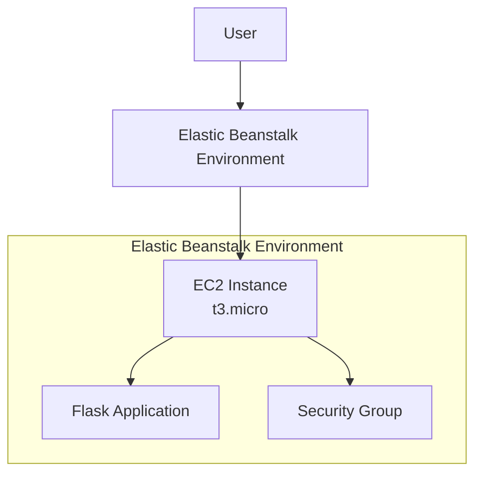

# Deploying a Flask Application on AWS Elastic Beanstalk

## Prerequisites

- Active AWS account with billing enabled
- IAM permissions for Elastic Beanstalk and EC2
- Python installed locally for app creation
- Basic knowledge of Flask and web deployment

## Objective

Deploy a simple Flask application on AWS Elastic Beanstalk and verify it using the public URL.

## What is Elastic Beanstalk?

Elastic Beanstalk is a Platform as a Service (PaaS) provided by AWS that allows developers to deploy and manage applications without manually handling the underlying infrastructure such as EC2, load balancers, or auto scaling.

The user only uploads the application code, and Elastic Beanstalk automatically:

- Creates required AWS resources
- Deploys the application
- Handles scaling, monitoring, and health checks

**Single Instance Environment:**

A single instance environment means the application runs on one EC2 instance only, without a load balancer or auto scaling.

**Used for:**

- Learning and lab exercises
- Development and testing
- Low-traffic applications

It is cost-effective and simple, but not fault-tolerant.

## Elastic Beanstalk Architecture




## Phase A: Create the Flask App

### Step 1: Create a Project Folder

On your local system, create a folder named: `eb-flask-lab`

### Step 2: Create [application.py](application.py)

Inside the folder, create a file named `application.py` with the following code:

```python
from flask import Flask

app = Flask(__name__)

@app.route("/")
def home():
    return "Hello from Flask on Elastic Beanstalk!"

@app.route("/health")
def health():
    return "OK"

if __name__ == "__main__":
    app.run()
```

### Step 3: Create [requirements.txt](requirements.txt)

Create a file named `requirements.txt` and add the following dependencies:

```text
Flask==3.0.3
gunicorn==22.0.0
```

> [!NOTE]
> The `requirements.txt` file lists all Python libraries and their versions required for the application. Elastic Beanstalk uses this file to automatically install dependencies using pip.

### Step 4: Create Procfile (MOST IMPORTANT)

Create a file named exactly `Procfile` (with no file extension).

Contents:

```text
web: gunicorn application:app
```

> [!WARNING]  
> **Windows Note:** In Notepad, select **Save as type: All Files** to ensure it doesn't save as `Procfile.txt`.

**What is Procfile?**

A Procfile tells Elastic Beanstalk how to start the application. It specifies:

- The process type (e.g., web)
- The command to run the application (e.g., Gunicorn for Flask)

Without a Procfile, Elastic Beanstalk may not know which command to execute, leading to deployment errors.

### Step 5: Verify Folder Contents

Ensure your folder contains exactly these 3 files:

```text
eb-flask-lab/
├── application.py
├── requirements.txt
└── Procfile
```

**Verification:** Run `python application.py` locally to ensure it starts without errors.


## Phase B: Create the Root-Level ZIP

### Step 1: Select the Files

Inside the eb-flask-lab folder, select all 3 files (`application.py`, `requirements.txt`, and `Procfile`).

### Step 2: Create ZIP

Right-click → Compress to ZIP file. Rename it to: `eb-flask-lab.zip`

### Step 3: Confirm ZIP Contents

Open the ZIP file. You must see the files directly at the top level.

> [!IMPORTANT]
> If the files are inside a sub-folder within the ZIP, the deployment will fail. Elastic Beanstalk expects all required files at the root level of the ZIP file.

**Verification:** Extract ZIP temporarily to confirm files are at root.

## Phase C: Deploy on Elastic Beanstalk (AWS Console)

### Step 1: Open Elastic Beanstalk

Navigate to the AWS Console → Search for Elastic Beanstalk. Ensure your region is Asia Pacific (Mumbai) (ap-south-1).

### Step 2: Create Environment

1. Click **Create environment**
2. **Environment tier:** Select **Web server environment**
3. **Application information:** Name it `EB-Flask-Lab`
4. **Platform:**
   - Platform: **Python**
   - Platform branch: Latest Python on Amazon Linux
   - Platform version: Recommended

### Step 3: Upload Your Code

1. In **Application code**, select **Upload your code**
2. **Version label:** `v1`
3. **Source code origin:** **Local file**
4. Click **Choose file** and select `eb-flask-lab.zip`
5. **Presets:** Select **Single instance (free tier eligible)**
6. Click **Next**

**Verification:** Confirm ZIP upload succeeds and environment creation starts.


## Phase D: Configure Service Access (IAM Roles)

### Step 1: Service Role

If the dropdown is empty:

1. Click **Create role** (opens IAM)
2. Use case: **Elastic Beanstalk**
3. Name it `aws-elasticbeanstalk-service-role`
4. Return to EB tab, click **Refresh**, and select the role

### Step 2: EC2 Instance Profile

If the dropdown is empty:

1. Click **Create role** → Use case: **EC2**
2. Attach policy: `AWSElasticBeanstalkWebTier`
3. Name it `aws-elasticbeanstalk-ec2-role`
4. Return to EB tab, click **Refresh**, and select the role

### Step 3: Finalize

Leave EC2 Key pair blank. Click Next, keep remaining defaults, and click Create environment.

**Verification:** Environment creation starts without errors.


## Phase E: Monitor & Test

### Step 1: Wait for Deployment

Open the Events tab. Deployment is successful when:

- Message: "Environment successfully launched"
- Health: **OK**
- A **Domain URL** appears at the top

### Step 2: Test the App

Click the Domain link.

**Expected Output:** `Hello from Flask on Elastic Beanstalk!`

### Step 3: Test Health Check

Append `/health` to the URL.

**Expected Output:** `OK`

**Verification:** Both URLs load correctly.


## Cost Considerations

- **Pricing:** EB ~$0.01/hour for t3.micro EC2; free tier covers 750 hours
- **Tip:** Terminate environments immediately to avoid charges. Monitor via CloudWatch


## Phase F: Cleanup (Mandatory)

1. Go to **Elastic Beanstalk** → **Environments**
2. Select your environment → **Actions** → **Terminate environment**


## Accessing Logs in Elastic Beanstalk

If environment health is "Degraded" or "Severe":

1. Go to EB → Environment → Logs
2. Click "Request Logs" → "Last 100 Lines" or "Full Logs"
3. Download and review for errors (e.g., import failures, port issues)
4. Alternatively, SSH into EC2 via EB → Environment → EC2 Instance → Connect

## Common Mistakes

- **Procfile must be "Procfile"** (no .txt extension)
- **ZIP must contain files at root level** (not inside a sub-folder)
- **Upload must be Local file** (not Public S3 URL)
- **IAM roles must be created/selected** if "No options" appear
- **Python version in requirements.txt must match EB platform**
- **Application must listen on 0.0.0.0** in production (handled by Gunicorn)


## Why Use `host='0.0.0.0'` in Flask?

By default, Flask runs on `127.0.0.1` (localhost), which means the application is accessible **only from inside the EC2 instance**.

When we set:

```python
app.run(host='0.0.0.0', port=5000)
```

it tells Flask to **listen on all network interfaces** of the EC2 instance.

This allows:

- Access from the **browser on our local system**
- Access using the **EC2 public IP address**

**What happens if we don't use 0.0.0.0?**

- Flask listens only on localhost
- Application works **inside EC2**
- Browser access using `http://<EC2-public-IP>:5000` fails

> [!TIP]
> We use `host='0.0.0.0'` so that the Flask application running on EC2 is accessible from external systems using the EC2 public IP.

## Troubleshooting

- **502 Bad Gateway:** Check Procfile syntax and file location in ZIP
- **Application version not found:** Verify files are at root level in ZIP
- **Environment health degraded:** Review logs for Python/dependency errors
- **Permission denied:** Ensure IAM roles are correctly assigned
- **Port issues:** Gunicorn handles port binding; don't specify port in application.py when deployed


## Key Takeaways

1. Elastic Beanstalk abstracts infrastructure management
2. Procfile is critical for defining the startup command
3. Files must be at ZIP root level
4. IAM roles are required for EB to manage resources
5. Monitor logs and health status for debugging
6. Always terminate environments after use to avoid costs
