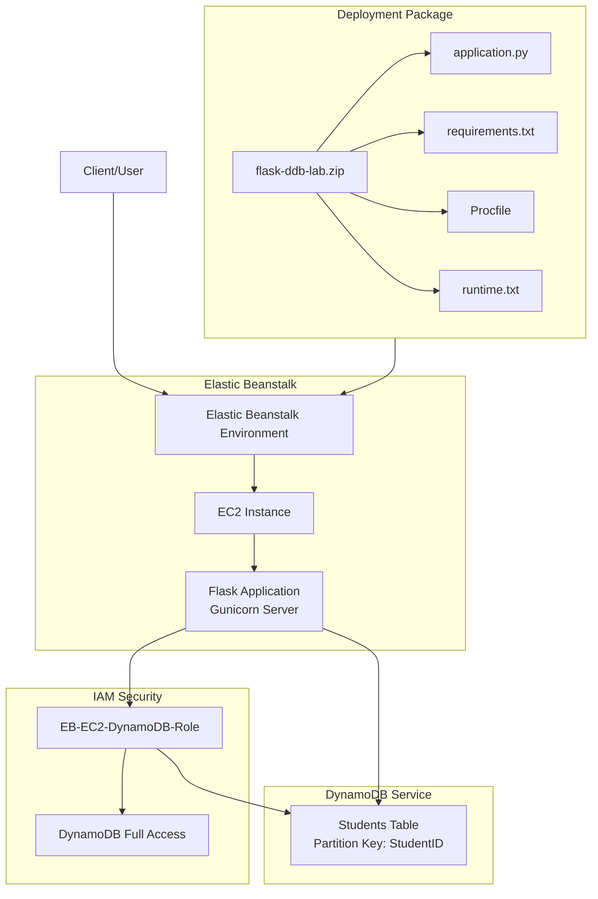

# Flask + DynamoDB on Elastic Beanstalk

This lab provides a complete walkthrough for deploying a Flask application integrated with Amazon DynamoDB on AWS Elastic Beanstalk, demonstrating a serverless database architecture with managed application hosting.

## System Architecture



## Phase 1: Local Environment Preparation

Before deploying to AWS, prepare your project folder with the required files.

### Project Structure

Create a folder named `flask-ddb-lab` containing exactly these four files:

- `application.py` - Flask application code
- `requirements.txt` - Python dependencies
- `Procfile` - Gunicorn configuration
- `runtime.txt` - Python version specification

### File Contents

#### application.py

```python
from flask import Flask, request, jsonify
import boto3
import os

app = Flask(__name__)

REGION = os.getenv("AWS_REGION", "ap-south-1")
TABLE_NAME = os.getenv("TABLE_NAME", "Students")

dynamodb = boto3.resource("dynamodb", region_name=REGION)
table = dynamodb.Table(TABLE_NAME)

@app.route("/")
def home():
    return "Flask + DynamoDB on Elastic Beanstalk is working!"

@app.route("/health")
def health():
    return jsonify(status="ok")

# CREATE
@app.route("/student", methods=["POST"])
def create_student():
    data = request.get_json()
    table.put_item(Item={
        "StudentID": data["StudentID"],
        "Name": data["Name"],
        "Dept": data.get("Dept", "")
    })
    return jsonify(message="Student created"), 201

# READ
@app.route("/student/<student_id>", methods=["GET"])
def get_student(student_id):
    resp = table.get_item(Key={"StudentID": student_id})
    item = resp.get("Item")
    if not item:
        return jsonify(error="Student not found"), 404
    return jsonify(item)

# UPDATE
@app.route("/student/<student_id>", methods=["PUT"])
def update_student(student_id):
    data = request.get_json()
    resp = table.update_item(
        Key={"StudentID": student_id},
        UpdateExpression="SET #n = :n, Dept = :d",
        ExpressionAttributeNames={"#n": "Name"},
        ExpressionAttributeValues={":n": data["Name"], ":d": data.get("Dept", "")},
        ReturnValues="UPDATED_NEW"
    )
    return jsonify(message="Student updated", updated=resp["Attributes"])

# DELETE
@app.route("/student/<student_id>", methods=["DELETE"])
def delete_student(student_id):
    table.delete_item(Key={"StudentID": student_id})
    return jsonify(message="Student deleted")
```

#### requirements.txt

```text
Flask==3.0.0
boto3==1.34.0
gunicorn==21.2.0
```

#### Procfile

```text
web: gunicorn application:app
```

#### runtime.txt

```text
python-3.11
```

### Packaging the Application

1. Select all 4 files in the `flask-ddb-lab` folder
2. Right-click → **Send to** → **Compressed (zipped) folder**
3. Name the file: `flask-ddb-lab.zip`

> [!IMPORTANT]
> When you open the zip file, all 4 files should be at the root level, NOT inside a subfolder. Elastic Beanstalk expects the application code at the root of the archive.

## Phase 2: AWS Resource Configuration

### Create DynamoDB Table

1. Navigate to **DynamoDB** → **Tables** → **Create table**
2. Configure the table:
   - **Table name**: `Students`
   - **Partition key**: `StudentID` (Type: **String**)
3. Click **Create table**
4. Wait for the table status to become **Active**

### Create IAM Role for EC2 Instances

The IAM role grants EC2 instances permission to access DynamoDB.

1. Navigate to **IAM** → **Roles** → **Create role**
2. **Trusted entity type**: AWS service
3. **Use case**: EC2
4. Click **Next**
5. **Attach permissions policy**: Search for and select `AmazonDynamoDBFullAccess`
6. Click **Next**
7. **Role name**: `EB-EC2-DynamoDB-Role`
8. Click **Create role**

> [!TIP]
> Once this role is created, it will be available for all future Elastic Beanstalk environments. You only need to create it once per AWS account.

## Phase 3: Elastic Beanstalk Deployment

### Create Application Environment

1. Navigate to **Elastic Beanstalk** → **Create application**
2. Configure application:
   - **Application name**: `flask-ddb-lab`
   - **Platform**: Python
   - **Application code**: Select **Sample application** (for initial setup)
   - **Presets**: Single instance (free tier eligible)

### Configure Service Access

1. **Service role**: Leave as default (auto-created)
2. **EC2 instance profile**: Select `EB-EC2-DynamoDB-Role`
3. Click **Next** through remaining configuration screens
4. Click **Submit**

Wait 5-10 minutes for the environment to launch. The environment health should show **Ok** (green) when ready.

### Verify Sample Application

1. In the environment dashboard, locate the **Domain** URL (e.g., `flask-ddb-lab.us-east-1.elasticbeanstalk.com`)
2. Open the URL in your browser
3. You should see the default Python sample application

### Deploy Your Application

1. In the environment dashboard, click **Upload and deploy**
2. Click **Choose file** and select `flask-ddb-lab.zip`
3. **Version label**: `v1`
4. Click **Deploy**

Wait for the deployment to complete (health status returns to **Ok**).

## Phase 4: Environment Variables Configuration

Environment variables tell your Flask app which DynamoDB table and region to use.

1. In the environment dashboard, click **Configuration** (left sidebar)
2. Locate the **Software** category and click **Edit**
3. Scroll to **Environment properties** section
4. Add these properties:

| Name | Value |
|------|-------|
| `TABLE_NAME` | `Students` |
| `AWS_REGION` | `ap-south-1` |

5. Click **Apply**
6. Wait for the environment to finish updating (2-3 minutes)

> [!WARNING]
> Without these environment variables, your application will fail to connect to DynamoDB. The Flask app reads these values using `os.getenv()`.

## Phase 5: Testing & Verification

### Health Check

Open **AWS CloudShell** (or your local terminal) and test the health endpoint:

```bash
curl http://<your-eb-domain>/health
```

**Expected output:**

```json
{"status":"ok"}
```

### CRUD Operations Testing

Replace `<your-eb-domain>` with your actual Elastic Beanstalk domain URL.

#### Create a Student (POST)

```bash
curl -X POST http://<your-eb-domain>/student \
-H "Content-Type: application/json" \
-d '{"StudentID":"101","Name":"Anita","Dept":"MCA"}'
```

**Expected response:**

```json
{"message":"Student created"}
```

#### Read Student Data (GET)

```bash
curl http://<your-eb-domain>/student/101
```

**Expected response:**

```json
{"StudentID":"101","Name":"Anita","Dept":"MCA"}
```

#### Update Student Data (PUT)

```bash
curl -X PUT http://<your-eb-domain>/student/101 \
-H "Content-Type: application/json" \
-d '{"Name":"Anita S","Dept":"MCA-III"}'
```

**Expected response:**

```json
{"message":"Student updated","updated":{"Name":"Anita S","Dept":"MCA-III"}}
```

#### Delete Student (DELETE)

```bash
curl -X DELETE http://<your-eb-domain>/student/101
```

**Expected response:**

```json
{"message":"Student deleted"}
```

### Verify in DynamoDB Console

1. Navigate to **DynamoDB** → **Tables** → **Students**
2. Click **Explore table items**
3. Confirm the data reflects your test operations

## Common Issues & Solutions

### Issue: Application returns 500 errors

**Causes:**
- Missing environment variables (`TABLE_NAME`, `AWS_REGION`)
- Incorrect IAM role attached to EC2 instance
- DynamoDB table doesn't exist or wrong name

**Solution:**
1. Check environment variables in **Configuration** → **Software**
2. Verify IAM role in **Configuration** → **Security**
3. Confirm table name matches exactly (case-sensitive)

### Issue: Environment health shows "Degraded"

**Causes:**
- Application code errors
- Missing dependencies in `requirements.txt`
- Incorrect file structure in zip

**Solution:**
1. Check logs: **Logs** → **Request logs** → **Last 100 lines**
2. Verify all 4 files are at zip root (not in subfolder)
3. Ensure `application.py` has the correct variable name (`app`)

### Issue: Permission denied accessing DynamoDB

**Cause:** IAM role not attached or incorrect permissions

**Solution:**
1. Go to **Configuration** → **Security** → **Edit**
2. Verify **IAM instance profile** is set to `EB-EC2-DynamoDB-Role`
3. Confirm role has `AmazonDynamoDBFullAccess` policy attached

## Cleanup Instructions

To avoid ongoing charges:

1. **Elastic Beanstalk**:
   - Go to your environment → **Actions** → **Terminate environment**
   - Confirm by typing the environment name

2. **DynamoDB**:
   - Go to **DynamoDB** → **Tables** → **Students**
   - Click **Delete** → Confirm deletion

3. **IAM Role** (optional):
   - Can be retained for future labs
   - Or delete via **IAM** → **Roles** → `EB-EC2-DynamoDB-Role` → **Delete**

## Key Concepts

### Elastic Beanstalk Components

- **Application**: Top-level container for environments
- **Environment**: Runtime instance with specific configuration
- **Platform**: Managed runtime (Python, Node.js, etc.)
- **Version**: Specific deployment of application code

### IAM Instance Profile

An EC2 instance profile is a container for an IAM role that allows EC2 instances to assume that role. It provides temporary credentials to applications running on EC2 without hardcoding API keys.

### Environment Variables vs. Hardcoding

**Why use environment variables?**

- Separate configuration from code
- Different settings per environment (dev, staging, prod)
- Security: No credentials in source code
- Easy updates without redeploying code

## Learning Outcomes

After completing this lab, you should understand:

- How to structure a Flask application for Elastic Beanstalk
- IAM roles and policies for service-to-service authentication
- DynamoDB as a NoSQL database for REST APIs
- Environment-based configuration management
- Deployment workflows for managed PaaS platforms
- CRUD operations via RESTful endpoints
