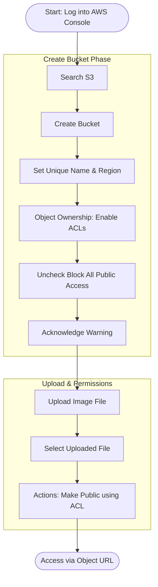
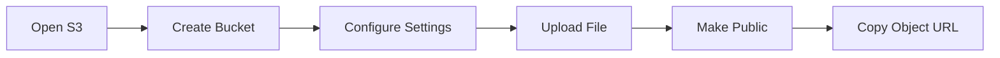

# Amazon S3 Introduction

Topics: S3 Bucket Creation, Upload Objects, Public Access

Date: 14-10-2025

## S3 Public Object Workflow

This diagram visualizes the specific configuration steps required to make an object accessible via a public URL.

Amazon S3 (Simple Storage Service) is a fully managed, object-based storage service offered by AWS. It allows you to store and retrieve unlimited amounts of data from anywhere on the web.

Unlike traditional file systems that store data in folders, S3 stores data as objects inside buckets. Each object has:

- **Data** (the actual file),
    
- **Metadata** (information about the file),
    
- **Unique key** (its name within the bucket).
    

You can store unlimited data in Amazon S3. However, each AWS account can create up to 100 buckets by default (can be increased by request). Each object (file) can be up to 5 TB (terabytes) in size. Single upload limit: 5 GB (may vary), but larger files can be uploaded using Multipart Upload.

Amazon S3 is designed for:

- **Durability:** 99.999999999% (11 nines) – this means your data is extremely safe.
    
- **Availability:** 99.99% uptime – your data is almost always accessible.
    

S3 automatically stores multiple copies of your data across multiple Availability Zones in a region.

**Storage classes:** S3 offers different storage classes depending on cost and frequency of access.

## S3 Storage Classes

|**Storage Class**|**Description**|
|---|---|
|S3 Standard|For frequently accessed data (default).|
|S3 Intelligent-Tiering|Automatically moves data between frequent - infrequent access tiers.|
|S3 Standard-IA|For infrequently accessed data but still quickly available.|
|S3 Glacier|For archival storage (low cost, slower retrieval).|
|S3 Glacier Deep Archive|For long-term archival (lowest cost).|

Each object can be accessed through a unique URL. S3 is commonly used for:

- Backup and archival
    
- Static website hosting
    
- Application data storage
    
- Media content delivery

## S3 Features

|**Feature**|**Description**|
|---|---|
|**Buckets**|Top-level containers for storing objects.|
|**Objects**|Actual files stored in S3 (e.g., images, HTML, PDFs).|
|**Region**|Each bucket is created in a specific AWS region.|
|**Versioning**|Maintains multiple versions of the same object for recovery.|
|**Static Website Hosting**|Allows you to host HTML pages directly from an S3 bucket.|

## Create an S3 Bucket and Upload an Image

**Step 1:** Open the S3 Service:

- Sign in to your AWS Management Console.
    
- In the search bar, type S3 and click Amazon S3.

**Step 2:** Create a New Bucket:

- Click "Create bucket".
    
- Bucket type: General purpose.
    
- Bucket name: Enter a name (Bucket names must be globally unique and lowercase).
    
- AWS Region: Choose the region nearest to you.
    
- **Object Ownership: select ACLs enabled** [this enables us to access the objects through the public URLs].
    
- Next keep the ‘Bucket owner preferred’ as checked [default setting].
    
- Scroll down to ‘Block Public Access settings for this bucket’ section and uncheck:
    
    - “Block all public access” → Uncheck this (for viewing file publicly).
        
    - Confirm the warning checkbox [acknowledgement].
        
- Keep all other settings as default.
    
- Click Create bucket.

**Step 3:** Upload an Image File:

- Click on the newly created bucket name.
    
- Click Upload → Add files.
    
- Choose any image file from your computer.
    
- Scroll down and click Upload.

**Step 4:** Make the Object Public:

- By default, S3 objects are private. To view them in a browser, make the file public.
    
- After upload, go to the Objects tab inside your bucket.
    
- Select the uploaded file.
    
- Click Actions → Make public using ACL.
    
- Confirm.

**Step 5:** Copy the Object URL:

- Open the object again by clicking its name.
    
- Scroll down to the Object URL section.
    
- Copy this URL and open it in a new browser tab.
    

The image is displayed directly from the S3 bucket — meaning AWS S3 is serving that object over HTTP.

