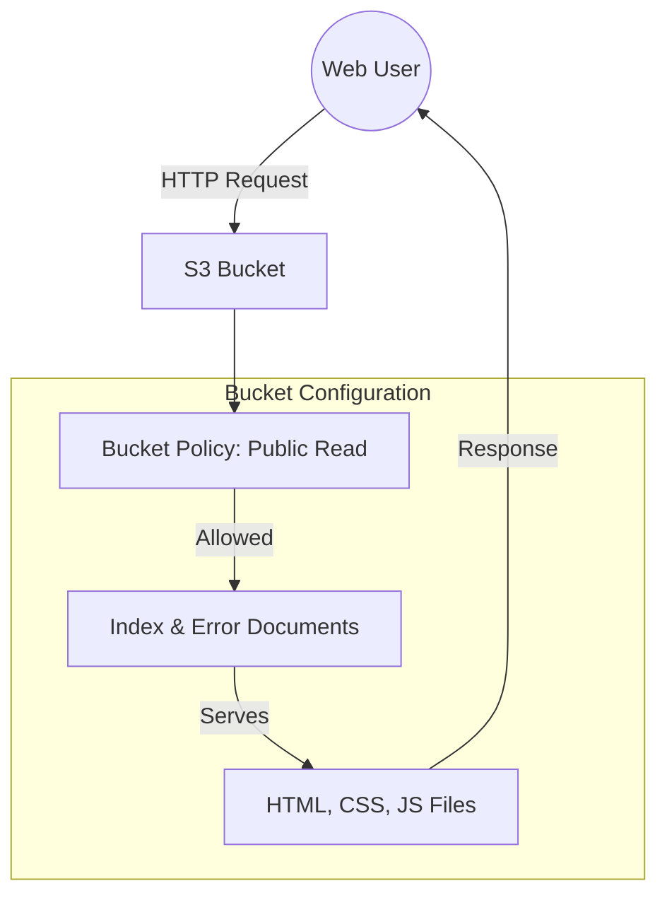
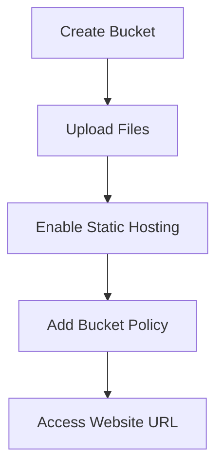
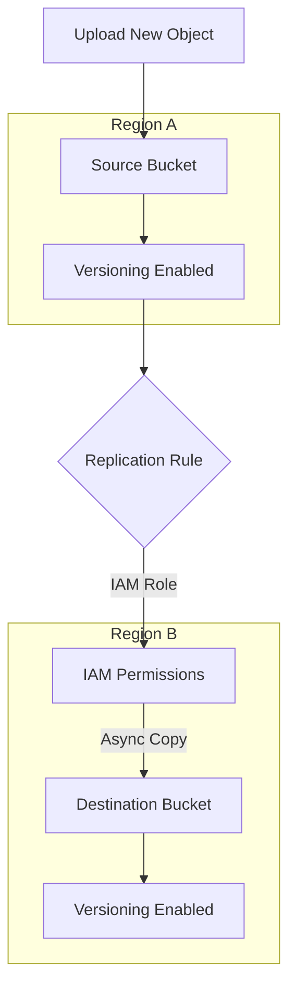

# Amazon S3 Advanced Features

Topics: Static Website Hosting, Versioning, Cross-Region Replication

Date: 16-10-2025, 23-10-2025

## S3 Advanced Features Overview

This lab covers three major S3 capabilities:

| Feature | Purpose |
|---------|--------|
|Static Website Hosting|Convert a bucket into a web server for HTML/CSS/JS sites|
|Versioning|Keep multiple versions of objects for recovery|
|Cross-Region Replication|Automatically copy objects to another region for disaster recovery|

## Amazon S3 Static Website Hosting

Amazon S3 can host a static website – a website consisting of only HTML, CSS, JavaScript, images, etc. – no server-side scripting like PHP or Python.



When you enable "Static Website Hosting," your S3 bucket acts like a web server, and AWS provides a public website URL to access it. You can create a multi-page static website (e.g., `index.html`, `about.html`, `contact.html`) and upload it to S3. Links within these pages allow users to navigate between them just like a normal website.

### Create a Multi-Page Static Website on S3



**Step 1:** Create an S3 Bucket

- Open the AWS Management Console → Navigate to S3.
    
- Click Create bucket.
    
- Select Bucket type: General purpose.
    
- Enter a unique bucket name (e.g., `my-static-web-demo`).
    
- **Select ACLs enabled under Object Ownership section.**
    
- Uncheck “Block all public access.”
    
- Click Create bucket.

**Step 2:** Prepare Website Files

- Before uploading, organize your files in a folder structure as follows:
    

Plaintext

```
my-website/
|
+-- index.html
+-- about.html
+-- contact.html
+-- error.html
+-- images/
+-- banner.jpg
```

- Each HTML file should include navigation links.

**Step 3:** Upload Website Files

- Open your S3 bucket → Click Upload.
    
- Add all files and folders (HTML, CSS, JS, images).
    
- Click Upload to store them in S3.

**Step 4:** Enable Static Website Hosting

- Go to the **Properties** tab of the bucket.
    
- Scroll down to **Static website hosting** → Click Edit.
    
- Choose Enable and select ‘Host a static website’.
    
- Set:
    
    - Index document: `index.html`
        
    - Error document: `error.html`
        
- Click Save changes.

**Step 5:** Make Files Public (Bucket Policy)

- By default, your files are private. To make them public:
    
- Go to the **Permissions** tab → **Bucket Policy** → Edit.
    
- Paste the following policy (replace `my-static-web-demo` with your actual bucket name):
    

```json
{
    "Version": "2012-10-17",
    "Statement": [
    {
        "Sid": "PublicReadGetObject",
        "Effect": "Allow",
        "Principal": "*",
        "Action": "s3:GetObject",
        "Resource": "arn:aws:s3:::my-static-web-demo/*"
    }
    ]
}
```

- Save the changes.

**Step 6:** Access Your Website

- Go to the **Properties** tab → Scroll to **Static website hosting**.
    
- Copy the **Bucket Website Endpoint URL**.
    
- Paste it into your browser — your homepage (`index.html`) should appear.
    
- Use the header links to navigate between pages (About, Contact, etc.).

### When Will the Error Page Be Shown?

If a user enters a wrong URL or tries to access a file that doesn't exist (e.g., `/abc.html`), Amazon S3 automatically displays the file you set as the Error document (`error.html`).

## Amazon S3 Versioning

Versioning allows you to keep multiple versions of an object in a bucket. If a file is accidentally deleted or overwritten, you can recover the previous version. Each version gets a unique version ID.

### Enable Versioning

1. Go to your S3 bucket.
    
2. Open the **Properties** tab.
    
3. Scroll to **Bucket Versioning**.
    
4. Click Edit → Enable.
    
5. Click Save changes.
    

Now whenever you upload a file with the same name, S3 will keep both versions.

Note: You can view versions by clicking "List versions" in the bucket objects page.

### Restore or Delete a Specific Version

1. Click the object name → Versions.

2. Select the desired version → Download / Delete (Deleting only adds a delete marker — older versions are still stored).

## Cross-Region Replication (CRR)

CRR automatically copies objects from one S3 bucket (source) to another (destination) in a different AWS Region. It is used for disaster recovery, compliance, or low-latency access in another region.

**Requirement:** Versioning must be enabled on both buckets.



### Set Up CRR

**NOTE:** Enable Versioning on both:

- Source bucket
    
- Destination bucket

**Step 1:** Choose a different region before you create the Destination bucket.

**Step 2:** Create Destination Bucket first.

**Step 3:** Create Source Bucket

- Give replication permission:
    
- Source bucket → Management tab → Replication rules → Create rule.

**Step 4:** Create Replication Rule page

- Enter a Replication rule name.
    
- Status: Enabled.
    
- **Source bucket section:**
    
    - Choose a rule scope: select “Apply to all objects in the bucket”.
        
- **Destination:**
    
    - Select “Choose a bucket in this account”.
        
    - Bucket name: Select the destination bucket.
        
- **IAM role:**
    
- Select "Create new role".

**Step 5:** Save

Any new objects uploaded to the source bucket will automatically replicate to the destination region.

Note: Replication is not retroactive — only new uploads after enabling CRR are copied.

Reminder: Resource cleanup – release/delete/terminate the resources created when finished.

