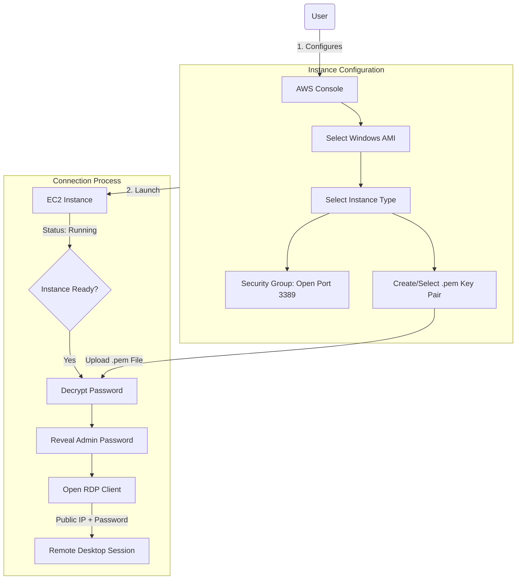

# Windows EC2 Instance and RDP Connection

Topics: EC2 Overview, Launch Windows Instance, Connect via RDP

Date: 29-10-2025

## Windows EC2 Launch & Connect Workflow

This diagram illustrates the process of configuring the instance, handling security credentials, and establishing the remote desktop connection.

Amazon Elastic Compute Cloud (EC2) is a core AWS Compute service that lets you run virtual servers (instances) in the cloud. Amazon EC2 is an Infrastructure as a Service (IaaS) offering from AWS. It allows you to launch virtual machines to host applications and manage them remotely – wherever you are in the world.

### Key concepts

- **Instance:** A virtual machine running in the AWS cloud.
    
- **AMI (Amazon Machine Image):** A pre-configured template that includes: OS (Linux, Windows, etc.), Application software, other configurations.
    
- **Instance Type:** Defines hardware power.

## EC2 Instance Types

|**Family**|**Example**|**Use Case**|
|---|---|---|
|General Purpose|t2.micro|Basic web apps|
|Compute Optimized|c5.large|High-performance computing|
|Memory Optimized|r5.large|Databases, analytics|
|Storage Optimized|i3.large|Data warehousing|
|GPU Instances|g4dn.xlarge|ML/AI, graphics|

- **EBS (Elastic Block Store):** Persistent storage for your EC2 instance. Acts like a hard drive — data remains even after the instance stops. Types: SSD, HDD, etc.
    
- **Security Groups:** Virtual firewalls controlling inbound and outbound traffic. Example: Allow HTTP (port 80), SSH (port 22), HTTPS (port 443).
    
- **Key Pair:** Used for secure login (SSH for Linux, RDP for Windows). Consists of a public key (stored in AWS) and private key (.pem) that you download.

### Common Ways to Access EC2

- SSH (Linux instances)

- RDP (Windows instances) - Use Remote Desktop with Administrator password.

- User Data Script: Run automation commands during instance launch.

### EC2 Use Cases

- Hosting static or dynamic websites
    
- Deploying web servers (Apache/Nginx)
    
- Running applications, APIs, or databases
    
- Machine Learning model hosting
    
- Batch processing jobs

### Pricing Models

- **On-Demand:** Pay per hour/second; flexible.

- **Reserved Instances:** 1–3 year commitment; cheaper.

- **Spot Instances:** Unused capacity; up to 90% cheaper.

- **Free Tier:** t2.micro or t3.micro free for 6 months.

### Instance Lifecycle

|**Step**|**Description**|
|---|---|
|Launch|Choose AMI, type, key, security group|
|Running|Accessible and operational|
|Stop|Instance paused, EBS persists|
|Start|Boot again from same EBS|
|Terminate|Deleted permanently, data lost unless backed up|

### Two Types of IPv4 Addresses

1. **Private IPv4 Address:** Used for internal communication within the same VPC. Not accessible from the Internet. The private IP remains attached to the instance until it is terminated.

2. **Public IPv4 Address:** Used for communication over the Internet. Assigned automatically if your subnet is public. The public IP changes each time you stop/start the instance. To make it permanent, you can assign an Elastic IP (static public IP).

### Remote Desktop Protocol (RDP)

Remote Desktop Protocol (RDP), is a secure communication protocol developed by Microsoft that allows a user to connect to and control another computer remotely. An RDP client is the software or app that you use to make this remote connection. It connects to a remote Windows server or Windows EC2 instance that is running an RDP server (which listens on port 3389). It is pre-installed in Windows.

## Launch Windows EC2 and Connect via RDP

**Step 1:** Sign in to AWS Management Console:

Select the Region closest to you.

**Step 2:** Open the EC2 Dashboard:

In the AWS Console, search for EC2. Click on EC2 → Instances → Launch Instance. Under Name and Tags, give your instance a name.

**Step 3:** Choose an Amazon Machine Image (AMI):

Under Application and OS Images (Amazon Machine Image) → choose: Microsoft Windows Server 2022 Base (Free tier eligible).

**Step 4:** Choose Instance Type:

Choose t3.micro (Free-tier eligible).

**Step 5:** Configure Key Pair:

- Under Key pair (login), choose an existing key pair or create a new one.
    
- If creating a new key pair: Choose type: RSA, Format: .pem
    
- Download and save it safely — it's required to decrypt your Windows password later.

**Step 6:** Configure Network Settings:

- Leave default VPC and Subnet settings.
    
- Under Firewall (security group) → Select Create security group.
    
- Allow RDP (port 3389) access from My IP (for better security) or anywhere (0.0.0.0/0).

**Step 7:** Launch the Instance:

Review all configurations. Click Launch Instance. Wait until the Instance state changes to Running.

**Step 8:** Get the Administrator Password:

- Wait approximately 5 minutes after instance launch.
    
- Select your running instance → click Connect → choose RDP Client tab.
    
- Click Get Password.
    
- Upload your .pem key file and click Decrypt Password.
    
- Copy the Public IPv4 address and Administrator Password shown.

**Step 9:** Connect Using RDP Client:

- On Windows system: Open Remote Desktop Connection (from Start Menu).
    
- Enter your instance’s Public IPv4 address.
    
- Click Connect → Enter: Username: Administrator, Password: (the decrypted password).
    
- Click OK → accept the certificate → the remote Windows desktop opens!

**Step 10:** Verify Connection:

You should now see a Windows Server desktop running inside your local window.

**Note:** Always Stop (not Terminate) the instance when not in use to avoid charges.

