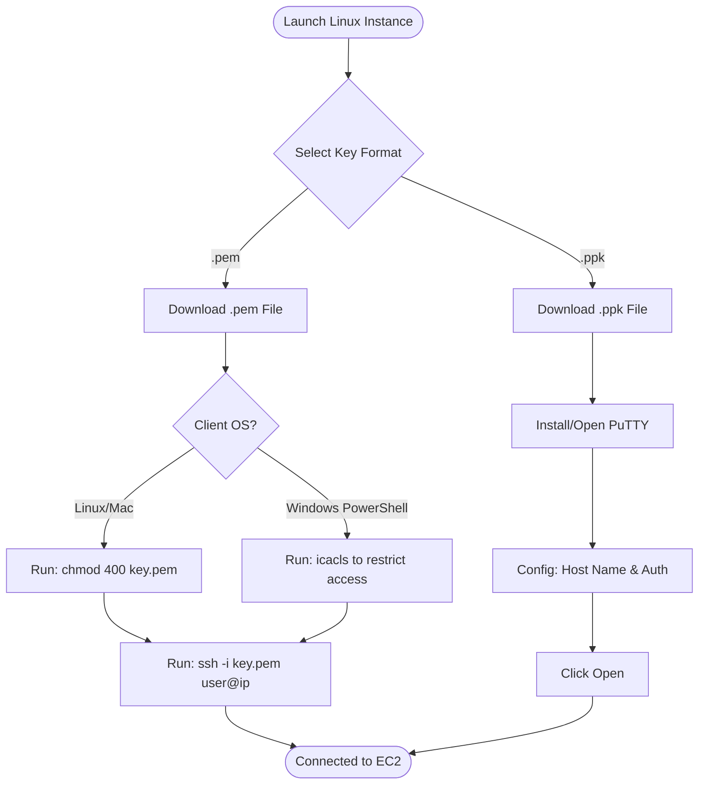
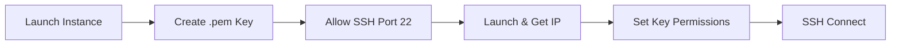
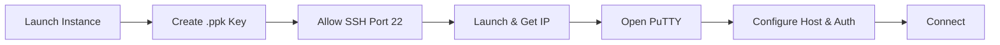
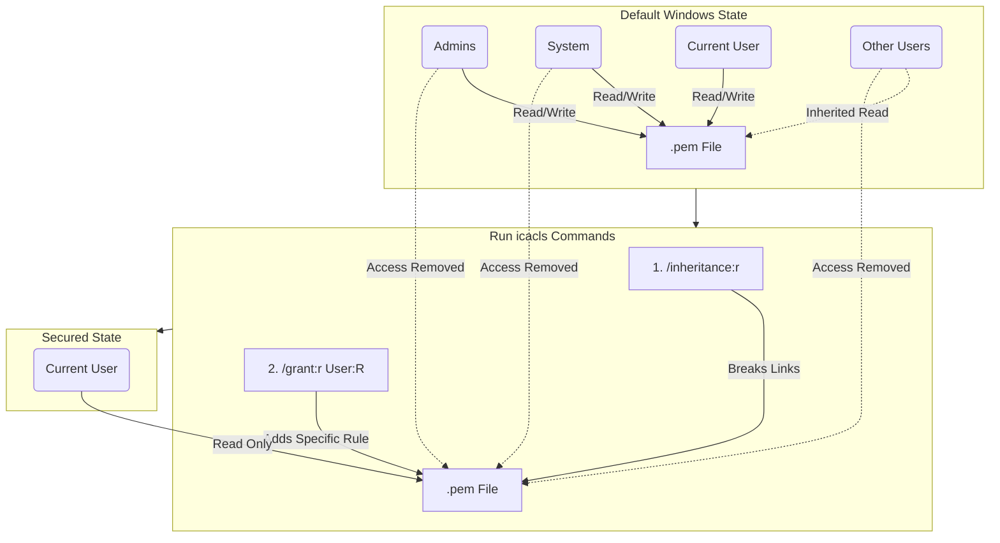

# Linux EC2 Instance and SSH Connection

Topics: Launch Linux EC2, SSH via PowerShell/Terminal, PuTTY on Windows

Date: 30-10-2025

## SSH Connection Workflow

This diagram illustrates the two distinct paths for connecting to a Linux instance based on your operating system and preferred tool (OpenSSH vs. PuTTY).



### Key Pair Format Differences

|**Scenario**|**Key File Format**|**Explanation**|
|---|---|---|
|**Using PuTTY on Windows**|`.ppk`|The .ppk file is specific to the GUI based PuTTY application.|
|**Using PowerShell on Windows, Linux terminal**|`.pem`|The .pem file is the default AWS key format used by the OpenSSH client.|

## Launch Linux EC2 and Connect via SSH (PowerShell/Linux)



**Step 1:** Sign in to AWS Management Console: select the nearest AWS Region.

**Step 2:** Open EC2 Service: In the search bar, type EC2. Select Instances → Launch Instance.

**Step 3:** Configure Instance Details:

- Name: e.g., `Linux-SSH-Demo`.
    
- AMI: select **Amazon Linux 2 AMI** (Free tier eligible).
    
- Instance type: choose `t3.micro` (Free-tier eligible).

**Step 4:** Create or Select a Key Pair:

- Under Key pair (login) → choose Create new key pair.
    
- Key pair type: **RSA**
    
- Private key file format: **.pem** (for SSH via PowerShell/Linux)
    
- Click Create key pair → the `.pem` file will automatically download.

**Step 5:** Configure Network Settings:

- In Firewall (security group) → select Create security group.
    
- Ensure **SSH (port 22)** is allowed (Source: My IP or Anywhere).

**Step 6:** Launch the Instance: Click Launch Instance. Wait for the Instance State to show **Running**.

**Step 7:** Get the Public IP Address: Select your instance → Copy the Public IPv4 address.

**Step 8:** Connect using SSH:

**Note: Fixing "Permission Denied" on Windows (PowerShell)**

When using PowerShell on Windows, you may get an "Unprotected private key file" or "Permission denied" error. This happens because the `.pem` file, by default, can be read by other users on your system (it has inherited permissions), which SSH refuses for security.

On Linux, this is fixed with `chmod 400 key.pem`, which makes the file readable _only_ by the owner. The Windows equivalent uses the `icacls` command to remove permissions from all other users and groups.
> 
> **To fix this in PowerShell (run as Administrator):**
> 
> 1. **Navigate to your key file:** (e.g., in Downloads)
>     
>     ```bash
>     cd "C:\Users\YourUser\Downloads"
>     ```
>     
> 2. **Remove inherited permissions:** This stops other users from having access.
>
>     ```bash
>     icacls .\your-key-file.pem /inheritance:r
>     ```
>     
> 3. **Grant read access only to yourself:** (Replace `YourUser` with your actual Windows username).
>     
>     ```bash
>     icacls .\your-key-file.pem /grant:r "YourUser:(R)"
>     ```
>     
> After running these commands, your key file is secure and SSH will accept it.

- **(A) On Windows using PowerShell:**
    
    - Open PowerShell.
        
    - Navigate to the folder where your .pem file is saved:
        
        ```bash
        cd "C:\Users\<YourName>\Downloads"
        ```
        
    - Connect using the SSH command:

        ```bash
        ssh -i "keyfile.pem" ec2-user@<Public-IP-address>
        ```
        
    - When prompted, type `yes` to continue connecting.
        
- **(B) On Linux Terminal (Ubuntu / macOS):**
    
    - Open Terminal.
        
    - Navigate to the directory where your .pem file is stored.
        
    - Set proper permission for the key file:
        
        ```bash
        chmod 400 keyfile.pem
        ```
        
    - Connect to the instance:
        
        ```bash
        ssh -i keyfile.pem ec2-user@<Public-IP-address>
        ```
        
    - Type `yes` when prompted.

**Step 9:** Verify Connection: Try commands: `uname -a` and `sudo yum update -y`.

**Step 10:** Stop Instance after Use: Go to the EC2 console → Select your instance → Instance State → Stop Instance.

## Install PuTTY on Windows

PuTTY is a client program for the SSH, Telnet and Rlogin network protocols. It is primarily used in the Windows platform.

1. Use the correct, safe download link: [https://www.chiark.greenend.org.uk/~sgtatham/putty/latest.html](https://www.chiark.greenend.org.uk/~sgtatham/putty/latest.html)
    
2. Under the Package files section, look for: **MSI (‘Windows Installer’)**
    
3. Click the link: `putty-64bit-0.83-installer.msi`
    
4. Once it downloads, open the file and follow: Next → Next → Install → Finish
    
5. After installation, you will have: PuTTY, PuTTYgen, Pageant.

## Launch Linux EC2 and Connect via PuTTY



**Step 1:** Sign in to AWS Management Console and select your AWS Region.

**Step 2:** Open the EC2 Service: Click Instances → Launch Instance.

**Step 3:** Configure Instance Details:

- Name: e.g., `Linux-PuTTY-Demo`.
    
- AMI: choose **Amazon Linux 2 AMI** (Free tier eligible).
    
- Instance Type: select `t2.micro` (Free tier eligible).

**Step 4:** Create or Select a Key Pair:

- Under Key pair (login) → select Create new key pair.
    
- Key pair type: **RSA**
    
- Private key file format: **.ppk** (for PuTTY on Windows)
    
- Click Create key pair → a `.ppk` file will download.

**Step 5:** Configure Network Settings:

- Under Firewall (security group): Select Create security group.
    
- Ensure **SSH (port 22)** is allowed.

**Step 6:** Launch the Instance: Click Launch Instance. Wait for the Instance State to show **Running**.

**Step 7:** Obtain the Public IP: Select your instance → Copy the Public IPv4 address.

**Step 8:** Connect using PuTTY:

- Open PuTTY on your Windows system.
    
- In the **Host Name (or IP address)** field, enter: `ec2-user@<Public-IP-address>`
    
- In the Category list on the left, expand: **Connection → SSH → Auth → Credentials**
    
- Click **Browse** → locate and select your `.ppk` key file.
    
- Click **Open**.
    
- When prompted, click **Accept** to trust the host.

**Step 9:** Verify Connection: Try: `uname -a` or `sudo yum update –y`

**Step 10:** Stop the Instance: Return to the EC2 Dashboard → Select your instance → click Instance State → Stop Instance.

> **Note on Formats:** Use **.ppk** format key when connecting with PuTTY. Use **.pem** format key when connecting with PowerShell / Linux / macOS terminal.

> Note on Permissions:
> 
> The message “Permission denied (publickey)” or “Permissions are too open” appears when the .pem key file or SSH configuration has incorrect permissions or mismatched ownership.
> 
> Run this command in your local terminal before connecting:
> 
> ```bash
> chmod 400 keypair.pem
> ```
> 
> Then connect again:
> 
> ```bash
> ssh -i "keypair.pem" ec2-user@<Public-IP>
> ```


### Deep Dive: Fixing the “Too Open” Permission Error on Windows

When connecting to EC2 via SSH, you may encounter the error: `“Permission denied (publickey)”` or `“Unprotected private key file”`. This occurs because Windows, by default, inherits permissions that allow other users (or the system) to read your files. AWS requires the key to be accessible **only** by you.

#### Scenario Comparison: Laptop vs. Lab System

| **Situation**              | **Your Laptop**                           | **Lab Systems**                                                |
| -------------------------- | ----------------------------------------- | -------------------------------------------------------------- |
| **Who owns the .pem file** | You (single user)                         | Shared system, different users per batch                       |
| **File location**          | Inside your user folder (safe by default) | Often in Downloads of another user, or in Public/shared folder |
| **Windows permissions**    | Automatically restricted to your account  | Other users might have access to the same folder               |
| **Result**                 | Works fine                                | SSH refuses connection (Security Risk)                         |

### The Solution: Restrict Permissions using icacls

On Linux, we use `chmod 400`. On Windows, we use `icacls`. Both achieve the same goal: **Make the key file readable only by the file's owner.**

**Run these commands in PowerShell as Administrator:**

```powershell
# 1. Go to folder where pem file is stored
cd "C:\Users\studentX\Downloads"

# 2. Remove inherited permissions (others lose access)
icacls .\keyfile.pem /inheritance:r

# 3. Grant permission only to the current logged-in user
# (Replace 'studentX' with your actual username)
icacls .\keyfile.pem /grant:r "studentX:(R)"
```

### Understanding the icacls Command

- **ICACLS** stands for **Integrity Control Access Control Lists**.
    
    - **"I" (Integrity):** Refers to Windows integrity levels (protecting system files).
        
    - **"Cacls" (Change Access Control Lists):** The old command was `cacls`. The new version adds support for viewing/modifying permissions, handling NTFS ACLs, and managing inheritance.

### Command Breakdown

**1. `cd "C:\Users\studentX\Downloads"`**

- **CD (Change Directory):** Moves PowerShell’s current working location into the folder containing your key.
    

**2. `icacls .\keyfile.pem /inheritance:r`**

- **`.\keyfile.pem`**: Target the file in the current folder.
    
- **`/inheritance:r`**: "Remove inherited permissions."
    
- **What it does:** By default, files inherit permissions from the parent folder (e.g., "Downloads"). This command breaks that link, removing default access for "Administrators" or generic "Users."
    

**3. `icacls .\keyfile.pem /grant:r "studentX:(R)"`**

- **`/grant:r`**: Grant specific rights, replacing existing ones.
    
- **`"studentX:(R)"`**: Give **Read-only** access specifically to the user `studentX`.
    

#### Final State of the `.pem` File

After running these commands, your key file is:

1. **Readable only** by the current student user.
    
2. **Protected** from access by any other batch login or system user.
    
3. **Fully compliant** with AWS’s SSH key security rule (functionally identical to `chmod 400`).
    

---

#### Mermaid Diagram: Permission Logic

This diagram visualizes how the permissions change before and after running the command.



