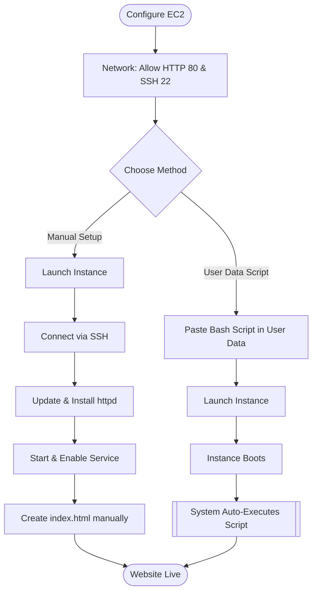

# Hosting Static Website on EC2

Topics: Manual Apache Installation, User Data Script Automation

Date: 5-11-2025

## Deployment Workflows

This diagram contrasts the Manual Installation method (requires SSH and multiple commands) with the User Data method (automated at boot).



- **Manual Installation of Apache (httpd) Web Server on EC2 for Static Website Hosting.**
    
- **Launching an EC2 Instance with User Data Script to Automatically Install Apache and Host a Static Website.**
    

When you create an EC2 instance, it’s just a bare machine — It does not have the software to host a website yet.

To host a website:

- You need a web server software → **Apache (httpd)**
    
- You put your website files (HTML, CSS, etc.) in a special folder (usually `/var/www/html`)
    
- Apache listens on **port 80 (HTTP)** or **port 443 (HTTPS)** for incoming connections
    

Apache HTTP Server (httpd) is a web server software. httpd stands for HTTP Daemon. When you install Apache, you’re really installing the httpd service.

File Locations (default) – Website files go into: /var/www/html

---

### Manual Installation of Apache (httpd) Web Server on EC2 for Static Website Hosting

#### Part 1 – Creating an EC2 Instance

**Step 1: Sign in to AWS Management Console:** Go to EC2 Dashboard.

**Step 2: Launch a New Instance:** Click “Launch Instance.” Give a name (e.g., MyApacheServer).

**Step 3: Choose an Amazon Machine Image (AMI):** Select Amazon Linux 2 AMI (Free tier eligible).

**Step 4: Choose Instance Type:** Choose t3.micro (Free tier eligible).

**Step 5: Create / Select Key Pair:** Create new key pair → File format = .pem. Download the key file.

**Step 6: Configure Network Settings:** Click → Allow SSH traffic, → Allow HTTP traffic from the internet. (This automatically opens port 80).

**Step 7: Launch Instance:** Click Launch Instance.

**Step 8: Connect to the Instance:** Using PowerShell, navigate to your .pem file folder and connect:

```bash
ssh -i "keyfile.pem" ec2-user@<Public-IP-address>
```

### Part 2: Install Apache (httpd) Web Server

**Step 1:** Update the Packages:

```bash
sudo yum update -y
```

**Step 2:** Install Apache (httpd):

```bash
sudo yum install httpd -y
```

**Step 3:** Start the Apache Service:

```bash
sudo systemctl start httpd
```

**Step 4:** Enable Apache to Start on Boot:

```bash
sudo systemctl enable httpd
```

**Step 5:** Check Apache Status:

```bash
sudo systemctl status httpd
```

**Step 6:** Test Apache Server:

- Copy your Public IPv4 address from the EC2 dashboard.
    
- Paste it into a browser: `http://<your-ec2-public-ip>`
    
- You should see the Apache Test Page.

### Part 3: Host a Static Website on Apache

**Step 1:** Move to Web Root Folder:

```bash
cd /var/www/html
```

**Step 2:** Create your HTML file:

```bash
sudo nano index.html
```

**Step 3:** Add HTML content: Paste the following code:

```html
<!DOCTYPE html>
<html>
<head>
<title>Welcome to My Website</title>
</head>
<body style="text-align:center; background-color: #f0f0f0;">
<h1>Hello from Apache on AWS EC2!</h1>
<p>This is a static website hosted on Apache web server.</p>
</body>
</html>
```

**Step 4:** Press `Ctrl + O`, `Enter`, then `Ctrl + X` to save and exit.

**Step 5:** Restart Apache:

```bash
sudo systemctl restart httpd
```

**Step 6:** View Website: In browser: `http://<your-ec2-public-ip>`. You'll see your custom HTML page.

## User Data Script Automation

### Understanding the Shebang

> **Important Note**
> 
> When you provide a script to the EC2 "User Data" field, the very first line **must** be `#!/bin/bash`.
> 
> This line, called a "shebang", tells the Linux operating system to use the Bash shell (located at `/bin/bash`) to run all the commands in the script.
> 
> When your EC2 instance first boots, it reads this User Data. If the shebang is missing, the system doesn't know what interpreter to use (e.g., Bash, Python). This will cause the script to **silently fail**—Apache won't get installed and your website won't appear.

### Launch EC2 with User Data Script

In this method, you write a shell script in the User Data section (during instance creation). When the EC2 instance starts for the first time, it automatically installs Apache, starts the service, and creates an `index.html` webpage.

**Step 1:** Sign in to AWS Management Console: Go to EC2 Dashboard → Click Launch Instance.

**Step 2:** Name and OS:

- Name: AutoApacheWebServer
    
- AMI: Choose Amazon Linux 2 AMI (Free tier eligible)
    
- Instance Type: t3.micro

**Step 3:** Key Pair: Select existing key pair (or create new) → Format = .pem.

**Step 4:** Network Settings:

- Allow HTTP traffic from the Internet (port 80).

- Allow SSH traffic (port 22).

**Step 5:** Add User Data Script:

- Scroll down to **Advanced Details** → **User data** box.
    
- Paste the following shell script:
    

```bash
#!/bin/bash
# Update packages
yum update -y
# Install Apache Web Server
yum install -y httpd
# Start Apache
systemctl start httpd
systemctl enable httpd
# Create website content
echo "<html>
<head><title>Welcome to My Auto Web Server</title></head>
<body style='text-align:center; background-color:#e9f5ff;'>
<h1>Welcome to EC2 Instance</h1>
<h2>Apache Installed Automatically via User Data Script</h2>
<p>This is a static website hosted on EC2 using User Data automation.</p>
</body>
</html>" > /var/www/html/index.html
```

**Step 6:** Launch the Instance: Click Launch Instance. Wait for the status → Running.

**Step 7:** Test Your Web Server:

- Copy the Public IPv4 address of your instance.

- Paste it in your browser: `http://<your-public-ip>`

- You should immediately see your webpage!

