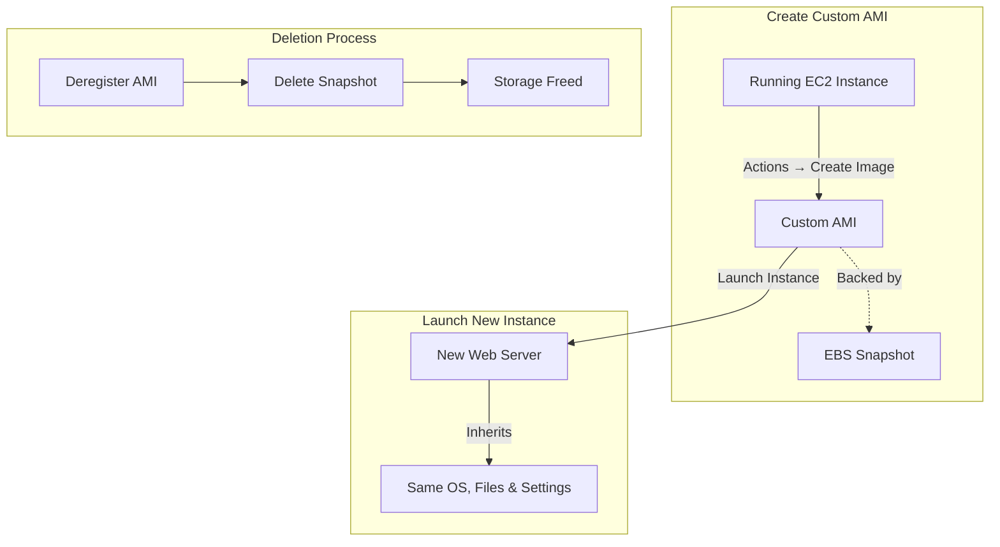
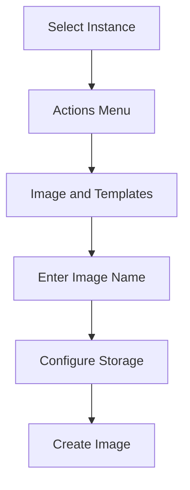
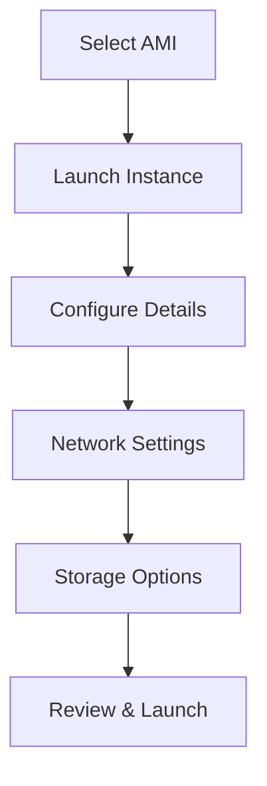
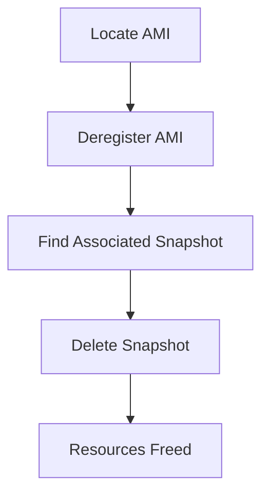

# Custom AMI Creation and Management

**Date:** 7-11-2025

This lab covers creating a Custom Amazon Machine Image (AMI) from a working EC2 instance, launching new instances from it, and properly deleting AMIs to avoid unnecessary charges.

## What is an AMI?

**AMI (Amazon Machine Image)** is a pre-configured template that contains only the Operating System (e.g., Amazon Linux, Ubuntu, Windows) needed to launch an EC2 instance.

When you launch a new EC2 instance, you select an AMI as the base image. A **Custom AMI** is created from your own running EC2 instance after you've installed software, uploaded website files, or applied settings.

| Benefit | Description |
|---------|-------------|
|Reusability|Launch multiple identical servers quickly|
|Backup|Acts as a snapshot of your configured instance|
|Auto Scaling|Used by Auto Scaling Groups to create identical instances automatically|
|Disaster Recovery|Recreate your setup if the original instance fails|
|Time-saving|No need to reinstall Apache or re-upload files each time|

A Custom AMI is like a master copy of your EC2 setup. It ensures your website or app can be duplicated instantly and consistently.

## Create a Custom AMI from an EC2 Instance

This section captures the current configuration — installed packages, website files, and settings — into a reusable Amazon Machine Image (AMI).

**Step 1:** Select the running instance

- Go to EC2 → Instances
- Select the instance that already hosts your website
- Or create an instance (add user data for web hosting)

**Step 2:** Create Image

- From the Actions → Image and templates → Create image

**Step 3:** Enter details

- Image name: `MyWebsiteAMI`
- Description: AMI created from configured Apache website instance
- Leave "No reboot" unchecked (so the filesystem is consistent)

**Step 4:** Storage volumes

- The root volume will appear automatically; keep defaults unless you need more space

**Step 5:** Create image

- Click Create image
- A confirmation message appears; note the Image ID

**Step 6:** Verify creation

- In the left panel → AMIs → refresh until Status = **Available**

Your custom AMI is now saved in that region and can be used to launch identical webserver instances.

## Launch an EC2 Instance from Custom AMI

This section launches a new EC2 instance from a previously created Custom Amazon Machine Image (AMI) — containing your configured website and software.

**Step 1:** Go to AMIs

- Open the EC2 Service dashboard
- In the left navigation pane, click AMIs (under "Images")

**Step 2:** Select Your Custom AMI

- Locate the AMI you created earlier (e.g., `MyWebsiteAMI`)
- Ensure Status = **Available**

**Step 3:** Launch Instance from AMI

- Select the AMI → click Launch instance from image

**Step 4:** Configure Instance Details

- Name: `WebServer-from-Custom-AMI`
- Instance type: `t3.micro` (Free Tier eligible)
- Key pair: Choose an existing .pem key for SSH access
- Network settings:
    - VPC: Default
    - Subnet: Public
    - Security Group: Allow HTTP (80) and SSH (22)

**Step 5:** Storage (EBS Volume)

- Keep default root volume (e.g., 8 GB gp3)

**Step 6:** Review and Launch

- Click Launch instance
- Wait until the instance state becomes **Running**

**Step 7:** Access the Website

- Copy the Public IPv4 address from the instance details
- Open in a browser → `http://<Public-IP>`
- You should see your same website, confirming the custom AMI works

A new EC2 instance is successfully launched using the Custom AMI, automatically containing the OS, Apache, configurations, and website files — no manual setup required.

## Delete a Custom AMI

Deleting a custom AMI involves **deregistering** the image and then **deleting its associated EBS snapshot**.

When you deregister an AMI, it is removed from your account and can no longer be used to launch new instances. However, the **snapshot** that was created along with the AMI still remains in your storage and continues to incur charges, so you must delete it separately to free up space and stop costs.

**Step 1:** Open EC2 Dashboard

- Sign in to the AWS Management Console
- Navigate to EC2 service
- In the left navigation pane, scroll down to Images → AMIs

**Step 2:** Locate Your Custom AMI

- In the **Owned by me** tab, you will see all AMIs you created (custom AMIs)
- Select the AMI you want to delete
- You can identify it by Name or AMI ID

**Step 3:** Deregister the AMI

- Select the AMI → Click on Actions dropdown
- Choose **Deregister AMI**
- Confirm by clicking Deregister in the pop-up
- **Note:** This removes the AMI record, but _not_ the underlying snapshot(s)

**Step 4:** Delete the Associated Snapshot

- To fully free up storage space (and avoid charges):
- In the left navigation pane, click Elastic Block Store → **Snapshots**
- Find the snapshot linked to your deleted AMI
- You can check the Description column; it usually mentions the AMI ID
- Select the snapshot → Actions → **Delete snapshot** → Confirm Delete

The AMI is now deregistered (unavailable for future instance launches). The snapshot is also deleted, freeing up EBS storage and costs.
