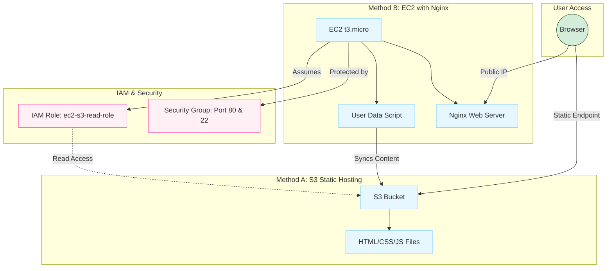

# Mini Project: S3 and EC2 Static Website Hosting

**Date:** 11-11-2025

This project demonstrates hosting a simple static website using AWS S3 for static hosting and an EC2 instance for an alternative server-backed deployment.



## Project Status

| Component | Status |
|-----------|--------|
|S3|Site files uploaded and hosted as static website|
|EC2|Amazon Linux 2 `t3.micro` configured with nginx|
|IAM Role|EC2 role with read-only S3 access created|
|Security Group|HTTP (80) from Internet, SSH (22) from operator IP|
|SSH Key|Private key permissions fixed and verified|

## S3 Static Website Hosting

### Files and Locations

Local site files at repository root include: `index.html`, `main.css`, `index.js`, `form_1.html`, `form_2.html`, `form_3.html`.

### Create and Configure S3 Bucket

**Step 1:** Create an S3 bucket

In the console: Services → S3 → Create bucket. Select region (e.g., ap-south-1). Uncheck "Block all public access" for public site.

**Step 2:** Enable static website hosting

Bucket → Properties → Static website hosting → Enable. Set Index document: `index.html`.

**Step 3:** Add bucket policy for public access

```json
{
    "Version": "2012-10-17",
    "Statement": [
    {
        "Sid": "PublicReadGetObject",
        "Effect": "Allow",
        "Principal": "*",
        "Action": "s3:GetObject",
        "Resource": "arn:aws:s3:::BUCKET_NAME/*"
    }
    ]
}
```

**Step 4:** Upload site files to bucket root

```bash
# from repository root
aws s3 sync . s3://BUCKET_NAME --exclude "infra/*" --acl public-read
```

## IAM Role for EC2

Create a role with least privilege access for EC2 to read from S3.

**Step 1:** Navigate to IAM → Roles → Create Role

**Step 2:** Select "AWS service" → "EC2" → Next

**Step 3:** Attach policy (e.g., `AmazonS3ReadOnlyAccess` or a custom policy)

**Step 4:** Create role (named e.g., `ec2-s3-read-role`)

## Security Group Configuration

### Inbound Rules

| Type | Port | Source |
|------|------|--------|
|SSH|TCP 22|Your public IP (e.g., `203.0.113.5/32`)|
|HTTP|TCP 80|`0.0.0.0/0`|

### Outbound Rules

Allow all (default) so the instance can reach S3 endpoints.

## EC2 Instance Launch

### Configuration Options

| Setting | Value |
|---------|-------|
|AMI|Amazon Linux 2|
|Instance type|`t3.micro` (Free-tier eligible)|
|IAM role|`ec2-s3-read-role`|
|Security group|Created above|
|Key pair|Select existing or create new (.pem)|
|Auto-assign Public IP|Enabled|

### User Data Script

Paste into "Advanced details → user data" when launching:

```bash
#!/bin/bash
set -e

# Adjust region and bucket name
BUCKET="BUCKET_NAME"
REGION="ap-south-1"

# update and install nginx, awscli
yum update -y
yum install -y nginx aws-cli

# start nginx
systemctl enable nginx
systemctl start nginx

# sync from S3 (will use the instance's IAM role for credentials)
mkdir -p /usr/share/nginx/html
aws s3 sync s3://$BUCKET /usr/share/nginx/html --region $REGION --delete
chown -R nginx:nginx /usr/share/nginx/html
systemctl restart nginx

echo "Site synced from s3://$BUCKET to /usr/share/nginx/html" >> /var/log/user-data.log
```

## Post-Launch Verification

**Step 1:** SSH to the instance (fix private key permissions if needed)

```bash
chmod 400 for_demo_static_host.pem
ssh -i for_demo_static_host.pem ec2-user@<PUBLIC_IP>
```

**Step 2:** Verify files and nginx status

```bash
sudo systemctl status nginx --no-pager
ls -la /usr/share/nginx/html
```

**Step 3:** Test the public endpoint

```bash
curl -I http://<PUBLIC_IP>
# or open http://<PUBLIC_IP> in a browser
```

The website should be live and accessible from the public EC2 IP address.
