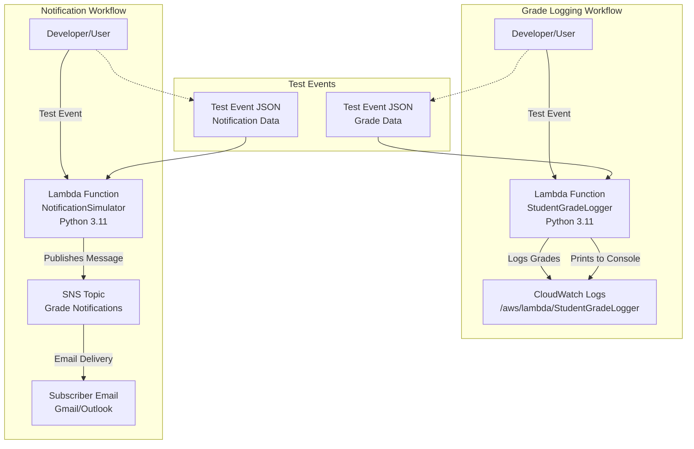

# AWS Lambda : Input Processing, Business Logic Execution, and CloudWatch Logging

**Topics:** Lambda, CloudWatch, Serverless, Event-Driven, Python

## Overview

This lab introduces AWS Lambda, the serverless compute service. You'll create functions that process input events, execute business logic, log to CloudWatch, and integrate with SNS for notifications. This demonstrates event-driven serverless architecture.

### Key Concepts

| Concept | Description |
|---------|-------------|
| **AWS Lambda** | Serverless compute service running code in response to events |
| **Event-Driven** | Functions triggered by events (API calls, messages, etc.) |
| **CloudWatch Logs** | Centralized logging service for monitoring Lambda executions |
| **SNS Integration** | Simple Notification Service for sending emails/SMS |
| **IAM Execution Role** | Permissions Lambda uses to access other AWS services |
| **Test Events** | JSON payloads used to simulate function triggers |

#### Prerequisites

- Active AWS account with billing enabled
- IAM permissions for Lambda, CloudWatch, and SNS
- Basic knowledge of Python and JSON

## Architecture Overview

::: details Click to expand Architecture Diagram

:::

## Create and Test Lambda Function

1. **Create the Lambda Function**:
   - Open Lambda: AWS Console → Search Lambda → Open AWS Lambda.
   - Click **Create function** and select **Author from scratch**.
   - Function name: `StudentGradeLogger`
   - Runtime: Python 3.14
   - Architecture: x86_64 (default)
   - Permissions: Create a new role with basic Lambda permissions.
   - Click **Create function**.

2. **Add Code (Business Logic + Logs)**:
   - In the **Code** tab, open `lambda_function.py`.
   - Paste the following code and click **Deploy**:
::: details lambda_function.py Code
```python
import json

def lambda_handler(event, context):
    # Welcome message
    print("Lambda invoked successfully")

    # Read input from event
    if "StudentName" not in event:
        return {
            "statusCode": 400,
            "body": json.dumps({"message": "Missing 'StudentName'"})
        }
    if "Marks" not in event:
        return {
            "statusCode": 400,
            "body": json.dumps({"message": "Missing 'Marks'"})
        }
    student_name = event["StudentName"]
    marks = event["Marks"]
    if not isinstance(marks, int) or marks < 0 or marks > 100:
        return {
            "statusCode": 400,
            "body": json.dumps({"message": "Marks must be between 0 and 100"})
        }

    # Business logic: grade calculation
    if marks >= 75:
        result = "Pass"
        grade = "A"
    else:
        result = "Fail"
        grade = "F"

    # Log output
    print("Student:", student_name)
    print("Marks:", marks)
    print("Grade:", grade)
    print("Result:", result)

    # Return response
    return {
        "statusCode": 200,
        "body": json.dumps({
            "StudentName": student_name,
            "Marks": marks,
            "Grade": grade,
            "Result": result
        })
    }
```
:::

3. **Test with Input Events (JSON)**:
   - Create a test event (Valid case): Go to **Test** → **Configure test event**.
     - Event name: `ValidInput`
       ```json
       {
         "StudentName": "Anita",
         "Marks": 86
       }
       ```
   - Run test: Click **Test**. Expected: statusCode 200, Grade A, Result Pass.
   
   - Test invalid input (Missing Marks): Event `MissingMarks` with `{"StudentName": "Rahul"}`.
     - Expected: statusCode 400, message "Missing 'Marks'"
   
   - Test invalid marks range: Event `InvalidMarks` with `{"StudentName": "Priya", "Marks": 150}`.
     - Expected: statusCode 400, message "Marks must be between 0 and 100"

4. **View Logs in CloudWatch**:
   - Go to **Monitor** tab → **View CloudWatch logs**.
   - Open latest log stream under `/aws/lambda/StudentGradeLogger`.
   - Verify print outputs: welcome message, student details, grade/result.


#### Validation

::: details Validation

- **Function Creation:** Confirm Lambda function created with correct runtime and permissions.
- **Code Deployment:** Verify code deploys without errors.
- **Test Events:** Test all scenarios (valid, missing fields, invalid marks).
- **CloudWatch Logs:** Check logs contain expected print statements.
- **SNS Integration:** Verify email notifications received for different event types.
- **IAM Permissions:** Ensure proper policies attached for CloudWatch and SNS access.

:::

### Cost Considerations

::: details Cost Considerations

- **Lambda:** ~$0.20 per 1M requests + compute time (~$0.0000167/GB-second)
- **CloudWatch Logs:** ~$0.50/GB ingested
- **SNS:** ~$0.50/100,000 email notifications
- **Free Tier:** Generous Lambda free tier; delete functions after lab

:::

### Cleanup

::: details Cleanup

1. Delete Lambda functions: `StudentGradeLogger` and `NotificationSimulator`.
2. Delete SNS Topic: `Grade Notifications`.
3. Delete CloudWatch Log Groups associated with the functions.
4. Delete the IAM roles if they are not used elsewhere.

:::

## Result

Successfully created serverless Lambda functions with business logic, logging, and SNS integration. Demonstrated event-driven processing, error handling, and monitoring in a serverless architecture.

## Viva Questions

1. What is serverless computing and how does Lambda implement it?
2. How does CloudWatch help with Lambda monitoring?
3. What are the benefits of event-driven architecture?
4. How does Lambda handle input validation and error responses?

::: details Quick Start Guide
### Quick Start Guide
1. Create Lambda function with Python runtime and basic execution role.
2. Add business logic code to process input events and log to CloudWatch.
3. Create test events for valid and invalid inputs; run tests.
4. View execution logs in CloudWatch to verify outputs.
:::
