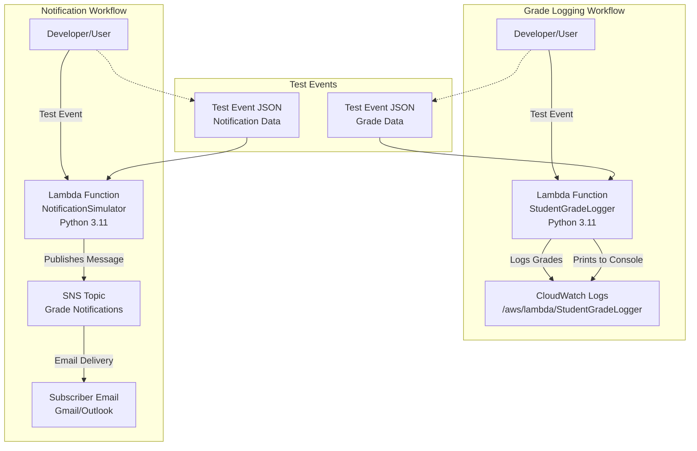

# AWS Lambda : Input Processing, Business Logic Execution, and CloudWatch Logging

This exercise involves creating a Lambda function that prints a welcome message, reads JSON input, performs grade calculation logic, and writes logs to CloudWatch.

## Overview

This lab introduces AWS Lambda, the serverless compute service. You'll create functions that process input events, execute business logic, log to CloudWatch, and integrate with SNS for notifications. This demonstrates event-driven serverless architecture.

### Key Concepts

| Concept | Description |
|---------|-------------|
| **AWS Lambda** | Serverless compute service running code in response to events |
| **Event-Driven** | Functions triggered by events (API calls, messages, etc.) |
| **CloudWatch Logs** | Centralized logging service for monitoring Lambda executions |
| **SNS Integration** | Simple Notification Service for sending emails/SMS |
| **IAM Execution Role** | Permissions Lambda uses to access other AWS services |
| **Test Events** | JSON payloads used to simulate function triggers |

### Prerequisites

- Active AWS account with billing enabled
- IAM permissions for Lambda, CloudWatch, and SNS
- Basic knowledge of Python and JSON

## Architecture Overview



### Create the Lambda Function

1. **Open Lambda**: AWS Console → Search Lambda → Open AWS Lambda.
    
2. **Create function**: Click **Create function** and select **Author from scratch**.
    
    - **Function name**: `StudentGradeLogger`
        
    - **Runtime**: Python 3.11
        
    - **Architecture**: x86_64 (default)
        
3. **Permissions**: Under "Permissions," choose **Create a new role with basic Lambda permissions**. This automatically gives permission to write logs to CloudWatch.
    
4. Click **Create function**.
    

### Add Code (Business Logic + Logs)

In the **Code** tab, open `lambda_function.py`, paste the following code, and click **Deploy**:

```python
import json

def lambda_handler(event, context):
    # Welcome message
    print("Lambda invoked successfully")

    # Read input from event
    if "StudentName" not in event:
        return {
            "statusCode": 400,
            "body": json.dumps({"message": "Missing 'StudentName'"})
        }
    if "Marks" not in event:
        return {
            "statusCode": 400,
            "body": json.dumps({"message": "Missing 'Marks'"})
        }
    student_name = event["StudentName"]
    marks = event["Marks"]
    if not isinstance(marks, int) or marks < 0 or marks > 100:
        return {
            "statusCode": 400,
            "body": json.dumps({"message": "Marks must be between 0 and 100"})
        }

    # Business logic: grade calculation
    if marks >= 75:
        result = "Pass"
        grade = "A"
    else:
        result = "Fail"
        grade = "F"

    # Log output
    print("Student:", student_name)
    print("Marks:", marks)
    print("Grade:", grade)
    print("Result:", result)

    # Return response
    return {
        "statusCode": 200,
        "body": json.dumps({
            "StudentName": student_name,
            "Marks": marks,
            "Grade": grade,
            "Result": result
        })
    }
```

### Test with Input Events (JSON)

1. **Create a test event (Valid case)**: Go to **Test** → **Configure test event**.
    
    - **Event name**: `ValidInput`
    
        ```json
        {
          "StudentName": "Anita",
          "Marks": 86
        }
        ```
        
1. **Run test**: save and Click **Test**. Expected response: `statusCode: 200`, Grade A, and Result Pass.
    
2. **Test invalid input (Missing Marks)**: Create a test event named `MissingMarks` with `{"StudentName": "Rahul"}`.
	- statusCode: 400
	- message: Missing 'Marks'
    
3. **Test invalid marks range**: Create a test event named `InvalidMarks` with `{"StudentName": "Priya", "Marks": 150}`.
	- statusCode: 400
	- message: Marks must be between 0 and 100


### View Logs in CloudWatch

1. On the Lambda function page, go to the **Monitor** tab.
    
2. Click **View CloudWatch logs**.
    
3. Open the latest **log stream** under the log group `/aws/lambda/StudentGradeLogger`.
    
4. Verify the `print()` outputs: "Lambda invoked successfully", student details, and grade/result logs.
    

## Validation

- **Function Creation:** Confirm Lambda function created with correct runtime and permissions.
- **Code Deployment:** Verify code deploys without errors.
- **Test Events:** Test all scenarios (valid, missing fields, invalid marks).
- **CloudWatch Logs:** Check logs contain expected print statements.
- **SNS Integration:** Verify email notifications received for different event types.
- **IAM Permissions:** Ensure proper policies attached for CloudWatch and SNS access.

## Mini Project: Event-Driven Notification System using AWS Lambda and Amazon SNS

- An event in JSON format is given as input to an AWS Lambda function.    
- The Lambda function processes the event and generates a notification message.
- The message is published to an Amazon SNS topic.    
- SNS sends the notification to the subscribed email address.
- The execution details are verified using CloudWatch Logs.

### Create SNS Topic + Email Subscription

1. **Open SNS**: AWS Console → Search SNS → Open Simple Notification Service.
    
2. **Create a Topic**: Click **Topics** → **Create topic**. Select **Standard**, name it `NotificationTopic`, and click **Create topic**.
    
3. **Copy Topic ARN**: You will need this for the Lambda code.
    
4. **Create Email Subscription**: Inside the topic, click **Create subscription**. Select **Email** as the protocol and enter your email address as endpoint. Create subscription
    
5. **Confirm Subscription**: Click the confirmation link in your email inbox. The status in SNS should become **Confirmed**.
    

### Create Lambda Function

1. **Create function**: Name it `NotificationSimulator`, use **Python 3.11**, and create a new role with basic permissions.
    
2. **Add Lambda Code in lambda_function.py**: In the **Code** tab, paste the following (replace `<SNS_TOPIC_ARN>` with your actual ARN) and click **Deploy**:
    
Lambda → **Code** tab → open lambda_function.py → remove existing code → paste:

Replace <SNS_TOPIC_ARN> with your copied Topic ARN.

```python
import json
import boto3

sns = boto3.client('sns')
TOPIC_ARN = "<SNS_TOPIC_ARN>"

def lambda_handler(event, context):
    print("Notification Simulator invoked")
    
    if "eventType" not in event or "user" not in event:
        return {
            "statusCode": 400,
            "body": json.dumps({"message": "Missing 'eventType' or 'user'"})
        }
    
    event_type = event["eventType"]
    user = event["user"]

    if event_type == "ORDER_PLACED":
        message = f"Hi {user}, your order is placed successfully."
        priority = "NORMAL"
    elif event_type == "PAYMENT_FAILED":
        message = f"Hi {user}, your payment has failed. Please retry."
        priority = "HIGH"
    elif event_type == "LOW_ATTENDANCE":
        message = f"Hi {user}, your attendance is low. Please take action."
        priority = "HIGH"
    else:
        message = f"Hi {user}, unknown event received."
        priority = "LOW"

    print("Event Type:", event_type)
    print("Message:", message)
    print("Priority:", priority)

    # Publish to SNS
    try:
        sns.publish(TopicArn=TOPIC_ARN, Message=message, Subject=f"{event_type} [{priority}]")
    except Exception as e:
        print("Error publishing to SNS:", str(e))
        return {
            "statusCode": 500,
            "body": json.dumps({"message": "Failed to send notification"})
        }

    return {
        "statusCode": 200,
        "body": json.dumps({
            "EventType": event_type,
            "Message": message,
            "Priority": priority
        })
    }
```

### Permissions and Testing

1. **Attach SNS Publish Policy**: Go to **Configuration** → **Permissions** → Click the **Role name**. 
2. On the IAM page, click **Add permissions** → **Attach policies** and attach `AmazonSNSFullAccess`. Now lambda can publish to SNS 
   - Note: For production, create a custom policy with only `sns:Publish` permission on the specific topic ARN instead of full access. 
    
3. **Create a test event**: Name it `PaymentFailed` with the following JSON:
   Lambda → Test tab → Create new test event 
    ```json
    {
      "eventType": "PAYMENT_FAILED",
      "user": "Anita"
    }
    ```
    
4. **Run Test**: Click **Test**. Check your email for a notification with the subject `PAYMENT_FAILED [HIGH]`.
    

### Verify CloudWatch Logs

Lambda → Monitor → View CloudWatch logs  
Open latest log stream.

Verify these prints exist:
- Notification Simulator invoked
- Event Type:
- Message:
- Priority:

**Expected Outputs**
1. Lambda test status: Succeeded
2. Email received from SNS with correct message    
3. CloudWatch logs showing event type and generated message

## Cost Considerations

- **Lambda:** ~$0.20 per 1M requests + compute time (~$0.0000167/GB-second)
- **CloudWatch Logs:** ~$0.50/GB ingested
- **SNS:** ~$0.50/100,000 email notifications
- **Tip:** Lambda has generous free tier; delete functions after lab.

## Cleanup

1. Delete Lambda functions: `StudentGradeLogger` and `NotificationSimulator`.
    
2. Delete SNS Topic: `NotificationTopic`.
    
3. Delete CloudWatch Log Groups associated with the functions.
    
4. Delete the IAM roles if they are not used elsewhere.

## Result

Successfully created serverless Lambda functions with business logic, logging, and SNS integration. Demonstrated event-driven processing, error handling, and monitoring in a serverless architecture.
    
