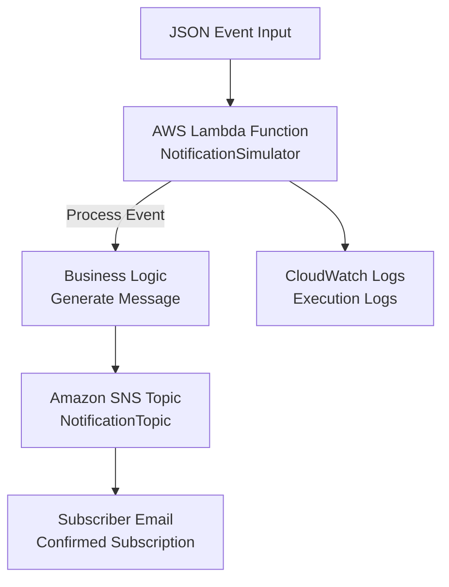

# Mini Project: Event-Driven Notification System using AWS Lambda and Amazon SNS

**Topics:** Lambda, SNS, CloudWatch, Event-Driven Architecture, Serverless

## Overview

This mini project demonstrates building an event-driven notification system using serverless computing. An event in JSON format is given as input to an AWS Lambda function. The Lambda function processes the event and generates a notification message. The message is published to an Amazon SNS topic. SNS sends the notification to the subscribed email address. The execution details are verified using CloudWatch Logs.

### Key Concepts

| Concept | Description |
|---------|-------------|
| **Event-Driven Architecture** | System that responds to events asynchronously |
| **AWS Lambda** | Serverless compute service for running code without managing servers |
| **Amazon SNS** | Simple Notification Service for sending messages to subscribers |
| **CloudWatch Logs** | Monitoring and logging service for AWS resources |
| **JSON Event Processing** | Handling structured data inputs in serverless functions |
| **IAM Permissions** | Managing access control for AWS services |

### Prerequisites

- Active AWS account with billing enabled
- IAM permissions for Lambda, SNS, and CloudWatch
- Basic knowledge of Python and JSON
- Email address for SNS notifications

## Architecture Overview

::: details Click to expand Architecture Diagram

:::

## Phase A: Create SNS Topic + Email Subscription

1. **Open SNS**: AWS Console → Search SNS → Open Simple Notification Service.
    
2. **Create a Topic**: Click **Topics** → **Create topic**. Select **Standard**, name it `NotificationTopic`, and click **Create topic**.
    
3. Open the created topic and copy Topic ARN. You will need this for the Lambda code.
    
4. **Create Email Subscription**: Inside the topic, click **Create subscription**. Select **Email** as the protocol and enter your email address as endpoint. Create subscription
    
5. **Confirm Subscription**: Click the confirmation link in your email inbox. The status in SNS should become **Confirmed**.

## Phase B: Create Lambda Function

Open AWS Lambda

1. **Create function**: Author from scratch, Name it `NotificationSimulator`, use **Python 3.11**, and create a new role with basic permissions.
    
2. **Add Lambda Code in lambda_function.py**: In the **Code** tab, paste the following (replace `<SNS_TOPIC_ARN>` with your actual ARN) and click **Deploy**:
    
Lambda → **Code** tab → open lambda_function.py → remove existing code → paste:

Replace <SNS_TOPIC_ARN> with your copied Topic ARN.

::: details lambda_function.py Code
```python
import json
import boto3

sns = boto3.client('sns')
TOPIC_ARN = "<SNS_TOPIC_ARN>"

def lambda_handler(event, context):
    print("Notification Simulator invoked")
    
    if "eventType" not in event or "user" not in event:
        return {
            "statusCode": 400,
            "body": json.dumps({"message": "Missing 'eventType' or 'user'"})
        }
    
    event_type = event["eventType"]
    user = event["user"]

    if event_type == "ORDER_PLACED":
        message = f"Hi {user}, your order is placed successfully."
        priority = "NORMAL"
    elif event_type == "PAYMENT_FAILED":
        message = f"Hi {user}, your payment has failed. Please retry."
        priority = "HIGH"
    elif event_type == "LOW_ATTENDANCE":
        message = f"Hi {user}, your attendance is low. Please take action."
        priority = "HIGH"
    else:
        message = f"Hi {user}, unknown event received."
        priority = "LOW"

    print("Event Type:", event_type)
    print("Message:", message)
    print("Priority:", priority)

    # Publish to SNS
    try:
        sns.publish(TopicArn=TOPIC_ARN, Message=message, Subject=f"{event_type} [{priority}]")
    except Exception as e:
        print("Error publishing to SNS:", str(e))
        return {
            "statusCode": 500,
            "body": json.dumps({"message": "Failed to send notification"})
        }

    return {
        "statusCode": 200,
        "body": json.dumps({
            "EventType": event_type,
            "Message": message,
            "Priority": priority
        })
    }
```
:::
## Phase C: Permissions and Testing

1. **Attach SNS Publish Policy**: Go to **Configuration** → **Permissions** → Click the **Role name**. 
2. On the IAM page, click **Add permissions** → **Attach policies** and attach `AmazonSNSFullAccess`. Now lambda can publish to SNS 
   - Note: For production, create a custom policy with only `sns:Publish` permission on the specific topic ARN instead of full access. 
    
3. **Create a test event**: Name it `PaymentFailed` with the following JSON:
   Lambda → Test tab → Create new test event 
    ```json
    {
      "eventType": "PAYMENT_FAILED",
      "user": "Anita"
    }
    ```
    
4. **Run Test**: Click **Test**. Check your email for a notification with the subject `PAYMENT_FAILED [HIGH]`.
	Message: “Hi Anita, your payment has failed. Please retry.”

## Phase D: Verify CloudWatch Logs

Lambda → Monitor → View CloudWatch logs  
Open latest log stream.

Verify these prints exist:
- Notification Simulator invoked
- Event Type:
- Message:
- Priority:

## Validation

::: details Validation

**Expected Outputs**
1. Lambda test status: Succeeded
2. Email received from SNS with correct message    
3. CloudWatch logs showing event type and generated message

:::

## Cost Considerations

::: details Cost Considerations

- **Lambda:** ~$0.20 per 1M requests + compute time (~$0.0000167/GB-second)
- **CloudWatch Logs:** ~$0.50/GB ingested
- **SNS:** ~$0.50/100,000 email notifications
- **Tip:** Lambda has generous free tier; delete functions after lab.

:::

## Cleanup

::: details Cleanup

1. Delete Lambda functions: `StudentGradeLogger` and `NotificationSimulator`.
    
2. Delete SNS Topic: `NotificationTopic`.
    
3. Delete CloudWatch Log Groups associated with the functions.
    
4. Delete the IAM roles if they are not used elsewhere.

:::

## Result

Successfully created serverless Lambda functions with business logic, logging, and SNS integration. Demonstrated event-driven processing, error handling, and monitoring in a serverless architecture.

## Viva Questions

1. What is event-driven architecture and how does Lambda support it?
2. How does SNS enable decoupled communication between services?
3. Why are CloudWatch Logs important for serverless functions?
4. What are the benefits of serverless computing for notification systems?
    
