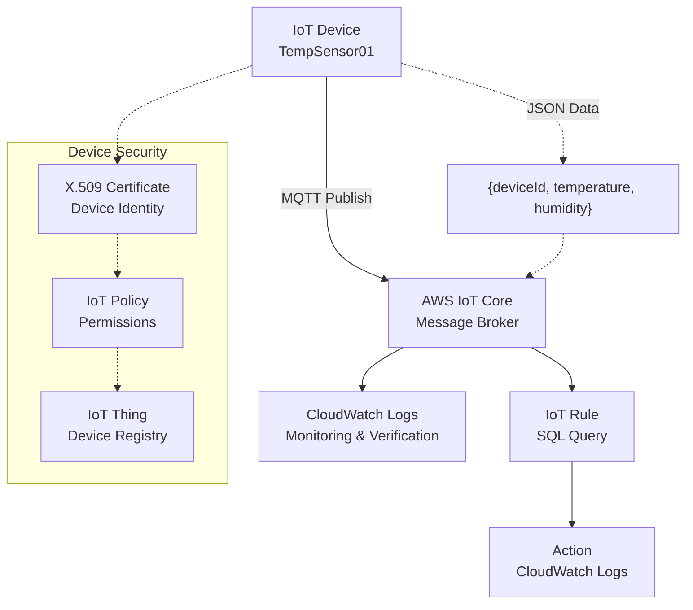

# Smart Sensor Monitoring System using AWS IoT Core

**Topics:** IoT, AWS IoT Core, MQTT, CloudWatch, Event-Driven Architecture

## Overview

This lab demonstrates cloud-based IoT data ingestion and processing using AWS IoT Core. A simulated IoT device sends sensor data (temperature and humidity) in JSON format to the AWS cloud. The data is received by AWS IoT Core, processed automatically through rules, and logged using CloudWatch for monitoring and verification. This exercise shows how real-time device data can be handled without managing servers, highlighting IoT, cloud computing, and event-driven architecture principles.

### Key Concepts

| Concept | Description |
|---------|-------------|
| **AWS IoT Core** | Managed cloud service that acts as the central message broker for IoT devices |
| **IoT Thing** | Virtual representation of a physical IoT device in AWS |
| **Device Certificate** | Digital certificate that provides secure identity for IoT devices |
| **IoT Policy** | Document that defines permissions for IoT devices to connect and communicate |
| **MQTT Protocol** | Lightweight messaging protocol used for IoT device communication |
| **IoT Rules** | SQL-based rules that process incoming IoT data and trigger actions |
| **Event-Driven Architecture** | System design where actions are triggered by events (data arrival) |

#### Prerequisites

- Active AWS account with billing enabled
- IAM permissions for IoT Core, CloudWatch, and related services
- Basic knowledge of JSON data format
- Understanding of IoT concepts (optional but helpful)

## Architecture Overview

::: details Click to expand Architecture Diagram

:::

## Phase A: Create IoT Thing (Device)

1. Go to **AWS Console → IoT Core**
2. Navigate to **Manage → Things**
3. Click **Create things**
4. Choose **Create single thing**
5. Give a name (example: `TempSensor01`)
6. Skip advanced settings
7. Click **Create**

This represents a sensor device (even though no real hardware is used).

## Phase B: Create and Configure Device Certificate

1. Choose **Auto-generate certificate**
2. Activate the certificate
3. Download:
   - Device certificate
   - Private key
   - Root CA
4. Attach the certificate to the Thing

Certificate = identity of the device

## Phase C: Create and Attach IoT Policy

1. Go to **Secure → Policies**
2. Create a new policy
3. Allow:
   - Connect
   - Publish
   - Subscribe
   - Receive
4. Use `*` (for lab simplicity)
5. Attach the policy to the certificate

Policy = permission for device to talk to AWS

## Phase D: Test Device Messages (No Hardware)

Go to **Test → MQTT test client**

Subscribe to a topic: `sensor/temperature`

Publish a message:

```json
{
  "deviceId": "TempSensor01",
  "temperature": 32,
  "humidity": 65
}
```

Verify message appears instantly. IoT data successfully reached the cloud.

## Phase E: Create a Rule (Automation)

1. Go to **Act → Rules**
2. Create a rule
3. Rule query example: `SELECT * FROM 'sensor/temperature'`
4. Choose action: Send to CloudWatch Logs (or Lambda/DynamoDB if required)

Rule = "when data arrives, do something"

## Phase F: Verify Output

1. Open **CloudWatch → Logs**
2. Check log group created by IoT Rule
3. Confirm sensor data entries

Automatic processing confirmed. Sensor data is sent to AWS IoT Core, where rules automatically process and store the data without using any server.

### Validation

::: details Validation

- **IoT Thing Created**: Verify `TempSensor01` appears in Things registry
- **Certificate Attached**: Check certificate is active and attached to the thing
- **Policy Attached**: Confirm policy allows required permissions
- **MQTT Test**: Message published and received successfully
- **Rule Created**: IoT rule exists with correct SQL query
- **CloudWatch Logs**: Sensor data entries visible in log group

:::

### Cost Considerations

::: details Cost Considerations

- **AWS IoT Core**: Pay per message ($1 per million messages) + connection time
- **CloudWatch Logs**: $0.50 per GB ingested
- **Free Tier**: 250,000 messages/month, 5GB logs free
- **Estimated Cost**: <$1 for this lab

:::

### Cleanup

::: details Cleanup

1. Delete IoT Rule
2. Detach and deactivate certificate
3. Delete IoT Policy
4. Delete IoT Thing
5. Delete CloudWatch log group

:::

## Result

Successfully implemented a serverless IoT data pipeline using AWS IoT Core. Demonstrated event-driven architecture where sensor data is automatically processed and logged without managing any servers. The system can scale to handle millions of devices and messages.

## Viva Questions

1. What is the role of AWS IoT Core in IoT applications?
2. Why are certificates and policies important for IoT device security?
3. How do IoT Rules enable event-driven processing?
4. What are the benefits of using MQTT protocol for IoT?