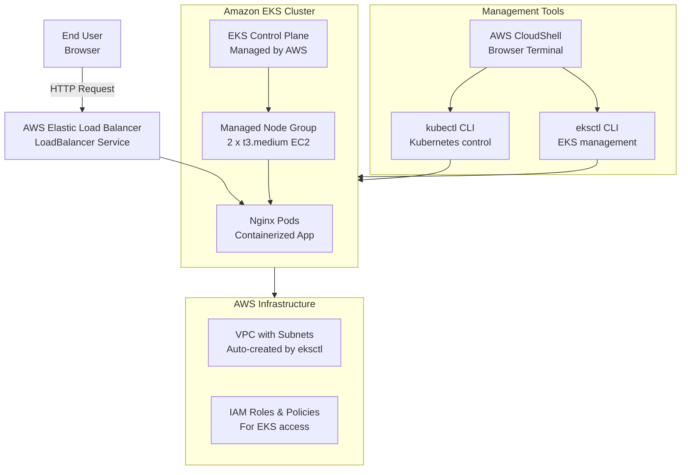

# Deploying a Containerized App on AWS using Amazon EKS

**Topics:** Containers, Kubernetes, EKS, AWS

## Overview

This mini-project demonstrates container orchestration on AWS using Amazon Elastic Kubernetes Service (EKS). You'll create a managed Kubernetes cluster, add worker nodes, deploy a containerized Nginx application, and expose it to the internet using a LoadBalancer service. This hands-on project covers the complete workflow of container deployment in the AWS cloud environment.

### Key Concepts

| Concept | Description |
|---------|-------------|
| **Amazon EKS** | Managed Kubernetes service that runs containerized applications on AWS |
| **Managed Node Groups** | AWS-managed EC2 instances that serve as worker nodes in the cluster |
| **kubectl** | Command-line tool for interacting with Kubernetes clusters |
| **eksctl** | AWS CLI tool for creating and managing EKS clusters |
| **Kubernetes Deployment** | Declarative way to manage containerized applications |
| **LoadBalancer Service** | Kubernetes service type that exposes applications via AWS ELB |
| **CloudShell** | Browser-based shell environment for AWS management |

### Prerequisites

- Active AWS account with billing enabled
- Root account access or IAM permissions for EKS, EC2, VPC, and IAM services
- Basic understanding of containers and Kubernetes concepts
- **Region**: Mumbai (ap-south-1) or consistent with your account setup

## Architecture Overview

::: details Click to expand Architecture Diagram

:::

## Create EKS Cluster and Deploy Application

1. **Access CloudShell and Verify Tools**:
   - AWS Console (Mumbai region) → Click CloudShell icon
   - Terminal opens in browser
   - Verify installed tools:
     ```bash
     aws --version
     kubectl version --client
     eksctl version
     ```

   >[!NOTE]
   >If eksctl is missing, CloudShell usually has it pre-installed. You can install it if needed using: `curl --silent --location "https://github.com/weaveworks/eksctl/releases/latest/download/eksctl_$(uname -s)_amd64.tar.gz" | tar xz -C /tmp && sudo mv /tmp/eksctl /usr/local/bin`

2. **Create EKS Cluster and Node Group**:
   ```bash
   eksctl create cluster \
   --name eks-lab-cluster \
   --region ap-south-1 \
   --nodes 2 \
   --node-type t3.medium \
   --managed
   ```
   Wait for completion.

   >[!TIP]
   >**Troubleshooting IAM permissions**: If the command fails, verify your credentials:
   >```bash
   >aws sts get-caller-identity
   >```
   >The output should show your root account ID or an ARN with proper permissions. Ensure you have EKS, EC2, VPC, and IAM permissions.

   >[!NOTE]
   >**What this command creates**:
   >- New VPC with proper subnets and routes
   >- EKS cluster control plane (managed by AWS)
   >- Managed Node Group with 2 t3.medium EC2 worker nodes
   >- Automatic kubeconfig configuration for kubectl access

3. **Verify Cluster and Nodes**:
   ```bash
   kubectl get nodes
   ```
   Expected: 2 nodes in Ready state.

4. **Deploy Nginx Application**:
   ```bash
   kubectl create deployment webapp --image=nginx
   kubectl get pods
   ```

5. **Expose Application with LoadBalancer**:
   ```bash
   kubectl expose deployment webapp --type=LoadBalancer --port=80
   kubectl get svc
   ```
   Wait until EXTERNAL-IP becomes a value.

6. **Test and Access Application**:
   - Copy the EXTERNAL-IP from the service output
   - Open in browser: `http://<EXTERNAL-IP>`
   - Expected: Nginx welcome page

## Validation

- **CloudShell Access**: Terminal successfully opened in browser
- **Tools Verification**: aws, kubectl, and eksctl commands work
- **EKS Cluster**: Cluster creation completed successfully
- **Node Group**: 2 worker nodes created and in Ready state
- **Nginx Deployment**: Pod created and running
- **LoadBalancer Service**: Service created with external IP
- **Application Access**: Nginx welcome page loads in browser

## Cost Considerations

- **EKS Control Plane**: $0.10 per hour (always running)
- **EC2 Worker Nodes**: t3.medium pricing (~$0.04/hour each)
- **Elastic Load Balancer**: $0.0225 per hour + $0.008 per GB data
- **Data Transfer**: Standard AWS data transfer rates
- **Free Tier**: Limited EKS free tier available
- **Estimated Cost**: $5-15 for 1-2 hour lab session

## Cleanup

1. **Delete LoadBalancer service**:
   ```bash
   kubectl delete svc webapp
   ```

2. **Delete deployment**:
   ```bash
   kubectl delete deployment webapp
   ```

3. **Delete EKS cluster** (this removes everything):
   ```bash
   eksctl delete cluster --name eks-lab-cluster --region ap-south-1
   ```

4. Verify all resources are removed to avoid charges

## Result

Successfully deployed a containerized Nginx application on Amazon EKS using managed Kubernetes services. Demonstrated the complete container orchestration workflow from cluster creation through application exposure. Mastered EKS cluster management, kubectl operations, and AWS LoadBalancer integration for containerized applications.

## Viva Questions

1. What is the difference between Amazon EKS and self-managed Kubernetes?
2. Why use managed node groups instead of self-managed nodes?
3. How does a LoadBalancer service work in Kubernetes?
4. What are the benefits of using CloudShell for AWS management?
