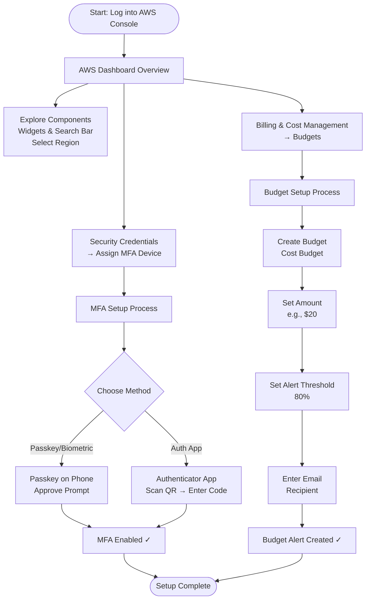
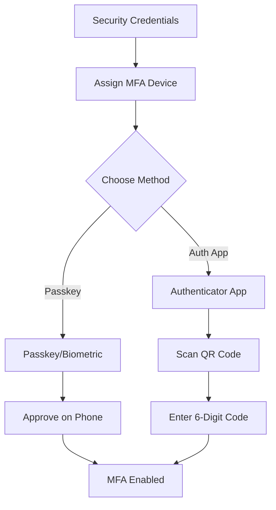
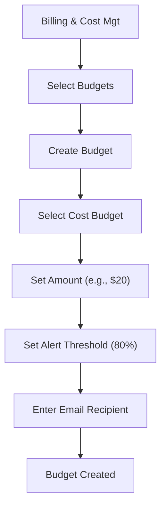

# AWS Account Setup and Configuration

**Topics:** AWS Console Overview, IAM Security, MFA, Budgets

## Overview

This lab provides a comprehensive introduction to AWS account management and security best practices. You'll learn to navigate the AWS Management Console, understand its key components, and implement essential security measures. 

The lab covers Multi-Factor Authentication (MFA) setup to protect your account from unauthorized access and budget alert configuration to monitor spending and prevent unexpected charges.

## Key Concepts

| Concept | Description |
|---------|-------------|
| AWS Console | Web-based interface for managing all AWS services and resources |
| MFA (Multi-Factor Authentication) | Additional security layer requiring a second form of verification beyond password |
| Budget Alert | Automated notification system that warns when spending approaches set thresholds |
| AWS Regions | Geographic locations where AWS data centers are clustered |
| Widgets | Customizable dashboard components displaying service metrics and shortcuts |
| Security Credentials | Authentication mechanisms including passwords, access keys, and MFA devices |
| Passkey | Biometric or device-based authentication method for passwordless login |
| Authenticator App | Mobile application generating time-based one-time passwords (TOTP) |

## Prerequisites

- Active AWS account (Free Tier eligible)
- Smartphone for MFA setup
- Email address for budget notifications

### For MFA Setup
- **Option 1 (Passkey):** Phone with Bluetooth enabled, screen lock (fingerprint/PIN), and unlocked during setup
- **Option 2 (Authenticator App):** Google Authenticator, Microsoft Authenticator, or Authy installed on your phone

## Account Setup Workflow

::: details Click to expand Workflow Diagram

:::

## Phase 1: AWS Console Overview and Navigation

1. Sign in to your AWS Management Console using your root user credentials or IAM user account.

2. Familiarize yourself with the main dashboard components:
   - **Widgets:** Small panels displaying metrics, service shortcuts, and recent activity. You can add or remove widgets to customize your view.
   - **Services Menu:** Access the complete catalog of AWS services organized by category (Compute, Storage, Database, etc.).
   - **Search Bar:** Quick-access search for any AWS service. Type the service name to find it instantly.
   - **Region Selector:** Drop-down menu (typically in the top-right) showing the current AWS region. Specifies the geographical data center location where your resources are deployed.

3. Pin frequently used services for faster access:
   - Search for a service (e.g., "EC2", "S3", "Lambda")
   - Click the star icon next to the service name
   - Pinned services appear in your favorites bar

> [!TIP] Best Practice
> Select a region closest to your physical location or your target users to minimize latency. Remember that some services are global (like IAM), while others are region-specific (like EC2).

## Phase 2: Enable Multi-Factor Authentication (MFA)

> [!IMPORTANT] Security Requirement
> MFA is essential for protecting your AWS account from unauthorized access. Even if someone obtains your password, they cannot log in without the second authentication factor.

> [!NOTE] Passkey Pre-Setup
> - Phone must be unlocked
> - Bluetooth enabled
> - Screen lock configured (fingerprint/PIN)

::: details Click to expand MFA Setup Flow Diagram

:::

### Option 1: Add a Passkey for Easier Login

1. Navigate to Security Credentials:
   - Sign in to AWS Console
   - Click your username in the top-right corner → Select **Security credentials**

2. Under **Multi-factor authentication (MFA)**, click **Assign MFA device**.

3. Choose **Passkeys and security keys** → Click **Next**.

4. On the next screen, choose **Phone or tablet**.

5. AWS will show a browser pop-up asking to use a device.

6. Select your phone (or click **Use another device** if prompted).

7. Look at your phone — you should get a "Use passkey" or biometric prompt.

8. Approve using fingerprint or phone PIN.

9. Back in AWS, click **Finish**. The passkey is now your MFA method.

### Test Passkey Login

1. Sign out of AWS.
2. Go to the AWS login page.
3. Choose **Sign in with a passkey** → Select your phone.
4. Approve the prompt on your phone — you should be signed in without entering any codes.

### Option 2: Authenticator App

This method uses a 6-digit time-based code from Google Authenticator, Authy, or Microsoft Authenticator.

1. In **Security credentials**, click **Assign MFA device**.

2. Select **Authenticator app** → Click **Next**.

3. A QR code appears on screen.

4. Open your authenticator app on your phone:
   - Tap **Add account** or the **+** icon
   - Select **Scan QR code**
   - Point your camera at the QR code displayed in AWS

5. The app will display a 6-digit code that refreshes every 30 seconds.

6. Enter the current code in AWS → Click **Assign MFA**.

7. From now on, you'll enter the 6-digit code from the app each time you log in.

## Phase 3: Create AWS Budget Alert

Budget alerts help you monitor AWS spending and avoid unexpected charges by sending email notifications when costs approach or exceed defined thresholds. This is a critical cost management tool, especially when using services outside the Free Tier.

::: details Click to expand Budget Setup Flow Diagram

:::

1. In the AWS Console search bar, type `budgets`.

2. Select **Budgets** from the Features group (part of the Billing and Cost Management service).

3. Click **Create Budget**.

4. Under **Budget setup**, select **Customize** option.

5. Under **Budget types**, select **Cost budget** → Click **Next**.

6. Configure budget details:
   - **Budget name:** `MyBudget` (or any descriptive name)
   - **Period:** Monthly
   - **Budget renewal type:** Recurring budget
   - **Start month:** Select current month and year
   - **Budgeting method:** Fixed
   - **Enter your budgeted amount:** `20.00` (or your preferred amount in USD)
   - **Budget scope:** All AWS services

7. Leave **Advanced options** at default → Click **Next**.

8. Configure alert threshold:
   - Click **Add an alert threshold**
   - Set **Threshold:** `80` (percent)
   - **Trigger:** Actual
   - **Email recipients:** Enter your email address
   - Click **Next**

9. Under **Attach actions**, leave at default → Click **Next**.

10. Review all settings to ensure they match your desired configuration.

11. Click **Create budget**. Your budget is now active and will send alerts when spending reaches 80% of the defined amount.

> [!TIP] Best Practice
> Set multiple alert thresholds (e.g., 50%, 80%, 100%) to get early warnings before exceeding your budget. You can create up to 2 free budgets per account.

## Validation

Verify that you have successfully completed all phases:

- **Console Navigation:**
  - You can navigate to different services using the search bar
  - You've pinned at least one frequently used service
  - You understand the current selected region

- **MFA Setup:**
  - MFA device appears under Security Credentials section
  - Test login works with passkey or authenticator code
  - Account displays "Assigned" status for MFA

- **Budget Alert:**
  - Budget appears in the Budgets dashboard
  - Alert threshold is set to 80%
  - Email recipient is correctly configured
  - Confirmation email received (check spam folder)

## Cost Considerations

- **AWS Free Tier:** This lab uses only Free Tier services with no direct costs
- **Budgets:** First 2 budgets are free; additional budgets cost $0.02 per day per budget
- **MFA:** No additional cost for MFA setup or usage
- **Notification Emails:** Free through Amazon SNS for budget alerts

## Cleanup

No cleanup is required for this lab as all configurations (MFA, budgets, console customizations) are permanent account settings that provide ongoing value. However, if you wish to remove specific items:

- **To remove MFA:** Go to Security Credentials → Click the MFA device → Remove
- **To delete a budget:** Go to Budgets → Select budget → Actions → Delete

> [!WARNING] Security Notice
> Removing MFA significantly reduces your account security. Only do this if you're certain it's necessary.

## Result

You have successfully configured your AWS account with essential security and cost management features. Your account now has MFA protection, reducing the risk of unauthorized access, and budget alerts to monitor spending and prevent unexpected charges. You're familiar with the AWS Console navigation and ready to begin working with AWS services securely and cost-effectively.

These foundational skills will serve you throughout your AWS journey, whether you're building personal projects, learning cloud technologies, or working on enterprise applications.

## Viva Questions

1. **What is Multi-Factor Authentication (MFA) and why is it important for AWS accounts?**
   - MFA adds an extra layer of security beyond username and password, requiring a second form of verification (phone, authenticator app, or hardware token). It protects against unauthorized access even if your password is compromised.

2. **What's the difference between a passkey and an authenticator app for MFA?**
   - Passkey uses biometric authentication (fingerprint/face) on your device for seamless login. Authenticator app generates a 6-digit time-based code that must be manually entered. Passkeys are more convenient; authenticator apps work without Bluetooth.

3. **Why should you set up budget alerts in AWS?**
   - Budget alerts help you monitor spending and avoid unexpected charges by notifying you when costs approach defined thresholds. This is critical for cost control, especially when experimenting with paid services.

4. **What is the difference between AWS Regions and services being "global" vs "regional"?**
   - Regional services (like EC2, S3) operate in specific geographic regions you select. Global services (like IAM, CloudFront) operate across all regions automatically. Regional services may have different availability and pricing per region.

5. **How many free budgets can you create per AWS account?**
   - You can create 2 free budgets per AWS account. Additional budgets cost $0.02 per day each.
