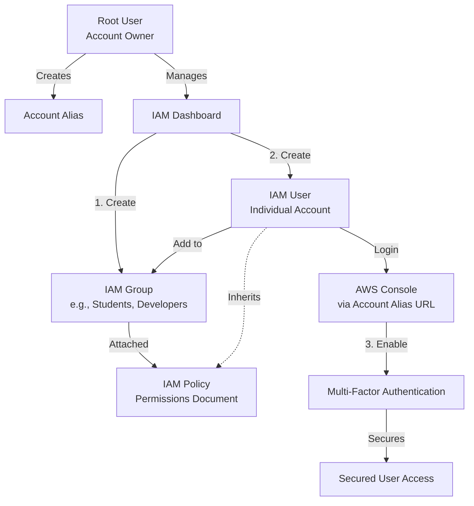
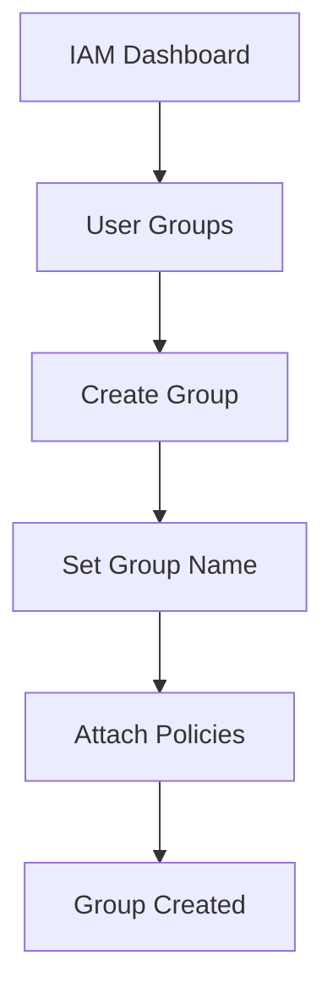
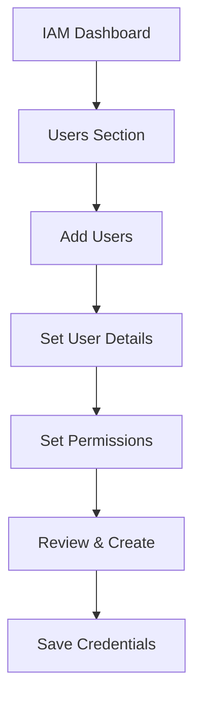
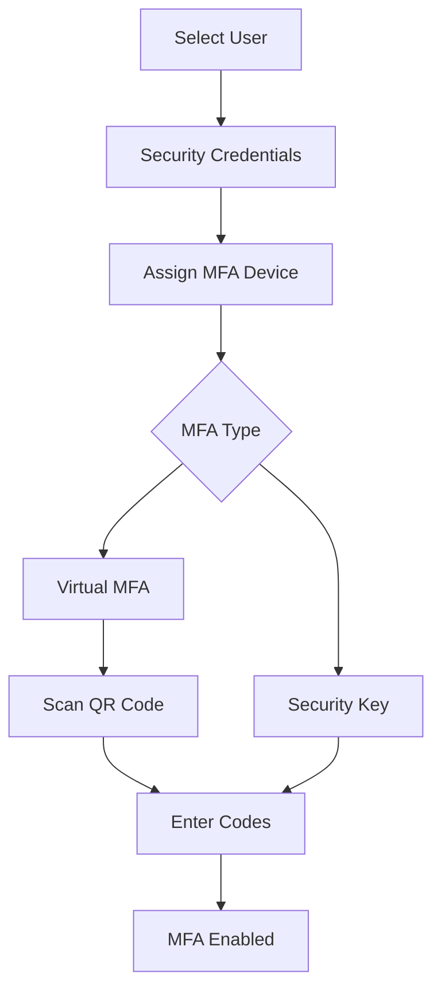

# AWS Identity Access Management (IAM)

**Topics:** IAM, User Management, Group Management, MFA, Security, Account Alias

## Overview

AWS Identity and Access Management (IAM) is a fundamental security service that enables you to control who can access your AWS resources and what actions they can perform. IAM is a global service, meaning it operates across all AWS regions without requiring region-specific configuration.

This lab guides you through creating IAM users and groups, setting up account aliases for easier access. You'll learn best practices for managing permissions through groups rather than individual users, understand the principle of least privilege, and implement security measures to protect your AWS resources.

## Key Concepts

| Concept | Description |
|---------|-------------|
| Root User | The account owner with unrestricted access to all AWS services and resources; should be used only for account setup and billing |
| IAM User | Individual identity with unique credentials for accessing AWS; represents a person or application |
| IAM Group | Collection of IAM users that share identical permissions; simplifies permission management |
| IAM Policy | JSON document defining permissions that specify allowed or denied actions on AWS resources |
| IAM Role | Set of permissions that can be temporarily assumed by users, services, or applications |
| MFA (Multi-Factor Authentication) | Additional security layer requiring a second form of authentication beyond password |
| Account Alias | Custom name for your AWS account that replaces the numeric account ID in sign-in URLs |
| Permissions | Authorization rules that determine what actions users can perform on AWS resources |

## Prerequisites

- AWS account with root user access
- Basic understanding of cloud security concepts
- Smartphone with authenticator app (Google Authenticator, Authy, or Microsoft Authenticator)
- Understanding of JSON format (helpful but not required)


## IAM Workflow Overview

This diagram illustrates the relationship between the Root user and IAM entities, and the workflow for securing a new user.

::: details Click to expand Architecture Diagram

:::


## Phase 1: Create IAM User Group

Groups allow you to manage permissions for multiple users simultaneously. Instead of attaching policies to each user individually, you assign policies to a group and add users to that group.

::: details Click to expand Group Creation Flow Diagram

:::

1. Sign in to AWS Management Console using your root user or an administrator account.

2. Navigate to IAM service:
   - In the search bar, type `IAM`
   - Click on **IAM** (Identity and Access Management)

3. In the IAM dashboard left sidebar, click **User groups** → **Create group**.

4. Enter a descriptive **Group name**:
   - Examples: `Developers`, `Admins`, `Students`, `ReadOnlyUsers`
   - Group names must be unique within your AWS account
   - Use descriptive names that reflect the group's purpose

5. Attach permissions policies to define what group members can do:
   - Scroll down to **Attach permissions policies**
   - Search and select appropriate policies:
     - `AdministratorAccess` — Full access to all AWS services (use cautiously)
     - `IAMUserChangePassword` — Allows users to change their own passwords
     - Or select other policies based on your requirements

6. Review all details (group name and attached permissions).

7. Click **Create group** to finalize.

8. The new group now appears in your IAM dashboard under User groups.

> [!NOTE] Best Practice
> Any user added to this group automatically inherits all permissions attached to the group. This makes permission management much easier than managing individual user permissions.

> [!WARNING] Security Consideration
> Use `AdministratorAccess` only for trusted administrators. For most users, apply the principle of least privilege by granting only the permissions they need.


## Phase 2: Create IAM User

IAM users represent individual people or applications that need to access your AWS resources. Each user has unique credentials and can be assigned specific permissions.

::: details Click to expand User Creation Flow Diagram

:::

1. In the IAM dashboard, click **Users** in the left navigation pane.

2. Click the **Add users** button.

3. Configure user details:
   - **User name:** Enter a unique username (e.g., `john.doe`, `student1`, `dev-user`)
   - Check **Provide user access to the AWS Management Console**
   - Select **I want to create an IAM user**

4. Set console password (choose one):
   - **Autogenerated password** — AWS creates a random password
   - **Custom password** — You specify the password
   - Optionally check **Users must create a new password at next sign-in** for security

5. Click **Next**.

6. Set permissions for the user (choose one method):
   - **Add user to group** (Recommended) — Select the group you created earlier
   - **Copy permissions from existing user** — Duplicate another user's permissions
   - **Attach policies directly** — Manually select specific policies

7. (Optional) Add tags for organization:
   - Click **Add new tag**
   - Examples: `Department: MCA`, `Role: Student`, `Environment: Development`
   - Tags help with resource management and cost tracking

8. Click **Next** to review.

9. Review all settings:
   - User name
   - Console access
   - Permissions (groups or policies)
   - Tags

10. Click **Create user**.

11. **IMPORTANT - Save credentials immediately:**
    - AWS displays:
      - Console sign-in URL
      - Username
      - Console password (if autogenerated)
    - Click **Download .csv** to save these credentials
    - Or copy them to a secure location
    - **These credentials cannot be retrieved later!**

12. Test the new user login:
    - Copy the Console sign-in URL
    - Open it in a new browser window (or incognito mode)
    - Log in with the username and password
    - If prompted, create a new password
    - Verify that the user can access appropriate services

> [!TIP] Best Practice
> Always use IAM users for daily tasks, even for administrators. Reserve the root user account only for tasks that explicitly require it (like closing the account or changing billing information).

## Phase 3: Enable MFA for IAM User

Multi-Factor Authentication adds an essential security layer to user accounts. Even if someone steals a password, they cannot log in without the second authentication factor.

::: details Click to expand MFA Setup Flow Diagram

:::

1. Sign in to AWS Console as root user or an administrator.

2. Navigate to IAM:
   - Search for `IAM` in the console
   - Select **IAM** (Identity and Access Management)

3. In the left navigation pane, select **Users**.

4. Click the **user name** for whom you want to enable MFA.

5. Click the **Security credentials** tab.

6. Scroll down to the **Multi-factor authentication (MFA)** section.

7. Click **Assign MFA device**.

8. On the MFA device setup page:
   - **MFA device name:** Enter a descriptive name (e.g., `john-iphone`, `student1-authenticator`)
   - **MFA device:** Choose one option:
     - **Authenticator app** (Recommended) — Use Google Authenticator, Authy, or Microsoft Authenticator
     - **Security key** — Use a hardware FIDO security key (e.g., YubiKey)
     - **Hardware TOTP token** — Use a physical MFA device

9. If you selected **Authenticator app**:
   - Click **Next**
   - A QR code appears on screen
   - Open your authenticator app on your phone:
     - Tap **Add account** or the **+** icon
     - Select **Scan QR code**
     - Point your camera at the QR code
   - The app will start generating 6-digit codes

10. Verify the MFA device:
    - Enter two consecutive 6-digit codes from your authenticator app:
      - **MFA code 1:** Enter the current code
      - Wait for the code to refresh (every 30 seconds)
      - **MFA code 2:** Enter the next code
    - Click **Add MFA**

11. Confirm successful setup:
    - You'll see a green success message
    - The MFA device appears in the Security credentials section
    - Status shows as "Assigned"

12. Test MFA login:
    - Sign out from AWS Console
    - Sign in again with the IAM user credentials
    - After entering username and password, you'll be prompted for the MFA code
    - Open your authenticator app and enter the current 6-digit code
    - Successful login confirms MFA is working

> [!IMPORTANT] Security Requirement
> From now on, this user must provide both their password and a current MFA code to sign in to the AWS Console.

> [!TIP] Backup
> Some authenticator apps support cloud backup or export. Consider backing up your MFA configuration to avoid losing access if you lose your phone.

## Phase 4: Create AWS Account Alias

An account alias replaces the numeric AWS account ID in your sign-in URL, making it easier for IAM users to remember and access the console.

**Default Sign-in URL format:**
```
https://123456789012.signin.aws.amazon.com/console
```

**With Account Alias:**
```
https://my-company.signin.aws.amazon.com/console
```

1. Sign in to AWS Management Console using root user or an IAM user with administrative privileges.

2. Navigate to IAM service:
   - Search for `IAM` in the console
   - Open the **IAM** service

3. In the left navigation pane, select **Dashboard**.

4. Under the **AWS Account** section on the right, locate **Account Alias**.

5. Click **Create** (or **Edit** if an alias already exists).

6. In the dialog box:
   - Enter your preferred alias name
   - Alias requirements:
     - Must be globally unique across all AWS accounts
     - Can contain lowercase letters, digits, and hyphens
     - Must be between 3 and 63 characters
     - Cannot start or end with a hyphen

7. Click **Create alias** (or **Save changes** if editing).

8. The new sign-in URL is displayed immediately:
   - Copy the URL: `https://YOUR-ALIAS.signin.aws.amazon.com/console`
   - Share this URL with your IAM users for easier access
   - Bookmark it for convenience

9. Test the alias URL:
   - Open the new sign-in URL in a browser
   - Verify it loads the AWS sign-in page
   - Sign in with an IAM user to confirm it works

> [!NOTE] Account Alias Benefits
> - Easier to remember than numeric account IDs
> - Professional-looking URLs for organization users
> - Can be changed at any time
> - Immediately effective across all IAM users

## Validation

Verify that you have successfully completed all phases:

- **IAM Group:**
  - Group appears in User groups list
  - Policies are correctly attached to the group
  - Group name reflects its purpose

- **IAM User:**
  - User appears in Users list
  - User is member of the created group
  - User credentials were saved securely
  - Test login successful with user credentials

- **MFA Setup:**
  - MFA device shows "Assigned" status in Security credentials
  - Authenticator app generates codes successfully
  - Test login requires both password and MFA code
  - User can successfully authenticate with MFA

- **Account Alias:**
  - Alias appears in IAM Dashboard under AWS Account section
  - New sign-in URL works correctly
  - IAM users can access console using the alias URL

## Cost Considerations

- **IAM Service:** Completely free with no charges for:
  - Creating users, groups, roles, and policies
  - Enabling MFA on any number of users
  - Creating and using account aliases
  - No limit on number of IAM entities created

- **Virtual MFA:** No cost for using authenticator apps

- **Hardware MFA Devices:** If you choose hardware FIDO security keys or TOTP tokens, those devices have purchase costs (typically $20-$50) but no AWS charges

## Cleanup

If you need to remove the IAM resources created in this lab:

### Delete IAM User
1. Go to IAM → Users
2. Select the user
3. Click **Delete** → Confirm deletion
4. **Warning:** This permanently removes the user and all associated access

### Delete IAM Group
1. Go to IAM → User groups
2. Select the group
3. First, remove all users from the group
4. Click **Delete** → Confirm deletion

### Remove MFA Device
1. Go to IAM → Users → Select user
2. Security credentials tab
3. Under MFA, click **Remove** next to the MFA device
4. Confirm removal
5. **Warning:** This reduces account security

### Delete Account Alias
1. Go to IAM → Dashboard
2. Under AWS Account section, click **Delete** next to the alias
3. Your account reverts to using the numeric account ID in sign-in URLs

> [!WARNING] Best Practice
> In production environments, do NOT delete IAM users or groups without proper authorization and documentation. These actions are often irreversible and can disrupt access for team members.

## Result

You have successfully implemented a secure IAM configuration for your AWS account. You created an IAM group with appropriate permissions, added an IAM user to that group, enabled Multi-Factor Authentication for enhanced security, and configured an account alias for easier access. These foundational security practices are essential for any AWS environment, from personal projects to enterprise deployments.

You now understand how to manage identities and access in AWS using the principle of least privilege and defense-in-depth security strategies. The IAM users can access AWS resources securely with MFA protection, and the account alias provides a professional, memorable sign-in experience.

## Viva Questions

1. **What is the difference between a root user and an IAM user?**
   - Root user is the account owner with unrestricted access to all AWS services and resources; it should only be used for initial setup and billing tasks. IAM users are created by the root user or administrators and have limited permissions based on attached policies, suitable for daily operational tasks.

2. **Why should you use IAM groups instead of attaching policies directly to users?**
   - Groups simplify permission management by allowing you to assign permissions once to a group and then add/remove users as needed. This follows the DRY (Don't Repeat Yourself) principle, reduces errors, ensures consistency, and makes it easier to audit and update permissions for multiple users simultaneously.

3. **What are the three ways to assign permissions to an IAM user?**
   - (1) Add user to a group that has policies attached (recommended), (2) Copy permissions from an existing user, (3) Attach policies directly to the user. The group method is preferred because it's easier to manage and follows best practices.

4. **Why is Multi-Factor Authentication (MFA) important for IAM users?**
   - MFA adds a second layer of security beyond passwords. Even if credentials are compromised through phishing or data breaches, attackers cannot access the account without the second factor (authenticator code or hardware token). This significantly reduces the risk of unauthorized access.

5. **What is the purpose of an AWS account alias?**
   - An account alias replaces the numeric 12-digit account ID in the IAM sign-in URL with a custom, memorable name. This makes it easier for users to remember and access the sign-in page, provides a more professional appearance, and simplifies user onboarding in organizations.

