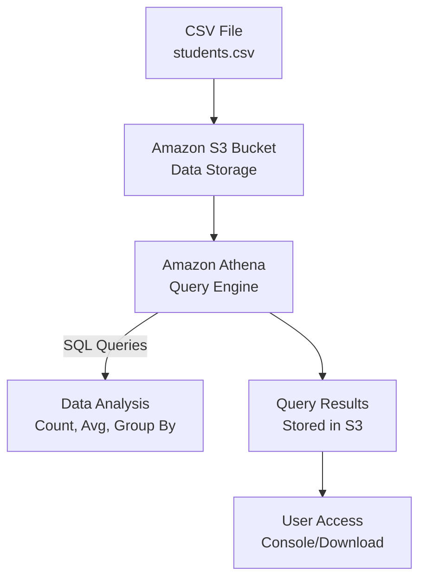

# Analyze a CSV File in S3 Using Amazon Athena

**Topics:** S3, Athena, SQL, Data Analysis, Serverless Analytics

## Overview

This lab demonstrates serverless data analysis using Amazon Athena to query CSV files stored in Amazon S3. You'll create a sample CSV file, upload it to S3, set up Athena, and run SQL queries for data analysis including counts, averages, grouping, and filtering operations.

### Key Concepts

| Concept | Description |
|---------|-------------|
| **Amazon Athena** | Serverless, interactive query service for analyzing data in S3 using SQL |
| **External Tables** | Tables that reference data stored externally (in S3) |
| **CSV SerDe** | Serializer/Deserializer for processing CSV files in Athena |
| **Query Result Location** | S3 location where Athena stores query outputs |
| **Serverless Analytics** | No infrastructure management required for data analysis |
| **SQL on S3** | Running standard SQL queries directly on files in S3 |

#### Prerequisites

- Active AWS account with billing enabled
- IAM permissions for S3 and Athena
- Basic knowledge of SQL queries
- Text editor for creating CSV file

## Architecture Overview

::: details Click to expand Architecture Diagram

:::

## Phase A: Create Sample CSV File

1. Open **Notepad** (or any text editor)
2. Paste this data and save as: **students.csv**

```csv
StudentID,Name,Dept,Marks,Result
101,Anita,MCA,85,Pass
102,Ravi,MCA,72,Pass
103,Meera,MBA,64,Pass
104,John,MCA,35,Fail
105,Sneha,MBA,91,Pass
106,Arun,MCA,49,Fail
107,Kiran,MBA,58,Pass
108,Divya,MCA,77,Pass
```

## Phase B: Create S3 Bucket and Upload CSV
- Go to **AWS Console → S3**
- Click **Create bucket**
- Bucket name: `athena-lab-<yourname>-<number>` (must be globally unique)
- Keep defaults → Click **Create bucket**
- Open the bucket → Click **Upload**
- Upload **students.csv**
- Click **Upload**

Now your CSV is in S3.

## Phase C: Set Up Athena Query Result Location

- Go to **AWS Console → Amazon Athena**
- Open “Query editor”.
- It will ask to set a Query result location
- Click the link/button like Settings / Manage / Edit
- Set query result location to something like:
	- `s3://your-bucket-name/athena-results/`
* Click Save

> [!IMPORTANT]
> This is required so Athena can store query outputs.

## Phase D: Create Database in Athena
In Athena query editor, run:
CREATE DATABASE labdb;
Then on the left side, select:
- Data source: AwsDataCatalog
- Database: labdb

## Phase E: Create External Table for CSV
Run this SQL query (replace YOUR_BUCKET_NAME with your actual bucket name):

```sql
CREATE EXTERNAL TABLE IF NOT EXISTS students (
  StudentID int,
  Name string,
  Dept string,
  Marks int,
  Result string
)
ROW FORMAT SERDE 'org.apache.hadoop.hive.serde2.OpenCSVSerde'
WITH SERDEPROPERTIES (
  'separatorChar' = ',',
  'quoteChar'     = '"',
  'escapeChar'    = '\\'
)

STORED AS TEXTFILE

LOCATION 's3://YOUR_BUCKET_NAME/'

TBLPROPERTIES ('skip.header.line.count'='1');
```

This tells Athena: “My CSV is in S3, treat it like a table.”

## Phase F: Run Analysis Queries

### 1) View all rows
```sql
SELECT * FROM students;
```
Expected: 8 records.

### 2) Total students
```sql
SELECT COUNT(*) AS total_students FROM students;
```
Expected: 8

### 3) Pass vs Fail count
```sql
SELECT Result, COUNT(*) AS cnt
FROM students
GROUP BY Result;
```
Expected (based on data): Pass = 6, Fail = 2

### 4) Average marks overall
```sql
SELECT AVG(Marks) AS avg_marks
FROM students;
```

### 5) Department-wise average marks
```sql
SELECT Dept, AVG(Marks) AS avg_marks
FROM students
GROUP BY Dept;
```

### 6) Top scorer
```sql
SELECT Name, Dept, Marks
FROM students
ORDER BY Marks DESC
LIMIT 1;
```
Expected: Sneha (91)

### 7) List failed students
```sql
SELECT StudentID, Name, Dept, Marks
FROM students
WHERE Result = 'Fail';
```
Expected: John, Arun

### Validation

::: details Validation

- **CSV Upload:** File successfully uploaded to S3 bucket
- **Database Creation:** labdb database created in Athena
- **Table Creation:** students table created without errors
- **Query Results:** All SQL queries execute successfully and return expected results
- **Result Location:** Query outputs stored in specified S3 location

:::

### Cost Considerations

::: details Cost Considerations

- **S3 storage:** Tiny (almost negligible for this small CSV)
- **Athena:** Charges based on data scanned; with this tiny CSV it's usually minimal
- **Tip:** Always delete query outputs and bucket after lab to avoid charges

:::

### Cleanup

::: details Cleanup

1. In Athena, you can keep DB/table (no cost by itself), but clean S3:
2. Go to S3 bucket
3. Delete:
   - students.csv
   - athena-results/ folder contents (query outputs)
4. Delete the bucket (must be empty to delete)

:::

## Result

Successfully implemented serverless data analysis using Amazon Athena to query CSV files stored in S3. Demonstrated SQL query capabilities on cloud-stored data without managing any infrastructure.

## Viva Questions

1. What is the main advantage of using Athena over traditional databases?
2. How does Athena handle data stored in S3?
3. Why is setting a query result location important?
4. What is a SerDe and why is it needed for CSV files?
