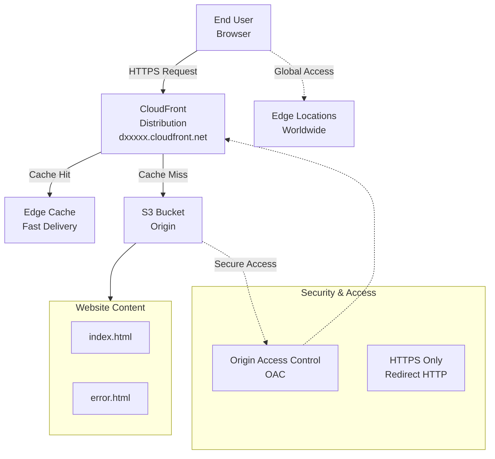

# Accelerate an S3 Static Website Using Amazon CloudFront (CDN)

**Topics:** S3, CloudFront, CDN, Static Websites, OAC

## Overview

This lab demonstrates how to accelerate a static website hosted on Amazon S3 using Amazon CloudFront, a global Content Delivery Network (CDN). You'll configure CloudFront to cache and serve your website content from edge locations worldwide, reducing latency and improving user experience. The lab covers setting up proper security with Origin Access Control (OAC) to ensure S3 remains private while CloudFront can access the content securely.

### Key Concepts

| Concept | Description |
|---------|-------------|
| **Amazon CloudFront** | Global CDN that caches content at edge locations for faster delivery |
| **Origin Access Control (OAC)** | Security mechanism that allows CloudFront to access private S3 buckets |
| **Edge Locations** | Global network of data centers where CloudFront caches content |
| **Distribution** | CloudFront configuration that defines how content is delivered |
| **Cache Hit/Miss** | Whether requested content is served from cache (hit) or origin (miss) |
| **TTL (Time To Live)** | How long content remains cached before being refreshed |

### Prerequisites

- Active AWS account with billing enabled
- IAM permissions for CloudFront, S3, and related services
- Existing S3 bucket configured as static website with:
  - `index.html` file
  - Optional: `error.html` file

## Architecture Overview

::: details Click to expand Architecture Diagram

:::

## Phase A: Ensure S3 is Ready

1. Open **S3 → your bucket**
2. Go to **Properties → Static website hosting**
3. Enable it, set:
   - Index document: `index.html`
   - Error document: `error.html` (optional)
4. Note down the S3 Website endpoint shown there.

## Phase B: Create CloudFront Distribution

1. Go to **CloudFront → Create distribution**
2. **Origin domain**: Select your S3 bucket (not the website endpoint)
3. **Origin access**: Choose **Origin access control (OAC)** (recommended)
   - Click **Create control setting** if asked
4. **Viewer protocol policy**: Choose **Redirect HTTP to HTTPS**
5. **Default root object**: Set `index.html`
6. Click **Create distribution**
7. Copy the Distribution domain name (looks like `dxxxxx.cloudfront.net`)

## Phase C: Configure Bucket Policy for CloudFront Access

After creating distribution, CloudFront shows a message: "S3 bucket policy needs update"

1. Click **Copy policy**
2. Go to **S3 → Bucket → Permissions → Bucket policy**
3. Paste and **Save**

This ensures public users cannot directly access S3, but CloudFront can access it securely.

## Phase D: Test the CloudFront Distribution

1. Wait until Distribution status becomes **Enabled** (and "Deployed")
2. Open in browser: `https://dxxxxx.cloudfront.net`

**Expected Result**: Your `index.html` loads via CloudFront.

## Validation

::: details Validation

- **S3 Static Website**: Bucket configured with static website hosting enabled
- **CloudFront Distribution**: Status shows "Enabled" and "Deployed"
- **OAC Configuration**: Origin Access Control properly set up
- **Bucket Policy**: S3 bucket policy allows CloudFront access
- **HTTPS Redirect**: HTTP requests automatically redirect to HTTPS
- **Content Delivery**: Website loads successfully via CloudFront URL

:::

## Cost Considerations

::: details Cost Considerations

- **CloudFront Data Transfer**: $0.085-$0.12 per GB (first 10TB)
- **CloudFront Requests**: $0.0075-$0.009 per 10,000 requests
- **S3 Storage**: Standard S3 pricing for website files
- **Free Tier**: 1TB data transfer, 10 million requests free
- **Estimated Cost**: <$5 for moderate traffic website

:::

## Cleanup

::: details Cleanup

1. Delete CloudFront distribution
2. Remove bucket policy from S3 bucket
3. Optionally delete S3 bucket and contents
4. Verify all resources are removed

:::

## Result

Successfully accelerated an S3 static website using Amazon CloudFront CDN. Demonstrated global content delivery with improved performance and security through Origin Access Control. The website now serves content from edge locations worldwide, reducing latency while maintaining secure access to private S3 resources.

## Viva Questions

1. What is the primary benefit of using CloudFront with S3?
2. Why is OAC important for security when using CloudFront with S3?
3. What happens during a cache miss vs cache hit?
4. How does CloudFront improve website performance?

