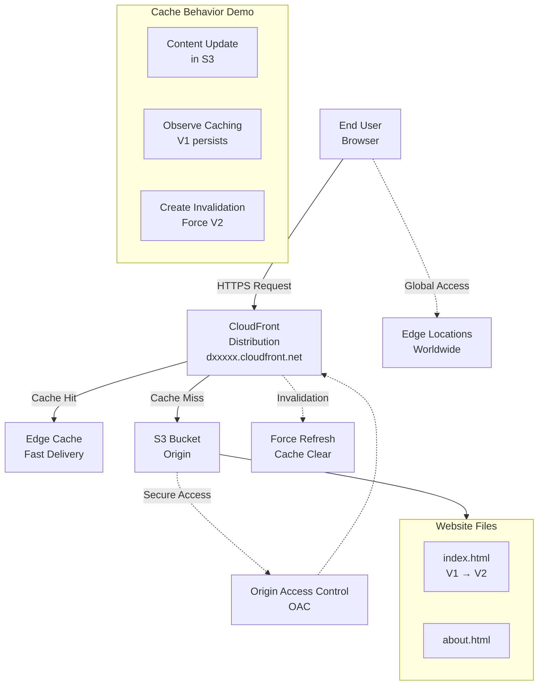

# Global Static Website Delivery using S3 + CloudFront with Cache Update Demo

**Topics:** S3, CloudFront, CDN, Caching, Invalidation

## Overview

This mini-project demonstrates end-to-end static website hosting and global content delivery using Amazon S3 and CloudFront CDN. You'll create a static website, accelerate it globally through CloudFront, observe caching behavior when content updates, and learn how to force content refresh using invalidations. This hands-on project covers the complete lifecycle of CDN-managed static websites.

### Key Concepts

| Concept | Description |
|---------|-------------|
| **CloudFront Distribution** | CDN configuration that defines how content is cached and delivered globally |
| **Origin Access Control (OAC)** | Security mechanism allowing CloudFront secure access to private S3 buckets |
| **Cache Invalidation** | Process to force removal of cached content and fetch latest version from origin |
| **Edge Locations** | Global network of servers that cache and serve content to reduce latency |
| **TTL (Time To Live)** | Duration content remains cached before automatic refresh |
| **Cache Hit/Miss** | Whether requested content is served from cache or fetched from origin |

### Prerequisites

- Active AWS account with billing enabled
- IAM permissions for S3 and CloudFront services
- Basic understanding of HTML and static websites
- Two HTML files prepared:
  - `index.html` (Version 1)
  - `about.html`

**Sample HTML Files:**

`index.html` (Version 1):
```html
<html>
  <body>
    <h1>My CloudFront Mini Project</h1>
    <h2>Version: V1</h2>
    <p>Loaded via CloudFront CDN</p>
  </body>
</html>
```

`about.html`:
```html
<html>
  <body>
    <h1>About Page</h1>
    <h2>Version: V1</h2>
  </body>
</html>
```

## Architecture Overview

::: details Click to expand Architecture Diagram

:::

## Phase A: Create S3 Bucket and Upload Files

1. Go to **S3 → Create bucket**
2. Bucket name: `cf-mini-project-<yourname>`
3. Region: Keep default
4. Block Public Access: Keep ON
5. Click **Create bucket**
6. Open your bucket → **Upload**
7. Upload both HTML files:
   - `index.html`
   - `about.html`
8. Click **Upload**

## Phase B: Create CloudFront Distribution

1. Go to **CloudFront → Create distribution**
2. **Origin domain**: Select your S3 bucket from dropdown
3. **Origin access**: Choose **Origin access control (OAC)**
   - Click **Create control setting** if asked → **Create**
4. **Viewer protocol policy**: Select **Redirect HTTP to HTTPS**
5. **Default root object**: Enter `index.html`
6. Click **Create distribution**


## Phase C: Configure Security (OAC Bucket Policy)

After distribution creation, CloudFront shows: "S3 bucket policy needs to be updated"

1. Click **Copy policy**
2. Go to **S3 → your bucket → Permissions → Bucket policy**
3. Paste policy → **Save changes**

**Result**: S3 remains private, but CloudFront can securely fetch objects.

## Phase D: Test Initial Setup

1. Go back to **CloudFront → your distribution**
2. Copy the **Distribution domain name** (e.g., `dxxxxx.cloudfront.net`)
3. Open in browser:
   - `https://dxxxxx.cloudfront.net`
   - `https://dxxxxx.cloudfront.net/about.html`

**Expected**: Both pages show "Version: V1"

**Screenshot Evidence:**
- CloudFront distribution details (domain + status)
- Browser output showing Version V1

## Phase E: Demonstrate Caching Behavior

1. **Update content in S3**: Edit `index.html` and change:
   ```html
   From: <h2>Version: V1</h2>
   To: <h2>Version: V2</h2>
   ```

2. **Re-upload updated file**:
   - S3 → bucket → Upload → add updated `index.html`
   - Click **Upload**

3. **Observe caching**: Immediately refresh `https://dxxxxx.cloudfront.net`
   - You may still see V1 (cached content)
   - Try hard refresh: `Ctrl + Shift + R`
   - Edge caching may still show V1

**This demonstrates CloudFront caching behavior!**

## Phase F: Force Content Update with Invalidation

1. **CloudFront → your distribution → Invalidations tab**
2. Click **Create invalidation**
3. **Object paths**: Enter `/index.html` (or `/*` to clear everything)
4. Click **Create invalidation**
5. Wait until status becomes **Completed**

6. **Verify latest version**: Refresh `https://dxxxxx.cloudfront.net`
   - Should now show "Version: V2"

**Screenshot Evidence:**
- Invalidation status "Completed"
- Browser showing V2

## Validation

::: details Validation

- **S3 Bucket**: Created with files `index.html` and `about.html`
- **CloudFront Distribution**: Status "Enabled" with domain name
- **OAC Configuration**: Origin Access Control properly set up
- **Bucket Policy**: S3 bucket allows CloudFront access
- **Initial Test**: Website loads via CloudFront showing V1
- **Content Update**: S3 file updated to V2
- **Cache Demonstration**: CloudFront may show V1 despite S3 having V2
- **Invalidation**: Created and completed successfully
- **Final Test**: CloudFront now shows V2 after invalidation

:::

## Cost Considerations

::: details Cost Considerations

- **CloudFront Data Transfer**: $0.085-$0.12 per GB (first 10TB)
- **CloudFront Requests**: $0.0075-$0.009 per 10,000 requests
- **Invalidations**: $0.005 per path (up to 3,000 free/month)
- **S3 Storage**: Standard S3 pricing for HTML files
- **Free Tier**: 1TB data transfer, 10 million requests free
- **Estimated Cost**: <$2 for this mini-project

:::

## Cleanup

::: details Cleanup

1. **CloudFront**: Disable distribution → wait for deployment → Delete distribution
2. **S3**: Empty bucket → Delete bucket
3. Verify all resources are removed to avoid charges
:::

## Result

Successfully completed a comprehensive CloudFront mini-project demonstrating global static website delivery with caching behavior analysis. Mastered the complete workflow from S3 setup through CloudFront distribution, observed real-world caching challenges, and learned to force content updates using invalidations. Demonstrated secure content delivery using Origin Access Control while understanding CDN performance benefits and cache management strategies.

**Key Learning Outcomes:**
- CloudFront accelerates global content delivery
- Caching improves performance but requires invalidation for updates
- OAC provides secure access to private S3 resources
- Invalidations force cache refresh when needed

## Viva Questions

1. Why use CloudFront instead of accessing S3 directly?
2. What does "cache" mean in CDN context?
3. Why was invalidation needed after content update?
4. What is OAC and why is it useful for security?
