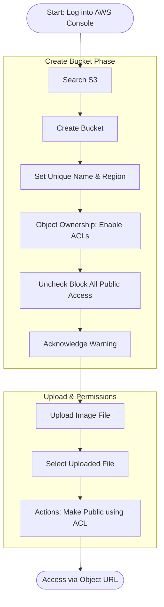

# Amazon S3: Bucket Creation and Object Management

**Topics:** S3, Object Storage, Bucket Management, Public Access, ACLs

## Overview

Amazon S3 (Simple Storage Service) is AWS's foundational object storage service, designed for storing and retrieving unlimited amounts of data from anywhere on the web. Unlike traditional file systems that organize data in hierarchical folders, S3 uses a flat structure where objects (files) are stored in buckets (containers).

This lab introduces you to core S3 concepts, creating S3 bucket, uploading objects, and configuring public access permissions. You'll learn about S3's architecture, storage classes, and security models, including the difference between ACLs and bucket policies. 

S3's durability (99.999999999%) and availability (99.99%) make it ideal for critical data storage across industries, from startups to enterprises.

## Key Concepts

| Concept                   | Description                                                                           |
| ------------------------- | ------------------------------------------------------------------------------------- |
| S3 Bucket                 | Top-level container for storing objects; globally unique name required                |
| Object                    | Individual file stored in S3 with data, metadata, and unique key (name)               |
| Object Key                | Unique identifier for an object within a bucket (essentially the file name/path)      |
| Metadata                  | Information about the object such as content type, creation date, and custom tags     |
| ACL (Access Control List) | Legacy permission mechanism for individual objects or buckets                         |
| Bucket Policy             | JSON-based permission document that applies to entire bucket (modern approach)        |
| Storage Class             | Pricing tier based on access frequency (Standard, Intelligent-Tiering, Glacier, etc.) |
| Durability                | Probability of data loss; S3 offers 99.999999999% (11 nines) durability               |
| Availability              | Percentage of time data is accessible; S3 Standard offers 99.99% availability         |
| Public Access             | Configuration allowing internet users to access objects without AWS credentials       |

### Prerequisites

- Active AWS account (Free Tier eligible)
- Image file or any test file for upload
- Basic understanding of cloud storage concepts
- Web browser for accessing uploaded public objects

## S3 Public Object Workflow

This diagram visualizes the specific configuration steps required to make an object accessible via a public URL.

::: details Click to expand Architecture Diagram


:::

## Create S3 Bucket and Upload Objects

1. Sign in to your AWS Management Console.

2. Navigate to S3 service:
   - In the search bar, type `S3`
   - Click **Amazon S3**

3. Click **Create bucket**.

4. Configure bucket settings:
   - **Bucket type:** General purpose
   - **Bucket name:** Enter a globally unique name
     - Must be lowercase
     - Can contain letters, numbers, and hyphens
     - Example: `student1-lab3-assets-2025-xy` or `yourname-demo-bucket-jan2026`
   - **AWS Region:** Select the region nearest to you (e.g., `us-east-1`, `ap-south-1`)

5. Configure Object Ownership:
   - Expand **Object Ownership** section
   - Select **ACLs enabled**
   - Keep **Bucket owner preferred** checked (default)

> [!NOTE] ACLs vs Bucket Policies
> - **ACLs** (Access Control Lists) are a legacy mechanism for controlling access to individual objects
> - **Bucket Policies** are modern JSON-based rules that apply to entire buckets
> - In production environments, bucket policies are preferred, but ACLs are useful for learning and simple use cases

6. Configure public access settings:
   - Scroll down to **Block Public Access settings for this bucket**
   - **Uncheck** "Block all public access"
   - A warning dialog appears
   - Check the acknowledgment box: "I acknowledge that the current settings might result in this bucket and the objects within becoming public"

7. Leave all other settings at default:
   - Bucket Versioning: Disabled
   - Tags: None
   - Default encryption: Amazon S3-managed keys (SSE-S3)

8. Click **Create bucket**.

9. Your bucket is now created and appears in the S3 bucket list.

10. Upload an object to the bucket:
    - Click on your bucket name to open it
    - Click **Upload** button
    - Click **Add files**
    - Select an image file (JPG, PNG, GIF) or any test file from your computer
    - Click **Upload** at the bottom

11. Wait for the upload to complete (green success banner appears).

12. Make the object publicly accessible:
    - Navigate to the **Objects** tab in your bucket
    - Select the uploaded file by checking the checkbox next to it
    - Click **Actions** dropdown menu
    - Select **Make public using ACL**
    - A confirmation dialog appears
    - Click **Make public**

13. Access the object via public URL:
    - Click on the object name to view its details
    - Scroll down to the **Object overview** section
    - Find the **Object URL** field
    - Copy the URL (format: `https://<bucket-name>.s3.<region>.amazonaws.com/<filename>`)
    - Open the URL in a new browser tab
    - The image/file is displayed directly from S3

> [!TIP] URL Structure
> ```
> https://<bucket-name>.s3.<region>.amazonaws.com/<object-key>
> ```
> - `<bucket-name>`: Your unique bucket name
> - `<region>`: AWS region where bucket is created
> - `<object-key>`: The file name (or path if using prefixes)

### Validation

::: details Validation

Verify successful completion:

- **Bucket Creation:**
  - Bucket appears in S3 bucket list
  - Bucket name is globally unique and follows naming rules
  - Bucket region matches your selection
  - Public access settings show "Public" label

- **Object Upload:**
  - Object appears in the Objects tab
  - File size and type are correct
  - Upload completed without errors

- **Public Access:**
  - Object has "Publicly accessible" label
  - Object URL opens in browser successfully
  - Image/file displays without authentication required
  - No "Access Denied" errors

:::

### Cost Considerations

::: details Cost Considerations

- **S3 Standard Storage:**
  - First 50 TB: $0.023 per GB/month
  - Next 450 TB: $0.022 per GB/month
  - Storage costs calculated by average storage per month

- **Free Tier (First 12 months):**
  - 5 GB of S3 Standard storage
  - 20,000 GET requests
  - 2,000 PUT requests
  - 100 GB of data transfer out

- **Data Transfer:**
  - Data transfer IN to S3: Free
  - Data transfer OUT to internet: $0.09 per GB (after free tier)
  - First 100 GB/month out is free

- **Requests:**
  - PUT, COPY, POST, LIST: $0.005 per 1,000 requests
  - GET, SELECT: $0.0004 per 1,000 requests

:::

### Cleanup

::: details Cleanup

To avoid ongoing costs and maintain good AWS hygiene:

1. **Delete objects first:**
   - Open your S3 bucket
   - Go to the **Objects** tab
   - Select all objects (checkbox at top)
   - Click **Delete**
   - Type `permanently delete` in the confirmation field
   - Click **Delete objects**

2. **Delete the bucket:**
   - Return to the S3 console (bucket list)
   - Select your bucket (checkbox)
   - Click **Delete**
   - Type the bucket name in the confirmation field
   - Click **Delete bucket**

:::

> [!IMPORTANT] Deletion Requirement
> S3 buckets must be empty before they can be deleted. Always empty buckets first, then delete them.

## Result

You have successfully created your first Amazon S3 bucket, uploaded objects, and configured public access. You now understand S3's fundamental concepts including buckets, objects, regions, and access control mechanisms. The public object URL demonstrates S3's capability to serve content directly over HTTP, which is the foundation for static website hosting, CDN integration, and public file sharing.

These skills are essential for leveraging S3 across numerous AWS use cases, from simple file storage to complex data lakes and application architectures.

## Viva Questions

1. **What is the difference between Amazon S3 and traditional file systems?**
   - S3 is object-based storage with a flat structure where files (objects) are stored in buckets with unique keys. Traditional file systems use hierarchical directory structures. S3 offers unlimited scalability, built-in redundancy, and HTTP-based access, while file systems are limited by disk capacity and require manual backup configurations.

2. **Why must S3 bucket names be globally unique?**
   - S3 bucket names form part of the DNS namespace and are used in URLs (`bucket-name.s3.amazonaws.com`). Since DNS names must be globally unique across the internet, bucket names must also be globally unique across all AWS accounts worldwide to prevent conflicts.

3. **What is the difference between ACLs and Bucket Policies in S3?**
   - ACLs (Access Control Lists) are legacy permission mechanisms that apply to individual objects or buckets with limited permission options. Bucket Policies are modern JSON-based documents that provide fine-grained control over entire buckets and can specify conditions, principals, and actions. AWS recommends using Bucket Policies for most use cases.

4. **What does S3's 99.999999999% durability mean?**
   - This means if you store 10,000,000 objects in S3, you can expect to lose one object every 10,000 years on average. S3 achieves this by automatically storing multiple copies of data across multiple Availability Zones within a region, providing extreme data protection against hardware failures.

5. **What are the main use cases for Amazon S3?**
   - Backup and disaster recovery, data archival, static website hosting, media file storage and distribution, data lakes for analytics, application data storage, content delivery (with CloudFront), log file storage, and software distribution.

