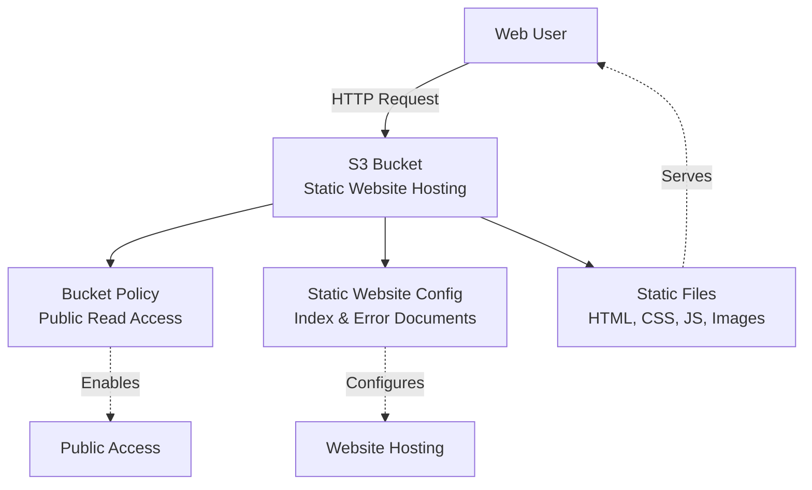
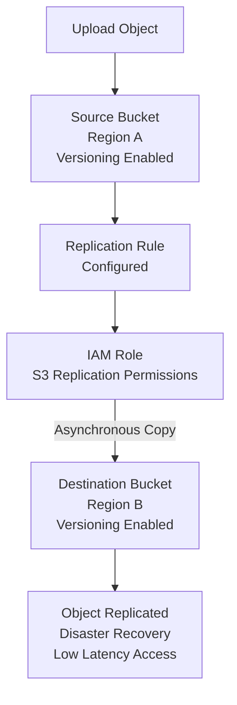

# Amazon S3 Advanced Features

**Topics:** S3, Static Website Hosting, Versioning, Cross-Region Replication, Disaster Recovery

## Overview

This lab explores three powerful Amazon S3 capabilities that extend beyond basic storage: Static Website Hosting, Versioning, and Cross-Region Replication (CRR). These features transform S3 from simple object storage into a comprehensive platform for web hosting, data protection, and disaster recovery.

**Static Website Hosting** allows you to serve HTML, CSS, and JavaScript files directly from S3 without requiring traditional web servers, making it cost-effective for portfolios, documentation sites, and landing pages. 

**Versioning** provides time-machine-like capabilities, automatically preserving every version of your objects to protect against accidental deletions or overwrites. 

**Cross-Region Replication** ensures business continuity by automatically copying data across geographic regions for disaster recovery and compliance requirements.

By mastering these features, you'll understand how to leverage S3 for production-grade applications that require high availability, data durability, and geographic redundancy.

## Key Concepts

| Concept | Description |
|---------|-------------|
| Static Website Hosting | S3 feature that serves HTML/CSS/JS files via HTTP, turning a bucket into a web server |
| Index Document | Default page served when accessing the website root (typically index.html) |
| Error Document | Custom page displayed when requested resources don't exist (404 errors) |
| Bucket Website Endpoint | HTTP URL provided by AWS for accessing the static website |
| Versioning | S3 feature that preserves all versions of objects, protecting against accidental deletion |
| Version ID | Unique identifier assigned to each version of an object |
| Delete Marker | Special marker placed on deleted objects in versioned buckets (object remains recoverable) |
| Cross-Region Replication (CRR) | Automatic asynchronous copying of objects to buckets in different AWS regions |
| Replication Rule | Configuration defining what objects to replicate and where |
| Lifecycle Policy | Automated rules for transitioning or deleting object versions based on age |

## Prerequisites

- Active AWS account (Free Tier eligible)
- Completed Lab 3 (basic S3 bucket creation)
- Basic HTML knowledge for static website hosting
- Text editor for creating HTML files
- Understanding of disaster recovery concepts (helpful)

### For Static Website Hosting
- HTML files prepared (index.html, error.html, and any additional pages)
- Optional: CSS, JavaScript, images for enhanced website

## Architecture Overview

::: details Click to expand Static Website Architecture

:::

::: details Click to expand Cross-Region Replication Architecture

:::

## Phase 1: Configure S3 Static Website Hosting

Static website hosting turns your S3 bucket into a web server capable of serving HTML, CSS, JavaScript, and media files over HTTP.

### Prepare Website Files

1. Create a simple website structure on your local computer:

```
my-website/
├── index.html
├── about.html
├── contact.html
└── error.html
```

2. Create basic HTML files with navigation links between pages.

::: details Click to expand HTML file examples

::: code-group

```html [index.html]
<!DOCTYPE html>
<html lang="en">
<head>
    <meta charset="UTF-8">
    <meta name="viewport" content="width=device-width, initial-scale=1.0">
    <title>My Static Website</title>
</head>
<body>
    <header>
        <h1>Welcome to My Static Website</h1>
        <nav>
            <a href="index.html">Home</a> |
            <a href="about.html">About</a> |
            <a href="contact.html">Contact</a>
        </nav>
    </header>
    <main>
        <p>This is a simple static website hosted on Amazon S3.</p>
        <p>Learn more about our services on the About page.</p>
    </main>
    <footer>
        <p>&copy; 2026 My Static Website</p>
    </footer>
</body>
</html>
```

```html [about.html]
<!DOCTYPE html>
<html lang="en">
<head>
    <meta charset="UTF-8">
    <meta name="viewport" content="width=device-width, initial-scale=1.0">
    <title>About - My Static Website</title>
</head>
<body>
    <header>
        <h1>About Us</h1>
        <nav>
            <a href="index.html">Home</a> |
            <a href="about.html">About</a> |
            <a href="contact.html">Contact</a>
        </nav>
    </header>
    <main>
        <p>This website demonstrates Amazon S3 static website hosting capabilities.</p>
        <p>S3 provides a cost-effective way to host static content without managing servers.</p>
    </main>
    <footer>
        <p>&copy; 2026 My Static Website</p>
    </footer>
</body>
</html>
```

```html [contact.html]
<!DOCTYPE html>
<html lang="en">
<head>
    <meta charset="UTF-8">
    <meta name="viewport" content="width=device-width, initial-scale=1.0">
    <title>Contact - My Static Website</title>
</head>
<body>
    <header>
        <h1>Contact Us</h1>
        <nav>
            <a href="index.html">Home</a> |
            <a href="about.html">About</a> |
            <a href="contact.html">Contact</a>
        </nav>
    </header>
    <main>
        <p>Get in touch with us!</p>
        <p>Email: info@mywebsite.com</p>
        <p>Phone: (555) 123-4567</p>
        <p>This is a static page - for dynamic forms, consider using additional AWS services.</p>
    </main>
    <footer>
        <p>&copy; 2026 My Static Website</p>
    </footer>
</body>
</html>
```

```html [error.html]
<!DOCTYPE html>
<html lang="en">
<head>
    <meta charset="UTF-8">
    <meta name="viewport" content="width=device-width, initial-scale=1.0">
    <title>Page Not Found</title>
</head>
<body>
    <header>
        <h1>404 - Page Not Found</h1>
        <nav>
            <a href="index.html">Home</a> |
            <a href="about.html">About</a> |
            <a href="contact.html">Contact</a>
        </nav>
    </header>
    <main>
        <p>Sorry, the page you're looking for doesn't exist.</p>
        <p>Please check the URL or return to the home page.</p>
    </main>
    <footer>
        <p>&copy; 2026 My Static Website</p>
    </footer>
</body>
</html>
```

:::

### Create and Configure S3 Bucket

1. Sign in to AWS Management Console and navigate to S3.

2. Click **Create bucket**.

3. Configure bucket settings:
   - **Bucket name:** Enter unique name (e.g., `yourname-static-website-2026`)
   - **Region:** Select your preferred region
   - **Object Ownership:** ACLs enabled
   - **Block Public Access:** Uncheck "Block all public access"
   - Acknowledge the warning

4. Click **Create bucket**.

5. Upload your website files:
   - Open the bucket
   - Click **Upload** → **Add files** and **Add folder**
   - Select all HTML, CSS, JS, and image files
   - Click **Upload**

6. Enable Static Website Hosting:
   - Navigate to **Properties** tab
   - Scroll to **Static website hosting** section
   - Click **Edit**
   - Select **Enable**
   - Choose **Host a static website**
   - **Index document:** `index.html`
   - **Error document:** `error.html`
   - Click **Save changes**

7. Configure bucket policy for public read access:
   - Go to **Permissions** tab
   - Scroll to **Bucket Policy** section
   - Click **Edit**
   - Paste the following policy (replace `YOUR-BUCKET-NAME`):

```json
{
    "Version": "2012-10-17",
    "Statement": [
        {
            "Sid": "PublicReadGetObject",
            "Effect": "Allow",
            "Principal": "*",
            "Action": "s3:GetObject",
            "Resource": "arn:aws:s3:::YOUR-BUCKET-NAME/*"
        }
    ]
}
```

8. Click **Save changes**.

9. Access your website:
   - Return to **Properties** tab
   - Scroll to **Static website hosting**
   - Copy the **Bucket website endpoint** URL
   - Open the URL in a browser
   - Your `index.html` page should display

10. Test navigation by clicking links to other pages (About, Contact).

11. Test error page by accessing a non-existent URL (e.g., `/nonexistent.html`).

> [!NOTE] HTTP vs HTTPS
> S3 static website endpoints provide HTTP only (not secure). For HTTPS with SSL/TLS, you must use Amazon CloudFront as a CDN in front of S3.

> [!TIP] Custom Domain
> You can use your own domain name (e.g., www.example.com) by creating a Route 53 alias record pointing to your S3 website endpoint. The bucket name must match the domain name.

## Phase 2: Enable S3 Versioning

Versioning protects against accidental deletions and overwrites by preserving all versions of every object in your bucket.

1. Navigate to your S3 bucket (or create a new one for testing).

2. Open the **Properties** tab.

3. Scroll to **Bucket Versioning** section.

4. Click **Edit**.

5. Select **Enable**.

6. Click **Save changes**.

7. Test versioning:
   - Upload a file (e.g., `document.txt` with content "Version 1")
   - Modify the file locally to say "Version 2"
   - Upload the same file again (same name)
   - Click on the file name
   - Click **Versions** tab
   - You'll see multiple versions listed with unique Version IDs

8. Restore a previous version:
   - Select the older version
   - Click **Download** to retrieve it
   - Or click **Actions** → **Delete** to remove only that version

9. Understand delete markers:
   - Delete the object from the bucket
   - Enable **Show versions** toggle
   - Notice a "Delete marker" appears instead of permanent deletion
   - The object is hidden but all versions remain
   - Delete the delete marker to restore the object

> [!IMPORTANT] Storage Costs
> Versioning stores ALL versions. If you upload a 1GB file 10 times, you're paying for 11GB total (10 old versions + 1 current). Use Lifecycle Policies to automatically delete old versions after a specified period.

> [!WARNING] Cannot Disable
> Once enabled, versioning can only be suspended (not fully disabled). Suspending versioning stops creating new versions but preserves existing ones.

## Phase 3: Configure Cross-Region Replication (CRR)

Cross-Region Replication automatically copies objects from a source bucket to a destination bucket in a different AWS region for disaster recovery and compliance.

### Prerequisites for CRR
- Versioning must be enabled on both source and destination buckets
- Source and destination buckets must be in different regions
- IAM role with replication permissions

### Setup Steps

1. **Create destination bucket:**
   - Switch to a **different AWS region** (e.g., if source is in us-east-1, choose us-west-2)
   - Create a new bucket with a unique name (e.g., `yourname-replica-bucket`)
   - **Important:** Enable versioning on this bucket
   - Leave other settings at default
   - Click **Create bucket**

2. **Configure replication on source bucket:**
   - Navigate to your source bucket (ensure versioning is enabled)
   - Go to **Management** tab
   - Scroll to **Replication rules** section
   - Click **Create replication rule**

3. **Configure replication rule:**
   - **Replication rule name:** Enter descriptive name (e.g., `cross-region-backup`)
   - **Status:** Enabled
   - **Priority:** Leave default (0)

4. **Source bucket configuration:**
   - **Rule scope:** Select **Apply to all objects in the bucket**
   - Or specify prefix/tags to replicate only certain objects

5. **Destination configuration:**
   - **Choose a bucket in this account**
   - **Bucket name:** Select your destination bucket from the dropdown
   - Verify it's in a different region

6. **IAM Role:**
   - Select **Create new role**
   - AWS will automatically create an IAM role with necessary permissions

7. Click **Save**.

8. **Test replication:**
   - Upload a new file to the source bucket
   - Wait 1-2 minutes for replication
   - Navigate to the destination bucket in the other region
   - Verify the object appears with the same name and version ID

9. **Verify replication status:**
   - In source bucket, click on the uploaded object
   - Scroll to **Replication status**
   - Status should show "Completed" or "Replica"

> [!NOTE] Not Retroactive
> CRR only replicates new objects uploaded after enabling the replication rule. Existing objects are not automatically replicated unless you use S3 Batch Replication.

> [!WARNING] Doubled Costs
> Cross-Region Replication doubles storage costs (data in two regions) AND incurs data transfer charges for moving data between regions.

> [!TIP] Same-Region Replication (SRR)
> AWS also offers Same-Region Replication for compliance requirements or creating test/dev copies in the same region. Configuration is identical but destination bucket is in the same region.

## Validation

::: details Validation

Verify successful completion of all phases:

### Static Website Hosting
- Bucket website endpoint URL loads in browser
- Index page (index.html) displays correctly
- Navigation links work between pages
- Error page displays for invalid URLs
- Bucket policy grants public read access
- No "Access Denied" errors

### Versioning
- Bucket Versioning shows "Enabled" in Properties
- Uploading same file multiple times creates multiple versions
- Version IDs are visible in Versions tab
- Can download specific versions
- Deleting object creates delete marker (not permanent deletion)

### Cross-Region Replication
- Destination bucket exists in different region
- Both buckets have versioning enabled
- Replication rule shows "Enabled" status
- Newly uploaded objects appear in destination bucket
- Replication status shows "Completed"
- IAM replication role exists

:::

## Cost Considerations

::: details Cost Considerations

### Static Website Hosting
- **S3 Storage:** $0.023 per GB/month (Standard class)
- **Requests:** GET requests $0.0004 per 1,000 requests
- **Data Transfer Out:** $0.09 per GB (after free tier)
- **Free Tier:** 5 GB storage, 20,000 GET requests, 2,000 PUT requests

### Versioning
- **Storage Cost Multiplier:** Each version counts toward total storage
- **Example:** 1 GB file with 10 versions = 11 GB charged = $0.253/month
- **Mitigation:** Use Lifecycle Policies to delete old versions after 30/60/90 days

### Cross-Region Replication
- **Source Storage:** $0.023 per GB/month (Region A)
- **Destination Storage:** $0.023 per GB/month (Region B)
- **Data Transfer:** ~$0.02 per GB for cross-region replication
- **Total:** Approximately **2.4x** the cost of single-region storage

> [!TIP] Cost Optimization
> For versioning, implement a lifecycle rule that transitions old versions to Glacier after 30 days and deletes them after 90 days. This dramatically reduces costs while maintaining recent version history.

:::

## Cleanup

::: details Cleanup

### Delete Static Website
1. Go to source bucket → **Properties** → **Static website hosting** → **Edit** → **Disable** → Save
2. Go to **Permissions** → **Bucket Policy** → **Edit** → Delete policy → Save
3. Delete all objects from bucket
4. Delete the bucket

### Disable Versioning (Suspend)
1. Go to bucket → **Properties** → **Bucket Versioning** → **Edit**
2. Select **Suspend** (cannot fully disable)
3. Save changes
4. To delete all versions:
   - Enable "Show versions" toggle in Objects tab
   - Select all versions
   - Click **Delete** → Confirm

### Remove Cross-Region Replication
1. Go to source bucket → **Management** → **Replication rules**
2. Select the replication rule
3. Click **Delete** → Confirm
4. Go to destination bucket (in other region)
5. Delete all replicated objects
6. Delete destination bucket
7. Optional: Delete the IAM replication role from IAM console

:::

> [!WARNING] Complete Cleanup
> Always delete objects from both source and destination buckets before deleting the buckets themselves. Replicated objects continue accruing costs until explicitly deleted.

## Result

You have successfully mastered three advanced S3 features that are essential for production workloads. 

Static Website Hosting demonstrates S3's versatility beyond storage, enabling cost-effective web hosting for static content. Versioning provides data protection and recovery capabilities critical for production environments. Cross-Region Replication ensures business continuity through geographic redundancy and disaster recovery.

## Viva Questions

1. **What is the difference between S3 static website hosting and traditional web hosting?**
   - S3 static hosting serves only static content (HTML/CSS/JS) without server-side processing, while traditional hosting supports server-side languages (PHP, Python, Java). S3 is cheaper, more scalable, and requires no server management, but cannot execute backend code or connect to databases directly.

2. **How does S3 versioning protect against accidental deletion?**
   - When versioning is enabled, deleting an object places a "delete marker" on it rather than permanently removing it. All previous versions remain stored and can be restored by removing the delete marker or downloading a specific version ID. This provides a complete history of changes and deletions.

3. **Why must versioning be enabled for Cross-Region Replication?**
   - CRR relies on version IDs to track and replicate objects across regions. Versioning ensures each object change gets a unique identifier, allowing S3 to properly synchronize the exact state of objects, including deletions (via delete markers), between source and destination buckets.

