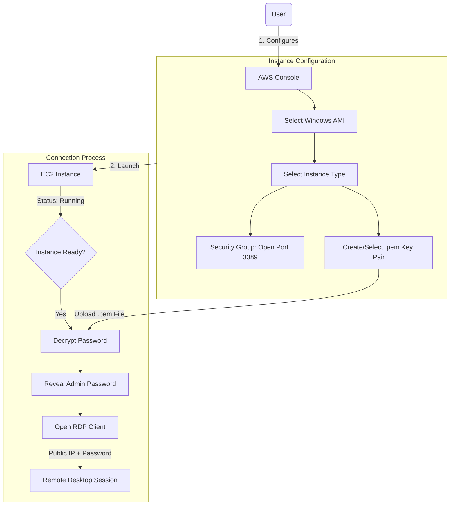

# Launch Windows EC2 Instance and RDP Connection

**Topics:** EC2, Windows Server, RDP, Remote Desktop, Security Groups, Key Pairs

## Overview

Amazon Elastic Compute Cloud (EC2) is AWS's core Infrastructure as a Service (IaaS) offering that provides resizable compute capacity in the cloud. Allowing to launch virtual servers (instances) on-demand, paying only for what you use, without the capital expense of physical hardware.

This lab focuses on launching a Windows Server instance and establishing remote access using Remote Desktop Protocol (RDP). Demonstrates how to decrypt the Windows administrator password using a private key and connect to your Windows instance from your local computer.

## Key Concepts

| Concept | Description |
|---------|-------------|
| EC2 Instance | Virtual server running in AWS cloud with configurable CPU, memory, storage, and networking |
| AMI (Amazon Machine Image) | Pre-configured template containing OS, applications, and configurations for launching instances |
| Instance Type | Hardware specification defining vCPUs, memory, storage, and network performance (e.g., t3.micro) |
| Security Group | Virtual firewall controlling inbound and outbound traffic to instances using port-based rules |
| Key Pair | Cryptographic key pair (public/private) for securely accessing instances and decrypting passwords |
| RDP (Remote Desktop Protocol) | Microsoft protocol for remote graphical access to Windows systems (port 3389) |
| EBS Volume | Elastic Block Store - persistent block storage attached to EC2 instances (survives stops/starts) |
| Public IPv4 Address | Internet-routable IP address for accessing instance from outside AWS (changes on stop/start) |
| Private IPv4 Address | Internal IP address for VPC communication (persists until instance termination) |
| Instance State | Current status: pending, running, stopping, stopped, terminating, terminated |

### Prerequisites

- Active AWS account (Free Tier eligible)
- Windows, macOS, or Linux computer with internet connection
- RDP client installed:
  - **Windows:** Remote Desktop Connection (built-in)
  - **macOS:** Microsoft Remote Desktop from App Store
  - **Linux:** Remmina or rdesktop
- Basic understanding of networking concepts (IP addresses, ports)
- Ability to download and store .pem key files securely

## Architecture Overview

::: details Click to expand Architecture Diagram

:::

## Launch Windows EC2 Instance

1. Sign in to AWS Management Console.

2. Select your preferred AWS Region from the dropdown (top-right corner).
   - Choose a region close to your location for better performance

3. Navigate to EC2 service:
   - Search for `EC2` in the console search bar
   - Click **EC2** (Virtual Servers in the Cloud)

4. Click **Launch Instance** button.

5. Configure instance name and tags:
   - **Name:** Enter descriptive name (e.g., `MyWindowsServer`, `TestWin2022`)
   - Tags help organize and identify resources

6. Choose Amazon Machine Image (AMI):
   - Under **Application and OS Images (Amazon Machine Image)**
   - Select **Quick Start** tab
   - Choose **Microsoft Windows Server 2025 Base**
   - Verify "Free tier eligible" label appears

7. Select Instance Type:
   - Under **Instance type**
   - Select **t3.micro** (Free tier eligible)
   - Specifications: 2 vCPUs, 1 GiB memory

8. Configure Key Pair for password decryption:
   - Under **Key pair (login)** section
   - **Option A - Create new key pair:**
     - Click **Create new key pair**
     - **Key pair name:** Enter name (e.g., `my-windows-key`)
     - **Key pair type:** RSA
     - **Private key file format:** .pem
     - Click **Create key pair**
     - The .pem file downloads automatically
     - **Save this file securely** - you cannot retrieve it later!
   - **Option B - Use existing key pair:**
     - Select existing key pair from dropdown
     - Confirm you have access to the private key file

> [!IMPORTANT] Key Pair Security
> The .pem file is required to decrypt the Windows administrator password. Store it in a secure location with restricted permissions. Loss of this file means you cannot access the administrator password.

9. Configure Network Settings:
   - Under **Network settings**, click **Edit** if you want to customize
   - **VPC:** Leave default VPC selected (or select custom VPC)
   - **Subnet:** No preference (auto-assign)
   - **Auto-assign Public IP:** Enable (required for RDP access from internet)

10. Configure Security Group (firewall rules):
    - **Create security group** (if first time) or select existing
    - **Security group name:** `windows-rdp-sg` (or descriptive name)
    - **Description:** "Allow RDP access to Windows instance"
    - **Inbound security group rules:**
      - **Type:** RDP
      - **Protocol:** TCP
      - **Port range:** 3389
      - **Source type:** Choose one:
        - **My IP** (Recommended) - Restricts access to your current public IP
        - **Custom** - Enter specific IP range (e.g., `203.0.113.0/24`)
        - **Anywhere (0.0.0.0/0)** - Allows access from any IP (NOT recommended for production)

> [!WARNING] Security Risk
> Opening RDP (port 3389) to 0.0.0.0/0 exposes your instance to brute-force attacks from automated bots worldwide. Always restrict RDP access to known IP addresses. Use "My IP" for testing, or implement VPN/bastion host for production.

11. Configure Storage:
    - **Volume 1 (Root):**
      - **Size:** 30 GiB (default for Windows Server)
      - **Volume type:** gp3 (General Purpose SSD) - recommended
      - **Delete on termination:** Checked (default)
    - Leave other storage settings at default

12. Expand **Advanced details** (optional configurations):
    - **User data:** Can add PowerShell script to run at launch
    - **Termination protection:** Enable to prevent accidental deletion
    - Leave other settings at default for this lab

13. Review configuration in the **Summary** panel on the right:
    - Instance count: 1
    - AMI: Windows Server 2025
    - Instance type: t3.micro
    - Key pair: Selected
    - Security group: RDP allowed

14. Click **Launch instance**.

15. Wait for instance launch:
    - You'll see a success message
    - Click **View all instances** to see the Instances dashboard
    - Instance **State** changes from "Pending" → "Running" (1-2 minutes)
    - **Status check** shows "2/2 checks passed" (2-5 minutes)

> [!TIP] Initial Boot Time
> Windows instances take longer to initialize than Linux instances (typically 3-5 minutes). Wait for both instance state to show "Running" AND status checks to complete before attempting to connect.

## Connect to Windows Instance via RDP

1. Wait for instance to be fully ready:
   - **Instance state:** Running
   - **Status check:** 2/2 checks passed
   - **Important:** Wait an additional 5 minutes after launch for Windows to complete initialization

2. Select your instance in the EC2 console (checkbox).

3. Click **Connect** button at the top.

4. Navigate to **RDP client** tab.

5. Retrieve Windows Administrator password:
   - Click **Get password** button
   - **Upload private key file:** Click **Browse** or **Choose File**
   - Select the .pem file you downloaded earlier
   - Click **Decrypt password**
   - The decrypted Administrator password appears

6. Copy credentials:
   - **Public DNS (IPv4) or Public IP:** Copy this address
   - **User name:** Administrator
   - **Password:** Copy the decrypted password
   - Keep this information accessible for the next steps

7. Open RDP client on your computer:

   **For Windows:**
   - Press `Win + R`, type `mstsc`, press Enter
   - Or search "Remote Desktop Connection" in Start menu

   **For macOS:**
   - Open **Microsoft Remote Desktop** app from Applications

   **For Linux:**
   - Open **Remmina** or run `rdesktop` in terminal

::: details Click to expand: Using rdesktop in Ubuntu

To install and use rdesktop for RDP connections in Ubuntu:

1. **Connect to Windows EC2 instance:**
   ```bash
   sudo apt install rdesktop

   rdesktop -u Administrator -p "YOUR_DECRYPTED_PASSWORD" YOUR_PUBLIC_IP
   ```

2. **Optional parameters:**
   - `-f` for fullscreen mode
   - `-g 1024x768` to set resolution
   - `-a 16` for color depth

3. **Troubleshooting common errors:**

   **Certificate validation error:**
   ```bash
   rdesktop -u Administrator -p 'YOUR_DECRYPTED_PASSWORD' --ignore-certificate YOUR_PUBLIC_IP
   ```

4. **Exit rdesktop:** Press `Ctrl+Alt+Enter` to exit fullscreen, then close the window.
:::

8. Configure RDP connection:
   - **Computer/Server:** Paste the Public IP address
   - Click **Connect** or **Show Options** for advanced settings
   - **User name:** Administrator
   - **Password:** Paste the decrypted password

9. Handle security certificate warning:
   - You'll see a warning about the remote computer's identity
   - This is expected for new instances with self-signed certificates
   - Click **Yes** / **Continue** / **Connect Anyway** to proceed

> [!NOTE] Certificate Warning
> Self-signed certificates trigger security warnings. For production environments, configure proper SSL/TLS certificates or join the instance to Active Directory domain for trusted certificates.

10. Remote Desktop session establishes:
    - Windows Server desktop appears in the RDP window
    - You're now remotely controlling the EC2 Windows instance
    - Wait for Server Manager to load automatically

11. Verify connection:
    - Check the Server Manager dashboard
    - Open Command Prompt and run `ipconfig` to see network configuration
    - Open PowerShell and run `Get-ComputerInfo` for system details

> [!TIP] Performance Tips 
> - For better RDP performance, reduce display resolution in RDP settings
> - Disable desktop background and visual effects
> - Use RDP compression for slower internet connections

### Validation

Verify successful completion:

- **Instance Launch:**
  - Instance appears in EC2 Instances dashboard
  - Instance state shows "Running"
  - Status checks show "2/2 checks passed"
  - Public IP address assigned

- **Security Configuration:**
  - Security group attached to instance
  - RDP (port 3389) rule present in security group
  - Key pair associated with instance

- **RDP Connection:**
  - Successfully decrypted Administrator password
  - RDP client connects to instance public IP
  - Windows Server desktop displays
  - Server Manager loads successfully
  - Can execute commands in PowerShell/Command Prompt

- **Network Connectivity:**
  - Instance has both public and private IP addresses
  - Can ping external websites from instance (e.g., `ping google.com`)
  - Windows firewall allows outbound internet access

### Cost Considerations

- **EC2 Instance (t3.micro):**
  - **Free Tier:** 750 hours/month for first 12 months (covers 1 instance running 24/7)
  - **After Free Tier:** ~$0.0104/hour = ~$7.50/month (us-east-1 pricing)
  - **Stopped instances:** No compute charges, but EBS storage still charged

- **EBS Storage (30 GB gp3):**
  - **Free Tier:** 30 GB for first 12 months
  - **After Free Tier:** $0.08/GB-month = $2.40/month

- **Data Transfer:**
  - **Inbound:** Free
  - **Outbound to internet:** First 100 GB/month free, then $0.09/GB
  - **RDP sessions:** Minimal data transfer (~10-50 MB/hour)

- **Elastic IP (if allocated):**
  - Free while instance is running with it attached
  - $0.005/hour if instance is stopped or IP is unattached

> [!WARNING] Stop vs Terminate
> Stopping an instance halts compute charges but EBS storage charges continue (~$2.40/month). Terminate the instance to stop all charges completely.

### Cleanup

To avoid ongoing charges:

1. **Disconnect RDP session:**
   - Sign out from Windows (Start → Power → Sign out)
   - Or close the RDP window

2. **Stop the instance (temporary, if you need it later):**
   - Go to EC2 → Instances
   - Select your instance
   - Click **Instance state** → **Stop instance**
   - Confirm by clicking **Stop**
   - **Result:** Compute charges stop, EBS storage charges continue

3. **Terminate the instance (permanent deletion):**
   - Select your instance
   - Click **Instance state** → **Terminate instance**
   - Type "terminate" in the confirmation dialog
   - Click **Terminate**
   - **Result:** All charges stop, data is permanently deleted

4. **Delete the key pair (optional):**
   - Go to EC2 → Network & Security → Key Pairs
   - Select your key pair
   - Click **Actions** → **Delete**
   - Confirm deletion
   - Delete the local .pem file from your computer

5. **Delete the security group (optional):**
   - Go to EC2 → Network & Security → Security Groups
   - Select your RDP security group
   - Click **Actions** → **Delete security group**
   - Confirm deletion
   - **Note:** Cannot delete if still attached to running instances

> [!IMPORTANT] Data Loss
> Terminating an instance permanently deletes all data on the instance. Ensure you've backed up any important files before termination. For production instances, enable "Termination Protection" to prevent accidental deletion.

## Result

You have successfully launched an Amazon EC2 Windows Server instance, configured security settings, and established a remote desktop connection. You now understand the fundamentals of EC2 including AMIs, instance types, key pairs, security groups, and the instance lifecycle.

These skills form the foundation for deploying Windows-based applications, Active Directory environments, Microsoft SQL Server databases, and other Windows services in AWS. 


## Viva Questions

1. **Why is RDP port 3389 a security risk when opened to 0.0.0.0/0?**
   - Port 3389 is a well-known target for automated brute-force attacks. Bots continuously scan the internet for open RDP ports and attempt dictionary attacks using common passwords. Restricting access to known IP addresses (My IP) or using VPN/bastion host significantly reduces this attack surface.

2. **What is the purpose of the .pem key pair file for Windows instances?**
   - The private key (.pem file) is used to decrypt the randomly generated Windows Administrator password. AWS encrypts the password using the public key and stores it. Only someone with the corresponding private key can decrypt it, ensuring secure password distribution without transmitting it in plaintext.

3. **What happens to the Public IP address when you stop and start an EC2 instance?**
   - The Public IPv4 address changes every time you stop and restart an instance. The Private IP address remains the same. To maintain a consistent public IP, allocate and associate an Elastic IP address (static public IP that persists across stops/starts).

