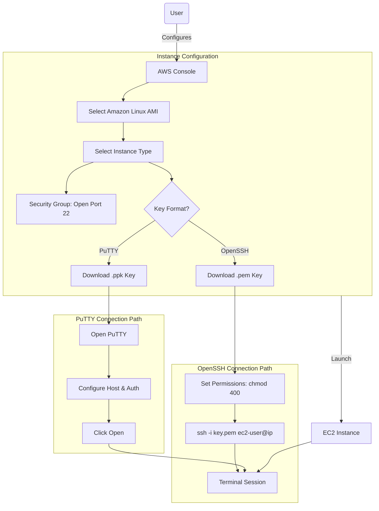

# Launch Linux EC2 Instance and SSH Connection

**Topics:** EC2, Linux, SSH, PuTTY, OpenSSH, Security Groups, Key Pairs

## Overview

This lab focuses on launching a Linux-based EC2 instance and establishing secure shell (SSH) access using cryptographic key pairs. You'll learn multiple connection methods: 
- OpenSSH client (available on Windows PowerShell, macOS, and Linux) 
- PuTTY (a popular Windows SSH client). 

By completing this lab, you'll gain hands-on experience with EC2 instance creation, security group configuration, SSH key pair formats (.pem vs .ppk), file permission requirements, and troubleshooting common connection issues.


## Key Concepts

| Concept | Description |
|---------|-------------|
| SSH (Secure Shell) | Encrypted network protocol for secure remote command-line access to Linux servers (port 22) |
| Key Pair Authentication | Public-key cryptography method where private key proves identity without transmitting passwords |
| .pem File | Privacy-Enhanced Mail format - standard for AWS private keys, used by OpenSSH clients |
| .ppk File | PuTTY Private Key format - proprietary format required by PuTTY on Windows |
| OpenSSH Client | Native SSH client included in Windows 10+, macOS, and Linux for terminal-based connections |
| PuTTY | Free SSH client for Windows with GUI interface for managing connections and keys |
| ec2-user | Default username for Amazon Linux instances (varies by AMI: ubuntu, centos, admin, etc.) |
| File Permissions (chmod 400) | Unix permission setting making key readable only by owner (required for SSH security) |
| icacls Command | Windows tool for modifying NTFS file permissions to restrict key file access |
| EC2 Instance Connect | Browser-based SSH terminal in AWS Console requiring no local key files |

## Prerequisites

- Active AWS account (Free Tier eligible)
- SSH client installed:
  - **Windows:** PowerShell (built-in on Windows 10+) or PuTTY
  - **macOS/Linux:** Terminal with OpenSSH (pre-installed)
- Basic understanding of command-line interfaces
- Text editor for viewing/editing key files (Notepad++, VSCode, nano, vim)

## Architecture Overview

::: details Click to expand Architecture Diagram

:::

## Launch Linux EC2 Instance with .pem Key (OpenSSH)

This section demonstrates launching a Linux instance and connecting via OpenSSH client (PowerShell on Windows, Terminal on macOS/Linux).

### Phase 1: Launch Linux Instance

1. Sign in to AWS Management Console.

2. Select your preferred AWS Region from the dropdown (top-right corner).
   - Choose a region close to your location for lower latency

3. Navigate to EC2 service:
   - Search for `EC2` in the console search bar
   - Click **EC2** (Virtual Servers in the Cloud)

4. Click **Launch Instance** button.

5. Configure instance name and tags:
   - **Name:** Enter descriptive name (e.g., `Linux-SSH-Demo`, `DevServer`)
   - Tags help organize and identify resources

6. Choose Amazon Machine Image (AMI):
   - Under **Application and OS Images (Amazon Machine Image)**
   - Select **Quick Start** tab
   - Choose **Amazon Linux 2023** or **Amazon Linux 2 AMI**
   - Verify "Free tier eligible" label appears

> [!NOTE] AMI Options
> Amazon Linux is optimized for EC2 and includes AWS CLI pre-installed. Alternative options include Ubuntu Server, Red Hat Enterprise Linux, or CentOS. Each has different default usernames (ubuntu, ec2-user, centos, admin).

7. Select Instance Type:
   - Under **Instance type**
   - Select **t3.micro** (Free tier eligible)
   - Specifications: 2 vCPUs, 1 GiB memory

8. Configure Key Pair for SSH authentication:
   - Under **Key pair (login)** section
   - **Option A - Create new key pair:**
     - Click **Create new key pair**
     - **Key pair name:** Enter name (e.g., `my-linux-key`)
     - **Key pair type:** RSA
     - **Private key file format:** **.pem** (for OpenSSH)
     - Click **Create key pair**
     - The .pem file downloads automatically
     - **Save this file securely** - you cannot retrieve it later!
   - **Option B - Use existing key pair:**
     - Select existing key pair from dropdown
     - Confirm you have access to the private key file

> [!IMPORTANT] Key Pair Security
> The .pem file is your only authentication method for SSH access. Store it in a secure location with restricted permissions. Loss of this file means you cannot access the instance without complex recovery procedures.

9. Configure Network Settings:
   - Under **Network settings**, click **Edit** if you want to customize
   - **VPC:** Leave default VPC selected (or select custom VPC)
   - **Subnet:** No preference (auto-assign)
   - **Auto-assign Public IP:** Enable (required for SSH access from internet)

10. Configure Security Group (firewall rules):
    - **Create security group** (if first time) or select existing
    - **Security group name:** `linux-ssh-sg` (or descriptive name)
    - **Description:** "Allow SSH access to Linux instance"
    - **Inbound security group rules:**
      - **Type:** SSH
      - **Protocol:** TCP
      - **Port range:** 22
      - **Source type:** Choose one:
        - **My IP** (Recommended) - Restricts access to your current public IP
        - **Custom** - Enter specific IP range (e.g., `203.0.113.0/24`)
        - **Anywhere (0.0.0.0/0)** - Allows access from any IP (NOT recommended)

> [!WARNING] Security Risk
> Opening SSH (port 22) to 0.0.0.0/0 exposes your instance to brute-force attacks and automated scanning. Always restrict SSH access to known IP addresses. Use "My IP" for testing, VPN, or bastion hosts for production.

11. Configure Storage:
    - **Volume 1 (Root):**
      - **Size:** 8 GiB (default for Linux)
      - **Volume type:** gp3 (General Purpose SSD) - recommended
      - **Delete on termination:** Checked (default)
    - Leave other storage settings at default

12. Expand **Advanced details** (optional configurations):
    - **User data:** Can add bash script to run at launch
    - **Termination protection:** Enable to prevent accidental deletion
    - Leave other settings at default for this lab

13. Review configuration in the **Summary** panel on the right:
    - Instance count: 1
    - AMI: Amazon Linux
    - Instance type: t3.micro
    - Key pair: Selected (.pem format)
    - Security group: SSH allowed

14. Click **Launch instance**.

15. Wait for instance launch:
    - You'll see a success message
    - Click **View all instances** to see the Instances dashboard
    - Instance **State** changes from "Pending" → "Running" (30-60 seconds)
    - **Status check** shows "2/2 checks passed" (2-3 minutes)

### Phase 2: Connect via SSH (OpenSSH Client)

**On Windows PowerShell:**

1. Locate your downloaded .pem key file (usually in Downloads folder).

2. Open PowerShell.

3. Navigate to the key file directory:
   ```powershell
   cd "C:\Users\YourUsername\Downloads"
   ```

4. Set proper file permissions (required for SSH security):
   ```powershell
   # Remove inherited permissions
   icacls .\your-key-file.pem /inheritance:r
   
   # Grant read access only to yourself (replace YourUsername)
   icacls .\your-key-file.pem /grant:r "$env:USERNAME:(R)"
   ```

> [!NOTE] icacls Command
> Windows equivalent of `chmod 400` on Linux. Removes inherited permissions and restricts read access to only your user account. SSH clients reject keys with overly permissive access for security reasons.

5. Get the instance public IP address:
   - Return to EC2 console → Instances
   - Select your instance
   - Copy the **Public IPv4 address**

6. Connect via SSH:
   ```powershell
   ssh -i .\your-key-file.pem ec2-user@<Public-IP-Address>
   ```
   - Replace `<Public-IP-Address>` with actual IP
   - Use `ec2-user` for Amazon Linux (check AMI documentation for other distributions)

7. Accept the host key fingerprint:
   - First connection shows authenticity warning
   - Type `yes` and press Enter
   - This stores the server fingerprint for future connections

8. Verify connection:
   - You should see the Amazon Linux welcome message
   - Command prompt changes to `[ec2-user@ip-xxx-xxx-xxx-xxx ~]$`

**On macOS/Linux Terminal:**

1. Open Terminal application.

2. Navigate to the directory containing your .pem file:
   ```bash
   cd ~/Downloads
   ```

3. Set proper file permissions:
   ```bash
   chmod 400 your-key-file.pem
   ```

> [!TIP] chmod 400
> Sets permissions to read-only for owner (4), no access for group (0), no access for others (0). This is a security requirement for SSH private keys.

4. Connect via SSH:
   ```bash
   ssh -i your-key-file.pem ec2-user@<Public-IP-Address>
   ```

5. Accept the host key fingerprint when prompted (type `yes`).

6. Test the connection:
   ```bash
   # Check system information
   uname -a
   
   # Update system packages
   sudo yum update -y
   
   # Check AWS CLI (pre-installed on Amazon Linux)
   aws --version
   ```

## Launch Linux EC2 Instance with .ppk Key (PuTTY)

This section demonstrates using PuTTY, a popular Windows SSH client with a graphical interface.

### Phase 1: Install PuTTY

1. Download PuTTY from the official website:
   - URL: [https://www.chiark.greenend.org.uk/~sgtatham/putty/latest.html](https://www.chiark.greenend.org.uk/~sgtatham/putty/latest.html)
   - **Important:** Only use the official site to avoid malware

2. Download the installer:
   - Under **Package files** section
   - Click **MSI ('Windows Installer')** for 64-bit: `putty-64bit-X.XX-installer.msi`

3. Run the installer:
   - Double-click the downloaded .msi file
   - Click Next → Next → Install → Finish
   - PuTTY, PuTTYgen, and Pageant are now installed

> [!TIP] Alternative
> MobaXterm is a feature-rich SSH client for Windows with built-in X11 server, tabbed sessions, and SFTP browser. Many professionals prefer it over PuTTY for daily use.

### Phase 2: Launch Instance with .ppk Key

1. Follow steps 1-5 from the "Launch Linux EC2 Instance with .pem Key" section above.

2. At the Key Pair configuration step:
   - **Key pair name:** Enter name (e.g., `my-putty-key`)
   - **Key pair type:** RSA
   - **Private key file format:** **.ppk** (for PuTTY)
   - Click **Create key pair**
   - The .ppk file downloads automatically

3. Complete steps 9-15 from the previous section to launch the instance.

### Phase 3: Connect via PuTTY

1. Wait for instance to be fully ready:
   - **Instance state:** Running
   - **Status check:** 2/2 checks passed

2. Get the instance public IP address:
   - Select your instance in EC2 console
   - Copy the **Public IPv4 address**

3. Open PuTTY application on Windows.

4. Configure the SSH connection:
   - In the **Session** category (left panel)
   - **Host Name (or IP address):** Enter `ec2-user@<Public-IP-Address>`
   - **Port:** 22
   - **Connection type:** SSH

> [!NOTE] Username Variations
> The username depends on the AMI:
> - Amazon Linux: `ec2-user`
> - Ubuntu: `ubuntu`
> - CentOS: `centos`
> - Debian: `admin`
> - Red Hat: `ec2-user` or `root`
> Check the "Connect" button instructions in AWS Console for confirmation.

5. Configure SSH authentication:
   - In the left category panel, expand: **Connection → SSH → Auth → Credentials**
   - Under **Private key file for authentication**
   - Click **Browse** button
   - Navigate to and select your downloaded .ppk file
   - Click **Open**

6. Save the session configuration (optional):
   - Return to the **Session** category
   - Under **Saved Sessions**, enter a name (e.g., `My-Linux-Server`)
   - Click **Save**
   - Future connections: Load the saved session and click Open

7. Initiate the connection:
   - Click **Open** button
   - PuTTY opens a terminal window

8. Accept the server host key:
   - First connection shows a security alert about the server's host key
   - Click **Accept** to store the key and continue
   - This is normal for first-time connections

9. Verify connection:
   - You should see the Amazon Linux banner
   - Command prompt appears: `[ec2-user@ip-xxx-xxx-xxx-xxx ~]$`

10. Test basic commands:
    ```bash
    # System information
    uname -a
    
    # Current user
    whoami
    
    # Disk space
    df -h
    
    # Update packages
    sudo yum update -y
    ```

## Alternative: EC2 Instance Connect (Browser-Based)

AWS provides a browser-based SSH terminal requiring no local key files or SSH clients.

1. In EC2 console, select your running instance.

2. Click **Connect** button (top-right).

3. Navigate to **EC2 Instance Connect** tab.

4. Verify the username (usually `ec2-user` for Amazon Linux).

5. Click **Connect** button.

6. A new browser tab opens with a terminal session.
   - No .pem or .ppk files needed
   - AWS temporarily injects a public key for the session
   - Session ends when you close the browser tab

> [!IMPORTANT] EC2 Instance Connect Requirements
> - Only works with Amazon Linux 2, Amazon Linux 2023, Ubuntu 16.04+
> - Requires security group allowing SSH (port 22) from AWS IP ranges
> - Instance must have ec2-instance-connect package installed
> - Does not work for all AMIs (Windows, some custom AMIs)

## Troubleshooting Common SSH Issues

### Permission Denied Error (Windows)

**Problem:** `WARNING: UNPROTECTED PRIVATE KEY FILE!` or `Permission denied (publickey)`

**Solution:** Fix file permissions using icacls:
```powershell
# Remove inherited permissions
icacls .\your-key.pem /inheritance:r

# Grant read access only to yourself
icacls .\your-key.pem /grant:r "$env:USERNAME:(R)"
```

### Permission Denied Error (Linux/macOS)

**Problem:** `WARNING: UNPROTECTED PRIVATE KEY FILE!`

**Solution:** Set proper permissions:
```bash
chmod 400 your-key.pem
```

### Connection Timeout

**Problem:** SSH hangs or times out

**Possible Causes:**
- Security group doesn't allow SSH (port 22) from your IP
- Instance doesn't have public IP assigned
- Network firewall blocking outbound SSH
- Instance stopped or terminated

**Solution:**
- Verify security group inbound rules include SSH (port 22)
- Check instance has public IP in EC2 console
- Try from different network (mobile hotspot to test)
- Confirm instance state is "Running"

### Wrong Username

**Problem:** `Permission denied (publickey)` despite correct key

**Solution:** Verify username for your AMI:
- Amazon Linux: `ec2-user`
- Ubuntu: `ubuntu`
- CentOS: `centos`
- Debian: `admin`
- Check AWS Console → Connect button for username guidance

### Host Key Verification Failed

**Problem:** `WARNING: REMOTE HOST IDENTIFICATION HAS CHANGED!`

**Cause:** Instance was terminated and new instance launched with same IP (different host key)

**Solution:** Remove old host key:
```bash
# Linux/macOS
ssh-keygen -R <Public-IP-Address>

# Windows PowerShell
Remove-Item "$env:USERPROFILE\.ssh\known_hosts" -Force
```

## Validation

Verify successful completion:

- **Instance Launch:**
  - Instance appears in EC2 Instances dashboard
  - Instance state shows "Running"
  - Status checks show "2/2 checks passed"
  - Public IP address assigned

- **Security Configuration:**
  - Security group attached to instance
  - SSH (port 22) rule present in security group
  - Key pair associated with instance

- **SSH Connection (OpenSSH):**
  - Successfully connected using `ssh -i key.pem ec2-user@ip`
  - Can execute commands with ec2-user privileges
  - Can elevate privileges with `sudo` (no password required)

- **SSH Connection (PuTTY):**
  - Successfully connected using .ppk key file
  - PuTTY terminal displays Amazon Linux banner
  - Can execute commands and use sudo

- **Command Execution:**
  - `uname -a` displays Linux kernel information
  - `sudo yum update -y` executes without errors
  - `aws --version` shows AWS CLI is installed
  - Can create files, install packages, manage services

## Cost Considerations

- **EC2 Instance (t3.micro):**
  - **Free Tier:** 750 hours/month for first 12 months (covers 1 instance running 24/7)
  - **After Free Tier:** ~$0.0104/hour = ~$7.50/month (us-east-1 pricing)
  - **Stopped instances:** No compute charges, but EBS storage still charged

- **EBS Storage (8 GB gp3):**
  - **Free Tier:** 30 GB for first 12 months
  - **After Free Tier:** $0.08/GB-month = $0.64/month

- **Data Transfer:**
  - **Inbound:** Free
  - **Outbound to internet:** First 100 GB/month free, then $0.09/GB
  - **SSH sessions:** Minimal data transfer (~1-5 MB/hour)

- **Elastic IP (if allocated):**
  - Free while instance is running with it attached
  - $0.005/hour if instance is stopped or IP is unattached


## Cleanup

To avoid ongoing charges:

1. **Exit SSH session:**
   ```bash
   exit
   ```
   - Or close PuTTY window

2. **Stop the instance (temporary, if you need it later):**
   - Go to EC2 → Instances
   - Select your instance
   - Click **Instance state** → **Stop instance**
   - Confirm by clicking **Stop**
   - **Result:** Compute charges stop, EBS storage charges continue

3. **Terminate the instance (permanent deletion):**
   - Select your instance
   - Click **Instance state** → **Terminate instance**
   - Type "terminate" in the confirmation dialog
   - Click **Terminate**
   - **Result:** All charges stop, data is permanently deleted

4. **Delete the key pair (optional):**
   - Go to EC2 → Network & Security → Key Pairs
   - Select your key pair
   - Click **Actions** → **Delete**
   - Confirm deletion
   - Delete the local .pem or .ppk file from your computer

5. **Delete the security group (optional):**
   - Go to EC2 → Network & Security → Security Groups
   - Select your SSH security group
   - Click **Actions** → **Delete security group**
   - Confirm deletion
   - **Note:** Cannot delete if still attached to running instances

> [!IMPORTANT] Data Loss
> Terminating an instance permanently deletes all data on the root volume. Ensure you've backed up any important files before termination. For production instances, enable "Termination Protection" and take EBS snapshots.

## Result

You have successfully launched an Amazon EC2 Linux instance and established secure SSH connections using multiple methods: OpenSSH client (PowerShell/Terminal) and PuTTY.

SSH access enables you to install software, configure services, deploy applications, manage databases, and perform system administration tasks on cloud servers. The ability to work with both .pem and .ppk key formats ensures flexibility across different tools and environments.

