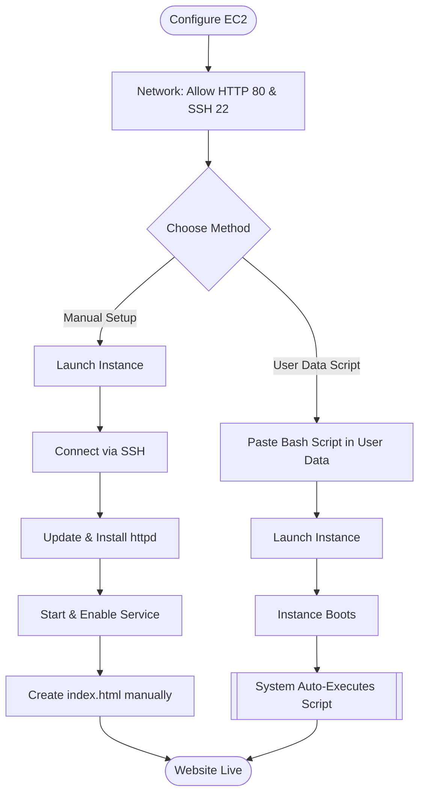

# Host Static Website on EC2 with Apache

**Topics:** EC2, Apache HTTP Server, httpd, User Data Automation, Static Website Hosting

## Overview

Amazon EC2 instances start as bare virtual machines without pre-installed application software. To host a website, you must install and configure a web server. Apache HTTP Server (httpd) is the world's most popular open-source web server, powering millions of websites globally. It serves static content (HTML, CSS, JavaScript, images) and can be configured for dynamic content through modules.

This lab demonstrates two fundamental approaches to deploying web applications on EC2: manual installation (SSH-based configuration) and automated deployment using User Data scripts. 

## Key Concepts

| Concept | Description |
|---------|-------------|
| Apache HTTP Server (httpd) | Open-source web server software that listens on port 80/443 and serves web content to browsers |
| httpd | HTTP Daemon - the service name for Apache on Red Hat-based Linux distributions (Amazon Linux, CentOS) |
| Document Root | Directory where web server looks for files to serve (default: /var/www/html on Amazon Linux) |
| systemd | Linux system and service manager for starting, stopping, enabling services (systemctl command) |
| yum Package Manager | Yellowdog Updater Modified - package manager for Red Hat-based systems to install/update software |
| User Data Script | Bash script executed automatically at instance first boot for configuration automation |
| Shebang (#!/bin/bash) | First line of script specifying the interpreter, required for User Data scripts to execute |
| Port 80 (HTTP) | Standard TCP port for unencrypted web traffic (Hypertext Transfer Protocol) |
| Security Group | Virtual firewall controlling inbound/outbound traffic; must allow port 80 for web access |
| cloud-init | AWS service that processes User Data scripts during instance initialization |

### Prerequisites

- Active AWS account (Free Tier eligible)
- Completed Lab 6 (SSH connection to Linux EC2)
- Basic understanding of Linux command-line operations
- SSH client installed (PowerShell, Terminal, or PuTTY)
- Text editor knowledge (nano or vim) for manual method
- Basic HTML knowledge (optional, for customizing web content)

## Architecture Overview

::: details Click to expand Architecture Diagram

:::

## Method 1: Manual Installation of Apache Web Server

This method provides hands-on experience with Linux system administration by manually configuring each component.

### Phase 1: Launch EC2 Instance

1. Sign in to AWS Management Console.

2. Navigate to EC2 service → Click **Launch Instance**.

3. Configure instance details:
   - **Name:** `MyApacheServer` (or descriptive name)
   - **AMI:** Amazon Linux 2 AMI (Free tier eligible)
   - **Instance type:** t3.micro (Free tier eligible)

4. Create or select key pair:
   - **Key pair:** Create new or select existing
   - **Format:** .pem (for SSH access)
   - Download and save securely

5. Configure Network Settings:
   - Click **Edit** under Network settings
   - **Firewall (security groups):** Create security group or select existing
   - **Security group name:** `apache-web-sg`
   - **Description:** "Allow SSH and HTTP traffic"

6. Add inbound security group rules:
   - **Rule 1:**
     - **Type:** SSH
     - **Protocol:** TCP
     - **Port:** 22
     - **Source:** My IP (recommended for security)
   
   - **Rule 2:**
     - **Type:** HTTP
     - **Protocol:** TCP
     - **Port:** 80
     - **Source:** 0.0.0.0/0 (Anywhere - required for public website access)

> [!IMPORTANT] Port 80 Requirement
> Unlike SSH (which should be restricted), HTTP port 80 must be open to 0.0.0.0/0 (anywhere) to allow public access to your website. This is standard for web servers accessible from the internet.

7. Configure Storage:
   - **Size:** 8 GiB (default)
   - **Volume type:** gp3 (General Purpose SSD)
   - Leave other settings at default

8. Click **Launch instance**.

9. Wait for instance to be ready:
   - **Instance state:** Running
   - **Status check:** 2/2 checks passed
   - Note the **Public IPv4 address**

### Phase 2: Connect via SSH

1. Open PowerShell (Windows) or Terminal (macOS/Linux).

2. Navigate to your key file location:
   ```bash
   cd ~/Downloads  # macOS/Linux
   
   cd "C:UsersYourNameDownloads"  # Windows
   ```

3. Set proper key permissions:
   ```bash
   # Linux/macOS
   chmod 400 your-key-file.pem
   
   # Windows PowerShell
   icacls .your-key-file.pem /inheritance:r
   icacls .your-key-file.pem /grant:r "$env:USERNAME:(R)"
   ```

4. Connect to instance:
   ```bash
   ssh -i your-key-file.pem ec2-user@<Public-IP-Address>
   ```

5. Type `yes` when prompted to accept the host key.

### Phase 3: Install Apache Web Server

1. Update system packages (recommended before installing software):
   ```bash
   sudo yum update -y
   ```

> [!NOTE] sudo command
> `sudo` (superuser do) temporarily elevates privileges to root for administrative tasks. The ec2-user has passwordless sudo access on Amazon Linux instances.

2. Install Apache HTTP Server:
   ```bash
   sudo yum install httpd -y
   ```
   - `httpd` is the package name for Apache on Red Hat-based systems
   - `-y` flag automatically answers "yes" to installation prompts

3. Start the Apache service:
   ```bash
   sudo systemctl start httpd
   ```

4. Enable Apache to start automatically on system boot:
   ```bash
   sudo systemctl enable httpd
   ```

> [!TIP] systemctl vs service
> `systemctl` is the modern systemd command. Older tutorials may show `service httpd start` (legacy command). Both work, but systemctl is preferred on modern Linux distributions.

5. Verify Apache is running:
   ```bash
   sudo systemctl status httpd
   ```
   - Look for "active (running)" in green text
   - Press `q` to exit the status view

6. Test Apache from browser:
   - Copy your instance's Public IPv4 address
   - Open web browser
   - Navigate to: `http://<Public-IP-Address>`
   - You should see the **Apache Test Page**

> [!NOTE] Apache Test Page
> The default page confirms Apache is running but no custom content exists yet. The page is generated from `/usr/share/httpd/noindex/index.html` when `/var/www/html/index.html` doesn't exist.

### Phase 4: Create Custom Website Content

1. Navigate to the web document root:
   ```bash
   cd /var/www/html
   ```

2. Create a new index.html file:
   ```bash
   sudo nano index.html
   ```
   - `nano` is a simple text editor (alternative: `vim`)
   - `sudo` required because /var/www/html is owned by root

3. Add HTML content (paste this code):
   ```html
   <!DOCTYPE html>
   <html>
   <head>
       <title>Welcome to My Website</title>
   </head>
   <body style="text-align:center; background-color: #f0f0f0; font-family: Arial, sans-serif; padding: 50px;">
       <h1 style="color: #333;">Hello from Apache on AWS EC2!</h1>
       <p style="font-size: 18px;">This is a static website hosted on Apache web server.</p>
       <p style="color: #666;">Deployed manually using SSH and systemctl commands.</p>
   </body>
   </html>
   ```

4. Save and exit nano:
   - Press `Ctrl + O` (write out)
   - Press `Enter` (confirm filename)
   - Press `Ctrl + X` (exit)

5. Verify file creation:
   ```bash
   ls -la /var/www/html
   cat /var/www/html/index.html
   ```

6. Restart Apache to ensure changes are loaded:
   ```bash
   sudo systemctl restart httpd
   ```

7. View your website:
   - Refresh your browser: `http://<Public-IP-Address>`
   - You should now see your custom HTML page instead of the Apache Test Page

> [!TIP] File Permissions
> Apache runs as user `apache` (group `apache`). If you encounter permission errors, set appropriate ownership: `sudo chown apache:apache /var/www/html/index.html` or `sudo chmod 644 /var/www/html/index.html`.

## Method 2: User Data Script Automation

This method automates the entire Apache installation and website deployment using a bash script executed during instance first boot.

### Understanding User Data Scripts

User Data scripts run automatically when an EC2 instance launches for the **first time only**. The cloud-init service executes the script as root user during the boot process, before the instance becomes available for SSH connection.

**Key Requirements:**
- First line must be `#!/bin/bash` (shebang)
- Runs only on first boot (not on subsequent reboots)
- Executes as root (no `sudo` needed in commands)
- Must be provided during instance launch (cannot add later)
- Execution logs available in `/var/log/cloud-init-output.log`

> [!WARNING] One-Time Execution
> User Data scripts execute only during the first boot. If you stop/start the instance, the script does not re-run. To re-execute User Data, you must terminate and launch a new instance. For repeated execution, use cron jobs or AWS Systems Manager Run Command.

### Phase 1: Prepare User Data Script

Copy this bash script (you'll paste it during instance launch):

```bash
#!/bin/bash
# Update all system packages
yum update -y

# Install Apache Web Server
yum install -y httpd

# Start Apache service
systemctl start httpd

# Enable Apache to start on boot
systemctl enable httpd

# Create custom website content
echo "<html>
<head><title>Welcome to My Auto Web Server</title></head>
<body style='text-align:center; background-color:#e9f5ff; font-family: Arial; padding: 50px;'>
<h1 style='color: #0066cc;'>Welcome to EC2 Instance</h1>
<h2 style='color: #333;'>Apache Installed Automatically via User Data Script</h2>
<p style='font-size: 18px;'>This is a static website hosted on EC2 using User Data automation.</p>
<p style='color: #666;'>No manual SSH configuration required!</p>
</body>
</html>" > /var/www/html/index.html
```

> [!NOTE] Root Privileges
> User Data scripts run as root, so `sudo` is not required. Commands like `yum install` and `systemctl` execute with full administrative privileges automatically.

### Phase 2: Launch Instance with User Data

1. Sign in to AWS Management Console.
   - Perform all steps from Phase 1 till security group and storage.

2. Expand **Advanced details** section (at bottom):
   - Scroll down to **User data** text box
   - Paste the entire bash script from Phase 1 above
   - **Ensure the first line is `#!/bin/bash`**

3. Review configuration in Summary panel:
   - Instance type: t3.micro
   - Security group: HTTP (80) allowed
   - User data: Present (shown as "Specified")

4. Click **Launch instance** and  Wait for instance to be ready:
    - Instance state: Running (1-2 minutes)
    - Status checks: 2/2 checks passed (2-3 minutes)
    - User Data execution: Additional 1-2 minutes


### Phase 3: Verify Automated Deployment

1. Get the Public IPv4 address from EC2 console.

2. Open web browser and navigate to:
   ```
   http://<Public-IP-Address>
   ```

3. Verify your custom website appears immediately.
   - No SSH required
   - No manual configuration needed
   - Website operational within minutes of launch

> [!WARNING] Public IP Changes
> If you stop and start an instance, the Public IP address changes, breaking your website URL. For production websites, allocate an Elastic IP (static IP) or use a domain name with Route 53 DNS service.


::: details Click to expand Troubleshooting Tips
If website doesn't appear, SSH to instance and check logs:
```bash
ssh -i your-key.pem ec2-user@<Public-IP>

# Check User Data execution log
sudo cat /var/log/cloud-init-output.log

# Check Apache status
sudo systemctl status httpd

# Check if index.html was created
ls -la /var/www/html/
```

> [!NOTE] Log File Location
> `/var/log/cloud-init-output.log` contains the complete output of User Data script execution, including any error messages. This is the first place to check when troubleshooting User Data issues.
:::


### Validation

::: details Click to expand

Verify successful completion:

- **Instance Launch:**
  - Instance state shows "Running"
  - Status checks: 2/2 checks passed
  - Public IP address assigned

- **Security Group Configuration:**
  - Inbound rule for HTTP (port 80) from 0.0.0.0/0
  - Inbound rule for SSH (port 22) from My IP (manual method)

- **Apache Installation:**
  - `sudo systemctl status httpd` shows "active (running)"
  - Service enabled for boot: `sudo systemctl is-enabled httpd` returns "enabled"

- **Website Accessibility:**
  - Browser displays custom HTML page at `http://<Public-IP>`
  - No connection timeout or Apache Test Page
  - HTML content matches what you created/scripted

- **File System:**
  - `/var/www/html/index.html` exists with correct content
  - File readable by Apache: `ls -la /var/www/html/index.html`
:::

### Cost Considerations

::: details Click to expand
- **EC2 Instance (t3.micro):**
  - **Free Tier:** 750 hours/month for first 12 months
  - **After Free Tier:** ~$0.0104/hour = ~$7.50/month (us-east-1)

- **EBS Storage (8 GB gp3):**
  - **Free Tier:** 30 GB for first 12 months
  - **After Free Tier:** $0.08/GB-month = $0.64/month

- **Data Transfer:**
  - **Inbound:** Free
  - **Outbound:** First 100 GB/month free, then $0.09/GB
  - **Web traffic:** Typical static website uses minimal bandwidth (<1 GB/month for low traffic)

- **Elastic IP (if allocated):**
  - Free while associated with running instance
  - $0.005/hour if unattached or instance stopped
:::

### Cleanup
::: details Click to expand
To avoid ongoing charges:

1. **Exit SSH session** (if connected):
   ```bash
   exit
   ```
2. **Terminate the instance:**
   - Go to EC2 → Instances
   - Select your instance
   - Click **Instance state** → **Terminate instance**
   - Confirm termination
   - **Result:** All charges stop, data deleted permanently

3. **Delete security group** (optional):
   - Go to EC2 → Security Groups
   - Select your security group
   - Click **Actions** → **Delete security group**
   - Confirm deletion

4. **Delete key pair** (optional):
   - Go to EC2 → Key Pairs
   - Select your key pair
   - Click **Actions** → **Delete**
   - Delete local .pem file from your computer
:::

## Result

You have successfully deployed a static website on Amazon EC2 using Apache HTTP Server through two methods: manual SSH-based installation and automated User Data scripts. You now understand the fundamentals of web server deployment, Linux package management, systemd service control, and infrastructure automation.

::: details Quick Start Guide
### Quick Start Guide
1. Launch EC2 instance with Amazon Linux 2 AMI and t3.micro type.
2. Create security group allowing SSH (22) and HTTP (80) inbound traffic.
3. Connect via SSH using your key pair.
4. For Manual Method:
   - Update packages: `sudo yum update -y`
   - Install Apache: `sudo yum install httpd -y`
   - Start and enable Apache: `sudo systemctl start httpd` and `sudo systemctl enable httpd`
   - Create custom `index.html` in `/var/www/html/`.
5. For User Data Method:
   - Prepare bash script with Apache installation and HTML content.
   - Paste script in User Data section during instance launch.
   - Launch instance and wait for it to initialize.
6. Access website via browser using Public IP address.
:::
