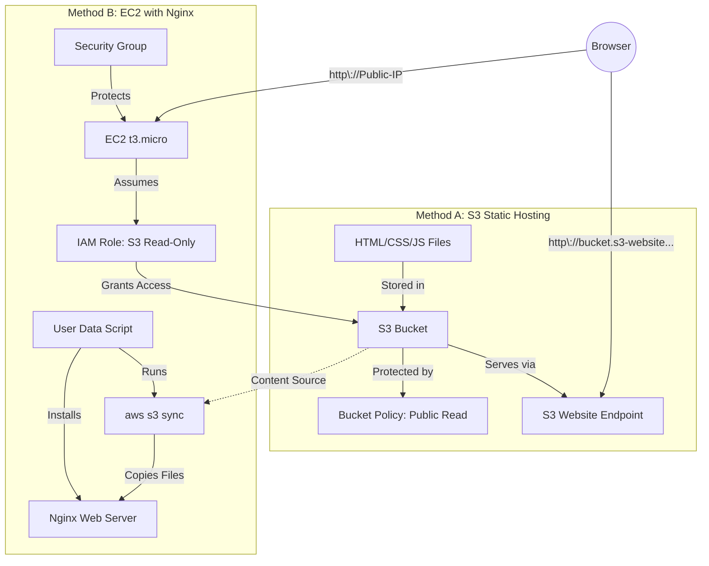

# Mini Project: S3 and EC2 Static Website Integration

**Topics:** S3, EC2, Nginx, IAM Roles, Static Hosting, AWS CLI, Automation

## Overview

This project integrates multiple AWS services: S3, EC2, IAM, and security groups to create a complete, production-ready deployment workflow.

This mini project demonstrates two distinct approaches to hosting static websites on AWS:  hosting and server-based EC2 with Nginx. 
- Method A :  Serves files directly from S3 using static website hosting (low-cost, highly scalable, serverless).
- Method B : Deploys an EC2 instance with Nginx that automatically syncs content from S3 using IAM roles and AWS CLI, demonstrating how to build scalable web servers with automated content delivery.

## Key Concepts

| Concept | Description |
|---------|-------------|
| S3 Static Website Hosting | Serverless method to serve static HTML/CSS/JS files directly from S3 bucket using HTTP endpoint |
| Nginx | High-performance web server and reverse proxy (alternative to Apache, known for efficiency) |
| IAM Role | AWS identity with permissions policies, attachable to EC2 instances for service-to-service authentication |
| AWS CLI | Command-line tool for interacting with AWS services (pre-installed on Amazon Linux) |
| aws s3 sync | CLI command that synchronizes directories between local filesystem and S3, copying only changed files |
| Bucket Policy | JSON document defining public or restricted access to S3 bucket objects |
| Document Root (Nginx) | /usr/share/nginx/html - directory where Nginx serves files (different from Apache's /var/www/html) |
| S3 Endpoint URL | Public HTTP URL for S3-hosted website (format: bucket-name.s3-website-region.amazonaws.com) |
| Least Privilege | IAM best practice of granting only minimum permissions needed (read-only S3 access for this project) |
| Hybrid Architecture | Combining multiple hosting methods for flexibility, redundancy, or specific use cases |

### Prerequisites

- Active AWS account (Free Tier eligible)
- Completed Lab 3 (S3 basics) and Lab 6 (EC2 SSH)
- Basic HTML, CSS, JavaScript files for website (or use provided sample)
- Understanding of Linux commands and file permissions
- SSH client for EC2 access
- Basic understanding of JSON for bucket policies and IAM roles

## Architecture Overview

::: details Click to expand Architecture Diagram

:::

## Project Setup Overview

This project consists of three main phases:

1. **S3 Configuration:** Create bucket, upload files, configure static hosting, set public access policy
2. **IAM Role Creation:** Create role allowing EC2 instances to read from S3 without credentials
3. **EC2 Deployment:** Launch instance with User Data script that automatically installs Nginx and syncs content from S3

## Phase 1: S3 Static Website Hosting

This phase creates the centralized content repository and direct static hosting.

### Create and Configure S3 Bucket

1. Sign in to AWS Management Console. 
  - Navigate to S3 service.
  - Click **Create bucket**.

2. Configure bucket settings:
   - **Bucket name:** Enter globally unique name (e.g., `my-static-website-2024`, `yourname-web-project`)
   - **Region:** Select region closest to your location (e.g., us-east-1, ap-south-1)

1. Configure public access settings:
   - **Uncheck** "Block all public access"
   - **Warning:** Acknowledge that you understand the bucket will be public

> [!WARNING] Security Consideration
> This bucket will be publicly accessible for website hosting. Use separate private buckets for sensitive content.
> Never store sensitive data, credentials, or private information in publicly accessible S3 buckets. 

6. Leave other settings at default:
   - Bucket Versioning: Disabled
   - Tags: Optional
   - Default encryption: Enabled (recommended)

7. Click **Create bucket**.

### Upload Website Files

1. Prepare your website files:
	```
	my-website/
	├── index.html
	├── about.html
	├── contact.html
	└── error.html
	```

::: details Click to expand HTML file examples
::: code-group
```html [index.html]
<!DOCTYPE html>
<html lang="en">
<head>
    <meta charset="UTF-8">
    <meta name="viewport" content="width=device-width, initial-scale=1.0">
    <title>My Static Website</title>
</head>
<body>
    <header>
        <h1>Welcome to My Static Website</h1>
        <nav>
            <a href="index.html">Home</a> |
            <a href="about.html">About</a> |
            <a href="contact.html">Contact</a>
        </nav>
    </header>
    <main>
        <p>This is a simple static website hosted on Amazon S3.</p>
        <p>Learn more about our services on the About page.</p>
    </main>
    <footer>
        <p>&copy; 2026 My Static Website</p>
    </footer>
</body>
</html>
```

```html [about.html]
<!DOCTYPE html>
<html lang="en">
<head>
    <meta charset="UTF-8">
    <meta name="viewport" content="width=device-width, initial-scale=1.0">
    <title>About - My Static Website</title>
</head>
<body>
    <header>
        <h1>About Us</h1>
        <nav>
            <a href="index.html">Home</a> |
            <a href="about.html">About</a> |
            <a href="contact.html">Contact</a>
        </nav>
    </header>
    <main>
        <p>This website demonstrates Amazon S3 static website hosting capabilities.</p>
        <p>S3 provides a cost-effective way to host static content without managing servers.</p>
    </main>
    <footer>
        <p>&copy; 2026 My Static Website</p>
    </footer>
</body>
</html>
```

```html [contact.html]
<!DOCTYPE html>
<html lang="en">
<head>
    <meta charset="UTF-8">
    <meta name="viewport" content="width=device-width, initial-scale=1.0">
    <title>Contact - My Static Website</title>
</head>
<body>
    <header>
        <h1>Contact Us</h1>
        <nav>
            <a href="index.html">Home</a> |
            <a href="about.html">About</a> |
            <a href="contact.html">Contact</a>
        </nav>
    </header>
    <main>
        <p>Get in touch with us!</p>
        <p>Email: info@mywebsite.com</p>
        <p>Phone: (555) 123-4567</p>
        <p>This is a static page - for dynamic forms, consider using additional AWS services.</p>
    </main>
    <footer>
        <p>&copy; 2026 My Static Website</p>
    </footer>
</body>
</html>
```

```html [error.html]
<!DOCTYPE html>
<html lang="en">
<head>
    <meta charset="UTF-8">
    <meta name="viewport" content="width=device-width, initial-scale=1.0">
    <title>Page Not Found</title>
</head>
<body>
    <header>
        <h1>404 - Page Not Found</h1>
        <nav>
            <a href="index.html">Home</a> |
            <a href="about.html">About</a> |
            <a href="contact.html">Contact</a>
        </nav>
    </header>
    <main>
        <p>Sorry, the page you're looking for doesn't exist.</p>
        <p>Please check the URL or return to the home page.</p>
    </main>
    <footer>
        <p>&copy; 2026 My Static Website</p>
    </footer>
</body>
</html>
```

:::

2. In S3 console, click your bucket name to open it.

3. Click **Upload** button.

4. Add files:
   - Click **Add files** or drag and drop
   - Select all your website files
   - Click **Upload**

5. Wait for upload to complete:
   - Monitor upload progress
   - Verify all files appear in bucket

> [!TIP] Using AWS CLI for Upload
> For faster uploads of many files, use AWS CLI: 
> `aws s3 sync ./local-folder s3://your-bucket-name/ --acl public-read`. 
> This is much faster than console upload for projects with hundreds of files.

### Enable Static Website Hosting

1. In your bucket, click the **Properties** tab.

2. Scroll down to **Static website hosting** section.

3. Click **Edit**.

4. Configure static hosting:
   - **Static website hosting:** Enable
   - **Hosting type:** Host a static website
   - **Index document:** `index.html`
   - **Error document:** `error.html`

5. Click **Save changes**.

6. Note the **Bucket website endpoint** URL:
   - Format: `http://bucket-name.s3-website-region.amazonaws.com`
   - Save this URL for testing later

### Add Bucket Policy for Public Access

S3 objects are private by default. You must add a bucket policy to allow public read access.

1. In your bucket, click the **Permissions** tab.
2. Scroll to **Bucket policy** section.
3. Click **Edit**.
4. Paste this JSON policy (replace `BUCKET_NAME` with your actual bucket name):

```json
{
    "Version": "2012-10-17",
    "Statement": [
        {
            "Sid": "PublicReadGetObject",
            "Effect": "Allow",
            "Principal": "*",
            "Action": "s3:GetObject",
            "Resource": "arn:aws:s3:::BUCKET_NAME/*"
        }
    ]
}
```

> [!IMPORTANT] Replace BUCKET_NAME
> You must replace `BUCKET_NAME` with your actual bucket name (without `s3://` prefix). 
> if your bucket is `my-website-2024`, the Resource line should be 
> `"arn:aws:s3:::my-website-2024/*"`.

5. Click **Save changes**.

6. Verify policy is active:
   - Should see message: "Publicly accessible"
   - Warning icon indicates public access (expected for websites)

### Test S3 Static Website

1. Open the Bucket website endpoint URL in a browser:
   ```
   http://your-bucket-name.s3-website-region.amazonaws.com
   ```

2. Verify your website displays correctly:
   - index.html loads
   - CSS styling applied (if you have CSS)
   - Links to other pages work
   - Images display (if any)

3. Test error handling:
   - Navigate to non-existent page: `http://...com/nonexistent.html`
   - Should display your error page or index.html

> [!NOTE] S3 Website Endpoint vs Object URL
> Always use the website endpoint for hosting.
> The S3 website endpoint (`.s3-website-`) supports index documents and error pages. 
> Direct object URLs (`.s3.amazonaws.com/index.html`) download files instead of displaying them in browser. 

## Phase 2: Create IAM Role for EC2

This phase creates a role allowing EC2 instances to access S3 without embedded credentials.

### Understanding IAM Roles

IAM roles provide temporary security credentials to services (like EC2) to access other AWS services (like S3). Roles are more secure than embedding access keys in code or User Data scripts.

**Benefits:**
- No hard-coded credentials in scripts
- Automatic credential rotation
- Follows AWS security best practices
- Audit trail in CloudTrail

### Create IAM Role

1. Navigate to IAM service in AWS Console.

2. Click **Roles** in left navigation.

3. Click **Create role** button.

4. Select trusted entity type:
   - **Trusted entity type:** AWS service
   - **Use case:** EC2
   - **Use case description:** Allows EC2 instances to call AWS services on your behalf

5. Click **Next**.

6. Attach permissions policy:
   - **Search:** Type "S3"
   - **Select:** Find and check `AmazonS3ReadOnlyAccess` (managed policy)
   - **Permissions:** This policy allows read operations on all S3 buckets

> [!NOTE] Least Privilege Alternative
> For production, create a custom policy granting read access only to your specific bucket: 
> ```json
> {"Effect": "Allow", 
>  "Action": ["s3:GetObject", "s3:ListBucket"], 
>  "Resource": [
>     "arn:aws:s3:::your-bucket-name/*", 
>     "arn:aws:s3:::your-bucket-name"]}`.
> ```

7. Click **Next**.

8. Configure role details:
   - **Role name:** `ec2-s3-read-role` (or descriptive name)
   - **Description:** "Allows EC2 instances to read from S3 buckets"
   - **Tags:** Optional (e.g., Project: StaticWebsite)

9. Click **Create role**.

10. Verify role creation:
    - Role appears in Roles list
    - Trust relationship shows EC2 service
    - Permissions show S3 read-only access

## Phase 3: Launch EC2 Instance with Nginx

This phase deploys an EC2 instance that automatically installs Nginx and syncs content from S3.

### Prepare User Data Script

This script runs automatically at first boot, installing Nginx and syncing website files.

::: details Click to expand Data Script
```bash
#!/bin/bash
set -e

# Configuration - UPDATE THESE VALUES
BUCKET="your-bucket-name"    # Replace with your actual bucket name
REGION="us-east-1"           # Replace with your bucket's region

yum update -y
# Install Nginx and AWS CLI
yum install -y nginx

# Start and enable Nginx
systemctl enable nginx
systemctl start nginx

# Create document root if it doesn't exist
mkdir -p /usr/share/nginx/html

# Sync website files from S3 (uses instance's IAM role for authentication)
aws s3 sync s3://$BUCKET /usr/share/nginx/html --region $REGION --delete

# Set proper ownership
chown -R nginx:nginx /usr/share/nginx/html

# Restart Nginx to ensure configuration is loaded
systemctl restart nginx

# Log completion
echo "Website synced from s3://$BUCKET to /usr/share/nginx/html" >> /var/log/user-data.log
```
:::

> [!IMPORTANT] Update Script Variables
> Before using this script, replace `your-bucket-name` with your actual S3 bucket name and `us-east-1` with your bucket's region.

### Launch EC2 Instance

1. Navigate to EC2 service → Click **Launch Instance**.

2. Configure instance:
   - **Name:** `NginxWebServer` (or descriptive name)
   - **AMI:** Amazon Linux 2 AMI (Free tier eligible)
   - **Instance type:** t3.micro (Free tier eligible)

3. Key pair:
   - Select existing key pair or create new
   - **Format:** .pem (for SSH troubleshooting)

4. Network settings:
   - **VPC:** Default VPC
   - **Auto-assign Public IP:** Enable
   - **Firewall (security group):** Create security group

5. Configure security group rules:
   - **Rule 1 - HTTP:**
     - **Type:** HTTP
     - **Protocol:** TCP
     - **Port:** 80
     - **Source:** 0.0.0.0/0 (Anywhere - required for public access)
   
   - **Rule 2 - SSH (optional):**
     - **Type:** SSH
     - **Protocol:** TCP
     - **Port:** 22
     - **Source:** My IP (for troubleshooting only)

6. Storage:
   - **Size:** 8 GiB (default)
   - **Volume type:** gp3

7. **Advanced details** (critical step):
   - Scroll to **IAM instance profile**
   - **Select:** `ec2-s3-read-role` (the role you created earlier)
   - **User data:** Paste the complete bash script from above
   - **Ensure:** First line is `#!/bin/bash`
   - **Update:** Replace BUCKET and REGION values in the script

> [!WARNING] IAM Role Requirement
> If you don't attach the IAM role, the `aws s3 sync` command will fail with "Unable to locate credentials" error. The role provides authentication for AWS CLI commands.

8. Review configuration:
   - IAM role: ec2-s3-read-role
   - Security group: Port 80 open
   - User data: Present

9. Click **Launch instance**.

10. Wait for instance to be ready:
    - **Instance state:** Running (1-2 minutes)
    - **Status check:** 2/2 checks passed (2-3 minutes)
    - **User Data execution:** Additional 2-3 minutes


### Verify EC2 Deployment

1. Get the Public IPv4 address from EC2 console.

2. Test the website in browser:
   ```
   http://<Public-IP-Address>
   ```

3. Verify:
   - Website displays (same content as S3 version)
   - All pages accessible
   - Files were synced from S3 successfully

::: details Click to expand SSH Verification Steps
```bash
# Connect and check logs
# Fix key permissions and connect
chmod 400 your-key.pem
ssh -i your-key.pem ec2-user@<Public-IP>

# Check User Data execution log
sudo cat /var/log/cloud-init-output.log

# Verify Nginx status
sudo systemctl status nginx

# List synced files
ls -la /usr/share/nginx/html/

# Check AWS CLI can access S3 (should list buckets)
aws s3 ls
```
:::

## Comparison: S3 vs EC2 Hosting

| Aspect              | S3 Static Hosting                        | EC2 with Nginx                                      |
| ------------------- | ---------------------------------------- | --------------------------------------------------- |
| **Scalability**     | Automatic, unlimited                     | Manual scaling, instance limits                     |
| **Availability**    | 99.99% SLA, multi-AZ                     | Single instance (99.5%), requires setup for HA      |
| **Maintenance**     | Zero - fully managed                     | OS patching, Nginx updates, monitoring              |
| **SSL/HTTPS**       | Requires CloudFront                      | Configure directly with Let's Encrypt               |
| **Dynamic Content** | Not supported                            | Supports server-side processing (PHP, Python, etc.) |
| **Best For**        | Pure static sites, SPAs, low traffic     | Dynamic sites, APIs, custom configurations          |
| **Setup Time**      | 5 minutes                                | 10-15 minutes                                       |

### Validation

::: details Validation

Verify successful completion:

- **S3 Static Hosting:**
  - Bucket created with public access enabled
  - Website files uploaded successfully
  - Bucket policy allows public read access
  - Website accessible via S3 endpoint URL
  - Static website hosting enabled in bucket properties

- **IAM Role:**
  - Role created with S3 read-only permissions
  - Trust relationship allows EC2 to assume role
  - Role appears in IAM Roles list

- **EC2 Instance:**
  - Instance running with 2/2 status checks
  - IAM role attached to instance
  - Security group allows HTTP (80) from anywhere
  - Public IP assigned

- **Nginx Deployment:**
  - Website accessible via EC2 public IP
  - Content matches S3 version
  - Nginx service running: `systemctl status nginx`
  - Files present in /usr/share/nginx/html/

- **Integration:**
  - EC2 can access S3 without access keys (via IAM role)
  - `aws s3 ls` command works on EC2 instance
  - Website displays identically on both S3 and EC2 endpoints

:::


### Cleanup

::: details Cleanup

To avoid ongoing charges:

### EC2 Cleanup

1. **Terminate EC2 instance:**
   - EC2 → Instances
   - Select your instance
   - **Instance state** → **Terminate instance**
   - Confirm termination

2. **Delete security group** (optional):
   - EC2 → Security Groups
   - Select your security group
   - **Actions** → **Delete security group**

3. **Delete key pair** (optional):
   - EC2 → Key Pairs
   - Select your key pair
   - **Actions** → **Delete**

### S3 Cleanup

1. **Empty the bucket:**
   - S3 → Buckets
   - Select your bucket
   - Click **Empty** button
   - Type "permanently delete" to confirm
   - Click **Empty**

> [!WARNING] Must Empty Before Delete
> You cannot delete an S3 bucket that contains objects. You must first empty the bucket, then delete it.

2. **Delete the bucket:**
   - Select your (now empty) bucket
   - Click **Delete** button
   - Type the bucket name to confirm
   - Click **Delete bucket**

### IAM Cleanup

1. **Delete IAM role:**
   - IAM → Roles
   - Select `ec2-s3-read-role`
   - **Delete** button
   - Confirm deletion

:::

## Result

You have successfully deployed a static website using two different AWS hosting methods: serverless S3 static hosting and server-based EC2 with Nginx. 

::: details Quick Start Guide
### Quick Start Guide
1. Create S3 bucket, upload website files, enable static hosting, and set public read policy.
2. Create IAM role with S3 read-only access for EC2.
3. Launch EC2 instance with User Data script to install Nginx and sync files from S3.
4. Test both S3 and EC2 endpoints to verify website accessibility.
:::
