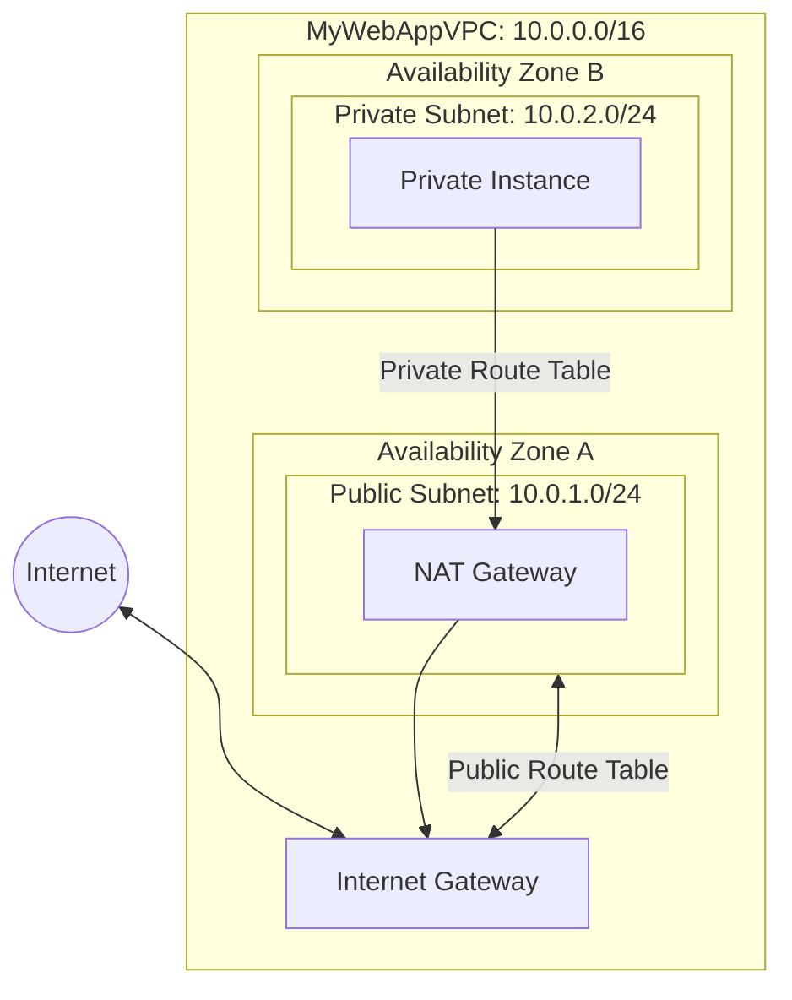

# Custom VPC Configuration with Public and Private Subnets

**Topics:** Networking, VPC, Internet Gateway, NAT Gateway, Route Tables, Security

## Overview

Amazon Virtual Private Cloud (VPC) is a logically isolated network within AWS where you launch and manage your cloud resources. Unlike the default VPC that AWS provides automatically, a custom VPC gives you complete control over your network configuration, IP addressing, subnets, routing, and security settings.

This lab guides you through creating a two-tier network architecture with public and private subnets spanning multiple Availability Zones. This architecture pattern is fundamental for secure, scalable cloud applications where web servers sit in public subnets while databases reside in isolated private subnets. You'll configure : 
- Internet Gateway for public internet access
- NAT Gateway for private subnet outbound connectivity
- Route tables to control traffic flow. 

## Key Concepts

| Concept | Description |
|---------|-------------|
| VPC (Virtual Private Cloud) | Logically isolated virtual network dedicated to your AWS account with complete control over IP addressing, subnets, routing, and security |
| CIDR Block | Classless Inter-Domain Routing notation defining IP address range (e.g., 10.0.0.0/16 provides 65,536 IP addresses) |
| Subnet | Subdivision of VPC IP range tied to a specific Availability Zone; can be public (internet-accessible) or private (isolated) |
| Internet Gateway (IGW) | Horizontally scaled, redundant gateway enabling bidirectional internet communication for public subnet resources |
| NAT Gateway | Managed network address translation service allowing private subnet instances to access internet for updates while blocking inbound traffic |
| Route Table | Set of routing rules determining where network traffic from subnets is directed (e.g., local traffic, internet-bound traffic) |
| Availability Zone (AZ) | Isolated data center within AWS region providing fault tolerance; distributing subnets across AZs ensures high availability |
| Elastic IP | Static public IPv4 address allocated to your account and associated with NAT Gateway for consistent outbound IP addressing |
| Main Route Table | Default route table automatically created with VPC; best practice is to leave it unchanged and create custom route tables |
| Security Group | Virtual firewall at instance level controlling inbound/outbound traffic based on protocol, port, and source/destination |

## Prerequisites

- AWS account with VPC creation permissions (IAMFullAccess or VPCFullAccess policy)
- Basic understanding of networking concepts (IP addresses, subnets, routing)
- Familiarity with CIDR notation and IP addressing
- Understanding of TCP/IP and network security fundamentals
- Completed EC2 labs (helpful for testing connectivity later)

## Architecture Overview

::: details Click to expand Architecture Diagram

:::

## Phase 1: Create Custom VPC

1. Sign in to AWS Management Console.

2. Navigate to VPC service (Virtual Private Cloud)

3. Click **Create VPC** button.

4. Choose VPC configuration:
   - Select **VPC only** option (for manual subnet configuration)
   
5. Configure VPC settings:
   - **Name tag:** `MyWebAppVPC` (or descriptive name for your application)
   - **IPv4 CIDR block:** `10.0.0.0/16`
     - This provides 65,536 IP addresses (10.0.0.0 to 10.0.255.255)
     - Standard private IP range suitable for production environments
   - **IPv6 CIDR block:** No IPv6 CIDR block (leave unchecked)
   - **Tenancy:** Default
     - Default: Instances run on shared hardware (cost-effective)
     - Dedicated: Instances run on dedicated hardware (compliance requirements)

6. Click **Create VPC**.

7. **Important - Enable DNS hostnames:**
   - Select your newly created VPC
   - Click **Actions** → **Edit VPC settings**
   - Under **DNS settings**, check **Enable DNS hostnames**
   - Click **Save changes**

> [!IMPORTANT] DNS Hostnames Requirement
> You must enable **"Enable DNS hostnames"**. Without this setting, your EC2 instances will receive a Public IP address (e.g., `54.1.2.3`) but won't get a Public DNS name (e.g., `ec2-54-1-2-3.compute-1.amazonaws.com`). Many applications, scripts, and AWS services rely on DNS names for connectivity and configuration.

> [!NOTE] CIDR Block Selection
> The `10.0.0.0/16` CIDR block is a standard choice from the RFC 1918 private IP range. It gives you 65,536 total IP addresses to use within this VPC. 
> Other common choices include `172.16.0.0/16` or `192.168.0.0/16`. 
> Plan your CIDR blocks carefully to avoid overlap if you need VPC peering later.

## Phase 2: Create Subnets

Subnets divide your VPC into smaller network segments. Each subnet must reside entirely within one Availability Zone and cannot span multiple AZs.

### Public Subnet

1. Go to `Subnets` → `Create subnet`
2. Select VPC: `MyWebAppVPC`
3. Choose Availability Zone A
4. Enter configuration:
  - Name → `PublicSubnet`
  - Availability Zone: e.g., `ap-south-1a`
  - IPv4 CIDR block → `10.0.1.0/24`

5. Click `Create subnet`

>[!NOTE] Auto-Assign Public IP
>Creating a "Public Subnet" doesn't automatically give instances a Public IP. 
>After creating the subnet, Select : 
>Subnet -> Actions -> **Edit subnet settings** -> Check **"Enable auto-assign public IPv4 address"**. 
>
>Without this, every time you launch an instance, you have to manually request an IP.

### Create Private Subnet

1. Click **Create subnet** button again.

2. Select VPC:
   - **VPC ID:** Select `MyWebAppVPC` (same VPC as public subnet)

3. Configure subnet settings:
   - **Subnet name:** `PrivateSubnet`
   - **Availability Zone:** Select different AZ (e.g., `ap-south-1b`)
     - Using different AZ than public subnet provides high availability
     - If `ap-south-1a` fails, `ap-south-1b` remains operational
   - **IPv4 CIDR block:** `10.0.2.0/24`
     - Must not overlap with public subnet CIDR (10.0.1.0/24)
     - Provides 251 usable IP addresses for private resources

4. Click **Create subnet**.

5. **Do NOT enable auto-assign public IP for private subnet** (this is intentional).

> [!NOTE] Subnet Sizing
> Using `/24` CIDR gives each subnet 256 total IP addresses. 
> AWS reserves 5 IPs per subnet (first 4 and last 1), leaving 251 usable IPs. 
> The subnet CIDR blocks cannot overlap. Plan your subnet sizes based on expected instance count in each tier.

## Phase 3: Create and Attach Internet Gateway

1. In the left navigation pane, click "Internet Gateways"

2. Click `Create Internet Gateway`
	- Name: `MyWebApp-IGW`

3. Click `Create Internet Gateway`

### Attach to VPC

**Step 1:** Select the IGW you just created

**Step 2:** Click Actions → "Attach to VPC"

**Step 3:** Select `MyWebAppVPC`

**Step 4:** Click `Attach Internet Gateway`

> [!NOTE] IGW 
> IGW is the "front door" to the internet for your VPC. Attaching it doesn't automatically give everything internet access. A route table is still needed.

## Configure Public Route Table

**Step 1:** Go to `Route Tables` → `Create route table`

- Name → `PublicRT`
- VPC → `MyWebAppVPC`

**Step 2:** Under `Routes` → `Edit routes` → `Add route`

- Destination: `0.0.0.0/0`
- Target: Internet Gateway (`MyWebApp-IGW`)

**Step 3:** Under `Subnet Associations` → `Edit subnet associations`

- Select `PublicSubnet` → `Save`

Now the `PublicSubnet` has internet access.

>[!NOTE] Main Route Table
>When you create a VPC, AWS creates a "Main" route table automatically. 
>Leave the "Main" table empty (no routes to IGW). Explicitly associate your subnets to your custom tables. This prevents accidental public exposure if you create a new subnet and forget to configure it.

## Create NAT Gateway

>[!IMPORTANT] NAT Tax 
>NAT Gateways are **NOT Free Tier eligible**. As soon as you finish this lab, **delete the NAT Gateway**. It charges you even if no data is passing through it.
>

**Step 1:** Go to `NAT Gateways` → `Create NAT Gateway`

**Step 2:** Configure:

- Name → `NAT-GW`
- Subnet → `PublicSubnet`
- Elastic IP Allocation ID → Click `Allocate Elastic IP`

> **Elastic IP Limits:** By default, you can only have 5 Elastic IPs per region.

**Step 3:** Click `Create NAT Gateway`

> [!NOTE] 
> The NAT Gateway needs to be in the **Public Subnet** to access the IGW. 
> Using an Elastic (static) IP ensures the public IP never changes even if underlying hardware fails.

## Phase 4: Configure Private Route Table

1. In VPC console left navigation, click **Route Tables**.

2. Click **Create route table** button.

3. Configure route table:
   - **Name:** `PrivateRT`
   - **VPC:** Select `MyWebAppVPC`

4. Click **Create route table**.

5. Add NAT Gateway route:
   - Select the newly created `PrivateRT`
   - In **Routes** tab, Click **Edit routes**
   - Click **Add route**
     - **Destination:** `0.0.0.0/0`
     - **Target:** Select **NAT Gateway** → `NAT-GW`
   - Click **Save changes**

6. Associate route table with private subnet:
   - In **Subnet associations** tab, Click **Edit subnet associations**
   - Check the box next to `PrivateSubnet`
   - Click **Save associations**

7. Verify configuration:
   - Routes tab shows two routes:
     - `10.0.0.0/16` → local
     - `0.0.0.0/0` → nat-xxxx
   - Subnet associations tab shows `PrivateSubnet` explicitly associated

Private subnet now has outbound internet access through the NAT Gateway.

> [!NOTE] Subnet Route Table Association
> Each subnet can be associated with only one route table. If not explicitly associated, it uses the Main Route Table. Always explicitly associate subnets to custom route tables to avoid confusion and maintain security best practices.

## Validation

::: details Validation

Verify successful VPC configuration:

- **VPC Creation:**
  - VPC appears in VPC list with status "Available"
  - CIDR block shows `10.0.0.0/16`
  - DNS hostnames enabled in VPC settings
  - DNS resolution enabled (default)

- **Subnet Configuration:**
  - Two subnets created: `PublicSubnet` (10.0.1.0/24) and `PrivateSubnet` (10.0.2.0/24)
  - Subnets in different Availability Zones
  - Public subnet has "Auto-assign public IPv4 address" enabled
  - Private subnet has "Auto-assign public IPv4 address" disabled

- **Internet Gateway:**
  - IGW created and attached to VPC
  - State shows "Attached"
  - VPC ID matches `MyWebAppVPC`

- **NAT Gateway:**
  - NAT Gateway created in Public Subnet
  - State shows "Available"
  - Elastic IP allocated and associated
  - Located in correct Availability Zone

- **Route Tables:**
  - `PublicRT` has route `0.0.0.0/0` → IGW
  - `PublicRT` associated with `PublicSubnet`
  - `PrivateRT` has route `0.0.0.0/0` → NAT Gateway
  - `PrivateRT` associated with `PrivateSubnet`
  - Both route tables have local VPC route `10.0.0.0/16`

- **Optional - Connectivity Testing:**
  - Launch EC2 instance in public subnet → should get public IP and internet access
  - Launch EC2 instance in private subnet → no public IP, outbound internet via NAT
  - Ping between instances on private IPs should work

:::

## Cost Considerations

::: details Cost Considerations

- **VPC, Subnets, Route Tables:** Free
  - No charges for creating or using VPCs, subnets, or route tables

- **Internet Gateway:** Free
  - No hourly charges for IGW itself
  - Only data transfer charges apply

- **NAT Gateway:** **NOT free-tier eligible**
  - **Hourly charges:** ~$0.045/hour = ~$32.40/month (us-east-1)
  - **Data processing charges:** $0.045 per GB processed
  - **Example cost:** NAT Gateway running 24/7 for 30 days = ~$32.40 + data processing
  - **Critical:** Delete immediately after lab to avoid charges

- **Elastic IP Address:**
  - Free while associated with running instance/NAT Gateway
  - $0.005/hour (~$3.60/month) if allocated but not associated
  - Free tier includes: No EIP-specific free tier

- **Data Transfer:**
  - **Inbound:** Free
  - **Outbound to internet:** First 100 GB/month free, then $0.09/GB
  - **Between AZs:** $0.01/GB in each direction (for cross-AZ traffic)

:::

> [!WARNING] NAT Gateway Costs
> NAT Gateway is the primary cost driver in this lab. Even with zero data transfer, you pay hourly charges ($0.045/hour). For 24-hour operation, that's approximately $1.08/day or $32.40/month. Always delete NAT Gateways when not actively using them.

> [!TIP] Cost Optimization
> For development/testing, consider:
> - **NAT Instance:** Launch a small EC2 instance (t3.micro) configured for NAT instead of managed NAT Gateway (lower cost but requires manual configuration and management)
> - **Schedule deletion:** Delete NAT Gateway at end of work day, recreate next day if needed
> - **Use NAT Gateway only in production:** For labs, test connectivity then immediately delete

## Cleanup

::: details Cleanup

To avoid ongoing charges, delete resources in this specific order to prevent dependency errors:

### 1. Delete NAT Gateway (Critical - Prevents Hourly Charges)

1. Navigate to VPC → NAT Gateways
2. Select `NAT-GW`
3. Click **Actions** → **Delete NAT gateway**
4. Type `delete` to confirm
5. Click **Delete**
6. Wait for state to change to "Deleted" (takes 2-3 minutes)

> [!IMPORTANT] Delete NAT Gateway First
> NAT Gateway must be deleted before you can delete the subnets or release the Elastic IP. Deletion is not immediate, wait for status to show "Deleted" before proceeding.

### 2. Release Elastic IP Address

1. Navigate to VPC → Elastic IPs
2. Select the Elastic IP (shows "Disassociated" status after NAT deletion)
3. Click **Actions** → **Release Elastic IP addresses**
4. Click **Release**

> [!WARNING] EIP Charges
> If you skip this step, you'll be charged $0.005/hour for the unassociated Elastic IP even though NAT Gateway is deleted.

### 3. Delete Route Table Associations

1. Navigate to VPC → Route Tables
2. Select `PublicRT` → **Subnet associations** tab → Edit → Remove `PublicSubnet` → Save
3. Select `PrivateRT` → **Subnet associations** tab → Edit → Remove `PrivateSubnet` → Save

### 4. Delete Custom Route Tables

1. Select `PublicRT`
2. Click **Actions** → **Delete route table**
3. Confirm deletion
4. Repeat for `PrivateRT`

> [!NOTE] Cannot Delete Main Route Table
> You cannot delete the Main Route Table. It's automatically deleted when the VPC is deleted.

### 5. Detach and Delete Internet Gateway

1. Navigate to VPC → Internet Gateways
2. Select `MyWebApp-IGW`
3. Click **Actions** → **Detach from VPC**
4. Confirm detachment
5. After detachment completes, click **Actions** → **Delete internet gateway**
6. Confirm deletion

### 6. Delete Subnets

1. Navigate to VPC → Subnets
2. Select `PublicSubnet`
3. Click **Actions** → **Delete subnet**
4. Type `delete` to confirm → Click **Delete**
5. Repeat for `PrivateSubnet`

### 7. Delete VPC

1. Navigate to VPC → Your VPCs
2. Select `MyWebAppVPC`
3. Click **Actions** → **Delete VPC**
4. Type `delete` to confirm
5. Click **Delete**

:::

> [!TIP] Cascade Deletion
> If you delete the VPC first, AWS attempts to automatically delete associated resources (subnets, route tables, IGW). However, NAT Gateway and Elastic IPs must be manually deleted first. Following the order above ensures clean deletion without errors.

### Verification

- All custom resources removed from VPC dashboard
- Only default VPC remains (if you have one)
- No unexpected charges in Billing dashboard (check after 24 hours)
- Elastic IP count returns to previous state

## Result

You have successfully created a production-ready custom VPC with a secure two-tier network architecture. This configuration separates public-facing resources (web servers) from private resources (databases) while enabling controlled internet access through Internet Gateway and NAT Gateway. The multi-Availability Zone design provides high availability and fault tolerance.

## Viva Questions

1. What is the difference between a public subnet and a private subnet in AWS VPC?

2. Why is NAT Gateway placed in the public subnet rather than the private subnet?

3. Explain the purpose of the 0.0.0.0/0 route in route tables.

4. Why should you enable DNS hostnames for a VPC, and what happens if you don't?

5. What are the security implications of using NAT Gateway versus Internet Gateway?

