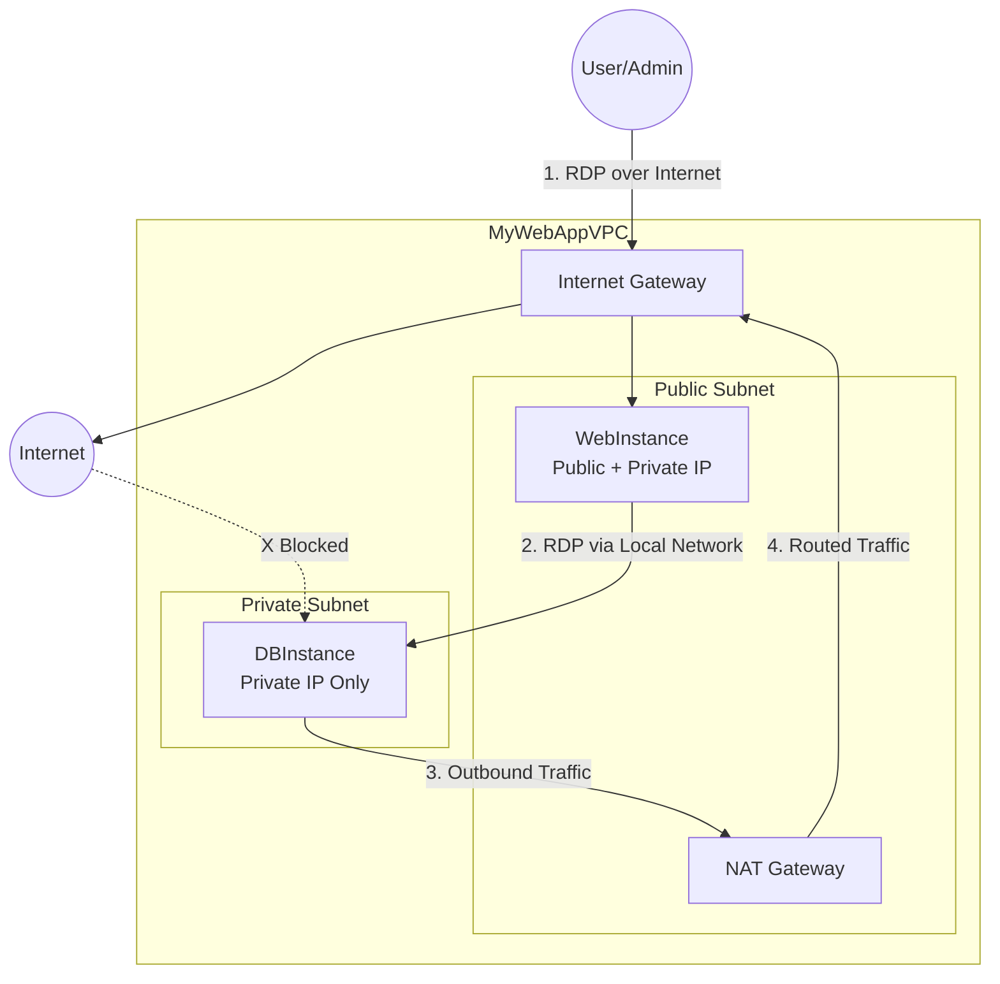

# EC2 Instances in Public and Private Subnets

**Topics:** EC2, VPC, Networking, Bastion Host, Jump Server, RDP, Security Groups, NAT Gateway

## Overview

This lab demonstrates deploying EC2 instances in a secure two-tier network architecture. You'll launch a Windows web server in a public subnet (accessible from the internet) and a Windows database server in a private subnet (isolated from direct internet access). This architecture pattern is fundamental for production environments where frontend servers need public accessibility while backend databases must remain fully isolated.

You'll configure security groups to control network access,use the public instance as a bastion host (jump server) to access the private instance, and verify that NAT Gateway enables private instances to access the internet for updates while blocking all inbound connections. 

## Key Concepts

| Concept | Description |
|---------|-------------|
| Bastion Host (Jump Server) | EC2 instance in public subnet used as secure gateway to access private subnet instances; only entry point to private resources |
| Public Subnet | Subnet with route to Internet Gateway allowing instances to receive public IPs and accept inbound internet connections |
| Private Subnet | Subnet without public IP assignment or direct internet access; outbound traffic routed through NAT Gateway for security |
| Security Group (Instance-Level) | Stateful virtual firewall controlling inbound/outbound traffic for EC2 instances based on protocol, port, and source |
| Security Group Chaining | Referencing one security group as source in another's rules; enables secure communication between tiers without exposing public IPs |
| Remote Desktop Protocol (RDP) | Microsoft protocol for remote GUI access to Windows instances over TCP port 3389 |
| NAT Gateway Functionality | Enables private subnet instances to initiate outbound internet connections while blocking all inbound initiated traffic |
| Private IP vs Public IP | Private IPs (e.g., 10.0.x.x) for internal VPC communication; public IPs for internet-accessible resources |
| Multi-Hop RDP | Connecting to private instance by first RDP to bastion (public instance), then RDP again from bastion to private instance |
| Network Isolation | Security practice of separating different application tiers (web, app, database) into distinct subnets with controlled routing |

## Prerequisites

- Completed Lab 10 (Custom VPC Configuration with public/private subnets, IGW, NAT Gateway)
- Existing VPC with:
  - Public subnet with route to Internet Gateway
  - Private subnet with route to NAT Gateway
  - Both subnets in different Availability Zones
- Windows computer with Remote Desktop Connection (mstsc) client
- `.pem` key pair file from previous EC2 labs (or create new one)
- Basic understanding of Windows Remote Desktop and network security
- IAM permissions for EC2 instance launch and security group management

## Architecture Overview

::: details Click to expand Architecture Diagram

:::

## Phase 1: Launch Windows Instance in Public Subnet

1. Sign in to AWS Management Console.

2. Navigate to EC2 service → Click **Launch Instance**.

3. Configure instance details:
   - **Name:** `WebInstance` (or descriptive name like `PublicWebServer`)
   - **Application and OS Images (AMI):**
     - Select **Windows** tab
     - Choose **Microsoft Windows Server 2022 Base** or **2019 Base**
     - Ensure "Free tier eligible" is displayed (if applicable)

4. Choose instance type:
   - **Instance type:** `t2.micro` or `t3.micro` (Free tier eligible)
   - t3.micro offers better performance but may not be available in all regions

5. Configure key pair:
   - **Key pair (login):** Select existing key pair or create new
   - **Key pair type:** RSA
   - **Private key file format:** `.pem` (for Windows decrypt password)
   - Download and save the `.pem` file securely

> [!IMPORTANT] Key Pair Requirement
> You need the `.pem` key pair file to decrypt the Windows Administrator password. Without it, you cannot log in to the instance. Store the `.pem` file securely—it cannot be downloaded again after creation.

6. Configure Network Settings:
   - Click **Edit** under Network settings
   - **VPC:** Select `MyWebAppVPC` (your custom VPC from Lab 10)
   - **Subnet:** Select `PublicSubnet` (must be the public subnet)
   - **Auto-assign Public IP:** **Enable**
     - Critical for internet accessibility
     - If disabled, instance won't be reachable from internet

7. Configure Security Group for Web Instance:
   - **Firewall (security groups):** Create security group
   - **Security group name:** `WebInstance-SG`
   - **Description:** "Allow RDP from anywhere for lab purposes"
   - **Inbound security group rules:**
     - **Rule 1:**
       - **Type:** RDP
       - **Protocol:** TCP
       - **Port:** 3389
       - **Source:** 0.0.0.0/0 (Anywhere)
       - **Description:** "RDP access for remote management"

> [!WARNING] Production Security
> In this lab, we allow RDP from 0.0.0.0/0 (anywhere) for learning purposes. In production environments, restrict RDP to specific IP addresses (e.g., your office IP or VPN) using "My IP" or custom CIDR blocks to prevent unauthorized access attempts.

8. Configure Storage:
   - **Size:** 30 GiB (default for Windows)
   - **Volume type:** gp3 (General Purpose SSD)
   - Leave other storage settings at default

9. Review configuration in Summary panel.

10. Click **Launch instance**.

11. Wait for instance to be ready:
    - Instance state: Running
    - Status checks: 2/2 checks passed (takes 3-5 minutes for Windows)
    - Note the **Public IPv4 address** and **Private IPv4 address**

> [!NOTE] Windows Boot Time
> Windows instances take longer to boot than Linux (3-5 minutes for status checks). The instance must complete initialization and Windows configuration before it's ready for RDP connection.

## Phase 2: Launch Windows Instance in Private Subnet

1. In EC2 console, click **Launch Instance** again.

2. Configure instance details:
   - **Name:** `DBInstance` (or descriptive name like `PrivateDatabaseServer`)
   - **AMI:** **Microsoft Windows Server 2022 Base** or **2019 Base** (same as public instance)

3. Choose instance type:
   - **Instance type:** `t2.micro` or `t3.micro`

4. Configure key pair:
   - **Key pair:** Select **the same key pair** used for WebInstance
     - Using same key pair simplifies password decryption
     - Alternatively, use different key pair if managing separately

5. Configure Network Settings:
   - Click **Edit** under Network settings
   - **VPC:** Select `MyWebAppVPC` (same VPC)
   - **Subnet:** Select `PrivateSubnet` (must be the private subnet)
   - **Auto-assign Public IP:** **Disable**
     - Critical for security—private instances should not have public IPs
     - Ensures instance is not directly accessible from internet

> [!IMPORTANT] No Public IP for Private Instances
> Private subnet instances must have auto-assign public IP **disabled**. This is a fundamental security practice ensuring databases and backend services are never directly exposed to the internet, preventing unauthorized access attempts.

6. Configure Security Group for DB Instance:
   - **Firewall (security groups):** Create security group
   - **Security group name:** `DBInstance-SG`
   - **Description:** "Allow RDP only from WebInstance security group"
   - **Inbound security group rules:**
     - **Rule 1:**
       - **Type:** RDP
       - **Protocol:** TCP
       - **Port:** 3389
       - **Source:** **Custom**
       - In source field, type `WebInstance-SG` and select it from dropdown
       - **Description:** "RDP from WebInstance only"

> [!TIP] Security Group Chaining
> By referencing `WebInstance-SG` as the source instead of an IP address, we create dynamic security. Any instance with `WebInstance-SG` can connect, even if IP addresses change. This is more maintainable than hardcoding IP addresses and follows AWS best practices.

7. Configure Storage:
   - **Size:** 30 GiB
   - **Volume type:** gp3
   - Leave defaults

8. Review configuration:
   - Verify subnet is `PrivateSubnet`
   - Verify no public IP assignment
   - Verify security group references `WebInstance-SG`

9. Click **Launch instance**.

10. Wait for instance to be ready:
    - Instance state: Running
    - Status checks: 2/2 checks passed
    - Note the **Private IPv4 address** (no public IP shown)
    - Instance name shows `DBInstance`

> [!NOTE] Private Instance Isolation
> The `DBInstance` is now **fully isolated** from direct internet access. It has no public IP and cannot accept connections from the internet. The only way to access it is through the `WebInstance` (bastion host) on the local VPC network.

## Phase 3: Connect to Public Windows Instance

### Retrieve Windows Administrator Password

1. In EC2 console, select `WebInstance`.

2. Click **Connect** button at the top.

3. Click the **RDP client** tab.

4. Retrieve password:
   - Click **Get password** button
   - If greyed out, wait 2-3 minutes (Windows must finish initialization)
   - Click **Browse** or **Choose file**
   - Select your `.pem` key pair file
   - Click **Decrypt password**

5. Copy the decrypted password:
   - Long random password appears (e.g., `aB3!xY9@mN5#pQ2$`)
   - Click **Copy password** or manually select and copy
   - Save to a text file temporarily (you'll need it multiple times)

6. Note the Public IP address displayed on the Connect page.

> [!TIP] Password Storage
> Save the decrypted password securely. You'll need it every time you connect to this instance. If you lose it, you cannot retrieve it again—you'd need to reset the Administrator password using Systems Manager or other methods.

### Connect Using Remote Desktop

1. On your Windows computer, press `Windows + R`.

2. Type `mstsc` and press Enter (opens Remote Desktop Connection).

3. In the Remote Desktop Connection dialog:
   - **Computer:** Paste the **Public IP** of `WebInstance` (e.g., `54.123.45.67`)
   - Click **Connect**

4. Windows Security credential prompt appears:
   - **Username:** `Administrator` (default Windows admin account)
   - **Password:** Paste the decrypted password you copied earlier
   - Check "Remember my credentials" (optional, for convenience)
   - Click **OK**

5. Certificate warning appears (common for self-signed certs):
   - Warning: "The identity of the remote computer cannot be verified"
   - Check "Don't ask me again for connections to this computer"
   - Click **Yes**

6. Remote Desktop session opens—you're now inside the `WebInstance`.

> [!NOTE] First Login
> First login may take 30-60 seconds as Windows configures the Administrator profile. Be patient and don't close the connection prematurely.

## Phase 4: Connect to Private Windows Instance via Bastion

You cannot connect directly to `DBInstance` from your laptop because it has no public IP. You must connect from within `WebInstance` using its private IP address.

### Get DB Instance Password

Before connecting, you need to decrypt `DBInstance` password (if you haven't already):

1. In your EC2 console (on your laptop), select `DBInstance`.

2. Click **Connect** → **RDP client** tab.

3. Click **Get password** → Upload same `.pem` file → **Decrypt**.

4. Copy and save the `DBInstance` password.

> [!TIP] Same Key Pair
> If you used the same key pair for both instances, the passwords will be different (AWS generates unique passwords per instance). Decrypt and save both passwords separately.

### Remote Desktop from WebInstance to DBInstance

1. While logged into `WebInstance` (your RDP session from Phase 3):
   - Inside the remote Windows desktop, press `Windows + R`
   - Type `mstsc` and press Enter
   - This opens Remote Desktop Connection **inside** WebInstance

2. In the Remote Desktop Connection dialog (inside WebInstance):
   - **Computer:** Enter the **Private IP address** of `DBInstance` (e.g., `10.0.2.15`)
     - Find this in EC2 console under `DBInstance` details
     - Must be private IP (10.0.x.x), not public (it has none)
   - Click **Connect**

3. Credential prompt appears:
   - **Username:** `Administrator`
   - **Password:** Paste the `DBInstance` decrypted password
   - Click **OK**

4. Certificate warning appears:
   - Click **Yes** to accept

5. Nested RDP session opens—you're now inside the private Windows instance.

> [!NOTE] Multi-Hop Connection
> You now have two RDP sessions:
> - Your laptop → `WebInstance` (public IP, over internet)
> - `WebInstance` → `DBInstance` (private IP, over VPC network)
>
> This is called "bastion host" or "jump box" pattern. `WebInstance` acts as the secure gateway to private resources.

## Phase 5: Test NAT Gateway Connectivity

### From WebInstance (Public Subnet)

1. While logged into `WebInstance` (outer RDP session):
   - Open a web browser (Microsoft Edge or Internet Explorer)
   - Navigate to `https://www.google.com` or `https://www.aws.amazon.com`
   - Website loads successfully

2. Check internet connectivity icon:
   - System tray (bottom-right) shows internet connection icon
   - No yellow triangle or "No internet" message

**Result:** Internet access works through Internet Gateway (direct route).

### From DBInstance (Private Subnet)

1. While logged into `DBInstance` (nested RDP session):
   - Open a web browser
   - Navigate to `https://www.google.com`
   - Website loads successfully

2. Check network status:
   - System tray shows internet connection icon
   - Status: "Internet Access"

**Result:** Internet access works through NAT Gateway (outbound-only route).

> [!NOTE] NAT Gateway Function
> Even though `DBInstance` has no public IP and cannot accept inbound connections from the internet, it **can** initiate outbound connections to the internet through the NAT Gateway. This allows it to download Windows updates, access AWS service APIs, or connect to external databases while remaining completely isolated from inbound internet traffic.

### Security Verification

Test that `DBInstance` is not accessible from the internet:

| Test | Expected Result |
|------|-----------------|
| RDP to DBInstance from your laptop using private IP | **Fails** (private IPs not routable over internet) |
| RDP to DBInstance from your laptop using public IP | **N/A** (no public IP assigned) |
| Ping DBInstance from internet | **Fails** (no public IP, ICMP blocked) |
| DBInstance outbound to internet | **Success** (via NAT Gateway) |
| Internet inbound to DBInstance | **Blocked** (NAT is one-way, security group denies) |
| WebInstance to DBInstance RDP via private IP | **Success** (allowed by security group) |

### Outbound Test from Private Subnet (Advanced)

1. Inside `DBInstance` RDP session:
   - Open Command Prompt (cmd)
   - Run: `ping google.com -n 4`

2. Expected output:
   ```
   Pinging google.com [142.250.xxx.xxx] with 32 bytes of data:
   Reply from 142.250.xxx.xxx: bytes=32 time=20ms TTL=115
   Reply from 142.250.xxx.xxx: bytes=32 time=18ms TTL=115
   Reply from 142.250.xxx.xxx: bytes=32 time=19ms TTL=115
   Reply from 142.250.xxx.xxx: bytes=32 time=21ms TTL=115
   ```

3. This proves outbound connectivity works via NAT Gateway.

> [!TIP] Troubleshooting No Internet
> If `DBInstance` cannot access the internet:
> 1. Verify NAT Gateway is in "Available" state (VPC → NAT Gateways)
> 2. Check Private Route Table has route `0.0.0.0/0` → NAT Gateway ID
> 3. Verify `PrivateSubnet` is associated with Private Route Table
> 4. Check security group allows outbound traffic (default: allow all outbound)
> 5. Wait 2-3 minutes for routing changes to propagate

## Validation

Verify successful completion:

- **Instance Launch:**
  - `WebInstance` running in `PublicSubnet` with public and private IPs assigned
  - `DBInstance` running in `PrivateSubnet` with private IP only (no public IP)
  - Both instances show 2/2 status checks passed
  - Both instances in "Running" state

- **Security Group Configuration:**
  - `WebInstance-SG` allows RDP (3389) from 0.0.0.0/0
  - `DBInstance-SG` allows RDP (3389) from `WebInstance-SG` only
  - `DBInstance-SG` does NOT allow traffic from 0.0.0.0/0
  - Both security groups allow all outbound traffic (default)

- **Network Connectivity:**
  - RDP to `WebInstance` from your laptop using public IP: **Success**
  - RDP to `DBInstance` directly from your laptop: **Fails** (no public IP)
  - RDP to `DBInstance` from `WebInstance` using private IP: **Success**
  - `WebInstance` internet access through IGW: **Success**
  - `DBInstance` internet access through NAT Gateway: **Success**

- **Security Isolation:**
  - `DBInstance` cannot accept inbound connections from internet: **Verified**
  - `DBInstance` can initiate outbound connections to internet: **Verified**
  - Bastion host pattern working: **Verified**

## Cost Considerations

- **EC2 Instances (t2.micro/t3.micro Windows):**
  - **Free Tier:** 750 hours/month for first 12 months (Linux and Windows combined)
  - **Windows instances:** Count against same free tier hours as Linux
  - **After Free Tier:** ~$0.0116/hour per instance = ~$8.35/month each (us-east-1)
  - **2 instances running:** ~$16.70/month

- **EBS Storage (30 GB per instance, gp3):**
  - **Free Tier:** 30 GB total for first 12 months
  - **2 instances = 60 GB total:** 30 GB covered by free tier, 30 GB charged
  - **Overage cost:** 30 GB × $0.08/GB-month = $2.40/month

- **NAT Gateway:**
  - **Hourly:** ~$0.045/hour = ~$32.40/month
  - **Data processing:** $0.045/GB processed
  - **Total for lab:** If running 1 hour = $0.045 + minimal data charges

- **Data Transfer:**
  - **RDP sessions:** Minimal data usage (<100 MB for 1-hour session)
  - **Inbound:** Free
  - **Outbound:** Covered by 100 GB free tier/month

- **Total Estimated Cost (1 hour lab):**
  - 2× Windows instances: 2× $0.0116 = $0.0232
  - NAT Gateway: $0.045
  - Data transfer: ~$0 (within free tier)
  - **Total:** ~$0.07 for 1-hour lab
  - **If left running 24/7 for 30 days:** ~$51/month

> [!WARNING] Stop vs Terminate
> **Stopping** instances (Instance state → Stop) halts compute charges but continues EBS storage charges (~$2.40/month for 60 GB). **Terminating** instances completely removes them and stops all charges. For labs, always **terminate** when done.

> [!IMPORTANT] NAT Gateway Charges
> NAT Gateway charges continue even if no instances are running. Always delete NAT Gateway after completing labs to avoid $32.40/month charges.

## Cleanup

To avoid ongoing charges, delete resources in this order:

### 1. Terminate EC2 Instances

1. Navigate to EC2 → Instances.

2. Select `WebInstance`:
   - Click **Instance state** → **Terminate instance**
   - Confirm termination (type `terminate` if prompted)

3. Select `DBInstance`:
   - Click **Instance state** → **Terminate instance**
   - Confirm termination

4. Wait for instance state to change to "Terminated" (2-3 minutes).

> [!NOTE] Termination Delay
> Windows instances take longer to terminate than Linux. Wait for state to show "Terminated" before proceeding to ensure all resources are released.

### 2. Delete Security Groups (Optional)

1. Navigate to EC2 → Security Groups.

2. Select `WebInstance-SG`:
   - Click **Actions** → **Delete security groups**
   - Confirm deletion

3. Select `DBInstance-SG`:
   - Click **Actions** → **Delete security groups**
   - If error "has dependent object," wait 2-3 minutes for instance network interfaces to fully detach
   - Retry deletion

> [!TIP] Security Group Dependencies
> You cannot delete security groups while they're attached to running instances or network interfaces. Always terminate instances first, then wait a few minutes before deleting security groups.

### 3. Delete NAT Gateway (If Not Already Done in Lab 10)

1. Navigate to VPC → NAT Gateways.

2. Select NAT Gateway → **Actions** → **Delete NAT gateway**.

3. Type `delete` to confirm → Click **Delete**.

4. Wait for state to change to "Deleted."

### 4. Release Elastic IP (If NAT Gateway Deleted)

1. Navigate to VPC → Elastic IPs.

2. Select Elastic IP (shows "Disassociated" status).

3. Click **Actions** → **Release Elastic IP addresses**.

4. Click **Release**.

### Verification

- Both instances show "Terminated" state in EC2 console
- Security groups deleted or only default security group remains
- No unexpected charges in Billing dashboard (check after 24 hours)
- NAT Gateway deleted (if applicable)
- Elastic IP released (if applicable)

## Result

You have successfully deployed and secured a two-tier EC2 architecture demonstrating real-world cloud security practices. The public Windows web server is accessible from the internet while the private Windows database server remains completely isolated, accessible only through the bastion host.

You configured security group chaining to allow controlled access between tiers, verified that NAT Gateway enables private instances to access the internet for updates while blocking inbound connections, and implemented the bastion host pattern for secure remote management of private resources.

## Viva Questions

1. What is a bastion host, and why is it important for cloud security?

2. Explain how security group chaining works and why it's better than hardcoding IP addresses.

3. Why can a private subnet instance access the internet through NAT Gateway but the internet cannot access it?

4. What would happen if you enabled "Auto-assign Public IP" on the private subnet?

5. Describe the complete network path when you RDP from your laptop to DBInstance through WebInstance.
