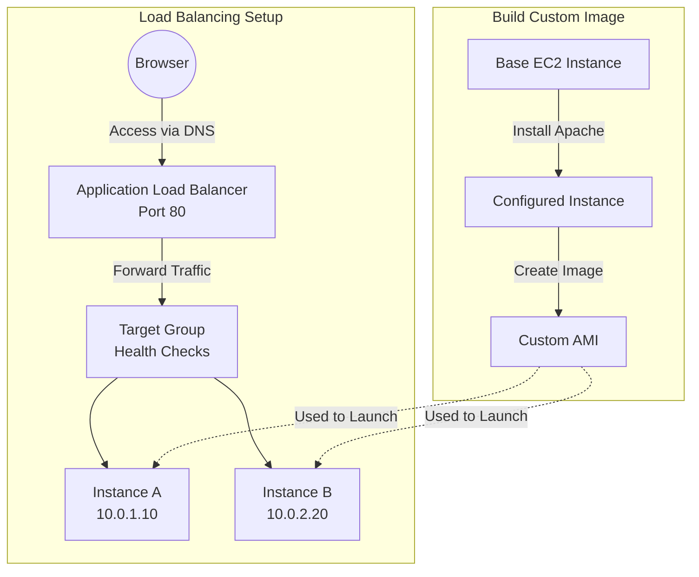

# Load-Balanced Web Application with ALB and Custom AMI

**Topics:** Application Load Balancer, Target Groups, Custom AMI, High Availability, Auto Scaling, Apache

## Overview

Application Load Balancers (ALB) distribute incoming HTTP/HTTPS traffic across multiple EC2 instances, ensuring your application remains available even if individual instances fail. This lab demonstrates deploying a load-balanced web architecture. 

You'll create a custom Amazon Machine Image (AMI) containing your pre-configured web application, use it to launch multiple identical EC2 instances, configure a Target Group to manage instance health, and deploy an Application Load Balancer to distribute traffic across instances. 

## Key Concepts

| Concept | Description |
|---------|-------------|
| Application Load Balancer (ALB) | Layer 7 HTTP/HTTPS load balancer that intelligently distributes traffic across multiple targets based on request content, paths, and headers |
| Target Group | Logical grouping of EC2 instances (targets) that receive traffic from ALB; includes health check configuration to monitor instance availability |
| Custom AMI (Amazon Machine Image) | Snapshot of configured EC2 instance including OS, applications, and data; enables launching identical instances for consistency |
| Health Check | Automated monitoring that ALB performs on each target to determine if it's healthy and should receive traffic |
| Load Balancing Algorithm | Method ALB uses to distribute requests (Round Robin for equal distribution across healthy targets) |
| High Availability | Architecture design ensuring services remain accessible even when individual components fail |
| Horizontal Scaling | Adding more instances to handle increased load rather than making existing instances larger (vertical scaling) |
| DNS Name (ALB) | Publicly accessible domain name automatically assigned to ALB for accessing your application |
| Instance State (Target Group) | Health status showing if instance is healthy, unhealthy, initial, draining, or unused |
| Listener | ALB component that checks for connection requests using configured protocol and port (e.g., HTTP port 80) |

### Prerequisites

- AWS account with EC2 and Elastic Load Balancing permissions
- Completed EC2 and VPC labs (understanding of instances, security groups, subnets)
- VPC with at least two public subnets in different Availability Zones
- EC2 key pair for SSH access (.pem file)
- Basic understanding of HTTP web servers and DNS
- Familiarity with Apache/httpd (from previous EC2 web server labs)

## Architecture Overview

::: details Click to expand Architecture Diagram

:::

## Phase 1: Launch and Configure Base EC2 Instance

Create the foundational instance that will become your custom AMI.

1. Sign in to AWS Management Console.

2. Navigate to EC2 service → Click **Launch Instance**.

3. Configure instance details:
   - **Name:** `Base-WebServer`
   - **AMI:** Amazon Linux 2 AMI (Free tier eligible)
   - **Instance type:** `t3.micro`
   - **Key pair:** Select existing key pair

4. Configure Network Settings:
   - **VPC:** Default VPC or custom VPC
   - **Subnet:** Any public subnet
   - **Auto-assign Public IP:** Enable

5. Configure Security Group:
   - **Create new security group:**
     - **Name:** `WebServer-SG`
     - **Description:** "Allow HTTP and SSH"
   - **Inbound rules:**
     - **Rule 1:** HTTP (80) from 0.0.0.0/0
     - **Rule 2:** SSH (22) from My IP

6. Click **Launch instance**.

7. Wait for instance state: Running, status checks: 2/2 passed.

## Phase 2: Install Apache and Create Custom Web Content

1. Connect to instance via SSH:
   ```bash
   ssh -i your-key.pem ec2-user@<Public-IP>
   ```

2. Update system packages:
   ```bash
   sudo yum update -y
   ```

3. Install Apache web server:
   ```bash
   sudo yum install httpd -y
   ```

4. Start and enable Apache:
   ```bash
   sudo systemctl start httpd
   sudo systemctl enable httpd
   ```

5. Verify Apache is running:
   ```bash
   sudo systemctl status httpd
   ```

6. Navigate to web document root:
   ```bash
   cd /var/www/html
   ```

7. Create dynamic web page showing instance information:
   ```bash
   echo "<h1>Hello from Instance 1 - $(hostname)</h1>" | sudo tee /var/www/html/index.html
   ```

> [!NOTE] Hostname Variable
> The `$(hostname)` command dynamically inserts the instance's hostname. 
> When you create the AMI and launch multiple instances, each will display its unique hostname, allowing you to verify load balancing is working. Refreshing the browser will show different hostnames as ALB distributes traffic.

8. Test the web server:
   - Open browser: `http://<Public-IP>`
   - Verify the page displays with hostname

> [!TIP] Enhanced Web Page
> For better visualization, create a more detailed page:
> ```bash
> echo '<!DOCTYPE html>
> <html>
> <head><title>Load Balanced Server</title></head>
> <body style="text-align:center; background-color:#e3f2fd; font-family:Arial; padding:50px;">
>   <h1 style="color:#0d47a1;">Server: '$(hostname)'</h1>
>   <p style="font-size:18px;">Instance IP: '$(hostname -I | awk '{print $1}')'</p>
>   <p>Request served by this instance</p>
> </body>
> </html>' | sudo tee /var/www/html/index.html
> ```

## Phase 3: Create Custom AMI

Create a reusable image from your configured instance.

1. In EC2 console, navigate to **Instances**.

2. Select `Base-WebServer` instance.

3. Click **Actions** → **Image and templates** → **Create image**.

4. Configure AMI:
   - **Image name:** `WebServer-AMI`
   - **Image description:** "Apache web server with custom homepage"
   - **Reboot:** Checked (recommended for data consistency)

5. Click **Create image**.

6. Monitor AMI creation:
   - Navigate to **AMIs** (left sidebar under Images)
   - Wait for status: **Available** (takes 3-5 minutes)
   - Note the **AMI ID** (e.g., ami-0abc12345def67890)

> [!IMPORTANT] AMI Availability
> The AMI must show status "Available" before you can launch instances from it. Creating the AMI takes a snapshot of all EBS volumes attached to the instance, which requires a few minutes. Don't proceed to Target Group creation until this is complete.

## Phase 4: Create Target Group

Target Groups define which instances receive traffic from the load balancer and how ALB monitors their health.

1. In EC2 console left navigation, scroll down to **Load Balancing** section.

2. Click **Target Groups** → **Create target group**.

3. Specify group details:
   - **Choose a target type:** Instances
   - **Target group name:** `WebApp-TG`
   - **Protocol:** HTTP
   - **Port:** 80
   - **VPC:** Select your VPC (Default VPC or custom)

4. Configure health checks:
   - **Health check protocol:** HTTP
   - **Health check path:** `/`
   - **Advanced health check settings:**
     - **Healthy threshold:** 2 (number of consecutive successful checks)
     - **Unhealthy threshold:** 2 (number of consecutive failed checks)
     - **Timeout:** 5 seconds
     - **Interval:** 30 seconds

> [!NOTE] Health Check Path
> The health check path `/` means ALB will request `http://instance-ip/` every 30 seconds. If it receives HTTP 200 OK response twice in a row, the instance is marked healthy. If it fails twice, the instance is marked unhealthy and stops receiving traffic.

5. Click **Next**.

6. **Register targets:** Skip this step (click Next without selecting instances)
   - We'll register instances later when launching from AMI
   - Or let Auto Scaling Group automatically register instances

7. Review and click **Create target group**.

8. Verify Target Group created successfully:
   - Shows in Target Groups list
   - Status: No targets registered (expected at this stage)

## Phase 5: Create Application Load Balancer

Deploy the load balancer that will distribute traffic across your instances.

1. In EC2 console left navigation, click **Load Balancers**.

2. Click **Create load balancer**.

3. Select load balancer type:
   - Choose **Application Load Balancer**
   - Click **Create**

4. Configure basic settings:
   - **Load balancer name:** `WebApp-ALB`
   - **Scheme:** Internet-facing
     - Internet-facing: Accessible from internet (public)
     - Internal: Accessible only within VPC (private)
   - **IP address type:** IPv4

5. Configure network mapping:
   - **VPC:** Select your VPC
   - **Mappings:** Select **at least 2 Availability Zones**
     - Check boxes for 2 or more AZs (e.g., us-east-1a, us-east-1b)
     - For each AZ, select a **public subnet**

> [!IMPORTANT] Multi-AZ Requirement
> ALB requires subnets in at least **two different Availability Zones** for high availability. If your VPC only has subnets in one AZ, the creation will fail. This ensures if one AZ fails, the ALB continues operating in the other AZ.

6. Configure security groups:
   - **Security groups:** Create new or select existing
   - If creating new:
     - **Name:** `ALB-SG`
     - **Inbound rules:** HTTP (80) from 0.0.0.0/0
   - Remove default security group if needed

7. Configure listeners and routing:
   - **Listeners:**
     - **Protocol:** HTTP
     - **Port:** 80
   - **Default action:** Forward to target group
     - **Target group:** Select `WebApp-TG`

> [!NOTE] Listener Concept
> A listener is a process that checks for connection requests. The listener forwards matching requests to the target group. You can add multiple listeners (e.g., HTTPS on port 443) later.

8. Review all settings:
   - Load balancer: Internet-facing, IPv4
   - Network: 2+ Availability Zones selected
   - Security group: Allows HTTP (80)
   - Listener: HTTP:80 → WebApp-TG

9. Click **Create load balancer**.

10. Wait for provisioning:
    - State: **Provisioning** (2-3 minutes)
    - State changes to: **Active**
    - Copy the **DNS name** (e.g., `WebApp-ALB-123456789.us-east-1.elb.amazonaws.com`)

> [!TIP] DNS Propagation
> Even after ALB shows "Active," DNS propagation may take 1-2 minutes. If the DNS name doesn't resolve immediately, wait a moment and try again.

## Phase 6: Launch Instances from Custom AMI

Launch multiple instances from your AMI to demonstrate load balancing.

### Launch Instance 1

1. Navigate to EC2 → Click **Launch Instance**.

2. Configure instance:
   - **Name:** `WebServer-Instance-1`
   - **AMI:** Click **My AMIs** tab → Select `WebServer-AMI`
   - **Instance type:** `t3.micro`
   - **Key pair:** Select your key pair

3. Network settings:
   - **VPC:** Same VPC as ALB
   - **Subnet:** Select public subnet in **first AZ** (e.g., us-east-1a)
   - **Auto-assign Public IP:** Enable (for testing)

4. Security group:
   - **Select existing:** `WebServer-SG` (created in Phase 1)
   - Or create new allowing HTTP (80) from 0.0.0.0/0

5. Click **Launch instance**.

### Launch Instance 2

1. Click **Launch Instance** again.

2. Configure instance:
   - **Name:** `WebServer-Instance-2`
   - **AMI:** **My AMIs** → `WebServer-AMI`
   - **Instance type:** `t3.micro`
   - **Key pair:** Same as Instance 1

3. Network settings:
   - **VPC:** Same VPC
   - **Subnet:** Select public subnet in **second AZ** (e.g., us-east-1b)
   - **Auto-assign Public IP:** Enable

> [!NOTE] Availability Zone Distribution
> Launching instances in different AZs provides high availability. If one AZ experiences an outage, instances in the other AZ continue serving traffic.

4. Security group:
   - **Select existing:** `WebServer-SG`

5. Click **Launch instance**.

6. Wait for both instances:
   - State: Running
   - Status checks: 2/2 passed
   - Both instances show in Instances list

## Phase 7: Register Instances with Target Group

Add your instances to the Target Group so ALB can route traffic to them.

1. Navigate to **Target Groups**.

2. Select `WebApp-TG`.

3. Click **Targets** tab (bottom panel).

4. Click **Register targets** button.

5. Select instances to register:
   - Check box for `WebServer-Instance-1`
   - Check box for `WebServer-Instance-2`
   - Both should appear in available instances list

6. Click **Include as pending below** button.

7. Verify instances appear in "Targets to be registered" section.

8. Click **Register pending targets** button.

9. Monitor health status:
   - **Status:** Initial → Healthy (takes 30-60 seconds)
   - **Health status checks:**
     - Initial: Waiting for first health check
     - Healthy: Instance passed 2 consecutive checks
     - Unhealthy: Instance failed 2 consecutive checks

> [!TIP] Troubleshooting Unhealthy Status
> If instances show "Unhealthy":
> 1. Verify security group allows HTTP (80) from ALB security group
> 2. Check httpd service is running: `sudo systemctl status httpd`
> 3. Test instance directly: `http://<instance-public-ip>`
> 4. Check health check path returns HTTP 200: `curl http://localhost/`
> 5. Review Target Group health check settings (path, port, thresholds)

10. Wait for both instances to show **Healthy** status.

## Phase 8: Test Load Balancer

Verify ALB is distributing traffic across your instances.

1. Copy the ALB DNS name:
   - Navigate to **Load Balancers**
   - Select `WebApp-ALB`
   - Copy **DNS name** from Description tab

2. Open web browser.

3. Navigate to ALB DNS:
   ```
   http://WebApp-ALB-123456789.us-east-1.elb.amazonaws.com
   ```

4. Observe the response:
   - Page displays: "Hello from Instance 1 - ip-10-0-1-15"
   - Or: "Hello from Instance 2 - ip-10-0-2-20"

5. **Refresh the browser multiple times (F5 or Ctrl+R):**
   - First refresh: Shows Instance 1 hostname
   - Second refresh: Shows Instance 2 hostname
   - Third refresh: Shows Instance 1 hostname
   - Pattern continues (Round Robin distribution)

> [!NOTE] Load Balancing Verification
> The changing hostnames prove ALB is distributing requests across both instances. Each refresh may go to a different instance. If you see the same instance repeatedly, ALB uses sticky sessions or your browser cached the response—try a different browser or incognito mode.

6. **Test high availability:**
   - Note which instance hostname displays
   - In EC2 console, stop that instance
   - Refresh browser
   - Observe: ALB automatically routes to the remaining healthy instance
   - No downtime experienced

7. **Restart stopped instance:**
   - Start the stopped instance
   - Wait for health check to mark it Healthy (60 seconds)
   - Refresh browser
   - Observe: Load balancing resumes across both instances

> [!TIP] Advanced Testing
> Use command line for rapid testing:
> ```bash
> # Make 10 requests and show unique responses
> for i in {1..10}; do curl -s http://your-alb-dns.elb.amazonaws.com | grep -o 'Instance [0-9]'; done
> ```
> You should see a mix of Instance 1 and Instance 2 in the output.

### Validation

::: details Validation

Verify successful completion:

- **Custom AMI:**
  - AMI appears in AMIs list with status "Available"
  - AMI includes Apache and custom web content
  - AMI ID noted for reference

- **Target Group:**
  - Target Group `WebApp-TG` created successfully
  - Protocol HTTP, Port 80 configured
  - Health check path `/` with 30-second interval
  - Two instances registered and showing **Healthy** status
  - No unhealthy or draining instances

- **Application Load Balancer:**
  - ALB `WebApp-ALB` created with state "Active"
  - Scheme: Internet-facing
  - At least 2 Availability Zones configured
  - Listener HTTP:80 forwarding to `WebApp-TG`
  - Security group allows HTTP (80) from 0.0.0.0/0
  - DNS name accessible and returns web content

- **EC2 Instances:**
  - Two instances running in different Availability Zones
  - Both launched from `WebServer-AMI`
  - Status checks: 2/2 passed
  - Security group allows HTTP (80)
  - Apache serving custom web content on port 80

- **Load Balancing Functionality:**
  - ALB DNS name accessible in browser
  - Refreshing browser shows alternating instance hostnames
  - Stopping one instance doesn't cause downtime
  - Restarting stopped instance resumes load balancing
  - Round Robin distribution verified

:::

### Cost Considerations

::: details Cost Considerations

- **Application Load Balancer:**
  - **Hourly charge:** ~$0.0225/hour = ~$16.20/month (us-east-1)
  - **LCU (Load Balancer Capacity Unit) charges:** $0.008 per LCU-hour
  - **Minimum cost:** Even with no traffic, ~$16.20/month for ALB running 24/7
  - **Free Tier:** No free tier for ALB (charges apply immediately)

- **EC2 Instances (2× t3.micro):**
  - **Free Tier:** 750 hours/month for first 12 months (covers both instances)
  - **After Free Tier:** 2× $0.0104/hour = $0.0208/hour = ~$15/month

- **EBS Storage (2× 8 GB gp3):**
  - **Free Tier:** 30 GB/month (covers 16 GB total)
  - **After Free Tier:** $0.08/GB-month = $1.28/month for 16 GB

- **AMI Storage (Snapshot):**
  - **EBS snapshot:** ~$0.05/GB-month = $0.40/month for 8 GB snapshot
  - **Free Tier:** Not covered (charged from creation)

- **Data Transfer:**
  - **ALB to instances:** Free (within same AZ)
  - **Cross-AZ:** $0.01/GB each direction (if instances in different AZs)
  - **Outbound to internet:** First 100 GB free, then $0.09/GB

- **Total Cost (1 hour lab, Free Tier eligible):**
  - ALB: $0.0225
  - 2× EC2 instances: $0 (free tier)
  - Data transfer: ~$0
  - **Total:** ~$0.02 for 1-hour lab
  
- **Total Cost (30 days, after Free Tier):**
  - ALB: ~$16.20
  - EC2: ~$15
  - EBS: ~$1.28
  - AMI snapshot: ~$0.40
  - **Total:** ~$32.88/month

:::

> [!WARNING] ALB Costs
> Application Load Balancer is the primary cost driver in this architecture. Unlike EC2 instances (which have free tier), ALB charges start immediately at ~$0.0225/hour. For learning purposes, delete the ALB immediately after completing the lab to avoid ongoing charges.

> [!TIP] Cost Optimization
> - Delete ALB when not in use (~$16/month savings)
> - Stop EC2 instances when testing complete (saves compute, but EBS charges continue)
> - For production: ALB cost is justified by high availability and scalability benefits
> - Use CloudWatch to monitor actual LCU consumption


### Cleanup

::: details Cleanup

Delete resources in this order to avoid dependency errors and stop all charges:

### 1. Deregister Targets from Target Group

1. Navigate to **Target Groups** → Select `WebApp-TG`.
2. Click **Targets** tab.
3. Select all registered instances.
4. Click **Actions** → **Deregister**.
5. Confirm deregistration.
6. Wait for targets to be removed.

> [!NOTE] Deregistration Requirement
> You cannot delete a Target Group while instances are registered. ALB must also be deleted before Target Group deletion.

### 2. Delete Application Load Balancer

1. Navigate to **Load Balancers**.
2. Select `WebApp-ALB`.
3. Click **Actions** → **Delete load balancer**.
4. Type `confirm` to confirm deletion.
5. Click **Delete**.
6. Wait for deletion to complete (2-3 minutes).

> [!IMPORTANT] Delete ALB First
> ALB must be deleted before you can delete the Target Group. ALB deletion is not immediate—wait for it to disappear from the list before proceeding.

### 3. Delete Target Group

1. Navigate to **Target Groups**.
2. Select `WebApp-TG`.
3. Click **Actions** → **Delete**.
4. Confirm deletion.

### 4. Terminate EC2 Instances

1. Navigate to **Instances**.
2. Select `WebServer-Instance-1` and `WebServer-Instance-2`.
3. Click **Instance state** → **Terminate instance**.
4. Confirm termination.
5. Wait for state: Terminated.

### 5. Deregister AMI

1. Navigate to **AMIs** (left sidebar under Images).
2. Select `WebServer-AMI`.
3. Click **Actions** → **Deregister AMI**.
4. Confirm deregistration.

> [!NOTE] AMI Deregistration
> Deregistering the AMI doesn't delete the underlying snapshot. You must delete the snapshot separately to avoid storage charges.

### 6. Delete EBS Snapshots

1. Navigate to **Snapshots** (left sidebar under Elastic Block Store).
2. Find snapshot associated with `WebServer-AMI`:
   - Description shows AMI ID or AMI name
3. Select the snapshot.
4. Click **Actions** → **Delete snapshot**.
5. Confirm deletion.

### 7. Delete Security Groups (Optional)

1. Navigate to **Security Groups**.
2. Select `WebServer-SG` and `ALB-SG`.
3. Click **Actions** → **Delete security groups**.
4. If error "has dependent object," wait 2-3 minutes for network interfaces to detach.
5. Retry deletion.

### 8. Terminate Base EC2 Instance

1. Navigate to **Instances**.
2. Select `Base-WebServer`.
3. Click **Instance state** → **Terminate instance**.
4. Confirm termination.

:::

### Verification

- All instances show "Terminated" state
- ALB removed from Load Balancers list
- Target Group removed from Target Groups list
- AMI deregistered from AMIs list
- Snapshot deleted from Snapshots list
- No unexpected charges in Billing dashboard (check after 24 hours)

## Result

You have successfully deployed a production-ready load-balanced web architecture using Application Load Balancer, Target Groups, and custom AMIs. This configuration provides high availability by distributing traffic across multiple instances in different Availability Zones, ensuring your application remains accessible even if individual instances or entire data centers fail.


## Viva Questions

1. **What is the difference between an Application Load Balancer and a Network Load Balancer?**
   - Application Load Balancer (ALB) operates at Layer 7 (HTTP/HTTPS) and makes routing decisions based on request content like URLs, headers, and paths. It supports advanced features like host-based routing, path-based routing, and WebSocket. ALB is ideal for web applications and microservices. Network Load Balancer (NLB) operates at Layer 4 (TCP/UDP) and routes based on IP protocol data, offering ultra-low latency and handling millions of requests per second. NLB is ideal for TCP/UDP applications, extreme performance needs, or when you need static IP addresses. Classic Load Balancer operates at both layers but is legacy technology.

2. **Why do we create a custom AMI instead of manually installing Apache on each instance?**
   - Custom AMIs ensure deployment consistency—every instance launched from the AMI has identical configuration, eliminating human error and configuration drift. AMIs enable faster scaling (launch in seconds vs. minutes for manual installation), simplify disaster recovery (quickly replace failed instances), and support infrastructure as code practices. For Auto Scaling, AMIs are essential—the Auto Scaling Group must launch pre-configured instances automatically without human intervention. Additionally, AMIs can be shared across regions and accounts, versioned for rollback, and include security hardening and compliance configurations that would be tedious to repeat manually.

3. **Explain how health checks work and what happens when an instance becomes unhealthy.**
   - ALB sends HTTP requests to each registered target at the health check path (e.g., `/`) every 30 seconds (configurable interval). If the instance responds with HTTP 200 OK, it increments the healthy count. After 2 consecutive successful checks (healthy threshold), the instance is marked Healthy and receives traffic. If the instance fails to respond or returns 4xx/5xx errors, it increments the unhealthy count. After 2 consecutive failures (unhealthy threshold), ALB marks the instance Unhealthy and stops routing new requests to it (existing connections may continue draining). ALB continuously monitors unhealthy instances and automatically re-adds them to the rotation when they pass health checks again, providing self-healing capabilities.

4. **Why must ALB be deployed in at least two Availability Zones?**
   - ALB is designed for high availability at the load balancer level itself. By requiring subnets in at least two Availability Zones, AWS ensures the ALB infrastructure can survive an entire AZ failure. Each AZ has independent power, cooling, and networking—physically separated by miles. If you deploy ALB in only one AZ and that AZ experiences an outage (power failure, natural disaster, network issue), your entire load balancer becomes unavailable, making your application inaccessible even if backend instances in other AZs are healthy. Multi-AZ ALB deployment distributes load balancer nodes across AZs, ensuring if one AZ fails, ALB continues operating from other AZs, providing true fault tolerance.

5. **What is the purpose of the Target Group, and how does it differ from a Security Group?**
   - A Target Group is a logical collection of instances (targets) that ALB routes traffic to based on listener rules. It defines which instances receive traffic, how ALB monitors their health (health check configuration), what protocol/port to use, and load balancing algorithm. Target Groups are application-layer concepts for traffic distribution. Security Groups are network-layer firewalls controlling what traffic can reach instances based on protocol, port, and source IP/security group. They're completely different: Target Groups determine IF an instance should receive traffic from ALB (based on health), while Security Groups determine WHAT traffic is allowed to reach instances (based on network rules). You need both—Target Group for load balancing logic, Security Group for network security.
