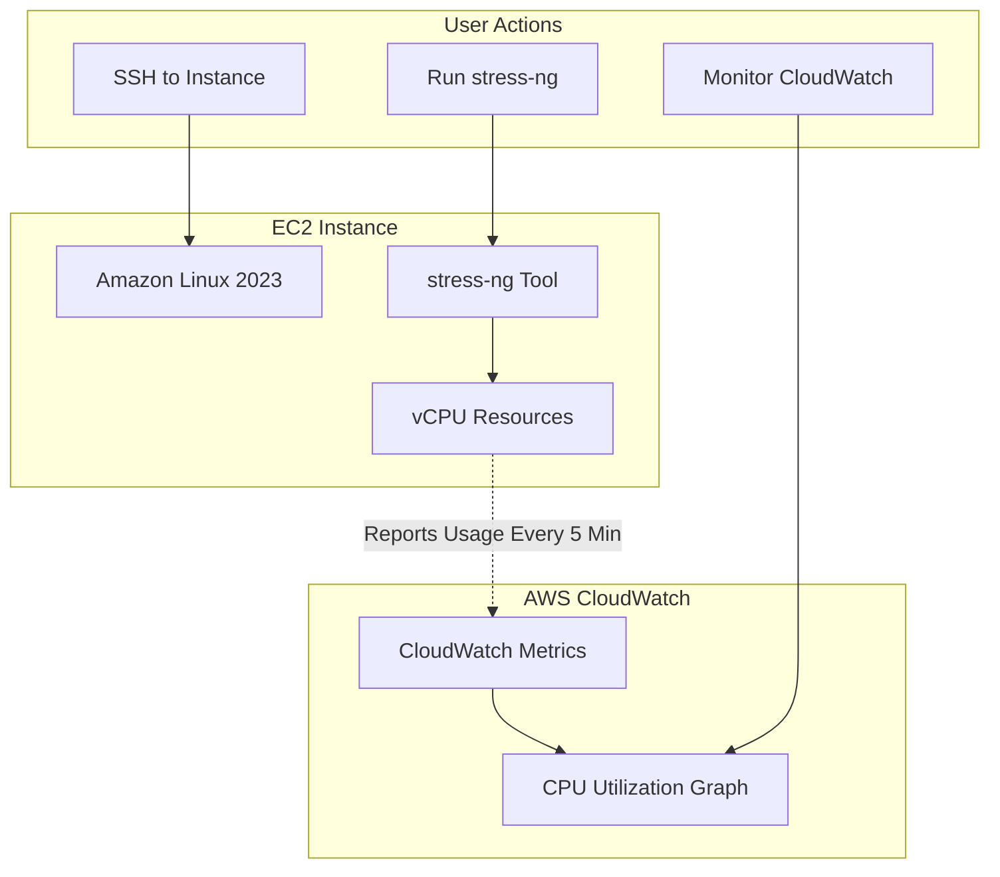

# Stress Testing EC2 Instance with CPU Load Monitoring

**Topics:** EC2, CloudWatch, Performance Testing, stress-ng, Monitoring, Metrics

## Overview

This lab demonstrates systematic load testing of EC2 instances using stress-ng, a Linux tool designed to generate controlled CPU stress. You'll learn how to install testing tools, generate synthetic CPU load, and monitor real-time performance metrics through Amazon CloudWatch. 

## Key Concepts

| Concept | Description |
|---------|-------------|
| stress-ng | Linux command-line tool for generating various system stress tests including CPU, memory, I/O, and network load |
| CPU Utilization | Percentage of CPU capacity currently in use; key metric for monitoring instance performance and Auto Scaling triggers |
| CloudWatch Metrics | Time-series data collected by AWS about resource utilization (CPU, memory, network, disk) for monitoring and alarms |
| Basic Monitoring | Default CloudWatch metric collection at 5-minute intervals; available for all EC2 instances at no charge |
| Detailed Monitoring | Optional CloudWatch metric collection at 1-minute intervals; enables faster response to load changes (additional cost) |
| CPU Workers | Number of parallel processes stress-ng creates to generate load; more workers = higher CPU utilization |
| Timeout | Duration for which stress test runs before automatically stopping (safety mechanism to prevent indefinite load) |
| CloudWatch Dashboard | Visual interface displaying graphs of metrics over time for monitoring instance performance |
| Metric Granularity | Time resolution of data points (1-minute vs 5-minute intervals) affecting monitoring accuracy |
| dnf Package Manager | Next-generation package manager for Amazon Linux 2023 and Red Hat-based distributions (replaces yum) |

### Prerequisites

- AWS account with EC2 and CloudWatch permissions
- Completed basic EC2 labs (launching instances, SSH connectivity)
- EC2 key pair for SSH access (.pem file)
- SSH client (PowerShell, Terminal, or PuTTY)
- Basic understanding of Linux command line


## Architecture Overview

::: details Click to expand Architecture Diagram

:::

## Phase 1: Launch Linux EC2 Instance

1. Sign in to AWS Management Console.

2. Navigate to EC2 service → Click **Launch Instance**.

3. Configure instance details:
   - **Name:** `StressTest-EC2`
   - **AMI:** Amazon Linux 2023 AMI (Free tier eligible)
     - Latest generation with dnf package manager
     - Optimized for AWS performance
   - **Instance type:** `t3.micro`
     - t3.micro: 2 vCPUs, 1 GB RAM (better burst performance)

4. Configure key pair:
   - **Key pair:** Select existing or create new
   - **Private key file format:** `.pem`

5. Configure Network Settings:
   - **VPC:** Default VPC (or custom VPC)
   - **Subnet:** Any public subnet
   - **Auto-assign Public IP:** Enable

6. Configure Security Group:
   - **Create new security group:**
     - **Name:** `StressTest-SG`
     - **Description:** "Allow SSH for stress testing lab"
   - **Inbound rules:**
     - **Rule 1:**
       - **Type:** SSH
       - **Port:** 22
       - **Source:** My IP (recommended for security)
       - **Description:** "SSH access for administration"
     - **Rule 2 (Optional):**
       - **Type:** HTTP
       - **Port:** 80
       - **Source:** 0.0.0.0/0
       - **Description:** "HTTP for optional Apache testing"

7. Configure Storage:
   - **Size:** 8 GiB (default)
   - **Volume type:** gp3 (General Purpose SSD)

8. Review configuration and click **Launch instance**.

9. Wait for instance to be ready:
   - Instance state: Running
   - Status checks: 2/2 checks passed (2-3 minutes)
   - Note the **Public IPv4 address**

## Phase 2: Connect to EC2 Instance

1. Open terminal (PowerShell on Windows, Terminal on macOS/Linux).

2. Navigate to directory containing your `.pem` key file:
   ```bash
   cd ~/Downloads  # macOS/Linux
   cd "C:\Users\YourName\Downloads"  # Windows PowerShell
   ```

3. Set proper key file permissions (if not already done):
   ```bash
   # Linux/macOS
   chmod 400 your-key-file.pem
   
   # Windows PowerShell (run as Administrator)
   icacls .\your-key-file.pem /inheritance:r
   icacls .\your-key-file.pem /grant:r "$env:USERNAME:(R)"
   ```

4. Connect via SSH:
   ```bash
   ssh -i your-key-file.pem ec2-user@<Public-IP-Address>
   ```

5. Accept host key fingerprint:
   - Type `yes` when prompted: "Are you sure you want to continue connecting?"

6. Verify successful connection:
   - Command prompt changes to: `[ec2-user@ip-172-31-x-x ~]$`
   - You're now inside the EC2 instance

## Phase 3: Install Apache Web Server (Optional)

This step is optional but demonstrates a typical instance configuration before stress testing.

1. Update system packages:
   ```bash
   sudo dnf update -y
   ```

> [!NOTE] dnf vs yum
> Amazon Linux 2023 uses `dnf` (Dandified YUM) as the package manager, replacing the older `yum` command. For most operations, they're interchangeable, but dnf offers better performance and dependency resolution.

2. Install Apache HTTP Server:
   ```bash
   sudo dnf install httpd -y
   ```

3. Start Apache service:
   ```bash
   sudo systemctl start httpd
   ```

4. Enable Apache to start on boot:
   ```bash
   sudo systemctl enable httpd
   ```

5. Verify Apache is running:
   ```bash
   sudo systemctl status httpd
   ```
   - Look for "active (running)" in green
   - Press `q` to exit status view

6. Create test webpage with hostname:
   ```bash
   echo "<h1>EC2 Stress Test Demo - $(hostname)</h1>" | sudo tee /var/www/html/index.html
   ```

7. Test in browser (if HTTP port 80 allowed in security group):
   - Navigate to: `http://<Public-IP>`
   - Verify page displays with hostname

> [!TIP] Why Install Apache
> While not required for stress testing, installing Apache demonstrates real-world scenario where you test performance of a web server under load. It also gives you a working service to verify the instance is functioning normally before and after stress testing.

## Phase 4: Install Stress Testing Tool

1. Ensure you're in ec2-user home directory:
   ```bash
   cd ~
   pwd  # Should show: /home/ec2-user
   ```

2. Install stress-ng package:
   ```bash
   sudo dnf install stress-ng -y
   ```

> [!NOTE] stress-ng Availability
> Amazon Linux 2023 includes stress-ng in default repositories. If using older Amazon Linux 2, you may need to install from EPEL: `sudo amazon-linux-extras install epel -y` first.

3. Verify installation:
   ```bash
   stress-ng --version
   ```
   - Expected output: `stress-ng, version 0.xx.xx`

4. View stress-ng help (optional, to understand options):
   ```bash
   stress-ng --help | less
   ```
   - Press spacebar to scroll
   - Press `q` to quit
   - Shows all available stress test options (CPU, memory, I/O, etc.)

## Phase 5: Run CPU Stress Test

Generate controlled CPU load to simulate high-utilization scenarios.

### Understanding the stress-ng Command

```bash
stress-ng --cpu 4 --timeout 120
```

**Parameters explained:**
- `--cpu 4`: Create 4 CPU worker processes
  - Each worker runs math-intensive calculations
  - More workers = higher CPU utilization
- `--timeout 120`: Run for 120 seconds (2 minutes) to prevent infinite load
  
### Execute Stress Test

1. Start the stress test:
   ```bash
   stress-ng --cpu 4 --timeout 120
   ```

2. Observe real-time output:
   ```
   stress-ng: info:  [12345] dispatching hogs: 4 cpu
   stress-ng: info:  [12345] cache allocate: using defaults, shared cache...
   ```

3. Wait for stress test to complete (2 minutes):
   ```
   stress-ng: info:  [12345] successful run completed in 120.02s
   ```

> [!IMPORTANT] Monitoring Delay
> CloudWatch metrics have a **5-minute** delay by default (Basic Monitoring). Even if stress-ng runs for only 2 minutes, CloudWatch may average the spike over its 5-minute collection interval, showing lower-than-actual peaks. For accurate real-time monitoring, enable Detailed Monitoring (1-minute intervals) or run stress tests for at least 6-10 minutes.


> [!TIP] Background Execution
> To run stress test in background and logout:
> ```bash
> nohup stress-ng --cpu 4 --timeout 600 &
> # View output later
> tail -f nohup.out
> ```

## Phase 6: Monitor CPU Utilization in CloudWatch

View performance metrics and verify CloudWatch is capturing the load.

1. In AWS Management Console, navigate to **CloudWatch** service.

2. In left navigation menu, click **Metrics** → **All metrics**.

3. Under "Metrics," click **EC2** and **Per-Instance Metrics**.

4. Find your instance name: `StressTest-EC2`

5. Select the **CPUUtilization** metric:
   - Check the box next to `CPUUtilization` for your instance

6. Configure graph time range and granularity:
   - Click **Custom** time range selector (top right)
   - Set **Relative** time: **Last 1 hour**

7. Observe the CPU graph:
   - **Before stress test:** CPU utilization 0-5% (idle)
   - **During stress test:** CPU utilization spikes to 80-100%
   - **After stress test:** CPU returns to 0-5%

## Phase 7: Real-Time Monitoring with Linux Tools

Monitor CPU usage directly on the instance for immediate feedback.

### Using top Command

1. While logged into EC2 instance:
   ```bash
   top
   ```

2. Key information displayed:
   - **%Cpu(s):** Shows CPU usage breakdown
     - `us`: User space processes (stress-ng will be high here)
     - `sy`: System/kernel processes
     - `id`: Idle (lower = higher load)
   - **PID column:** Process IDs
   - **%CPU column:** Per-process CPU usage

3. Press `1` to display all CPUs individually (for multi-core instances).

### Using htop Command (Enhanced Visualization)

1. Install htop:
   ```bash
   sudo dnf install htop -y
   ```

2. Run htop:
   ```bash
   htop
   ```

3. Features:
   - Color-coded CPU bars (green=user, red=kernel)
   - Visual memory usage
   - Process tree view (F5)
   - Filter and search (F4, F3)

4. Press `q` to quit.

### Monitor While Stress Test Runs

1. Open second SSH session to instance (keep first session for stress-ng).

2. In second session, run:
   ```bash
   htop
   # or
   top
   ```

3. In first session, start stress test:
   ```bash
   stress-ng --cpu 4 --timeout 300
   ```

4. Watch second session:
   - CPU bars jump to 100%
   - Four stress-ng processes appear
   - Real-time visual confirmation of load

> [!TIP] CPU Temperature Monitoring
> AWS abstracts hardware details, but you can monitor system load average:
> ```bash
> uptime
> Output: load average: 4.00, 2.50, 1.20
> First number = 1-min avg (4.00 = very high for 1 vCPU)
> ```

### Validation

::: details Validation

Verify successful completion:

- **EC2 Instance Launch:**
  - Instance state: Running
  - Status checks: 2/2 passed
  - Public IP address assigned
  - SSH connectivity successful

- **Software Installation:**
  - Apache installed and running: `sudo systemctl status httpd` shows "active"
  - stress-ng installed: `stress-ng --version` displays version number
  - htop/top available for monitoring

- **Stress Test Execution:**
  - stress-ng runs without errors
  - Command completes after specified timeout
  - Terminal shows "successful run completed in XXs"
  - During test: top/htop shows 80-100% CPU utilization

- **CloudWatch Metrics:**
  - CPUUtilization metric visible in CloudWatch console
  - Metric shows spike during stress test period
  - Graph displays clear difference between idle and stressed states
  - Metric returns to baseline after stress test completes

- **Expected CPU Values:**
  - Idle: 0-5% CPU utilization
  - Under stress (4 workers, 1 vCPU): 90-100% CPU utilization
  - Under stress (4 workers, 2 vCPUs): 70-100% CPU utilization
  - Post-stress: Returns to 0-5% within 1-2 minutes

:::

### Cost Considerations

::: details Cost Considerations

- **EC2 Instance (t2.micro/t3.micro):**
  - **Free Tier:** 750 hours/month for first 12 months
  - **After Free Tier:** ~$0.0104/hour = ~$7.50/month (us-east-1)
  - **1-hour lab cost:** $0 (free tier) or $0.01 (after free tier)

- **EBS Storage (8 GB gp3):**
  - **Free Tier:** 30 GB/month
  - **Cost:** Covered by free tier
  - **After Free Tier:** $0.08/GB-month = $0.64/month

- **CloudWatch Metrics (Basic Monitoring):**
  - **Free:** EC2 instances include free CloudWatch metrics
  - **Included metrics:** CPUUtilization, NetworkIn, NetworkOut, DiskReadOps, DiskWriteOps (7 total)
  - **No charges** for Basic Monitoring

- **CloudWatch Detailed Monitoring (Optional):**
  - **Cost:** $2.10/instance/month (7 metrics × $0.30/metric)
  - **Per hour:** ~$0.003/hour
  - **Not recommended for this lab** (Basic Monitoring sufficient)

- **Data Transfer:**
  - **SSH traffic:** Negligible (<1 MB for lab)
  - **Inbound:** Free
  - **Outbound:** Covered by 100 GB free tier/month

- **Total Lab Cost (1 hour):**
  - EC2: $0 (free tier) or $0.01
  - Storage: $0 (free tier)
  - Monitoring: $0 (Basic Monitoring)
  - **Total:** ~$0.00-$0.01

:::


### Cleanup

::: details Cleanup

Stop all charges by terminating resources:

### 1. Stop Stress Test (If Running)

If stress-ng is still running:
```bash
# Find stress-ng process
ps aux | grep stress-ng

# Kill the process (if needed)
sudo pkill stress-ng
```

### 2. Disable Detailed Monitoring (If Enabled)

1. Navigate to EC2 → Instances.
2. Select `StressTest-EC2`.
3. Click **Actions** → **Monitor and troubleshoot** → **Manage detailed monitoring**.
4. Uncheck **Enable** → Click **Save**.

### 3. Terminate EC2 Instance

1. Navigate to EC2 → Instances.
2. Select `StressTest-EC2`.
3. Click **Instance state** → **Terminate instance**.
4. Confirm termination (type `terminate` if prompted).
5. Wait for state to change to "Terminated."

> [!NOTE] Termination vs Stop
> - **Terminate:** Permanently deletes instance and attached EBS volumes, stops all charges
> - **Stop:** Keeps EBS volumes (storage charges continue), can restart later
> - **For labs:** Always terminate to ensure zero ongoing costs

### 4. Delete Security Group (Optional)

1. Navigate to EC2 → Security Groups.
2. Select `StressTest-SG`.
3. Click **Actions** → **Delete security groups**.
4. If error "has dependent object," wait 2-3 minutes for network interfaces to detach.
5. Retry deletion.

### 5. Delete Key Pair (Optional)

If created specifically for this lab:
1. Navigate to EC2 → Key Pairs.
2. Select your key pair.
3. Click **Actions** → **Delete**.
4. Confirm deletion.
5. Delete local `.pem` file from your computer.

### Verification

- Instance shows "Terminated" state in EC2 console
- CloudWatch metrics stop updating (no new data points after termination)
- Security group deleted (optional)
- No unexpected charges in Billing dashboard (check after 24 hours)

:::

## Result

You have successfully performed CPU stress testing on an Amazon EC2 instance and monitored the results through CloudWatch metrics. You learned how to generate synthetic load using stress-ng, observe real-time CPU utilization with Linux tools (top/htop), and analyze performance trends through CloudWatch graphs.


## Viva Questions

1. Why does CloudWatch show a lower CPU peak than what you observed in real-time with top/htop?

2. What is the difference between Basic Monitoring and Detailed Monitoring in CloudWatch?

3. Explain what happens when you run stress-ng --cpu 4 on a t2.micro (1 vCPU) instance.

4. Why is the stress-ng timeout parameter important, especially in cloud environments?

5. How would you use stress testing to validate an Auto Scaling Group configuration?

::: details Quick Start Commands

```bash
# Connect to EC2
ssh -i your-key-file.pem ec2-user@<Public-IP-Address>
# Update packages
sudo dnf update -y

# Install Apache
sudo dnf install httpd -y
sudo systemctl start httpd
sudo systemctl enable httpd

# Install stress-ng
sudo dnf install stress-ng -y

# Run CPU stress test
stress-ng --cpu 4 --timeout 120

# Monitor CPU usage
top
# or
htop
```
:::