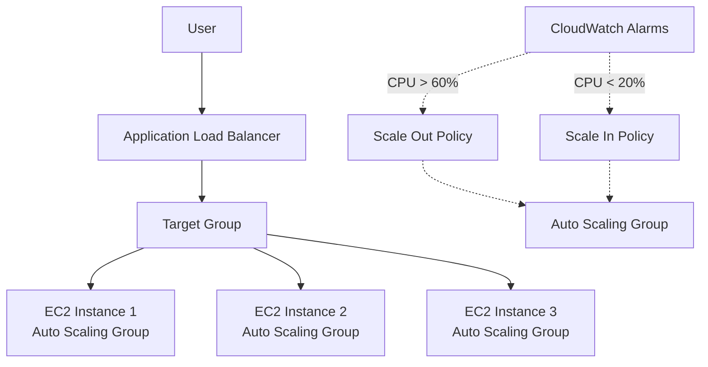
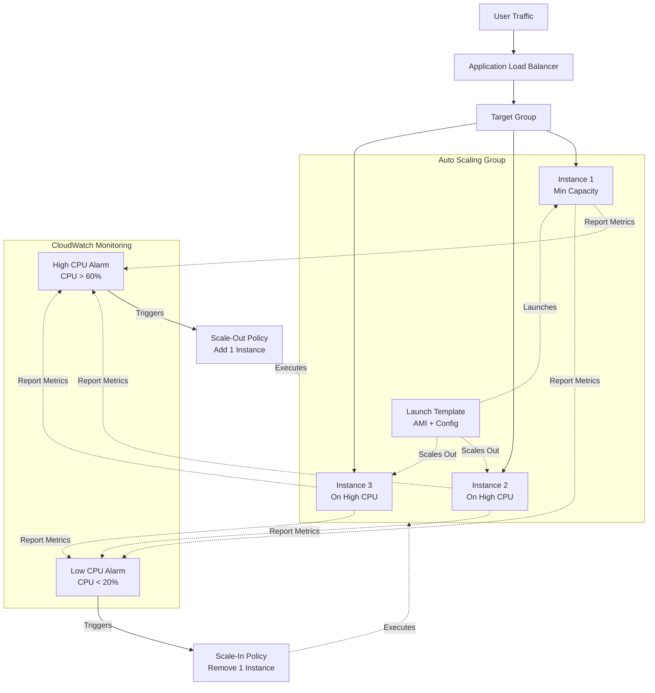

# Auto Scaling Group with Dynamic CPU-Based Scaling

**Topics:** Auto Scaling Groups, Launch Templates, CloudWatch Alarms, Dynamic Scaling Policies, Stress Testing, High Availability

## Overview

Auto Scaling Groups (ASG) automate the process of dynamically adjusting capacity based on real-time demand. When CPU utilization exceeds thresholds, ASG automatically launches new instances; when demand decreases, ASG terminates excess instances to reduce costs.

This comprehensive lab demonstrates building auto-scaling architecture. You'll create a Launch Template defining instance configuration, configure an Auto Scaling Group with minimum/maximum capacity constraints, integrate with Application Load Balancer for traffic distribution, create CloudWatch Alarms to monitor CPU metrics, attach dynamic scaling policies that respond to alarms, and validate the entire system through stress testing.

## Key Concepts

| Concept | Description |
|---------|-------------|
| Auto Scaling Group (ASG) | AWS service that automatically adjusts the number of EC2 instances based on demand, health checks, and scaling policies |
| Launch Template | Reusable configuration blueprint specifying AMI, instance type, key pair, security groups, and user data for launching instances |
| Desired Capacity | Target number of instances ASG attempts to maintain; can change dynamically based on scaling policies |
| Minimum Capacity | Lowest number of instances ASG will maintain; prevents scaling below this threshold even under zero load |
| Maximum Capacity | Highest number of instances ASG can launch; prevents runaway scaling and controls maximum costs |
| Scaling Policy | Rules defining when and how to add or remove instances (Simple Scaling, Step Scaling, Target Tracking) |
| Simple Scaling | Policy that adds or removes fixed number of instances when CloudWatch alarm triggers (one action per alarm) |
| CloudWatch Alarm | Automated monitoring that triggers actions when metrics exceed thresholds for specified duration |
| Scale-Out | Process of adding instances to handle increased load (horizontal scaling up) |
| Scale-In | Process of removing instances when load decreases (horizontal scaling down) |
| Cooldown Period | Wait time after scaling activity before ASG can initiate another scaling action (prevents oscillation) |
| Health Check Grace Period | Time ASG waits before checking instance health after launch (allows application startup time) |
| Target Group Integration | ASG automatically registers new instances with load balancer target groups for seamless traffic distribution |

## Prerequisites

- Completed Lab 12 (Load-Balanced Web Application with ALB and Custom AMI)
- Completed Lab 13 (Stress Testing EC2 Instance)
- Existing resources:
  - Custom AMI with Apache web server and custom homepage
  - Application Load Balancer (ALB) in active state
  - Target Group configured for HTTP port 80
  - VPC with at least 2 public subnets in different Availability Zones
  - Security group allowing SSH (22) and HTTP (80)
  - EC2 key pair for SSH access
- Understanding of CloudWatch metrics and alarms
- Familiarity with stress-ng tool for CPU load testing
- IAM permissions for Auto Scaling, CloudWatch, and EC2

## Architecture Overview

::: details Click to expand Architecture Diagram

:::


::: details Click to expand Architecture Diagram

:::

## Phase 1: Create Launch Template

Launch Templates define the instance configuration that ASG uses when launching new instances.

1. Sign in to AWS Management Console.

2. Navigate to EC2 service.

3. In left navigation, scroll down to **Instances** section → Click **Launch Templates**.

4. Click **Create launch template** button.

5. Configure template details:
   - **Launch template name:** `LT-WebServer`
   - **Template version description:** "Web server template for Auto Scaling"
   - **Auto Scaling guidance:** Check "Provide guidance to help me set up a template that I can use with EC2 Auto Scaling"

6. Configure Application and OS Images (AMI):
   - Click **My AMIs** tab
   - Select your custom AMI: `WebServer-AMI` (created in Lab 12)
   - Verify it shows the correct AMI ID

> [!IMPORTANT] AMI Selection
> You must select the custom AMI containing your pre-configured web server. If you launch from base Amazon Linux AMI, instances won't have Apache installed and won't serve web pages correctly.

7. Configure Instance type:
   - **Instance type:** `t3.micro`
   - 2 vCPUs, 1 GB RAM

8. Configure Key pair:
   - **Key pair name:** Select your existing key pair (e.g., `my-key-pair.pem`)
   - Required for SSH troubleshooting

9. Configure Network settings:
   - **Subnet:** Don't include in launch template
     - ASG will select subnets automatically based on ASG configuration
     - This provides flexibility for multi-AZ deployment
   - **Firewall (security groups):** Select existing security group
     - Choose security group allowing HTTP (80) and SSH (22)

10. Configure Storage:
    - **Volume 1 (AMI Root):**
      - Size: 8 GiB
      - Volume type: gp3
      - Delete on termination: Yes (recommended)

11. Review all settings:
    - Verify AMI is your custom web server image
    - Verify instance type is t3.micro
    - Verify security group allows HTTP and SSH
    - Verify storage configured correctly

12. Click **Create launch template**.

13. Verify creation:
    - Success message appears
    - Template shows in Launch Templates list
    - Status: Available
    - Note the template ID (lt-xxxxxxxxxxxxx)

> [!NOTE] Launch Template vs Launch Configuration
> Launch Templates are the modern replacement for Launch Configurations. They support versioning, allow modifications, can launch instances directly, and are recommended by AWS. 
> Launch Configurations are legacy and should not be used for new deployments.

## Phase 2: Create Auto Scaling Group

Configure the ASG to automatically manage instance count based on demand.

1. In EC2 console left navigation, scroll down to **Auto Scaling** section → Click **Auto Scaling Groups**.

2. Click **Create Auto Scaling group** button.

### Step 1: Choose Launch Template

1. Configure ASG name and template:
   - **Auto Scaling group name:** `ASG-WebServer`
   - **Launch template:** Select `LT-WebServer`
   - **Version:** Latest (recommended for automatic updates)

2. Click **Next**.

### Step 2: Choose Instance Launch Options

1. Configure network:
   - **VPC:** Select your VPC (Default VPC or custom VPC from Lab 10)
   - **Availability Zones and subnets:** Select at least **2 subnets**
     - Choose subnets in different Availability Zones (e.g., us-east-1a, us-east-1b)
     - Select public subnets (with route to Internet Gateway)
     - This ensures high availability across multiple data centers

2. Click **Next**.

### Step 3: Configure Advanced Options

1. Load balancing configuration:
   - **Load balancing:** Choose "Attach to an existing load balancer"
   - **Choose from your load balancer target groups:** Select option
   - **Existing load balancer target groups:** Select `WebApp-TG` (created in Lab 12)

> [!NOTE] Target Group Registration
> ASG automatically registers new instances with the Target Group. When ASG launches instances, they're immediately added to the Target Group. ALB performs health checks and starts routing traffic once instances pass health checks.

2. Health checks:
   - **Health check type:** 
     - Check ☑ **EC2** (checks instance status)
     - Check ☑ **ELB** (checks application health via load balancer)
   - **Health check grace period:** 300 seconds (5 minutes)
     - Allows time for Apache to start before health checks begin

> [!TIP] Health Check Grace Period
> 300 seconds prevents ASG from terminating instances before they finish initializing. If set too low (e.g., 60 seconds), ASG may terminate instances while Apache is still starting, creating a "launch-terminate loop." If instances use UserData scripts, increase to 600+ seconds.

3. Additional settings (optional):
   - **Enable group metrics collection within CloudWatch:** Check this box
     - Provides additional ASG-level metrics (GroupDesiredCapacity, GroupInServiceInstances)
   - **Default instance warmup:** 60 seconds

4. Click **Next**.

### Step 4: Configure Group Size and Scaling Policies

1. Group size configuration:
   - **Desired capacity:** 1
     - Number of instances ASG launches immediately
   - **Minimum capacity:** 1
     - ASG will never scale below 1 instance
     - Ensures at least one instance always running
   - **Maximum capacity:** 3
     - ASG will never scale above 3 instances
     - Prevents runaway costs if alarms malfunction

> [!NOTE] Capacity Explanation
> - **Minimum = 1:** Ensures website always available (at least 1 instance)
> - **Desired = 1:** Start with 1 instance (baseline capacity)
> - **Maximum = 3:** Allow scaling to 3 instances during high load
> - If desired=2, ASG launches 2 instances immediately

2. Scaling policies:
   - **Scaling policies:** Select "No scaling policies"
   - We'll add scaling policies separately in Phase 3

> [!TIP] Why Skip Scaling Policies Here
> AWS offers Target Tracking Scaling (simple setup) in this wizard, but we're using Simple Scaling with CloudWatch Alarms for educational purposes to understand the complete workflow. In production, Target Tracking is often preferred for its simplicity.

3. Instance maintenance policy:
   - Leave default settings

4. Click **Next**.

### Step 5: Review and Create

1. Review all configuration:
   - Launch template: LT-WebServer
   - VPC and subnets: 2+ subnets in different AZs
   - Load balancer: Attached to WebApp-TG
   - Group size: Min=1, Desired=1, Max=3
   - Health checks: EC2 + ELB enabled

2. Click **Create Auto Scaling group**.

3. Verify ASG created successfully:
   - Navigate to Auto Scaling Groups
   - `ASG-WebServer` appears in list
   - Status: Shows capacity information

### Phase 2 Verification

1. Check **Activity** tab:
   - Shows "Launching a new EC2 instance" activity
   - Wait for status: "Successful"

2. Check **Instance management** tab:
   - Shows 1 instance in "InService" lifecycle state
   - Health status: "Healthy" (may take 3-5 minutes)

3. Navigate to EC2 → Instances:
   - See new instance launched by ASG
   - Name includes ASG name (e.g., "ASG-WebServer")
   - Instance state: Running

4. Navigate to Target Groups → Select WebApp-TG → Targets tab:
   - Instance registered automatically
   - Health status: "Healthy" (wait 30-60 seconds for health checks)

5. Test ALB DNS name in browser:
   - Should display your custom web page
   - Refresh multiple times (will show same instance since only 1 running)

> [!NOTE] First Instance Launch
> ASG launches the first instance to meet desired capacity (1). This happens automatically—you don't manually register instances. The instance appears in both EC2 Instances list and Target Group targets.

## Phase 3: Create CloudWatch Alarms for Scaling

Create alarms that monitor CPU and trigger scaling policies.

### Create High CPU Alarm (Scale-Out Trigger)

1. Navigate to **CloudWatch** service.

2. In left navigation, click **Alarms** → **All alarms**.

3. Click **Create alarm** button.

4. Click **Select metric**.

5. Select metric source:
   - Click **EC2**
   - Click **By Auto Scaling Group**
   - Find and check **CPUUtilization** for `ASG-WebServer`
   - Click **Select metric**

> [!IMPORTANT] Metric Selection
> Select "By Auto Scaling Group" (not "Per-Instance Metrics"). This monitors the average CPU across all instances in the ASG, which is the correct metric for scaling decisions.

6. Configure metric and conditions:
   - **Statistic:** Average
   - **Period:** 1 minute
     - How often CloudWatch evaluates the condition
     - Shorter period = faster scaling response
   - **Conditions:**
     - **Threshold type:** Static
     - **Whenever CPUUtilization is:** Greater than 60
     - **Threshold value:** 60

> [!NOTE] Threshold Selection
> - **60% threshold:** Moderate load, typical for scale-out
> - **Lower threshold (40%):** More aggressive scaling, higher costs
> - **Higher threshold (80%):** Slower scaling, may impact performance
> - Adjust based on your application's requirements

7. Click **Next**.

8. Configure actions:
   - **Alarm state trigger:** In alarm
   - **Send a notification to:** Select "Remove"
     - We don't need SNS notifications for this lab
   - **Auto Scaling action:** Skip (we'll attach scaling policy separately)

> [!TIP] No Actions Configuration
> Don't configure any actions on this screen. We'll create scaling policies separately and link them to the alarms. If you see a warning "No actions configured," click **Proceed without actions**.

9. Click **Next**.

10. Configure alarm name:
    - **Alarm name:** `ASG-CPU-High-60`
    - **Alarm description:** "Trigger scale-out when CPU > 60%"

11. Click **Next**.

12. Review configuration:
    - Metric: ASG-WebServer CPUUtilization
    - Condition: Average > 60 for 1 minute
    - Actions: None (will add via scaling policy)

13. Click **Create alarm**.

14. Verify alarm created:
    - Shows in Alarms list
    - State: "OK" (CPU below 60%)
    - Or "Insufficient data" (wait 1-2 minutes for first data point)

### Create Low CPU Alarm (Scale-In Trigger)

1. In CloudWatch Alarms, click **Create alarm** again.

2. Click **Select metric** → **EC2** → **By Auto Scaling Group**.

3. Check **CPUUtilization** for `ASG-WebServer` → Click **Select metric**.

4. Configure metric and conditions:
   - **Statistic:** Average
   - **Period:** 1 minute
   - **Conditions:**
     - **Threshold type:** Static
     - **Whenever CPUUtilization is:** Lower than 20
     - **Threshold value:** 20

> [!NOTE] Scale-In Threshold
> - **20% threshold:** Conservative scale-in, keeps instances longer
> - **Higher threshold (40%):** Aggressive scale-in, reduces costs faster
> - Set lower than scale-out threshold to create "hysteresis" (prevents oscillation)

5. Click **Next**.

6. Configure actions:
   - Skip SNS notification
   - Skip Auto Scaling action
   - Click **Proceed without actions**

7. Click **Next**.

8. Configure alarm name:
   - **Alarm name:** `ASG-CPU-Low-20`
   - **Alarm description:** "Trigger scale-in when CPU < 20%"

9. Click **Next** → Review → Click **Create alarm**.

10. Verify both alarms exist:
    - `ASG-CPU-High-60` (State: OK or Insufficient data)
    - `ASG-CPU-Low-20` (State: OK or Insufficient data)

## Phase 4: Create and Attach Scaling Policies

Link the CloudWatch alarms to Auto Scaling actions.

### Create Scale-Out Policy (Add Instances)

1. Navigate to **EC2** → **Auto Scaling Groups**.

2. Select `ASG-WebServer`.

3. Click **Automatic scaling** tab.

4. Under **Dynamic scaling policies**, click **Create dynamic scaling policy** button.

5. Configure policy:
   - **Policy type:** Simple scaling
     - Adds/removes fixed number of instances per alarm trigger
   - **Scaling policy name:** `ScaleOut-CPU60`
   - **CloudWatch alarm:** Select `ASG-CPU-High-60`
   - **Take the action:** Add
   - **Capacity units:** 1
     - Adds 1 instance when alarm triggers
   - **And then wait:** 300 seconds
     - Cooldown period before next scaling action

> [!IMPORTANT] Cooldown Period
> 300 seconds (5 minutes) prevents rapid successive scaling. After adding instance, ASG waits 5 minutes before considering another scale-out, allowing the new instance to start serving traffic and metrics to stabilize.

6. Click **Create** button.

7. Verify policy created:
   - Shows in Dynamic scaling policies list
   - Policy name: ScaleOut-CPU60
   - Alarm: ASG-CPU-High-60

### Create Scale-In Policy (Remove Instances)

1. Still in **Automatic scaling** tab, click **Create dynamic scaling policy** again.

2. Configure policy:
   - **Policy type:** Simple scaling
   - **Scaling policy name:** `ScaleIn-CPU20`
   - **CloudWatch alarm:** Select `ASG-CPU-Low-20`
   - **Take the action:** Remove
   - **Capacity units:** 1
     - Removes 1 instance when alarm triggers
   - **And then wait:** 300 seconds

3. Click **Create** button.

4. Verify both policies exist:
   - ScaleOut-CPU60 (adds 1 when CPU > 60%)
   - ScaleIn-CPU20 (removes 1 when CPU < 20%)

> [!NOTE] Policy Status
> Policies show "Waiting" status initially. They activate when the linked CloudWatch alarms change state (OK → ALARM).

## Phase 5: Install Stress Testing Tool

Prepare to validate Auto Scaling by generating CPU load.

1. Navigate to **EC2** → **Instances**.

2. Find the instance launched by ASG:
   - Look for instance with ASG name in tags
   - Or check ASG → Instance management tab for instance ID

3. Select the instance → Click **Connect**.

4. Use **EC2 Instance Connect** or **SSH**:
   - For SSH: `ssh -i your-key.pem ec2-user@<Public-IP>`

5. Update system and install stress-ng:
   ```bash
   sudo dnf update -y
   sudo dnf install stress-ng -y
   ```

6. Verify installation:
   ```bash
   stress-ng --version
   ```

> [!TIP] VPC Internet Access Required
> If `dnf install` fails with "Cannot download," ensure:
> - Instance is in public subnet with route to Internet Gateway
> - Or in private subnet with route to NAT Gateway
> - Security group allows outbound HTTPS (443) for package downloads

## Phase 6: Trigger Scale-Out Event

Generate high CPU load to trigger automatic scaling.

### Run Stress Test

1. While connected to ASG instance via SSH:
   ```bash
   stress-ng --cpu 4 --timeout 300
   ```
   - Creates 4 CPU workers
   - Runs for 5 minutes (300 seconds)
   - Pushes CPU to 90-100%

2. Monitor command output:
   ```
   stress-ng: info:  [xxxxx] dispatching hogs: 4 cpu
   stress-ng: info:  [xxxxx] cache allocate: using defaults...
   ```

3. Keep SSH session open or run in background:
   ```bash
   # Run in background
   nohup stress-ng --cpu 4 --timeout 300 &
   # Logout (stress continues)
   exit
   ```

### Monitor CloudWatch Alarm

1. Navigate to **CloudWatch** → **Alarms**.

2. Watch `ASG-CPU-High-60` alarm:
   - Initial state: OK (CPU < 60%)
   - After 1-2 minutes: State changes to **ALARM** (CPU > 60%)
   - Red color indicates alarm triggered

3. Observe alarm graph:
   - CPU line crosses 60% threshold
   - Alarm evaluates true for 1 datapoint
   - State change: OK → ALARM

### Monitor Auto Scaling Activity

1. Navigate to **EC2** → **Auto Scaling Groups** → Select `ASG-WebServer`.

2. Click **Activity** tab.

3. Watch for new activity:
   - **Status:** "Launching a new EC2 instance"
   - **Cause:** "At 2026-01-17 10:23:00 UTC a monitor alarm arn:aws:cloudwatch:... in ALARM state triggered policy ScaleOut-CPU60"
   - Shows which alarm triggered the scaling

4. Wait 2-4 minutes:
   - Activity status changes to: **Successful**
   - Message: "Launching a new EC2 instance: i-xxxxxxxxx"

5. Click **Instance management** tab:
   - Now shows **2 instances** in "InService" state
   - Desired capacity automatically increased from 1 to 2

6. Navigate to **EC2** → **Instances**:
   - See 2 instances running with ASG name
   - New instance just launched

7. Navigate to **Target Groups** → Select `WebApp-TG` → **Targets** tab:
   - Shows 2 registered targets
   - New instance initially "Initial" status
   - Wait 30-60 seconds → Both show "Healthy"

> [!NOTE] Scaling Timeline
> - **T+0 min:** Stress test starts, CPU rises
> - **T+1 min:** CloudWatch alarm triggers (ALARM state)
> - **T+1 min:** ASG initiates scale-out
> - **T+2 min:** New instance launching
> - **T+3 min:** Instance running, registered with Target Group
> - **T+4 min:** Instance passes health checks, receives traffic

### Test Load Balancing Across 2 Instances

1. Copy ALB DNS name.

2. Open browser → Navigate to ALB DNS:
   ```
   http://WebApp-ALB-xxxxx.us-east-1.elb.amazonaws.com
   ```

3. Refresh browser multiple times:
   - First refresh: Shows Instance 1 hostname
   - Second refresh: Shows Instance 2 hostname
   - Third refresh: Shows Instance 1 hostname
   - Load balancing confirmed!

> [!TIP] Browser Caching
> If you see the same instance repeatedly, clear browser cache or use incognito mode. Some browsers cache responses aggressively.

## Phase 7: Trigger Scale-In Event

Allow CPU to drop and observe automatic instance termination.

### Stop Stress Test

1. If stress test still running, SSH to instance:
   ```bash
   # Find stress-ng process
   ps aux | grep stress-ng
   
   # Kill it if needed
   sudo pkill stress-ng
   ```

2. Or wait for 5-minute timeout to complete automatically.

### Monitor CPU Drop

1. Navigate to **CloudWatch** → **Alarms**.

2. Watch `ASG-CPU-High-60` alarm:
   - After stress stops: CPU drops below 60%
   - State changes: ALARM → OK

3. Watch `ASG-CPU-Low-20` alarm:
   - After 2-3 minutes of idle: CPU drops below 20%
   - State changes: OK → ALARM

### Monitor Scale-In Activity

1. Navigate to **Auto Scaling Groups** → Select `ASG-WebServer` → **Activity** tab.

2. Wait 3-5 minutes after CPU drops below 20%:
   - New activity appears: "Terminating EC2 instance"
   - **Cause:** "At 2026-01-17 10:35:00 UTC a monitor alarm arn:aws:cloudwatch:... in ALARM state triggered policy ScaleIn-CPU20"

3. Wait for activity status: **Successful**

4. Click **Instance management** tab:
   - Now shows **1 instance** in "InService"
   - Desired capacity automatically decreased from 2 to 1

5. Navigate to **EC2** → **Instances**:
   - One instance terminated (state: Terminating or Terminated)
   - One instance running (minimum capacity maintained)

6. Navigate to **Target Groups** → **Targets** tab:
   - Shows 1 healthy target
   - Terminated instance shows "Draining" then disappears

> [!NOTE] Scale-In Timing
> Scale-in is intentionally slower than scale-out:
> - CloudWatch must detect low CPU for evaluation period
> - Cooldown period prevents premature termination
> - Total time: 5-10 minutes from stress stop to termination
> - This prevents oscillation (rapid add/remove cycles)

## Validation

::: details Validation

Verify all components working correctly:

- **Launch Template:**
  - Template `LT-WebServer` exists with correct AMI
  - Instance type: t3.micro
  - Security group allows HTTP (80) and SSH (22)
  - Template version shows "Latest" or specific version number

- **Auto Scaling Group:**
  - ASG `ASG-WebServer` created and active
  - Capacity: Min=1, Desired=1-2, Max=3
  - Attached to Target Group: WebApp-TG
  - Health check type: EC2 + ELB
  - Covers 2+ Availability Zones

- **CloudWatch Alarms:**
  - `ASG-CPU-High-60` exists (triggers at CPU > 60%)
  - `ASG-CPU-Low-20` exists (triggers at CPU < 20%)
  - Both alarms monitor ASG average CPU (not individual instances)
  - Alarms change state based on load (OK ↔ ALARM)

- **Scaling Policies:**
  - `ScaleOut-CPU60` attached to high CPU alarm (adds 1 instance)
  - `ScaleIn-CPU20` attached to low CPU alarm (removes 1 instance)
  - Cooldown period: 300 seconds configured
  - Policies show in ASG Automatic scaling tab

- **Auto Scaling Behavior:**
  - **Scale-out test:** High CPU triggers alarm → ASG launches new instance → Instance registers with Target Group → Health checks pass → Traffic distributed
  - **Scale-in test:** Low CPU triggers alarm → ASG terminates instance → Desired capacity reduces → Single instance remains (minimum)
  - Activity history shows all scaling events with timestamps and causes

- **Load Balancer Integration:**
  - New instances automatically registered with Target Group
  - Terminated instances automatically deregistered
  - ALB distributes traffic across all healthy instances
  - No manual Target Group management required

:::

## Cost Considerations

::: details Cost Considerations

- **Auto Scaling Group Service:** Free
  - No charges for ASG itself, only for launched instances

- **EC2 Instances (Variable):**
  - **Minimum cost (1 instance):** ~$0.0104/hour = ~$7.50/month
  - **During scale-out (2-3 instances):** ~$0.0208-$0.0312/hour
  - **Free Tier:** 750 hours/month covers 1 instance 24/7
  - **After Free Tier:** Pay for all running instances

- **Application Load Balancer:**
  - **Hourly:** ~$0.0225/hour = ~$16.20/month
  - **LCU charges:** $0.008 per LCU-hour (minimal for lab traffic)
  - **No free tier** for ALB

- **CloudWatch:**
  - **Alarms:** First 10 alarms free, then $0.10/alarm/month
  - **2 alarms in this lab:** Free
  - **Metrics (Basic Monitoring):** Free for EC2 instances
  - **Detailed Monitoring (Optional):** $2.10/instance/month

- **Data Transfer:**
  - **Between AZs:** $0.01/GB each direction (if instances in different AZs)
  - **Outbound to internet:** First 100 GB free, then $0.09/GB
  - **ALB to instances:** Free within same AZ

- **Total Cost Examples:**

  **Scenario 1: 1-hour lab (Free Tier)**
  - 1 instance running 1 hour: $0 (free tier)
  - ALB 1 hour: $0.02
  - CloudWatch alarms: $0 (free)
  - **Total: ~$0.02**

  **Scenario 2: 24/7 for 30 days (After Free Tier)**
  - 1 instance (minimum, always running): ~$7.50
  - Occasional scale-out (2-3 instances for 10% of time): ~$2.25
  - ALB: ~$16.20
  - CloudWatch: $0 (2 alarms free)
  - **Total: ~$26/month**

  **Scenario 3: High traffic with frequent scaling**
  - Average 2.5 instances running: ~$18.75
  - ALB + LCU charges: ~$20
  - Data transfer (cross-AZ): ~$2
  - **Total: ~$40/month**

:::

## Cleanup

::: details Cleanup

Delete resources in correct order to avoid dependency errors:

### 1. Delete Auto Scaling Group

1. Navigate to **EC2** → **Auto Scaling Groups**.

2. Select `ASG-WebServer`.

3. Click **Delete** button.

4. Confirmation dialog:
   - Type `delete` to confirm
   - Click **Delete**

5. ASG deletion triggers:
   - All scaling policies deleted automatically
   - All instances terminated automatically
   - Target Group deregistration automatic

6. Wait 2-3 minutes:
   - ASG removed from list
   - Instances show "Terminating" then "Terminated"

> [!IMPORTANT] ASG Deletes Instances
> When you delete ASG, AWS automatically terminates all instances it manages. You don't need to manually terminate them. If you terminate instances manually first, ASG will launch new ones to maintain desired capacity.

### 2. Delete CloudWatch Alarms

1. Navigate to **CloudWatch** → **Alarms**.

2. Select both alarms:
   - `ASG-CPU-High-60`
   - `ASG-CPU-Low-20`

3. Click **Actions** → **Delete**.

4. Confirm deletion.

### 3. Delete Launch Template

1. Navigate to **EC2** → **Launch Templates**.

2. Select `LT-WebServer`.

3. Click **Actions** → **Delete template**.

4. Confirm deletion (type `delete`).

### 4. Delete Application Load Balancer (If Not Needed)

1. Navigate to **EC2** → **Load Balancers**.

2. Select `WebApp-ALB`.

3. Click **Actions** → **Delete load balancer**.

4. Type `confirm` → Click **Delete**.

5. Wait for deletion (2-3 minutes).

### 5. Delete Target Group (If Not Needed)

1. Navigate to **EC2** → **Target Groups**.

2. Select `WebApp-TG`.

3. Click **Actions** → **Delete**.

4. Confirm deletion.

### 6. Deregister AMI and Delete Snapshot (If Not Needed)

1. Navigate to **EC2** → **AMIs**.

2. Select `WebServer-AMI`.

3. Click **Actions** → **Deregister AMI**.

4. Confirm deregistration.

5. Navigate to **Snapshots**.

6. Find snapshot associated with AMI (check description).

7. Select snapshot → **Actions** → **Delete snapshot**.

8. Confirm deletion.

### 7. Delete Security Groups (Optional)

1. Navigate to **EC2** → **Security Groups**.

2. Select security groups created for this lab.

3. Click **Actions** → **Delete security groups**.

4. If error "has dependent object," wait 2-3 minutes for network interfaces to detach.

5. Retry deletion.
:::

### Verification

- ASG removed from Auto Scaling Groups list
- All ASG-managed instances terminated
- CloudWatch alarms deleted
- Launch Template deleted
- ALB and Target Group deleted (if applicable)
- AMI deregistered and snapshot deleted (if applicable)
- No unexpected charges in Billing dashboard (check after 24 hours)

## Result

You have successfully deployed a production-ready auto-scaling infrastructure that automatically adjusts capacity based on CPU load. The system demonstrated self-healing capabilities by launching new instances during high demand and terminating excess instances during low demand, all without manual intervention.

## Viva Questions

1. Explain the complete workflow from high CPU detection to new instance serving traffic.

2. Why do we need both a minimum capacity and a maximum capacity in Auto Scaling Groups?

3. What is the purpose of the cooldown period, and what problems does it prevent?

4. How does Auto Scaling Group integration with Target Group differ from manually registering instances?

5. What would happen if you set the scale-in threshold higher than the scale-out threshold (e.g., scale-out at 40%, scale-in at 60%)?
