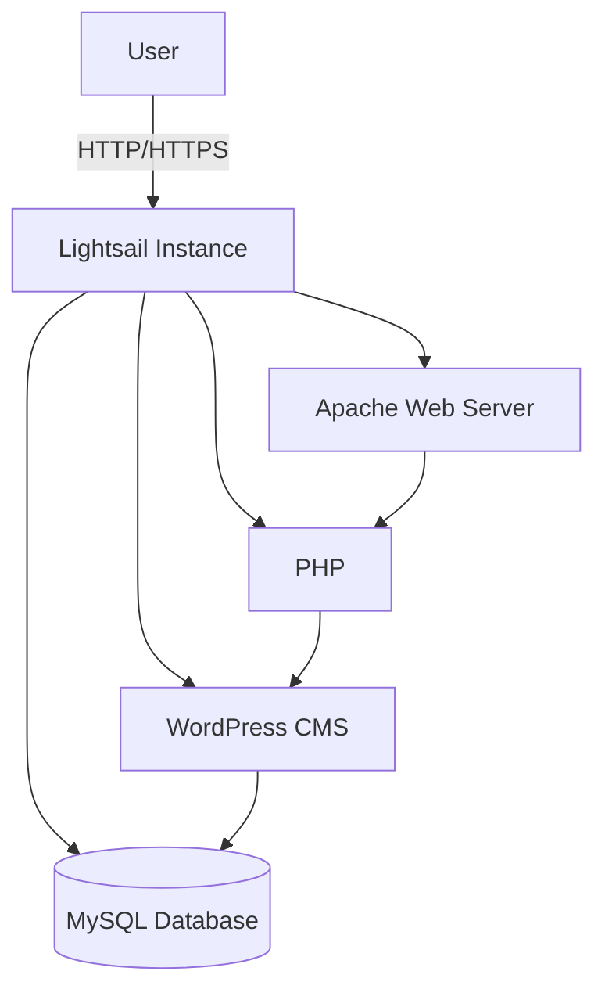
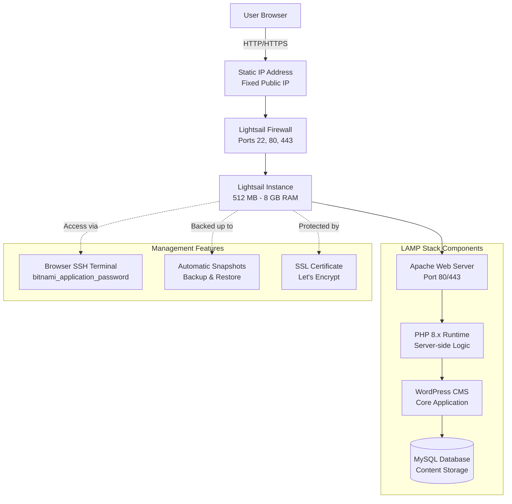

# WordPress Website on Amazon Lightsail

## Overview

This lab guides you through deploying a WordPress website using Amazon Lightsail, AWS's simplified cloud platform. You'll create a virtual server, install WordPress with one-click deployment, configure the site, and secure it with HTTPS and backups.

## Key Concepts

| Concept | Description |
|---------|-------------|
| Amazon Lightsail | AWS's simplified cloud platform offering virtual servers with fixed monthly pricing and easy management interface |
| WordPress Blueprint | Pre-configured image containing complete LAMP stack (Linux, Apache, MySQL, PHP) with WordPress installed and ready |
| LAMP Stack | Common web server architecture: **L**inux OS, **A**pache HTTP server, **M**ySQL database, **P**HP programming language |
| Static IP | Fixed public IP address that remains constant across instance stop/start cycles (prevents DNS breakage) |
| Bitnami | Software packaging service that creates pre-configured application images; Lightsail WordPress uses Bitnami packaging |
| SSL Certificate | Free HTTPS encryption certificate from Let's Encrypt integrated with Lightsail (secures data transmission) |
| Snapshots | Point-in-time backups capturing entire instance state (OS, files, database, configuration) for disaster recovery |
| WordPress Admin Dashboard | `/wp-admin` interface for managing site content, themes, plugins, users, and settings |
| Themes | Design templates controlling website appearance (layout, colors, typography) without coding |
| Plugins | Extensions adding functionality (SEO, security, forms, caching) to WordPress core |
| Permalinks | URL structure for posts and pages (e.g., `example.com/post-name` vs `example.com/?p=123`) |

## Prerequisites

- Active AWS account with billing enabled
- Payment method configured (credit card or AWS promotional credits)
- Free-tier eligibility for Lightsail (first 750 hours free for first-time users)
- Basic familiarity with web interfaces and content management systems (optional)
- Understanding of domain names and DNS (optional, for custom domain setup)
- Browser with pop-up blocker disabled (for SSH console)

## Architecture Overview

::: details Click to expand Architecture Diagram

:::

::: details Click to expand Architecture Diagram

:::


## Phase 1: Create Lightsail Instance with WordPress

### Step 1: Access Lightsail Console

1. Sign in to AWS Management Console.

2. In services search, type **Lightsail** → Click **Lightsail**.

3. Lightsail dashboard opens (separate from main AWS console).

> [!TIP] Lightsail Separate Interface
> Lightsail has its own simplified UI distinct from the main AWS console. This isolation keeps the interface beginner-friendly without overwhelming options.

### Step 2: Create New Instance

1. Click **Create instance** button.

2. Lightsail instance creation wizard opens.

### Step 3: Select Instance Location

1. **Instance location:** 
   - Region: Choose closest region to your target audience
   - Example: **Virginia (us-east-1)** for USA
   - Availability Zone: Select **Automatic** (Lightsail chooses optimal zone)

### Step 4: Select Platform and Blueprint

1. **Select a platform:**
   - Choose: **Linux/Unix**
   - (Windows available but costs more; WordPress runs best on Linux)

2. **Select a blueprint:**
   - Choose: **Apps + OS** tab
   - Select: **WordPress**

> [!IMPORTANT] WordPress Blueprint Contents
> This blueprint includes complete Bitnami LAMP stack:
> - **OS:** Debian 11 Linux
> - **Web Server:** Apache 2.4
> - **Database:** MySQL 8.0 or MariaDB 10.6
> - **Language:** PHP 8.1+
> - **Application:** WordPress (latest stable version)
> All configured and integrated automatically—no manual setup required.

### Step 5: Choose Instance Plan

1. **Select bundle (pricing plan):**

   **Free-Tier Eligible (First 3 Months):**
   - **$3.50/month:** 512 MB RAM, 1 vCPU, 20 GB SSD, 1 TB transfer
     - Free for first 750 hours (≈31 days for first-time Lightsail users)
     - Limited performance (slow with multiple concurrent users)

   **Recommended for Production:**
   - **$5/month:** 1 GB RAM, 1 vCPU, 40 GB SSD, 2 TB transfer

2. For this lab, select **$3.50/month** plan (free-tier eligible).

### Step 6: Name Your Instance

1. **Identify your instance:**
   - Enter name: `WordPress-MyCMS`
   - Use descriptive names (e.g., `PersonalBlog`, `PortfolioSite`)

2. **Add tags (optional):**
   - Key: `Project` | Value: `Lab15`
   - Key: `Environment` | Value: `Development`

3. **Key pair:**
   - Leave default (Lightsail auto-manages SSH keys)
   - Or download key pair for external SSH clients

### Step 7: Launch Instance

1. Review configuration:
   - Platform: Linux
   - Blueprint: WordPress
   - Plan: $3.50/month (512 MB RAM)
   - Name: WordPress-MyCMS

2. Click **Create instance** button.

3. Wait for provisioning:
   - Status shows "Pending" with spinning icon
   - Takes 1-2 minutes
   - Status changes to "Running" (green check mark)

4. Verify instance details:
   - **Public IP:** Assigned automatically (e.g., 3.92.145.78)
   - **Private IP:** Internal network address
   - **State:** Running
   - **Blueprint:** WordPress

> [!NOTE] Instance Provisioning
> Lightsail creates a complete virtual machine, configures networking, assigns IP, installs WordPress stack, and generates admin credentials automatically—all with one click.

## Phase 2: Access WordPress Admin Dashboard

### Step 8: Connect via Browser SSH

1. In Lightsail console, click instance name **WordPress-MyCMS**.

2. Instance details page opens.

3. Click **Connect using SSH** button (top right).

4. Browser-based SSH terminal opens in new window.

5. Verify SSH connection:
   - See Linux prompt: `bitnami@ip-xxx-xx-xx-xx:~$`
   - Bitnami is the default username
   - No .pem file or PuTTY required!

> [!TIP] SSH Troubleshooting
> If SSH window doesn't open:
> - Check browser pop-up blocker settings
> - Try different browser (Chrome, Firefox recommended)
> - Use external SSH client: `ssh -i LightsailDefaultKey.pem bitnami@<Public-IP>` (download key from Account → SSH keys)

### Step 9: Retrieve WordPress Admin Password

1. In SSH terminal, run command:
   ```bash
   cat bitnami_application_password
   ```

2. Output shows randomly generated password:

3. Copy this password.

> [!IMPORTANT] Password Security
> This is the default admin password set during WordPress installation. Change it immediately after first login via WordPress dashboard (Users → Profile → New Password) for security.

### Step 10: Access WordPress Public Site

1. Copy **Public IP** from Lightsail instance details (e.g., `3.92.145.78`).

2. Open new browser tab.

3. Navigate to: `http://<your-public-ip>`

4. WordPress default homepage loads:
   - Displays "Welcome to WordPress" or default content
   - Site is live and accessible to anyone on internet!


### Step 11: Login to WordPress Admin Dashboard

1. Navigate to admin login page: `http://<your-public-ip>/wp-admin`
   - Example: `http://3.92.145.78/wp-admin`

2. WordPress login screen appears.

3. Enter credentials:
   - **Username:** `user` (default Bitnami username)
   - **Password:** Paste the password from SSH (`INBV03eMcWX:`)

4. Click **Log In** button.

5. WordPress admin dashboard loads (wp-admin interface).

6. Dashboard shows:
   - Welcome panel
   - Quick links (New Post, New Page)
   - Site statistics (posts, pages, comments)
   - Left sidebar menu (Posts, Media, Pages, Appearance, Plugins, Settings)

### Step 12: Initial WordPress Configuration

1. **Change admin password:**
   - Top right → Your profile icon → **Edit Profile**
   - Scroll to "New Password" section
   - Click "Generate Password" or enter custom password
   - Minimum 12 characters, mixed case, numbers, symbols recommended
   - Click **Update Profile**

2. **Configure site settings:**
   - Left menu → **Settings** → **General**
   - **Site Title:** Enter your website name (e.g., "My Educational Portal")
   - **Tagline:** Brief description (e.g., "Learn Cloud Computing")
   - **WordPress Address (URL):** Shows `http://<IP>` (keep as is for now)
   - **Site Address (URL):** Shows `http://<IP>` (keep as is for now)
   - **Email Address:** Your admin email for notifications
   - Click **Save Changes**

3. **Configure permalinks (SEO-friendly URLs):**
   - Left menu → **Settings** → **Permalinks**
   - Select: **Post name** (creates URLs like `/my-blog-post/` instead of `/?p=123`)
   - Click **Save Changes**


## Phase 3: Build Website Content

### Step 13: Install Professional Theme

WordPress themes control site appearance (layout, colors, typography).

1. Dashboard → **Appearance** → **Themes**.

2. Current theme shows (e.g., Twenty Twenty-Three).

3. Click **Add New** button.

4. Theme directory appears with hundreds of free themes.

5. Search for recommended themes:
   - **Astra:** Lightweight, fast, highly customizable (best for educational sites)
   - **GeneratePress:** Minimal, accessible, performance-focused
   - **Kadence:** Modern blocks, pre-built templates
   - **OceanWP:** Feature-rich, eCommerce support

6. Select **Astra** theme:
   - Click **Install** button
   - Wait for installation (10-20 seconds)
   - Click **Activate** button

7. Site appearance changes to Astra theme.

8. Preview site: Visit `http://<your-public-ip>` to see new theme.

> [!NOTE] Theme Customization
> After activation, click **Customize** button to adjust colors, fonts, header layout, footer widgets using visual editor without coding.

### Step 14: Create Main Website Pages

1. Dashboard → **Pages** → **Add New**.

2. Create **Home Page:**
   - **Title:** "Welcome to [Your Site Name]"
   - **Content:** 
     ```
     Welcome to our Educational Portal. Explore comprehensive courses, 
     detailed lesson notes, assignments, and study materials designed 
     to enhance your learning journey.
     
     Navigate through our organized content using the menu above.
     ```
   - Click **Publish** button

3. Create **Courses & Subjects** page:
   - Title: "Courses & Subjects"
   - Content: "Browse all available courses organized by subject area."
   - Publish

4. Create **Lesson Notes** page:
   - Title: "Lesson Notes"
   - Content: "Access detailed notes for each lesson organized by course."
   - Publish

5. Create **Assignments** page:
   - Title: "Assignments"
   - Content: "View and download course assignments and practice exercises."
   - Publish

6. Create **Study Materials** page:
   - Title: "Study Materials"
   - Content: "Download PDFs, presentations, and supplementary materials."
   - Publish

7. Create **Contact** page:
   - Title: "Contact Us"
   - Content:
     ```
     Get in touch with us:
     Email: your-email@example.com
     Phone: +1-123-456-7890
     Office Hours: Monday-Friday, 9 AM - 5 PM
     ```
   - Publish

## Phase 4: Secure and Optimize WordPress

### Step 15: Attach Static IP

Lightsail assigns dynamic public IPs that change when instance stops/starts. Static IPs remain constant.

1. Lightsail console → **Networking** tab.

2. Click **Create static IP** button.

3. Configure static IP:
   - **Static IP location:** Auto-selected (matches instance region)
   - **Attach to instance:** Select `WordPress-MyCMS`
   - **Identify your static IP:** Enter name (e.g., `WordPress-StaticIP`)

4. Click **Create** button.

5. Static IP assigned (e.g., `54.221.34.89`).

6. Instance now accessible via this permanent IP.

### Step 16: Update WordPress Site URLs

After attaching static IP, update WordPress configuration:

1. SSH into instance: `Connect using SSH`.

2. Edit WordPress config:
   ```bash
   cd /opt/bitnami/wordpress
   sudo nano wp-config.php
   ```

3. Add these lines before `/* That's all, stop editing! */`:
   ```php
   define('WP_HOME','http://<your-static-ip>');
   define('WP_SITEURL','http://<your-static-ip>');
   ```
   Replace `<your-static-ip>` with actual IP (e.g., `54.221.34.89`)

4. Save and exit: Ctrl+O, Enter, Ctrl+X.

5. Or update via WordPress dashboard:
   - Settings → General
   - Update "WordPress Address" and "Site Address" to new static IP
   - Save Changes

> [!TIP] Why Update URLs
> WordPress stores site URL in database. If IP changes, internal links break. Always update after assigning static IP or custom domain.

### Step 17: Enable HTTPS with SSL Certificate

Secure site traffic with free Let's Encrypt SSL certificate.

1. SSH into instance.

2. Run Bitnami HTTPS configuration tool:
   ```bash
   sudo /opt/bitnami/bncert-tool
   ```

3. Interactive wizard starts:
   - **Enter domain list:** Enter your static IP or domain name
     - For IP: `54.221.34.89`
     - For domain: `example.com www.example.com`
   - **Enable HTTP to HTTPS redirection:** Yes
   - **Enable non-www to www redirection:** Your choice (Yes recommended)
   - **Enable www to non-www redirection:** Opposite of above

4. Tool configures Apache, installs SSL certificate, enables HTTPS.

5. Process completes (2-3 minutes).

6. Visit site with HTTPS: `https://<your-static-ip>` or `https://yourdomain.com`

7. Verify SSL:
   - Browser shows padlock icon 🔒
   - Certificate valid
   - Connection secure

> [!NOTE] Certificate Auto-Renewal
> Let's Encrypt certificates expire every 90 days. Bitnami tools configure automatic renewal via cron job. Check renewal status: `sudo /opt/bitnami/letsencrypt/lego --path /opt/bitnami/letsencrypt renew`

### Step 18: Configure Firewall Rules

1. Lightsail console → Instance → **Networking** tab.

2. Scroll to **Firewall** section.

3. Default rules:
   - SSH (TCP 22) - All IP addresses
   - HTTP (TCP 80) - All IP addresses
   - HTTPS (TCP 443) - All IP addresses

4. Restrict SSH for security:
   - Click **Edit** (pencil icon) next to SSH rule
   - Change "Restrict to IP address"
   - Enter your current IP (find at https://whatismyip.com)
   - Save
   - Now only your IP can SSH to instance

5. Keep HTTP/HTTPS open to all (required for public website access).

> [!WARNING] SSH Restriction Caution
> If you restrict SSH to your IP and your IP changes (dynamic ISP), you'll lose SSH access. Keep original rule if you have dynamic IP, or add multiple IPs if working from different locations.

### Step 19: Create Instance Snapshot

Snapshots are complete backups (OS, files, database, configuration).

1. Lightsail console → Instance → **Snapshots** tab.

2. Click **Create snapshot** button.

3. Snapshot configuration:
   - **Snapshot name:** `WordPress-MyCMS-Backup-2026-01-17`
   - Use descriptive names with dates

4. Click **Create** button.

5. Snapshot creation starts:
   - Status: "Pending" (takes 3-10 minutes depending on disk usage)
   - Status changes to: "Available"

6. Snapshot appears in Snapshots list.

> [!TIP] Snapshot Best Practices
> - Create snapshot before major changes (plugin installations, theme updates, WordPress core updates)
> - Schedule regular snapshots (weekly for active sites)
> - Snapshots billed at $0.05/GB/month (minimal cost)
> - Can restore snapshot to new instance if site breaks

## Validation

::: details Validation

Verify all components configured correctly:

- **Lightsail Instance:**
  - Instance status: Running
  - Public IP: Static IP attached (shows "Static" label)
  - Blueprint: WordPress
  - Plan: Appropriate for traffic (minimum 1 GB RAM recommended)
  - SSH access: Browser terminal opens correctly

- **WordPress Installation:**
  - Admin login: `http://<IP>/wp-admin` accessible with credentials
  - Dashboard: All sections load without errors
  - Theme: Custom theme activated (not default Twenty Twenty-X)
  - Plugins: Essential plugins installed and activated (security, SEO)
  - Permalinks: Set to "Post name" (SEO-friendly URLs)

- **Website Content:**
  - Pages: At least 5 main pages created (Home, Courses, Notes, Assignments, Contact)
  - Navigation menu: All pages accessible from header menu
  - Media: Files uploaded to Media Library
  - Hierarchy: Sub-pages organized under parent pages correctly

- **Security Configuration:**
  - Static IP: Attached and WordPress URLs updated
  - HTTPS: Site accessible via `https://` with valid SSL certificate (padlock icon)
  - Firewall: SSH restricted to specific IP (optional but recommended)
  - Admin password: Changed from default Bitnami password
  - Security plugin: Wordfence installed and configured

- **Backup:**
  - Snapshot: At least one snapshot created and showing "Available" status
  - Snapshot contains all current site data

- **Public Access:**
  - Site loads: `http://<static-ip>` or `https://<static-ip>` displays homepage
  - Navigation: All menu links work correctly
  - Content: Pages display properly with text and media
  - Mobile responsive: Site displays correctly on mobile browsers

:::

## Cost Considerations

::: details Cost Considerations

- **Lightsail Instance Pricing:**
  - **$3.50/month:** 512 MB RAM, 20 GB SSD, 1 TB transfer
    - First 750 hours free for first-time Lightsail users
    - Suitable for low-traffic personal blogs
  - **$5/month:** 1 GB RAM, 40 GB SSD, 2 TB transfer (recommended minimum)
  - **$10/month:** 2 GB RAM, 60 GB SSD, 3 TB transfer
  - **$20/month:** 4 GB RAM, 80 GB SSD, 4 TB transfer

- **Static IP:** Free when attached to running instance
  - $0.005/hour (~$3.60/month) if detached from instance but not deleted

- **Snapshots:** $0.05/GB/month
  - Example: 10 GB snapshot = $0.50/month
  - 20 GB snapshot = $1.00/month

- **DNS Zone Management (Optional):** $0.50/month per hosted zone
  - Only if using Lightsail DNS for custom domain

- **Data Transfer:**
  - Included: 1-8 TB/month (depends on plan)
  - Overage: $0.09/GB beyond included amount
  - Most small sites never exceed included transfer

- **SSL Certificate:** Free via Let's Encrypt integration
  - No charges for HTTPS

- **Total Cost Examples:**

  **Scenario 1: Personal Blog (Free Tier)**
  - Instance: $3.50/month (free first 750 hours)
  - Static IP: $0 (attached)
  - Snapshots: 1× 15 GB = $0.75/month
  - **Total first month: $0.75** (free tier instance)
  - **Total after free tier: $4.25/month**

  **Scenario 2: Small Business Site (Production)**
  - Instance: $5/month (1 GB RAM)
  - Static IP: $0 (attached)
  - Snapshots: 3× 20 GB = $3.00/month
  - DNS: $0.50/month
  - **Total: $8.50/month**

  **Scenario 3: High-Traffic Educational Site**
  - Instance: $10/month (2 GB RAM)
  - Static IP: $0
  - Snapshots: 5× 25 GB = $6.25/month
  - DNS: $0.50/month
  - **Total: $16.75/month**

:::


## Cleanup Procedure

::: details Cleanup Procedure

Delete all resources to stop charges:

### 1. Delete Instance

1. Lightsail console → **Instances**.

2. Click 3-dot menu next to `WordPress-MyCMS` → **Delete**.

3. Confirmation dialog:
   - Warning: "This will permanently delete instance and all data"
   - Type instance name to confirm
   - Click **Delete instance**

4. Instance deleted (takes 30 seconds).

> [!IMPORTANT] Data Loss Warning
> Deleting instance permanently deletes all files, database, and configuration. Create snapshot before deletion if you need to restore later.

### 2. Delete Static IP

1. Lightsail console → **Networking** tab.

2. Find **Static IPs** section.

3. Click 3-dot menu next to static IP → **Delete**.

4. Confirm deletion.

> [!WARNING] Delete Static IP Immediately
> If you delete instance but forget to delete static IP, you'll be charged $0.005/hour (~$3.60/month) for unused IP. Always delete static IPs when deleting associated instances.

### 3. Delete Snapshots (Optional)

1. Lightsail console → **Snapshots** tab.

2. Find snapshots for `WordPress-MyCMS`.

3. Click 3-dot menu → **Delete**.

4. Confirm deletion.

- Keep snapshots if you plan to restore later (costs $0.05/GB/month)
- Delete snapshots to eliminate all charges

### 4. Delete DNS Zone (If Created)

1. Lightsail console → **Networking** tab → **DNS zones**.

2. Select DNS zone → **Delete**.

3. Confirm deletion.

### Verification

- Lightsail Instances list: Empty or `WordPress-MyCMS` removed
- Static IPs: None listed or previously attached IP deleted
- Snapshots: None listed (or only intentionally kept snapshots)
- Billing dashboard: Check after 24 hours for $0 charges from Lightsail

:::

> [!TIP] Billing Verification
> Navigate to AWS Billing Dashboard → Bills → Filter by "Lightsail" service. Verify charges stop appearing in next billing cycle (charges may lag 24-48 hours).


## Result

You have successfully deployed a fully functional WordPress website using Amazon Lightsail's simplified cloud platform. 

## Viva Questions

1. Explain the complete architecture of WordPress on Lightsail, including all LAMP stack components and their roles.

2. When should you choose Lightsail instead of EC2, and what are the technical trade-offs?

3. Explain the purpose of static IP in Lightsail and what happens without it.
