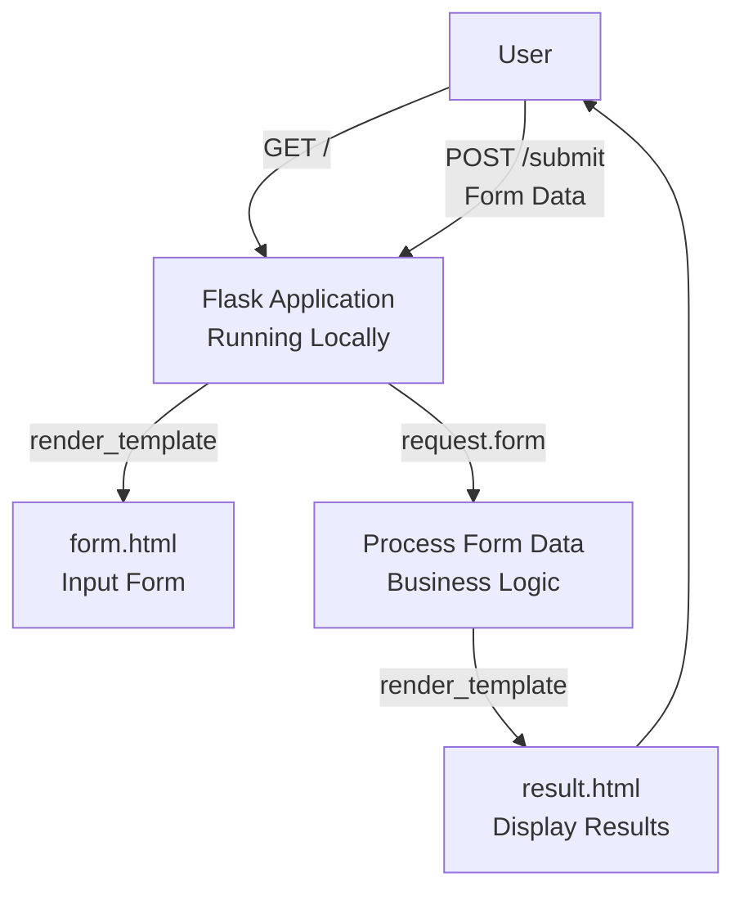
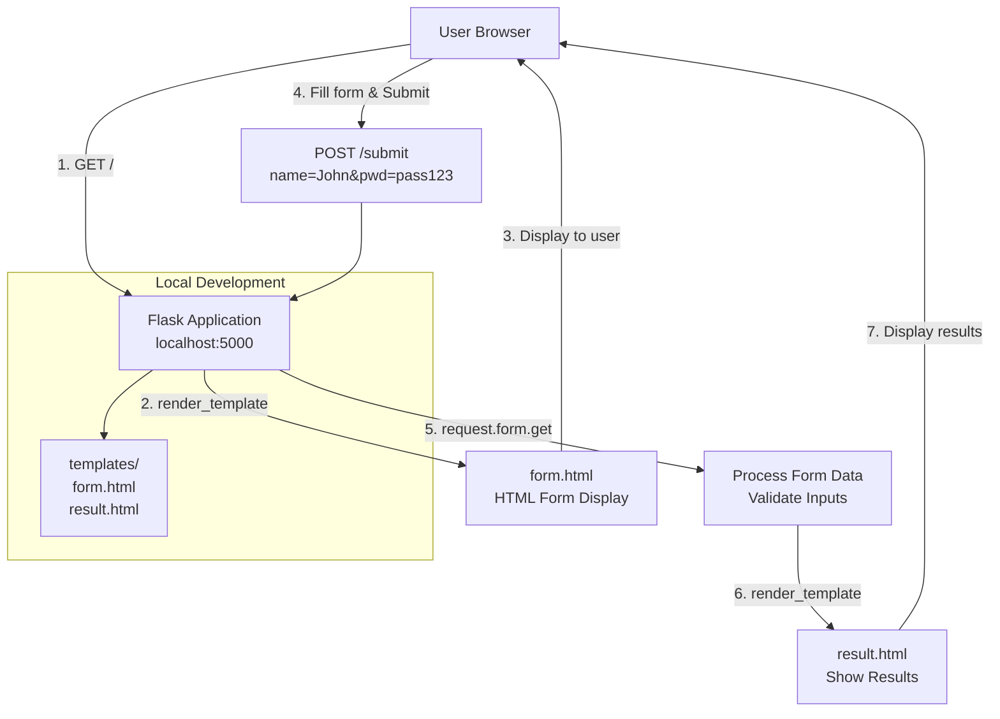

# Building a Basic Python Flask Web Application

**Topics:** Flask Framework, HTTP Methods, Form Handling, Jinja2 Templates, Request Processing, Virtual Environments

## Overview

This lab introduces essential web development concepts by building a simple Flask application that handles HTML form submissions. You'll create a local development environment with Python virtual environments, design HTML forms with POST requests, implement Flask routes to process form data using the request object, render dynamic templates with Jinja2, and handle basic validation. 

This foundational knowledge is prerequisite for Lab 17 (Flask with AWS RDS), where you'll deploy similar applications to EC2 with database connectivity.


## Key Concepts

| Concept | Description |
|---------|-------------|
| Flask Framework | Lightweight Python web framework for building web applications with minimal boilerplate code |
| HTTP Methods | Request types: **GET** for retrieving data (display form), **POST** for submitting data (process form) |
| Jinja2 Templates | Flask's templating engine for rendering dynamic HTML with Python variables embedded using `{{ variable }}` syntax |
| Request Object | Flask's `request` object provides access to incoming HTTP data (form fields, headers, cookies, JSON) |
| Routes (URL Endpoints) | URL patterns mapped to Python functions using `@app.route()` decorator (e.g., `/` → home(), `/submit` → submit()) |
| Virtual Environment (venv) | Isolated Python environment preventing package conflicts between projects |
| render_template() | Flask function that renders HTML templates from `templates/` folder with dynamic data |
| request.form | Dictionary-like object containing form field data submitted via POST |
| Form Action | HTML `<form action="/submit">` specifies which URL receives form submission |
| Form Method | HTML `<form method="post">` specifies HTTP method (GET displays form, POST submits data) |

## Prerequisites

- Python 3.7 or higher installed (check with `python --version` or `python3 --version`)
- pip package manager (included with Python 3.4+)
- Basic understanding of HTML structure and forms
- Familiarity with Python syntax (functions, variables, string manipulation)

## Architecture Overview

::: details Click to expand Architecture Diagram

:::

::: details Click to expand Architecture Diagram

:::

## Phase 1: Set Up Local Development Environment

### Step 1: Verify Python Installation

1. Open terminal (Command Prompt on Windows, Terminal on Mac/Linux).

2. Check Python and pip version:
   ```bash
   python3 --version
   pip3 --version
   ```

3. Create virtual environment:
   ```bash
   python3 -m venv flask_env
   ```
 
4. Activation prepares environment for package installation.

    **Mac/Linux:**
    ```bash
    source flask_env/bin/activate
    ```

    **Windows (Command Prompt):**
    ```bash
    flask_env\Scripts\activate
    ```

4. Install Flask, with virtual environment activated:
   ```bash
   pip install flask
   
   # Verify Flask version
   python -c "import flask; print('Flask version:', flask.__version__)"
   ```

> [!NOTE] Package Installation
> Flask automatically installs dependencies: Werkzeug (WSGI server), Jinja2 (templates), Click (CLI), MarkupSafe (security).

### Step 2: Create Project Directory

1. Navigate to desired location:
   ```bash
   cd Desktop
   ```
2. Create project folder:
   ```bash
   mkdir FlaskFormApp
   cd FlaskFormApp
   ```

## Phase 2: Create Project Structure

### Step 3: Create Templates Folder

Flask requires HTML files in specific folder structure.

1. Inside `FlaskFormApp`, create templates folder:
   
   ```bash
   mkdir templates
   ```

2. Verify folder structure:
   ```
   FlaskFormApp/
   ├── flask_env/          (virtual environment)
   └── templates/          (HTML files go here)
   ```

> [!IMPORTANT] Folder Name Must Be "templates"
> Flask searches for templates in folder named exactly `templates` (lowercase, plural). Different name causes "TemplateNotFound" errors.

### Step 4: Create HTML Form Template

1. Navigate into templates folder:
   ```bash
   cd templates
   ```

2. Create `form.html` using text editor.

::: details form.html Code
```html
<!DOCTYPE html>
<html>
<head>
    <title>User Details Form</title>
    <style>
        body { 
            font-family: Arial, sans-serif; 
            margin: 40px; 
            background-color: #f5f5f5; 
        }
        .container {
            max-width: 400px;
            margin: 0 auto;
            background-color: white;
            padding: 30px;
            border-radius: 8px;
            box-shadow: 0 2px 4px rgba(0,0,0,0.1);
        }
        h2 {
            color: #333;
            text-align: center;
        }
        form { 
            max-width: 300px; 
            margin: 0 auto;
        }
        label {
            display: block;
            margin-bottom: 5px;
            color: #666;
            font-weight: bold;
        }
        input { 
            margin-bottom: 15px; 
            padding: 10px; 
            width: 100%; 
            border: 1px solid #ddd;
            border-radius: 4px;
            box-sizing: border-box;
        }
        input:focus {
            outline: none;
            border-color: #4CAF50;
        }
        button { 
            padding: 12px; 
            width: 100%;
            background-color: #4CAF50; 
            color: white; 
            border: none; 
            cursor: pointer;
            border-radius: 4px;
            font-size: 16px;
            font-weight: bold;
        }
        button:hover { 
            background-color: #45a049; 
        }
    </style>
</head>
<body>
    <div class="container">
        <h2>Enter Your Details</h2>
        <form action="/submit" method="post">
            <label for="uname">Name:</label>
            <input type="text" id="uname" name="uname" required 
                   placeholder="Enter your name">
            
            <label for="pwd">Password:</label>
            <input type="password" id="pwd" name="pwd" required
                   placeholder="Enter your password">
            
            <button type="submit">Submit</button>
        </form>
    </div>
</body>
</html>
```
:::

**Key Components Explained:**

- **`<form action="/submit">`**: Form data sent to `/submit` URL endpoint
- **`method="post"`**: Uses HTTP POST method (data not visible in URL)
- **`name="uname"`**: Field identifier Flask uses to retrieve value (`request.form['uname']`)
- **`name="pwd"`**: Password field identifier
- **`required`**: HTML5 validation prevents empty submission
- **`placeholder`**: Hint text displayed in empty fields

### Step 5: Create Result Template

1. Still in templates folder, create `result.html`:

::: details result.html Code
```html
<!DOCTYPE html>
<html>
<head>
    <title>Submission Result</title>
    <style>
        body { 
            font-family: Arial, sans-serif; 
            margin: 40px; 
            background-color: #f5f5f5; 
        }
        .container {
            max-width: 500px;
            margin: 0 auto;
            background-color: white;
            padding: 30px;
            border-radius: 8px;
            box-shadow: 0 2px 4px rgba(0,0,0,0.1);
        }
        h2 {
            color: #4CAF50;
            text-align: center;
        }
        .result {
            background-color: #f9f9f9;
            padding: 20px;
            border-radius: 4px;
            margin: 20px 0;
        }
        .result p {
            margin: 10px 0;
            font-size: 16px;
        }
        .result strong {
            color: #333;
        }
        .warning { 
            color: #d32f2f; 
            font-weight: bold; 
            background-color: #ffebee;
            padding: 15px;
            border-left: 4px solid #d32f2f;
            border-radius: 4px;
            margin-top: 20px;
        }
        .back-link {
            display: block;
            text-align: center;
            margin-top: 20px;
            color: #4CAF50;
            text-decoration: none;
        }
        .back-link:hover {
            text-decoration: underline;
        }
    </style>
</head>
<body>
    <div class="container">
        <h2>Form Submission Result</h2>
        <div class="result">
            <p><strong>Name:</strong> {{ name }}</p>
            <p><strong>Password:</strong> {{ password }}</p>
        </div>
        <div class="warning">
            ⚠️ Note: Passwords should never be displayed in real applications for security reasons!
        </div>
        <a href="/" class="back-link">← Back to Form</a>
    </div>
</body>
</html>
```
:::

## Phase 3: Create Flask Application Backend

### Step 6: Create Main Application File

1. Navigate back to `FlaskFormApp` root:
   ```bash
   cd ..
   ```
   (Should be in FlaskFormApp/, not templates/)

2. Create `app.py` file with following content:

::: details app.py Code
```python
from flask import Flask, request, render_template

# Initialize Flask application
app = Flask(__name__)

# Route for home page (displays form)
@app.route('/')
def home():
    """
    Handles GET request to root URL
    Returns: Rendered form.html template
    """
    return render_template('form.html')

# Route for form submission (processes data)
@app.route('/submit', methods=['POST'])
def submit():
    """
    Handles POST request from form submission
    Retrieves form data, validates, and displays results
    Returns: Rendered result.html with form data or error message
    """
    # Retrieve form data safely using get() method
    # .strip() removes leading/trailing whitespace
    name = request.form.get('uname', '').strip()
    password = request.form.get('pwd', '').strip()
    
    # Basic validation: check if fields are empty
    if not name or not password:
        # Return error response with 400 status code
        return render_template('error.html', 
                             message="Both fields are required!"), 400
    
    # In production: hash password, validate format, sanitize input
    # For demo: display values (NOT recommended for real apps)
    
    return render_template('result.html', name=name, password=password)

# Run application
if __name__ == "__main__":
    # debug=True enables auto-reload on code changes and detailed error pages
    # Set debug=False in production for security
    app.run(debug=True, host='127.0.0.1', port=5000)
```
:::

**Code Explanation:**

- **`Flask(__name__)`**: Creates Flask application instance
- **`@app.route('/')`**: Decorator mapping URL `/` to `home()` function
- **`methods=['POST']`**: Restricts route to POST requests only (default is GET)
- **`request.form.get('uname', '')`**: Safely retrieves form field (returns empty string if missing)
- **`.strip()`**: Removes whitespace (prevents "   " from passing validation)
- **`render_template('file.html', var=value)`**: Renders template with data
- **`debug=True`**: Development mode with auto-reload and verbose errors
- **`host='127.0.0.1'`**: Localhost (only accessible from local machine)
- **`port=5000`**: Default Flask port

### Step 7: Verify Project Structure

Final folder structure should look like:

```
FlaskFormApp/
├── flask_env/              # Virtual environment (do not edit)
├── templates/
│   ├── form.html          # User input form
│   └── result.html        # Display results
└── app.py                 # Main Flask application
```

## Phase 4: Run and Test Application

### Step 8: Start Flask Development Server

1. Ensure virtual environment is activated:
   - Look for `(flask_env)` prefix in terminal
   - If not: `source flask_env/bin/activate` (Mac/Linux) or `flask_env\Scripts\activate` (Windows)

2. Ensure you're in `FlaskFormApp` root directory

3. Run Flask application:
   ```bash
   python3 app.py
   ```

4. Expected output:
   ```
   * Serving Flask app 'app'
   * Debug mode: on
   WARNING: This is a development server. Do not use it in a production deployment.
   * Running on http://127.0.0.1:5000
   Press CTRL+C to quit
   * Restarting with stat
   * Debugger is active!
   * Debugger PIN: xxx-xxx-xxx
   ```

### Step 9: Access Application in Browser

1. Open web browserand Navigate to: `http://127.0.0.1:5000`
   - Or: `http://localhost:5000`

3. Form page should load showing:
   - Title: "Enter Your Details"
   - Two input fields (Name and Password)
   - Submit button

### Step 10: Test Form Submission

**Test Case 1: Valid Submission**

1. Fill form:
   - Name: `John Doe`
   - Password: `test123`

2. Click "Submit" button.

3. Expected result:
   - Page redirects to result view
   - Displays: "Name: John Doe" and "Password: test123"
   - Shows security warning about displaying passwords

**Test Case 2: Empty Fields Validation**

1. Refresh page (return to form).

2. Leave both fields empty.

3. Click "Submit".

4. Expected result:
   - HTML5 validation prevents submission (browser shows "Please fill out this field")
   - If validation bypassed, error page shows "Both fields are required!"

**Test Case 3: Partial Input**

1. Enter name only, leave password empty.

2. Submit.

3. Expected result:
   - Browser validation catches empty password field

### Step 11: Monitor Server Logs

1. Check terminal running Flask.

2. Expected log output:
   ```
   127.0.0.1 - - [17/Jan/2026 10:30:15] "GET / HTTP/1.1" 200 -
   127.0.0.1 - - [17/Jan/2026 10:30:22] "POST /submit HTTP/1.1" 200 -
   ```

3. Return to terminal running Flask. Press **Ctrl+C** to stop server.

4. Deactivate virtual environment:
   ```bash
   deactivate
   ```

## Validation

::: details Validation

Confirm all components working correctly:

- **Virtual Environment:**
  - Created successfully in `flask_env/` folder
  - Activates without errors
  - Flask installed and importable

- **Project Structure:**
  - `templates/` folder exists with `form.html` and `result.html`
  - `app.py` exists in root directory
  - All files contain correct code

- **Flask Application:**
  - Starts without errors on port 5000
  - Shows "Running on http://127.0.0.1:5000" message
  - Debug mode enabled (shows Debugger PIN)

- **Form Functionality:**
  - Form displays correctly with styled inputs
  - Submit button triggers POST to `/submit`
  - HTML5 validation prevents empty submissions
  - Result page shows submitted data

- **Data Processing:**
  - `request.form.get()` retrieves values correctly
  - Whitespace trimmed with `.strip()`
  - Validation catches empty fields
  - Template variables render properly

- **Browser Testing:**
  - Accessible via localhost URL
  - Form submission works
  - Navigation between pages functions
  - No JavaScript errors in browser console

:::

## Cost Considerations

::: details Cost Considerations

This lab runs entirely on local machine—no cloud costs incurred:

- **Free Components:**
  - Python (open source)
  - Flask (open source)
  - Local development server (no hosting fees)
  - All dependencies (Jinja2, Werkzeug) free

- **No AWS Charges:**
  - No EC2 instances
  - No RDS databases
  - No data transfer fees

- **Resource Usage:**
  - Minimal CPU (~1-5% during development)
  - ~50 MB disk space (virtual environment)
  - ~100 MB RAM (Flask server)
:::


## Troubleshooting

::: details Troubleshooting
Common issues and solutions:

| Issue | Cause | Solution |
|-------|-------|----------|
| `ModuleNotFoundError: No module named 'flask'` | Flask not installed or venv not activated | Activate venv: `source flask_env/bin/activate`, then `pip install flask` |
| `TemplateNotFound: form.html` | Templates folder missing or misnamed | Ensure folder named `templates` (plural, lowercase) in app root |
| `Address already in use` | Port 5000 occupied by another process | Change port: `app.run(port=5001)` or kill process using port |
| `This site can't be reached` | Flask not running or wrong URL | Check Flask terminal for "Running on..." message, verify URL |
| `ImportError: cannot import name 'Flask'` | Conflicting package versions | Recreate venv: `deactivate`, delete `flask_env`, recreate |
| Form shows white page | Syntax error in HTML | Check browser console (F12) and Flask terminal for errors |
| POST returns 405 Method Not Allowed | Missing `methods=['POST']` | Add to decorator: `@app.route('/submit', methods=['POST'])` |
| Data not displaying in result | Template variable mismatch | Ensure `{{ name }}` matches `render_template(name=value)` |
| Cannot activate venv (PowerShell) | Execution policy restriction | Run: `Set-ExecutionPolicy -ExecutionPolicy RemoteSigned -Scope CurrentUser` |
| Python command not recognized | Python not in PATH | Reinstall Python with "Add to PATH" checked or use full path |
:::

## Result

You have successfully built a local Flask web application demonstrating fundamental web development concepts. The application receives user input via HTML forms, processes data on the server using Flask's request object, validates input, and renders dynamic responses using Jinja2 templates.

## Viva Questions

1. Explain the complete request-response flow when a user submits the form in this application.

2. What is the purpose of virtual environments in Python, and what problems do they solve?

3. Explain the difference between HTTP GET and POST methods, and why POST is used for form submission in this application.

4. What is Jinja2 templating, and how does Flask use it to generate dynamic HTML?

5. How would you modify this application to implement password hashing and database storage for production use?

