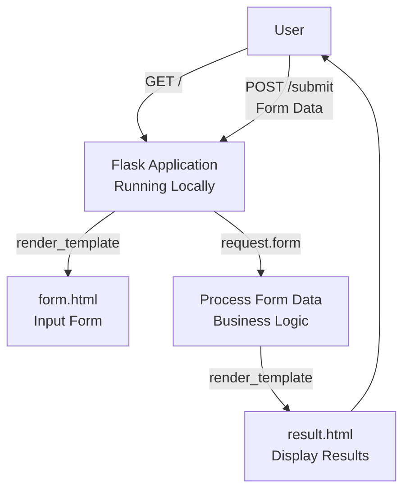

# Building a Basic Python Flask Web Application

Fundamentals of Web Requests & Form Handling (Pre-Requisite for AWS RDS Connectivity Lab)

## Overview

This lab introduces the fundamentals of web development by building a simple Python Flask application that handles HTML forms. You'll learn how to process user input on the server-side, a key skill before integrating with databases like AWS RDS.

### Key Concepts

| Concept | Description |
|---------|-------------|
| **Flask** | Lightweight Python web framework for building web applications |
| **HTTP Methods** | GET for retrieving data, POST for submitting forms |
| **Jinja2 Templates** | Flask's templating engine for dynamic HTML rendering |
| **Request Object** | Flask's way to access incoming request data (e.g., form fields) |
| **Routes** | URL endpoints mapped to Python functions |

### Learning Outcomes

After completing this exercise, you will be able to:

- Understand how an HTML form sends data to the server
- Explain how Flask receives form data using the `request` object
- Read request parameters (`request.form`) in Flask
- Understand basic frontend–backend communication
- Handle a simple HTTP POST request in a Flask application

### Flask Form Processing Flow



## Preparation

### Folder Structure

Create the following structure manually:

```text
FlaskFormApp/
├── app.py
└── templates/
    ├── form.html
    └── result.html
```

### Requirements

- Python installed (version 3.7 or higher; check with `python --version`)
- Flask library (install via pip)
- Virtual environment tool (venv, included with Python)
- Any code editor (VS Code / PyCharm / Notepad etc.)
- Web browser (Chrome / Edge / Firefox)

## Implementation Steps

### Step 1: Set Up Virtual Environment and Install Flask

1. Open **Command Prompt / Terminal**
2. Navigate to your desired directory (e.g., `cd Desktop`)
3. Create a virtual environment: `python -m venv flask_env`
4. Activate it:
   - Windows: `flask_env\Scripts\activate`
   - Mac/Linux: `source flask_env/bin/activate`
5. Install Flask: `pip install flask`
6. Verify: `python -c "import flask; print('Flask installed')"`

### Step 2: Create Project Folder

Create a folder on your local machine (e.g., `C:\Users\MCA\FlaskFormApp` or `~/FlaskFormApp`).

### Step 3: Create templates Folder

Inside `FlaskFormApp`, create a sub-folder named `templates`. All HTML files must be placed here.

### Step 4: Create HTML Form — `templates/form.html`

Create `form.html` inside the templates folder with the following code:

```html
<!DOCTYPE html>
<html>
<head>
    <title>HTML Form</title>
    <style>
        body { font-family: Arial, sans-serif; margin: 20px; }
        form { max-width: 300px; }
        input { margin-bottom: 10px; padding: 5px; width: 100%; }
        button { padding: 10px; background-color: #4CAF50; color: white; border: none; cursor: pointer; }
        button:hover { background-color: #45a049; }
    </style>
</head>
<body>
    <h2>Enter Your Details</h2>
    <form action="/submit" method="post">
        Name: <input type="text" name="uname" required><br><br>
        Password: <input type="password" name="pwd" required><br><br>
        <button type="submit">Submit</button>
    </form>
</body>
</html>
```

**Key Components:**

- `action="/submit"`: Sends the data to the `/submit` route
- `method="post"`: Data is sent using the HTTP POST method
- `name="uname"` and `name="pwd"`: Names used by Flask to identify the input values
- `required`: Basic HTML validation to ensure fields are filled

### Step 5: Create Result Page — `templates/result.html`

Create `result.html` inside the templates folder:

```html
<!DOCTYPE html>
<html>
<head>
    <title>Result</title>
    <style>
        body { font-family: Arial, sans-serif; margin: 20px; }
        .warning { color: red; font-weight: bold; }
    </style>
</head>
<body>
    <h2>Form Submission Result</h2>
    <p><strong>Name:</strong> {{ name }}</p>
    <p><strong>Password:</strong> {{ password }}</p>
    <p class="warning">Note: Passwords should never be displayed in real applications for security reasons!</p>
</body>
</html>
```

> [!WARNING]
> Displaying passwords is for educational purposes only. In production, never expose sensitive data like passwords.

### Step 6: Create Flask Backend — `app.py`

In the root `FlaskFormApp` folder, create `app.py`:

```python
from flask import Flask, request, render_template

app = Flask(__name__)

@app.route('/')
def home():
    # Render the form page
    return render_template('form.html')

@app.route('/submit', methods=['POST'])
def submit():
    # Retrieve form data safely
    name = request.form.get('uname', '').strip()  # Strip whitespace
    password = request.form.get('pwd', '').strip()
    
    # Basic validation
    if not name or not password:
        return render_template('error.html', message="Both fields are required!"), 400
    
    # In a real app, hash passwords and store securely
    # For demo, we display (not recommended)
    return render_template('result.html', name=name, password=password)

if __name__ == "__main__":
    app.run(debug=True)  # Set debug=False for production
```

**Explanation:**

- `@app.route('/')`: Home URL, displays the form
- `@app.route('/submit', methods=['POST'])`: Handles the submission logic
- `request.form.get('uname', '')`: Safely reads the input value
- Basic validation: Checks if fields are filled
- `render_template(...)`: Sends the retrieved values to the result page
- `debug=True`: Enables auto-reload; disable in production

> [!IMPORTANT]
> This is a basic example. In production, implement proper validation, error handling, and security measures (e.g., CSRF protection, password hashing).


## Execution

### Step 8: Run the Application

1. Open **Command Prompt / Terminal** inside the `FlaskFormApp` folder.
2. Activate the virtual environment (if not already): `flask_env\Scripts\activate` (Windows) or `source flask_env/bin/activate` (Mac/Linux).
3. Run the command: `python app.py`
4. The terminal will display: `* Running on http://127.0.0.1:5000`
5. Open your browser and visit: [http://127.0.0.1:5000](http://127.0.0.1:5000/)
6. **Testing:** Fill the form and submit; verify the result page shows your inputs.
7. **To Stop:** Press **Ctrl + C** in the terminal. Deactivate venv: `deactivate`

### Validation

- **Form Display:** Ensure the form loads with styled inputs.
- **Submission:** Submit with empty fields to test validation.
- **Result:** Check that name and password are displayed (with warning).
- **Errors:** Verify error page appears for invalid submissions.

**Troubleshooting:**
- **ModuleNotFoundError:** Ensure Flask is installed in the active venv (`pip list`).
- **Port 5000 in use:** Change port in `app.run(port=5001)`.
- **Form not submitting:** Check HTML for correct `action` and `method`.
- **Debug issues:** Enable debug mode and check console for errors.

## Cleanup

- Stop the Flask app (Ctrl + C).
- Deactivate the virtual environment: `deactivate`.
- Optionally, delete the `FlaskFormApp` folder if no longer needed.

