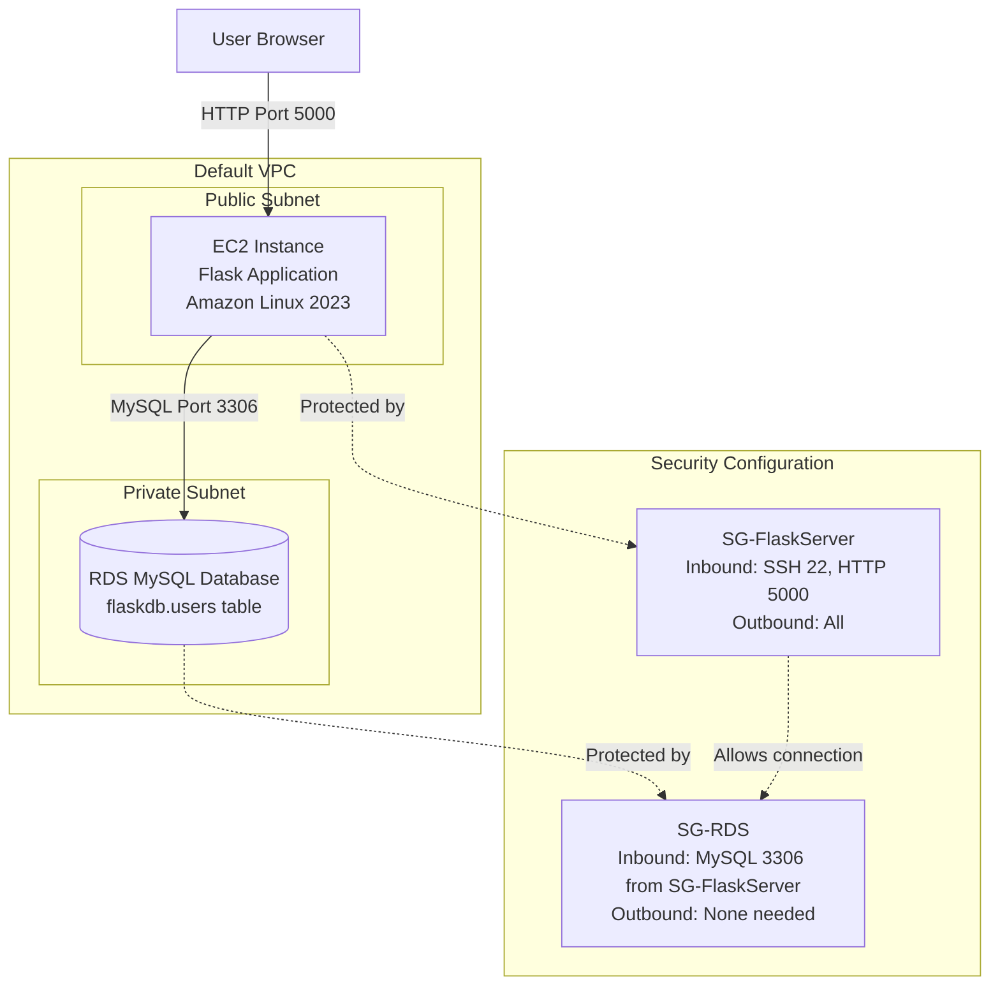

# Flask Web Application with AWS RDS MySQL Database

**Topics:** AWS EC2, AWS RDS MySQL, Flask Routing, Database Connectivity, Security Groups, mysql-connector-python, Cloud Deployment

## Overview

This lab demonstrates deploying a complete cloud-based web application with Flask on EC2 connected to RDS MySQL. You'll launch an EC2 instance for the Flask backend, create an RDS MySQL database instance, configure security groups to allow EC2-to-RDS communication on MySQL port 3306, implement user registration storing hashed data in RDS, build login functionality validating credentials against the database, and test the complete workflow from browser to application to database.

## Key Concepts

| Concept | Description |
|---------|-------------|
| AWS RDS (Relational Database Service) | Managed database service automating MySQL setup, backups, patching, and scaling |
| Database Endpoint | RDS connection URL (e.g., `db-instance.xxxxx.us-east-1.rds.amazonaws.com`) used for mysql connections |
| Security Groups (EC2-RDS) | Firewall rules allowing EC2 to connect to RDS on MySQL port 3306 while blocking internet access |
| mysql-connector-python | Python library for connecting to and querying MySQL databases |
| DB Instance Class | RDS compute/memory capacity (e.g., db.t3.micro = 1 vCPU, 1 GB RAM) |
| Flask Routing | URL mapping: `/` (registration form), `/register` (process signup), `/login` (login form), `/validate` (check credentials) |
| Connection Pooling | Reusing database connections to improve performance (managed by connector) |
| Multi-AZ Deployment | RDS high availability feature replicating database to multiple zones (not used in lab to reduce costs) |
| Database Schema | Table structure defining columns, data types, constraints (users table with id, name, password) |
| SQL Injection Prevention | Using parameterized queries (%s placeholders) instead of string concatenation to prevent attacks |

### Prerequisites

- Active AWS account with billing enabled
- Completed Lab 16 (Flask Web Application basics)
- IAM permissions for EC2 and RDS (AmazonEC2FullAccess, AmazonRDSFullAccess)
- Basic knowledge of Python, Flask, SQL, and database concepts
- Understanding of security groups and VPC networking

> [!WARNING] Cost Alert
> RDS db.t3.micro is NOT free tier eligible. This lab incurs charges. Delete RDS instance immediately after lab completion to minimize costs. Set AWS Budget alerts at $5 threshold.

## Architecture Overview

::: details Click to expand Architecture Diagram

:::

## Phase 1: Launch EC2 Instance for Flask Application

### Step 1: Navigate to EC2 Service

1. Sign in to AWS Management Console.

2. Services → **EC2** → Click **Launch instance**.

### Step 2: Configure Instance Settings

1. **Name:** `FlaskLoginServer`

2. **Application and OS Images (AMI):**
   - Quick Start → **Amazon Linux**
   - Amazon Linux 2023 AMI (Free tier eligible)

> [!NOTE] Amazon Linux 2023 Benefits
> Latest Amazon Linux with Python 3.9+ pre-installed, optimized for AWS, 5 years of support, dnf package manager.

3. **Instance type:**
   - Select: `t3.micro`

4. **Key pair (login):**
   - Select existing key pair OR click **Create new key pair**
   - If creating new:
     - Name: `flask-rds-key`
     - Type: RSA
     - Format: `.pem`

### Step 3: Network Settings

1. Click **Edit** in Network settings.
2. **VPC:** Default VPC.
3. **Subnet:** No preference (or select public subnet).
4. **Auto-assign public IP:** **Enable** (required for internet access and SSH).

5. **Firewall (security groups):**
   - Select **Create security group**
   - Security group name: `SG-FlaskServer`
   - Description: `Security group for Flask web server`

6. **Inbound security group rules:**

   **Rule 1: SSH Access**
   - Type: SSH
   - Protocol: TCP
   - Port: 22
   - Source: My IP (automatically detects your IP)
   - Description: SSH from my IP

   **Rule 2: Flask Application Access**
   - Click **Add security group rule**
   - Type: Custom TCP
   - Port: 5000
   - Source: 0.0.0.0/0 (Anywhere IPv4)
   - Description: Flask app access

7. **Outbound rules:** Leave default (Allow all traffic).

8. **Storage (volumes):**
   - Root volume: 8 GiB gp3
   - Volume type: General Purpose SSD (gp3)
   - Delete on termination: Yes (checked)

9. Click **Launch instance** button.


## Phase 2: Connect to EC2 and Install Dependencies

### Step 4: Connect via EC2 Instance Connect

1. EC2 console → Instances → Select `FlaskLoginServer`.

2. Click **Connect** button.

3. **Connect using EC2 Instance Connect** tab:
   - User: `ec2-user` (default for Amazon Linux)
   - Click **Connect** button

4. Browser-based terminal opens.

> [!TIP] Alternative: SSH from Terminal
> ```bash
> ssh -i flask-rds-key.pem ec2-user@54.221.34.89
> ```

### Step 5: Update System Packages

1. In EC2 terminal, update package index:
   ```bash
   sudo dnf update -y

   python3 --version

   sudo dnf install python3-pip -y

   pip3 install flask

   pip3 install mysql-connector-python

   python3 -c "import flask; import mysql.connector; print('All dependencies installed')"
   ```
   Expected: `All dependencies installed`

> [!NOTE] Why mysql-connector-python
> Official MySQL driver for Python. Chosen for simplicity and official support.

2. Install MariaDB client (MySQL-compatible):
   ```bash
   sudo dnf install mariadb105 -y

   mysql --version
   ```
   Expected: `mysql Ver 15.1 Distrib 10.5.x-MariaDB`

> [!NOTE] MariaDB Client
> Amazon Linux 2023 includes MariaDB client (not MySQL client) but they're protocol-compatible. Use mysql command to connect to RDS MySQL.

## Phase 3: Create Flask Project Structure

### Step 6: Create Project Directory

1. Create project folder:
```bash
mkdir FlaskLoginApp
cd FlaskLoginApp
mkdir templates
```

1. Create Database Configuration File `db_config.py`:
```bash
nano db_config.py
```

2. Enter configuration (will update endpoint after RDS creation):
```python
db_config = {
   'host': 'PLACEHOLDER-RDS-ENDPOINT',
   'user': 'admin',
   'password': 'YourPasswordHere',
   'database': 'flaskdb'
}
```

3. Save: **Ctrl+O**, Enter, **Ctrl+X**.

> [!IMPORTANT] Placeholder Values
> `PLACEHOLDER-RDS-ENDPOINT` will be replaced with actual RDS endpoint in Phase 7. `YourPasswordHere` will be replaced with your RDS master password.

### Step 7: Create Main Flask Application

1. Create `app.py`:
   ```bash
   nano app.py
   ```

2. Enter complete application code:

::: details Click to expand Full app.py Code
```python
from flask import Flask, request, render_template
import mysql.connector
from db_config import db_config

app = Flask(__name__)

def get_connection():
      """
      Establishes database connection using db_config
      Returns: mysql.connector connection object or None if failed
      """
      try:
         return mysql.connector.connect(**db_config)
      except mysql.connector.Error as err:
         print(f"Database connection error: {err}")
         return None

@app.route('/')
def home():
      """Display registration form"""
      return render_template('register.html')

@app.route('/register', methods=['POST'])
def register():
      """
      Process user registration
      Validates input and inserts into database
      """
      name = request.form.get('uname', '').strip()
      password = request.form.get('pwd', '').strip()
      
      if not name or not password:
         return render_template('error.html', 
                              message="Both fields are required"), 400
      
      conn = get_connection()
      if not conn:
         return render_template('error.html', 
                              message="Database connection failed"), 500
      try:
         cur = conn.cursor()
         cur.execute("INSERT INTO users (name, password) VALUES (%s, %s)", 
                     (name, password))
         conn.commit()
         return render_template('success.html')
      except mysql.connector.IntegrityError:
         return render_template('error.html', 
                              message="Username already exists"), 400
      except mysql.connector.Error as err:
         return render_template('error.html', 
                              message=f"Registration error: {err}"), 500
      finally:
         if 'cur' in locals():
            cur.close()
         if conn:
            conn.close()

@app.route('/login')
def login():
      """Display login form"""
      return render_template('login.html')

@app.route('/validate', methods=['POST'])
def validate():
      """
      Validate login credentials
      Queries database and shows welcome page if valid
      """
      name = request.form.get('uname', '').strip()
      password = request.form.get('pwd', '').strip()
      
      if not name or not password:
         return render_template('error.html', 
                              message="Both fields are required"), 400
      
      conn = get_connection()
      if not conn:
         return render_template('error.html', 
                              message="Database connection failed"), 500
      try:
         cur = conn.cursor()
         cur.execute("SELECT * FROM users WHERE name = %s AND password = %s", 
                     (name, password))
         user = cur.fetchone()
         if user:
            return render_template('welcome.html', username=name)
         else:
            return render_template('error.html', 
                                 message="Invalid username or password")
      except mysql.connector.Error as err:
         return render_template('error.html', 
                              message=f"Login error: {err}"), 500
      finally:
         if 'cur' in locals():
            cur.close()
         if conn:
            conn.close()

if __name__ == "__main__":
      # host='0.0.0.0' allows external connections (not just localhost)
      # debug=False for security (don't expose stack traces)
      app.run(host='0.0.0.0', port=5000, debug=False)
```
:::

### Step 8: Create HTML Templates

Create all templates in `templates/` folder:

**register.html (User Registration Form):**

```bash
nano templates/register.html
```

::: details Click to expand Full register.html Code
```html
<!DOCTYPE html>
<html>
<head>
    <title>User Registration</title>
    <style>
        body { font-family: Arial; margin: 40px; background: #f5f5f5; }
        .container { max-width: 400px; margin: auto; background: white; 
                    padding: 30px; border-radius: 8px; box-shadow: 0 2px 4px rgba(0,0,0,0.1); }
        h2 { color: #333; text-align: center; }
        input { width: 100%; padding: 10px; margin: 10px 0; border: 1px solid #ddd; 
               border-radius: 4px; box-sizing: border-box; }
        button { width: 100%; padding: 12px; background: #4CAF50; color: white; 
                border: none; border-radius: 4px; cursor: pointer; font-size: 16px; }
        button:hover { background: #45a049; }
        a { color: #2196F3; text-decoration: none; }
    </style>
</head>
<body>
    <div class="container">
        <h2>User Registration</h2>
        <form action="/register" method="post">
            Name: <input type="text" name="uname" required><br>
            Password: <input type="password" name="pwd" required><br>
            <button type="submit">Register</button>
        </form>
        <p style="text-align: center;">Already have account? <a href="/login">Login here</a></p>
    </div>
</body>
</html>
```
:::

**login.html (Login Form):**

```bash
nano templates/login.html
```

::: details Click to expand Full login.html Code
```html
<!DOCTYPE html>
<html>
<head>
    <title>User Login</title>
    <style>
        body { font-family: Arial; margin: 40px; background: #f5f5f5; }
        .container { max-width: 400px; margin: auto; background: white; 
                    padding: 30px; border-radius: 8px; box-shadow: 0 2px 4px rgba(0,0,0,0.1); }
        h2 { color: #333; text-align: center; }
        input { width: 100%; padding: 10px; margin: 10px 0; border: 1px solid #ddd; 
               border-radius: 4px; box-sizing: border-box; }
        button { width: 100%; padding: 12px; background: #2196F3; color: white; 
                border: none; border-radius: 4px; cursor: pointer; font-size: 16px; }
        button:hover { background: #0b7dda; }
        a { color: #4CAF50; text-decoration: none; }
    </style>
</head>
<body>
    <div class="container">
        <h2>User Login</h2>
        <form action="/validate" method="post">
            Name: <input type="text" name="uname" required><br>
            Password: <input type="password" name="pwd" required><br>
            <button type="submit">Login</button>
        </form>
        <p style="text-align: center;">New user? <a href="/">Register here</a></p>
    </div>
</body>
</html>
```
:::

**welcome.html, success.html, error.html** - Create similarly.

## Phase 4: Create RDS MySQL Database Instance

### Step 9: Navigate to RDS Service

1. AWS Console → Services → **RDS**.

2. Click **Create database** button.

3. **Choose a database creation method:**
   - Select: **Standard create** (more control over settings)

4. **Engine options:**
   - Engine type: **MySQL**
   - Edition: MySQL Community
   - Version: MySQL 8.0.35 (or latest 8.0.x version)

### Step 10: Templates and Settings

1. **Templates:**
   - Select: **Free tier** (if available)
   - If Free tier not available: **Dev/Test** (use smallest instance to minimize costs)

2. **Settings:**
   - **DB instance identifier:** `flaskdb-instance`
   - **Master username:** `admin`
   - **Master password:** `Flask123!`
   - **Confirm password:** `Flask123!`

### Step 11: DB Instance Configuration

1. **DB instance class:**
   - **Burstable classes:** `db.t3.micro`
   - 1 vCPU, 1 GB RAM
   - Note: NOT free tier eligible

2. **Storage:**
   - Storage type: General Purpose SSD (gp3)
   - Allocated storage: 20 GiB (minimum)
   - Maximum storage threshold: 1000 GiB

### Step 12: Connectivity Configuration (Critical)

1. **Compute resource:**
   - Select: **Connect to an EC2 compute resource**
   - **EC2 instance:** Select `FlaskLoginServer` which you created earlier

> [!IMPORTANT] Automatic Security Group Configuration
> Selecting "Connect to EC2" automatically:
> - Creates RDS security group allowing MySQL (3306) from EC2 security group
> - Configures network routing between EC2 and RDS
> - Simplifies connectivity setup significantly

2. **Network type:** IPv4

3. **VPC:** Default VPC (same as EC2)

4. **DB subnet group:** Default (or create new if needed)

5. **Public access:** **No** (RDS should not be internet-accessible)

6. **VPC security group:**
   - AWS auto-creates security group for EC2-RDS connection

7. **Availability Zone:** No preference

8. **Database port:** 3306 (default MySQL port)

### Step 13: Additional Configuration

1. **Database authentication:** Password authentication (default)

2. **Initial database name:** `flaskdb`
   - This creates database automatically (no need to run CREATE DATABASE)

3. **DB parameter group:** default.mysql8.0

4. **Option group:** default:mysql-8-0

5. **Backup:**
   - Enable automated backups: Yes (1-day retention for lab, 7-35 days for production)
   - Backup window: No preference

6. **Encryption:** Disable (optional, enable for production)

7. Review **Estimated monthly costs**. Click **Create database** button.

### Step 14: Note RDS Endpoint

1. RDS console → Databases → Click `flaskdb-instance`.

2. **Connectivity & security** tab:
   - **Endpoint:** Copy endpoint (e.g., `flaskdb-instance.abcdef123456.us-east-1.rds.amazonaws.com`)
   - **Port:** 3306

3. Save endpoint for use in db_config.py.

## Phase 5: Verify Security Group Configuration

### Step 15: Check RDS Security Group

1. RDS → Databases → `flaskdb-instance` → **Connectivity & security** tab.

2. Under **Security**, click VPC security group link (e.g., `sg-xxxxx`).

3. **Inbound rules** tab:
   - Verify rule exists:
     - Type: MySQL/Aurora
     - Port: 3306
     - Source: `sg-xxxxx` (EC2 security group SG-FlaskServer)
   - This allows EC2 to connect to RDS

> [!TIP] Security Group Rule Interpretation
> Source: `sg-xxxxx` means "allow connections from any EC2 instance in security group sg-xxxxx." This is more secure than allowing specific IPs because instances can have dynamic IPs.

4. **Outbound rules:** Default (allow all) sufficient.

## Phase 6: Create Database Table

### Step 16: Connect to RDS from EC2

1. Use RDS endpoint:
   ```bash
   mysql -h flaskd....onaws.com -u admin -p
   ```

2. Enter password when prompted

   ```bash
   Welcome to the MariaDB monitor. Commands end with ; or \g.
   ...
   MySQL [(none)]>
   ```

> [!TIP] Connection Troubleshooting
> - **Access denied:** Check username/password (master username = admin by default)
> - **Can't connect:** Verify security groups allow EC2→RDS on port 3306
> - **Timeout:** Ensure EC2 and RDS in same VPC and region
> - **Unknown host:** Verify RDS endpoint spelling

4. In MySQL prompt:

   If you created initial database `flaskdb` during RDS setup, switch to it:
```sql
CREATE DATABASE flaskdb;

USE flaskdb;
```
   Expected: `Database changed`

5. Create users table:
```sql
CREATE TABLE users (
   id INT AUTO_INCREMENT PRIMARY KEY,
   name VARCHAR(50) NOT NULL,
   password VARCHAR(50) NOT NULL
);
```
   Expected: `Query OK, 0 rows affected`

3. Verify table creation:
   ```sql
   SHOW TABLES;
   ```
   Expected:
   ```
   +--------------------+
   | Tables_in_flaskdb  |
   +--------------------+
   | users              |
   +--------------------+
   ```

4. Check table structure:
   ```sql
   DESCRIBE users;
   ```
   Expected:
   ```
   +----------+-------------+------+-----+---------+----------------+
   | Field    | Type        | Null | Key | Default | Extra          |
   +----------+-------------+------+-----+---------+----------------+
   | id       | int         | NO   | PRI | NULL    | auto_increment |
   | name     | varchar(50) | NO   |     | NULL    |                |
   | password | varchar(50) | NO   |     | NULL    |                |
   +----------+-------------+------+-----+---------+----------------+
   ```

5. Exit MySQL:
   ```sql
   EXIT;
   ```

## Phase 7: Configure Flask to Connect to RDS

### Step 18: Update Database Configuration

1. Navigate to project folder:
   ```bash
   cd ~/FlaskLoginApp
   ```

2. Edit db_config.py:
   ```bash
   nano db_config.py
   ```

3. Update with actual RDS endpoint and password:
```python
db_config = {
   'host': 'flaskdb-instance.abcdef123456.us-east-1.rds.amazonaws.com',
   'user': 'admin',
   'password': 'Flask123!',
   'database': 'flaskdb'
}
```

4. Save: Ctrl+O, Enter, Ctrl+X.

> [!IMPORTANT] Environment Variables (Production)
> For production, use environment variables:
> ```python
> db_config = {
>     'host': os.environ['RDS_HOST'],
>     'user': os.environ['RDS_USER'],
>     'password': os.environ['RDS_PASSWORD'],
>     'database': os.environ['RDS_DB']
> }
> ```
> Set variables before running: `export RDS_HOST=endpoint`

## Phase 8: Run Flask Application

### Step 19: Start Flask Server

1. In EC2 terminal, ensure you're in FlaskLoginApp:
   ```bash
   cd ~/FlaskLoginApp
   pwd
   ```
   Expected: `/home/ec2-user/FlaskLoginApp`

2. Start Flask:
   ```bash
   python3 app.py
   ```

3. Expected output:
   ```
   * Serving Flask app 'app'
   * Debug mode: off
   WARNING: This is a development server. Do not use it in a production deployment.
   * Running on all addresses (0.0.0.0)
   * Running on http://127.0.0.1:5000
   * Running on http://172.31.x.x:5000
   Press CTRL+C to quit
   ```

### Step 20: Access Application from Browser

1. Get EC2 public IP:
   - EC2 console → Instances → `FlaskLoginServer` → Copy Public IPv4 address

2. Open browser, navigate to:
   ```
   http://54.221.34.89:5000
   ```
   Replace with your EC2 public IP.

3. Registration page should load.

> [!TIP] Browser Connection Issues
> - **Site can't be reached:** Check EC2 security group allows port 5000 from 0.0.0.0/0
> - **Connection timeout:** Ensure Flask running (check EC2 terminal)
> - **HTTP not HTTPS:** Use http:// (not https://)


### Validation

::: details Validation

Verify all components working:

- **EC2 Instance:**
  - State: Running
  - Python 3, Flask, mysql-connector-python installed
  - Flask application accessible on port 5000
  - Security group allows SSH (22) and HTTP (5000)

- **RDS Database:**
  - Status: Available
  - Endpoint accessible from EC2
  - Database `flaskdb` exists with `users` table
  - Security group allows MySQL (3306) from EC2 security group

- **Application Functionality:**
  - Registration: Saves user to database
  - Login: Validates credentials from database
  - Error handling: Shows appropriate messages
  - Database connection: Successful queries without errors

- **Security:**
  - RDS not publicly accessible (public access: No)
  - EC2-RDS communication secured via security groups
  - No credentials hardcoded in code (use environment variables for production)

:::

### Cost Considerations

::: details Cost Considerations

Monthly cost estimate:

- **EC2 t3.micro:**
  - **On-Demand:** ~$0.0104/hour = ~$7.50/month
  - **Free Tier:** 750 hours/month free for first 12 months = $0
  - After free tier: ~$7.50/month

- **RDS db.t3.micro:**
  - **Compute:** ~$0.017/hour = ~$12.24/month
  - **Storage:** 20 GB × $0.115/GB = ~$2.30/month
  - **Backup:** 1 day retention included
  - **Total RDS:** ~$14.54/month (NO free tier)

- **Data Transfer:**
  - EC2-RDS same AZ: Free
  - EC2-RDS different AZ: $0.01/GB each direction
  - Minimal for lab (~0.01 GB) = ~$0

- **Total Monthly Cost:**
  - With EC2 free tier: ~$14.54/month (RDS only)
  - Without free tier: ~$22/month (EC2 + RDS)

- **Lab Duration Cost (4 hours):**
  - EC2: 4 × $0.0104 = $0.04 (or $0 with free tier)
  - RDS: 4 × $0.017 = $0.07
  - Total: ~$0.11 for 4-hour lab

:::

> [!WARNING] Cost Control
> - **Delete RDS immediately** after lab (largest cost driver)
> - Set AWS Budget alert at $5 threshold
> - Monitor costs in AWS Cost Explorer
> - RDS charges accumulate 24/7 even when not in use
> - Stopping RDS saves compute costs but still charges for storage

### Cleanup Procedure

::: details Cleanup Procedure

Delete all resources to stop charges:

### 1. Terminate EC2 Instance

1. EC2 → Instances → Select `FlaskLoginServer`.

2. Instance state → **Terminate instance**.

3. Confirmation: Type "terminate" → **Terminate**.

4. Wait for state: Terminated.

### 2. Delete RDS Database

1. RDS → Databases → Select `flaskdb-instance`.

2. Actions → **Delete**.

3. Deletion options:
   - Create final snapshot: **No** (uncheck for lab)
   - Retain automated backups: **No** (uncheck)
   - Acknowledgment: Check "I acknowledge..."
   - Type "delete me" in confirmation box

4. Click **Delete** button.

5. Wait for deletion (5-10 minutes).

> [!IMPORTANT] Final Snapshot
> For production databases, ALWAYS create final snapshot before deletion. For labs, skip snapshot to avoid storage costs.

### 3. Delete Security Groups (Optional)

1. EC2 → Security Groups.

2. Select `SG-FlaskServer` and RDS security group.

3. Actions → **Delete security groups**.

4. If error "has dependent object," wait 5 minutes for network interfaces to detach.

5. Retry deletion.

### Verification

- EC2 Instances: `FlaskLoginServer` shows Terminated
- RDS Databases: `flaskdb-instance` removed from list
- Security Groups: Custom groups deleted (default VPC security group remains)
- Billing: Check AWS Cost Explorer after 24 hours (charges should stop)

:::

### Troubleshooting
::: details Troubleshooting

Common issues and solutions:

| Issue | Cause | Solution |
|-------|-------|----------|
| Can't connect EC2 to RDS | Security group misconfigured | Verify RDS SG allows MySQL (3306) from EC2 SG, not IP addresses |
| Access denied for user 'admin' | Wrong password | Check RDS master password in AWS console or reset it |
| Unknown database 'flaskdb' | Database not created | Create manually: `CREATE DATABASE flaskdb;` in MySQL prompt |
| Table doesn't exist | Table not created | Run CREATE TABLE statement from Phase 6 |
| Connection timeout | VPC/subnet mismatch | Ensure EC2 and RDS in same VPC and region |
| Flask can't import mysql.connector | Package not installed | Run `pip3 install mysql-connector-python` |
| Browser can't reach Flask | Port 5000 blocked | Add security group rule allowing port 5000 from 0.0.0.0/0 |
| Database connection failed | Wrong RDS endpoint | Verify endpoint in db_config.py matches RDS console |
| Public access error | RDS publicly accessible | Set Public access = No in RDS settings |
:::

## Result

A fully working cloud-based registration and login system was successfully deployed using **Flask** (Backend), **EC2** (Application Server), and **AWS RDS** (Database). The application demonstrates secure database connectivity, user authentication, and proper error handling in a cloud environment.

## Viva Questions

1. Explain the complete data flow from user registration form submission to database storage in RDS.

2. How do AWS security groups control EC2-to-RDS connectivity, and why is using security group IDs as sources more secure than IP addresses?

3. What is SQL injection, and how does using parameterized queries prevent it?

4. Why is RDS preferable to running MySQL on EC2, and what are the operational benefits?

5. How would you implement password hashing with bcrypt and environment variable-based configuration to secure this application for production?


::: details Quick Start Guide
### Quick Start Guide
1. Launch EC2 instance, security group allowing SSH (22) and HTTP (5000).
2. Connect to EC2 via Instance Connect, update packages, install Python3, pip, Flask, mysql-connector-python, and MariaDB client.
```bash
sudo dnf update -y
sudo dnf install python3-pip -y
pip3 install flask mysql-connector-python
sudo dnf install mariadb105 -y
```
3. Create Flask project structure with `app.py`, `db_config.py`, and HTML templates
4. Create RDS MySQL instance, connect to EC2, set Public access = No, note endpoint.
5. Verify RDS security group allows MySQL (3306) from EC2 security group
6. Connect to RDS from EC2 using MariaDB client, create `flaskdb` database and `users` table.
7. Update `db_config.py` with actual RDS endpoint and password.
8. Run Flask application on EC2, access via browser using EC2 public IP and port
   5000, test registration and login functionality.
:::
