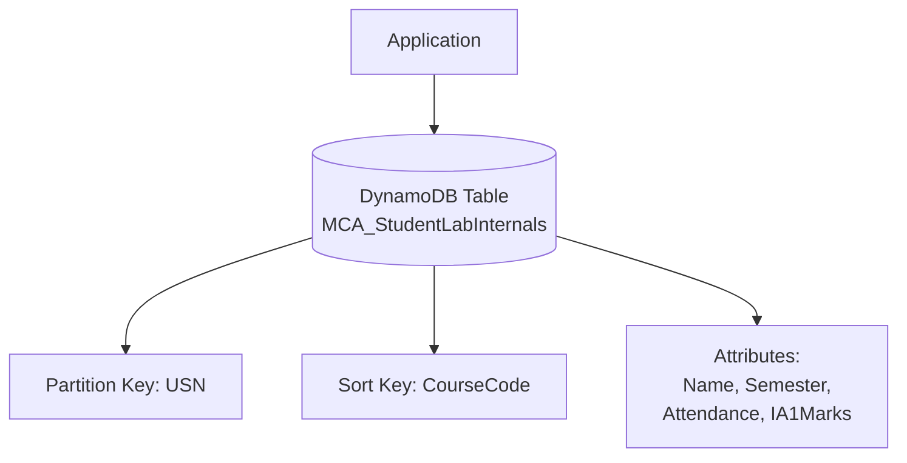
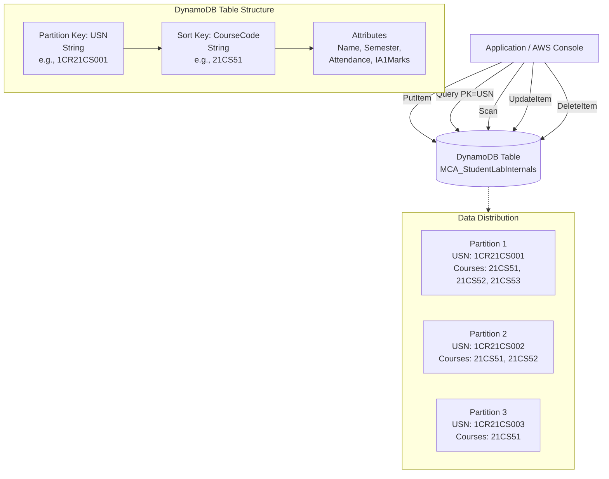

# DynamoDB NoSQL Database - Student Management System

**Topics:** AWS DynamoDB, NoSQL Databases, Partition Keys, Sort Keys, Composite Primary Keys, Query Operations, Scan Operations, CRUD Operations

## Overview

This lab introduces Amazon DynamoDB, AWS's fully managed NoSQL database service. You'll create a table with a composite primary key, insert data, perform read operations (Query vs. Scan), update items, and delete records.


## Key Concepts

| Concept | Description |
|---------|-------------|
| DynamoDB | Fully managed, serverless NoSQL database service providing consistent single-digit millisecond performance at any scale |
| Partition Key (PK) | Primary identifier for distributing data across partitions; all items with same PK stored together (e.g., USN) |
| Sort Key (SK) | Optional secondary identifier allowing multiple items per partition in sorted order (e.g., CourseCode) |
| Composite Primary Key | Combination of Partition Key + Sort Key creating unique identifier (one student can have multiple courses) |
| Item | Single record in DynamoDB (equivalent to row in relational database) containing attributes |
| Attribute | Key-value pair within item (Name="Alice", Attendance=85); each item can have different attributes (schema-less) |
| Query Operation | Efficient retrieval using Partition Key (retrieves all courses for one USN) with optional Sort Key filtering |
| Scan Operation | Reads entire table sequentially; expensive and slow; avoid in production except for analytics/backups |
| On-Demand Mode | Pay-per-request pricing ($1.25 per million writes, $0.25 per million reads); no capacity planning required |
| Provisioned Mode | Pre-allocated read/write capacity units (RCU/WCU); cheaper for predictable workloads; requires capacity planning |
| GSI (Global Secondary Index) | Alternate Partition Key/Sort Key for different query patterns (not used in this lab) |
| Eventually Consistent Reads | Default read mode returning data within 1 second of write; cheaper than strongly consistent reads |

### Prerequisites

- Active AWS account with billing enabled
- IAM permissions for DynamoDB (AmazonDynamoDBFullAccess)
- Basic understanding of NoSQL concepts and differences from relational databases
- Familiarity with JSON data structures

> [!NOTE] DynamoDB Free Tier
> AWS Free Tier (first 12 months and beyond): 25 GB storage, 25 write capacity units, 25 read capacity units, 2.5 million stream read requests.

## Architecture Overview

::: details Click to expand Architecture Diagram

:::

::: details Click to expand Architecture Diagram

:::

**Key-Value Data Model:**

- **Partition Key (USN):** Groups items by student; all courses for one USN stored together in same partition
- **Sort Key (CourseCode):** Allows multiple courses per student; items sorted by CourseCode within partition
- **Composite Primary Key:** USN + CourseCode must be unique (one student cannot have duplicate CourseCode entries)
- **Attributes:** Name, Semester, Attendance, IA1Marks can vary per item (schema-less flexibility)

**Query vs Scan:**

- **Query:** Specify Partition Key (USN="1CR21CS001") → Retrieves only that student's courses → Fast, efficient, cheap
- **Scan:** No Partition Key specified → Reads every item in entire table → Slow, expensive, avoid for production

## Phase 1: Create DynamoDB Table

We will create a table to store Student Records including USN, Name, Semester, Course, Attendance, and IA1 Marks.

### Step 1: Navigate to DynamoDB Service

1. Sign in to AWS Management Console.

2. Services → **DynamoDB** and Click **Create table** button.

3. **Table details:**
	  - **Table name:** `MCA_StudentLabInternals`
	  - **Partition key (PK):** `USN` (Type: String)
	  - **Sort key (SK):** `CourseCode` (Type: String)

> [!IMPORTANT] Primary Key Design
> Partition Key + Sort Key form **composite primary key**. 
> Each item must have unique USN+CourseCode combination. 
> Partition Key (USN) determines data distribution;
>  
> All items with same USN stored in same partition. 
> Sort Key (CourseCode) allows multiple courses per student sorted alphabetically (21CS51, 21CS52, 21CS53...).

4. **Table settings:**

   Select: **Customize settings** (not Default settings; need to choose On-Demand mode)

### Step 2: Table Class and Capacity Settings

1. **Table class:**
   - Select: **DynamoDB Standard** (default; optimized for frequent access)

2. **Read/write capacity settings:**
   **Capacity mode:**
   - Select: **On-demand** (recommended for labs and unpredictable workloads)

### Step 3: Create Table

1. Review summary panel on right:
   - Table name: MCA_StudentLabInternals
   - Partition key: USN (String)
   - Sort key: CourseCode (String)
   - Capacity: On-demand
   - Estimated cost: Variable based on usage

2. Click **Create table** button (bottom right).

3. Wait for table status: **Active** (5-10 seconds).

> [!NOTE] Table Creation Speed
> DynamoDB tables create almost instantly (unlike RDS taking 5-10 minutes). Serverless architecture has no instance provisioning—table ready as soon as metadata stored.

### Step 4: Verify Table Details

1. DynamoDB → Tables → Click `MCA_StudentLabInternals`.

2. **Overview tab:**
   - Table status: Active
   - Partition key: USN (S) [S = String type]
   - Sort key: CourseCode (S)
   - Item count: 0
   - Table size: 0 Bytes


## Phase 2: Insert Items (Create Operation)

### Step 5: Insert Student Records

1. DynamoDB → Tables → `MCA_StudentLabInternals` → Click **Explore table items** button (top right).

2. **Items** section → Click **Create item** button.

3. **Create item** interface:

   **Attributes - view DynamoDB JSON:**
   - Toggle to **JSON** view (easier for copy-paste)

4. Enter first item:

::: details First Student Record
```json
{
 "USN": {
   "S": "1CR21CS001"
 },
 "CourseCode": {
   "S": "21CS51"
 },
 "Name": {
   "S": "Alice Johnson"
 },
 "Semester": {
   "N": "5"
 },
 "Attendance": {
   "N": "85"
 },
 "IA1Marks": {
   "N": "14"
 }
}
```
:::

5. Click **Create item** button.

> [!NOTE] DynamoDB JSON Format
> DynamoDB uses typed JSON: `{"AttributeName": {"Type": "Value"}}`
> - `"S"`: String type (`"USN": {"S": "1CR21CS001"}`)
> - `"N"`: Number type stored as string (`"Semester": {"N": "5"}`)
> - `"BOOL"`: Boolean (`{"B": true}`)
> - `"L"`: List/Array (`{"L": [{"S": "item1"}, {"S": "item2"}]}`)
> - `"M"`: Map/Object (`{"M": {"key1": {"S": "value1"}}}`)
>
> Console supports regular JSON, but API requires typed format.

6. Click **Create item** → JSON view. Enter second item (different student, same course):

::: details Second Student Recore
```json
{
 "USN": {
   "S": "1CR21CS002"
 },
 "CourseCode": {
   "S": "21CS51"
 },
 "Name": {
   "S": "Bob Smith"
 },
 "Semester": {
   "N": "5"
 },
 "Attendance": {
   "N": "92"
 },
 "IA1Marks": {
   "N": "16"
 }
}
```
:::

7. **Create item**.

8. **Create item** → JSON view. Enter third item (same student as first, different course):

::: details Third Student Record
   ```json
{
 "USN": {
   "S": "1CR21CS001"
 },
 "CourseCode": {
   "S": "21CS52"
 },
 "Name": {
   "S": "Alice Johnson"
 },
 "Semester": {
   "N": "5"
 },
 "Attendance": {
   "N": "88"
 },
 "IA1Marks": {
   "N": "15"
 }
}
   ```
:::

> [!IMPORTANT] Composite Primary Key Validation
> Notice USN="1CR21CS001" appears twice (items 1 and 3), but CourseCode differs (21CS51 vs 21CS52). 
> This is valid because **composite primary key = USN + CourseCode**, which is unique for each item.
>
> Attempting to create duplicate USN+CourseCode (e.g., another 1CR21CS001 + 21CS51) would fail with error: 
> "The conditional request failed."

### Step 6: Verify Items Created

1. **Items returned:** Should show 3 items.

2. **Scan/Query items** interface:
   - USN 1CR21CS001 appears twice (21CS51, 21CS52)
   - USN 1CR21CS002 appears once (21CS51)
   - Each item shows all attributes

3. **Item count:** 3 items total.

## Phase 3: Read Operations (Query and Scan)

### Step 7: Query Operation - Retrieve One Student's Courses

1. **Items** section → **Scan/Query items**.

2. Change dropdown from **Scan** to **Query**.

3. **Partition key:**
   - USN (String): Enter `1CR21CS001`

4. Click **Run** button.

5. **Results:**
   - Returns 2 items:
     - CourseCode: 21CS51, Name: Alice Johnson, IA1Marks: 14
     - CourseCode: 21CS52, Name: Alice Johnson, IA1Marks: 15
   - Items sorted by Sort Key (CourseCode) alphabetically

> [!TIP] Query with Sort Key Filtering
> Add Sort Key condition for more specific queries:
> - **Begins with:** `CourseCode` begins with `21CS5` → Returns all courses starting with 21CS5
> - **Between:** `CourseCode` between `21CS51` and `21CS52` → Returns courses in range
> - **Equal:** `CourseCode` = `21CS51` → Returns exact course
>
> Example: Query USN="1CR21CS001" WHERE CourseCode="21CS51" → Returns 1 item

### Step 8: Scan Operation - Retrieve All Items

1. Change dropdown from **Query** to **Scan**.

2. Click **Run** button (no parameters needed).

3. **Results:**
   - Returns all 3 items:
     - 1CR21CS001 + 21CS51
     - 1CR21CS001 + 21CS52
     - 1CR21CS002 + 21CS51
   - Items returned in arbitrary order (not sorted)

> [!WARNING] Scan Operation Performance
> **Query:** Reads only items matching Partition Key (2 items for USN="1CR21CS001") → Cost: 2 read operations
>
> **Scan:** Reads entire table (3 items regardless of filter) → Cost: 3 read operations
>
> For table with 1 million items, querying one student reads ~10 items (fast, cheap). 
> Scanning reads 1 million items even with filter (slow, expensive ~$250 per scan with on-demand pricing). 
> **Never use Scan in production applications** except for analytics, backups, or one-time data migrations.

## Phase 4: Update Operation

### Step 9: Update Student's IA1Marks

1. **Items** section → **Scan/Query items** → **Scan** → **Run**.

2. Locate item:
   - USN: `1CR21CS001`
   - CourseCode: `21CS51`
   - Current IA1Marks: 14

3. Click on item (row).

4. **Edit item** interface opens:
   - Toggle to **JSON** or **Form** view

5. **Form view** (easier for attribute updates):
   - Find `IA1Marks` attribute
   - Change value from `14` to `16`

6. Click **Save changes** button.

7. Verify update:
   - Run Scan or Query again
   - Item now shows IA1Marks: 16

> [!NOTE] Update Operations
> DynamoDB supports partial updates—modify specific attributes without rewriting entire item. UpdateItem API allows:
> - **SET:** Add/modify attributes (`SET IA1Marks = 16`)
> - **REMOVE:** Delete attributes (`REMOVE Attendance`)
> - **ADD:** Increment number (`ADD IA1Marks 2` increases by 2)
> - **DELETE:** Remove from set (`DELETE Tags 'archive'`)
>
> Atomic updates ensure consistency (no read-modify-write race conditions).

## Phase 5: Delete Operations

### Step 10: Delete Single Item

1. **Items** section → **Scan/Query items** → **Scan** → **Run**.

2. Select item to delete (checkbox):
   - USN: `1CR21CS002`
   - CourseCode: `21CS51`

3. Click **Actions** → **Delete items**.

4. Confirmation dialog:
   - Check "I acknowledge the cost implications" (if shown)
   - Click **Delete** button

5. Verify deletion:
   - Run Scan → Should show 2 items remaining (1CR21CS001 courses only)

> [!TIP] Batch Delete
> Select multiple items (checkboxes) → Actions → Delete items → Deletes all selected. Batch operations limited to 25 items per request (API BatchWriteItem limit).

6. Verify Final Data
  - Run **Scan** operation.

7. Expected remaining items:
   - Item 1: USN=1CR21CS001, CourseCode=21CS51, IA1Marks=16 (updated)
   - Item 2: USN=1CR21CS001, CourseCode=21CS52, IA1Marks=15


### Validation

::: details Validation

Verify all operations successful:

- **Table Creation:**
  - Table name: MCA_StudentLabInternals
  - Partition key: USN (String)
  - Sort key: CourseCode (String)
  - Status: Active
  - Capacity mode: On-demand

- **Create Operations:**
  - Inserted 3 items with unique USN+CourseCode combinations
  - Demonstrated composite primary key allowing multiple courses per student

- **Read Operations:**
  - Query retrieved only one student's courses (2 items for USN=1CR21CS001)
  - Scan retrieved all items (3 items)
  - Understood Query efficiency vs Scan inefficiency

- **Update Operation:**
  - Modified IA1Marks from 14 to 16 for specific USN+CourseCode
  - Partial update preserved other attributes

- **Delete Operation:**
  - Removed one item (1CR21CS002+21CS51)
  - 2 items remain in table

:::

### Cleanup Procedure

::: details Cleanup Procedure

Delete table to stop all charges:

### Step 1: Delete Table

1. DynamoDB → Tables → `MCA_StudentLabInternals` → **Delete** button (top right).

2. **Delete table** dialog:
   - **Create a backup before deleting:** Uncheck (no backup needed for lab)
   - **Delete all CloudWatch alarms:** Check (if any created)
   - **Confirmation text:** Type `delete` (lowercase)

3. Click **Delete table** button.

4. Wait for deletion (5-10 seconds).

5. Verification: Tables list should no longer show `MCA_StudentLabInternals`.

### Verification

- DynamoDB → Tables → Verify `MCA_StudentLabInternals` removed
- AWS Cost Explorer → DynamoDB charges should be $0 after 24 hours
- CloudWatch → Metrics → DynamoDB namespace → Verify no active metrics

:::

### Troubleshooting

::: details Troubleshooting

Common issues and solutions:

| Issue | Cause | Solution |
|-------|-------|----------|
| "The conditional request failed" | Duplicate Primary Key (USN+CourseCode exists) | Change USN or CourseCode to unique combination |
| Query returns 0 items | Wrong Partition Key value or typo | Verify exact USN spelling (case-sensitive: "1CR21CS001" ≠ "1cr21cs001") |
| "Requested resource not found" | Table not Active or wrong region | Check table status (must be Active), verify region in top-right (us-east-1 vs us-west-2) |
| JSON format error | Invalid DynamoDB JSON | Ensure typed format: `{"USN": {"S": "value"}}` not `{"USN": "value"}` |
| Cannot delete table | Deletion protection enabled | Table → Additional settings → Disable deletion protection |
| High costs after lab | Table not deleted | Verify table deletion, check AWS Cost Explorer for lingering resources |
| Scan returns items in unexpected order | Scan doesn't guarantee order | Use Query for sorted results (by Sort Key) or sort on client side |
| Update doesn't modify item | Wrong Primary Key specified | Verify exact USN+CourseCode combination of item to update |
:::

> [!TIP] Region Awareness
> DynamoDB tables are region-specific. If table created in us-east-1, must access from same region.

## Result

Successfully created and operated a DynamoDB table, performing all CRUD operations. Demonstrated the efficiency of Query over Scan and understood the importance of proper key design in NoSQL databases.

## Viva Questions

1. Explain the composite primary key design with Partition Key (USN) and Sort Key (CourseCode). Why does this allow multiple courses per student, and what would happen without a Sort Key?

2. Compare Query and Scan operations in detail. Why is Scan inefficient and expensive, and when is it acceptable to use Scan in production?

3. Explain DynamoDB's partition key distribution and how it enables horizontal scaling. What happens if partition key design is poor (e.g., using "Semester" as partition key)?

4. When should you use DynamoDB (NoSQL) versus RDS MySQL (relational), and what are the trade-offs?

5. Explain DynamoDB's eventually consistent reads vs strongly consistent reads. When would you choose each, and what are the trade-offs?

::: details Quick Start Guide
### Quick Start Guide
1. Create DynamoDB table with Partition Key (USN) and Sort Key (CourseCode).
2. Insert items using Create Item (DynamoDB JSON format).
3. Perform Query operation specifying Partition Key to retrieve one student's courses.
4. Perform Scan operation to retrieve all items (inefficient).
5. Update specific item's attribute (IA1Marks) using Edit Item.
6. Delete specific item using Delete Items action.
:::