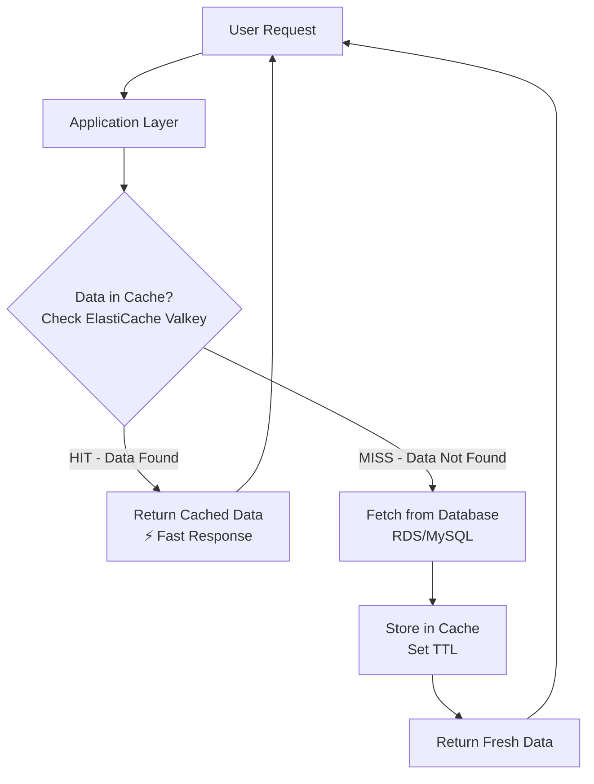

# ElastiCache (Valkey) as an In-Memory Cache

**Topics:** Databases, Caching, ElastiCache, Valkey, AWS

## Overview

This lab demonstrates Amazon ElastiCache using Valkey as an in-memory caching layer to improve application performance. You'll deploy a Valkey cluster, connect from an EC2 instance, and perform basic cache operations like storing, retrieving, and expiring data.

## Key Concepts

| Concept | Description |
|---------|-------------|
| ElastiCache | Managed in-memory caching service compatible with Valkey/Redis/Memcached |
| Valkey | High-performance, Redis-compatible data structure store used as cache |
| Redis OSS | Open-source alternative, but Valkey is recommended for new deployments |
| TTL (Time To Live) | Automatic expiration of cached data |
| Cache Hit/Miss | Data found in cache (hit) or fetched from DB (miss) |
| Subnet Groups | Define subnets for ElastiCache clusters in VPC (not needed for serverless) |
| Serverless | Auto-scaling, pay-per-use deployment option |
| Encryption | Data protection at rest and in transit |
| Authentication | Secure access using passwords/tokens |

### Prerequisites

- Active AWS account with billing enabled
- IAM permissions for ElastiCache and EC2
- Basic knowledge of Redis and caching concepts


## Architecture Overview

::: details Click to expand ElastiCache Data Flow

:::

## Phase 1: Launch EC2 Client using Amazon Linux 2023

**Purpose:** To create an EC2 instance that will act as a client machine to connect to ElastiCache using `valkey-cli`.

1. Select Region. 
    Ensure EC2 and ElastiCache stay in the same region.

2. Launch Instance
    - **Name:** `RedisClient-AL2023`
    - **AMI:** Amazon Linux 2023 AMI
    - **Instance Type:** `t3.micro` (Free Tier)
    - **Key Pair:** Select an existing `.pem` file

3. Network & Security Group
    - **VPC:** Default VPC
    - **Security Group Name:** `SG-RedisClient`
    - **Inbound Rules:** | Type: SSH | Port: 22 | Source : 0.0.0.0/0 |
    - **Outbound rules:** Allow all (default)

> [!IMPORTANT]
> Add Redis 6379 and 6380 also for durabilty. The client does not listen on 6379.


4. Connect & Install Client
    Connect via EC2 Instance Connect and run:

```bash
sudo dnf update -y
sudo dnf install -y valkey
# Verify installation
valkey-cli --version
```

> [!NOTE]
> Amazon Linux 2023 uses **Valkey**, which is fully Redis-protocol compatible.

**Verification:** Confirm EC2 status is "Running" and valkey-cli version displays.


## Phase 2: Create Amazon ElastiCache (Valkey) Cache

**Purpose:** To create an Amazon ElastiCache Valkey serverless cache that will act as an in-memory cache, accessible from the EC2 client created in Phase-1.

1. Confirm AWS Region
    - Ensure you are in the **same region** used in Phase-1
    - EC2 and ElastiCache must be in the **SAME region and VPC**

2. Open ElastiCache Console
    1. AWS Console → **Services**
    2. Select **ElastiCache**
    3. Click **Create cache**

3. Select Cache Engine
    - **Engine:** Valkey

4. Choose Deployment Settings
    - **Deployment option:** Serverless

> [!TIP]
> Serverless deployment provides automatic scaling and simplifies management for development and testing.

5. Provide Cluster Information
    - **Cache name:** `lab-valkey`

6. Configure Network
    - **VPC:** Default VPC
    - **Security Group:** Security group with port 6379, 6380 access from EC2

7. Note the Valkey Endpoint
    1. Click on the cache name `lab-valkey`
    2. Copy the **Serverless endpoint** (for serverless deployment)
    3. This endpoint will be used in Phase-3 to connect from EC2

8. In the created cache instance go to "Connected compute resources" and add the EC2 Instance. This automatically connects the EC2 security groups and allows connection.

> [!NOTE]
> Can Use cloudshell to run valkey commands if EC2 is not preferred.
> Connect to Compute allows connecting to EC2 created in Phase-1 automatically.

**Verification:** Confirm cache status is "Available" and endpoint is noted.

## Phase 3: Connect EC2 to ElastiCache Valkey and Execute Cache Commands

**Purpose:** To connect the EC2 client (Amazon Linux 2023) to the ElastiCache Valkey serverless cache using valkey-cli and demonstrate basic in-memory cache operations.

### Pre-checks

Before connecting, confirm:
- EC2 and ElastiCache are in the same AWS region
- EC2 security group = `SG-RedisClient`
- Valkey security group = `SG-ValkeyCache`
- Valkey security group allows port 6379 from `SG-RedisClient`
- Valkey Status = **Available**
- You have copied the **Serverless endpoint**
- You have the authentication password set in Phase 2

1. Connect to EC2
    1. AWS Console → **EC2**
    2. Select instance `RedisClient-AL2023`
    3. Click **Connect**
    4. Choose **EC2 Instance Connect** and click **Connect**
    5. You are now inside the EC2 terminal

2. Connect to ElastiCache Valkey

Use the Serverless Endpoint from Phase-2 and the password:

If the endpoint has `.....cache.amazonaws.com:6379` port at the end, change it to `-p 6379`.

```bash
valkey-cli --tls -h <Serverless_ENDPOINT> -p 6379
```

You should see a `lab-valkey-xxxxxx.serverless.use1.cache.amazonaws.com:6379>`. This means the connection is successful.

4. Execute Valkey Commands

These commands simulate what an application does internally.

#### 4.1 Test Connectivity

```
PING
```

**Expected Output:** `PONG`

#### 4.2 Store and Retrieve Data (SET / GET)

```
SET course "Cloud Computing"
GET course
```

**Expected Output:** `"Cloud Computing"`

> [!NOTE]
> Demonstrates key–value storage in memory.

#### 4.3 Counter Example (INCR)

```
INCR visits
INCR visits
GET visits
```

**Expected Output:** `"2"`

> [!TIP]
> Common real-world use - page views, hit counters.

#### 4.4 Set Data with Expiry (TTL)

```
SET notice "Results Published" EX 60
TTL notice
GET notice
```

**Expected Output:**

- TTL shows a value ≤ 60
- GET returns "Results Published"

#### 4.5 Verify Automatic Expiry

Wait ~60 seconds, then run:

```
GET notice
```

**Expected Output:** `(nil)`

#### 4.6 Delete Data Manually

```
DEL course
GET course
```

**Expected Output:** `(nil)`

5. Exit Valkey Client

```
EXIT
```

> [!TIP]
> The application first checks Valkey. If data is present, it is returned immediately from memory. If not present, the application fetches data from the database and stores it in Valkey with a TTL. Valkey automatically removes the data after expiry.

**Verification:** Confirm all commands executed as expected (e.g., GET returns values, TTL expires).

- EC2 successfully connected to ElastiCache Valkey
- In-memory key–value operations verified
- Temporary storage and TTL behavior observed
- Valkey used as a cache, not as a primary database

### Validation

::: details Validation

- **EC2 Setup:** Confirm instance is running, valkey-cli installed, and connected to Valkey.
- **ElastiCache Cache:** Verify status is "Available" and endpoint is accessible.
- **Cache Operations:** Test SET/GET, INCR, TTL, and DEL commands.
- **Expiry:** Confirm data is removed after TTL expires.
- **Security:** Ensure only authorized EC2 can connect via security groups, with authentication and encryption enabled.

:::


### Cleanup

::: details Cleanup

**Step 1: Delete Valkey Cache**

ElastiCache → Select `lab-valkey` → **Delete** (Disable snapshots)

**Step 2: Terminate EC2 Instance**

EC2 → Instances → **Terminate** `RedisClient-AL2023`

**Step 3: Optional**

Delete unused security groups

:::

## Valkey Commands Explanation

- `SET course "Cloud Computing"`: Stores frequently accessed data in cache
- `GET course`: Retrieves data from memory
- `EXPIRE course 30`: Sets a 30-second timer for the data
- `TTL course`: Checks remaining time before the data is removed

> [!NOTE]
> The above commands simulate application caching behavior. Cached data is temporary and stored in memory. After expiry, the application would fetch fresh data from the database again.


## Result

Successfully deployed an ElastiCache Valkey serverless cache with encryption and authentication enabled, and performed in-memory caching operations from an EC2 instance. Demonstrated key concepts like TTL, cache hits/misses, and integration with databases for improved application performance, following AWS security best practices.


## Viva Questions

1. What is the primary purpose of ElastiCache in AWS?
2. Explain the difference between a cache hit and a cache miss.
3. How does TTL work in Valkey, and why is it important?
4. Why would you use ElastiCache instead of storing data directly in RDS?
5. What security measures are implemented when connecting EC2 to ElastiCache?
6. What are the benefits of using ElastiCache Serverless deployment?
7. Why is encryption important for cached data?

::: details Quick Start Guide
### Quick Start Guide
1. Launch EC2 instance with Amazon Linux 2023 and install valkey-cli.
    - Allow Port 6379 and 6380 in security group.
```bash
sudo dnf install -y valkey
valkey-cli --version
```
2. Create ElastiCache Valkey serverless cache.
    - Connect to EC2 and choose the Created instance.
3. Connect EC2 to ElastiCache using valkey-cli with endpoint url.
4. Execute Valkey commands: PING, SET/GET, INCR, TTL, DEL.
```
PING
SET course "Cloud Computing"
GET course
INCR visits
TTL notice
SET notice "Results Published" EX 60
GET notice
DEL course
GET course
```
5. Verify data storage, retrieval, expiry, and deletion.
:::
