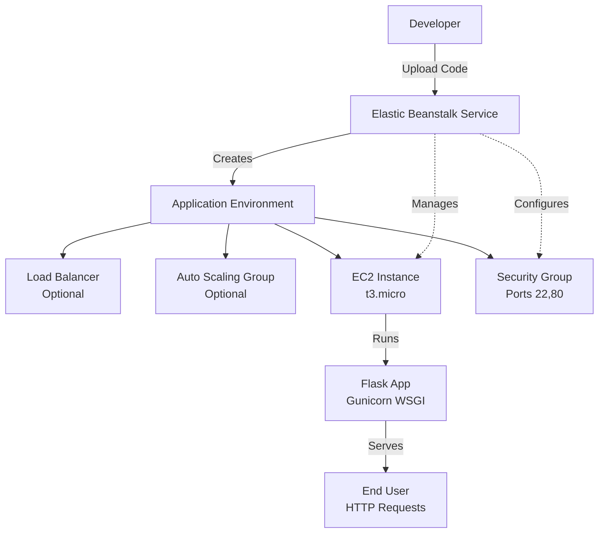

# Deploying a Flask Application on AWS Elastic Beanstalk

**Topics:** Elastic Beanstalk, Flask, PaaS, Gunicorn, Procfile

## Overview

This lab demonstrates deploying a Flask web application using AWS Elastic Beanstalk, a Platform as a Service (PaaS) that handles infrastructure provisioning and management. You'll create a simple Flask app, package it, and deploy it to a single-instance environment. The activity covers application preparation, packaging, deployment, and verification.

Elastic Beanstalk automatically creates required AWS resources, deploys the application, and handles scaling, monitoring, and health checks. You'll learn about Procfile configuration, dependency management, and single-instance environments.

## Key Concepts

| Concept | Description |
| :------- | :---------- |
| Elastic Beanstalk | Managed service for deploying and scaling web applications |
| Procfile | Defines how to run the application (e.g., Gunicorn for Flask) |
| requirements.txt | Lists Python dependencies for automatic installation |
| Single Instance Environment | Basic setup with one EC2 instance, no load balancer |
| Gunicorn | WSGI HTTP server for running Flask in production |
| Application Versions | Deployed code packages managed by Elastic Beanstalk |

### Prerequisites

- Active AWS account with billing enabled
- IAM permissions for Elastic Beanstalk and EC2
- Python installed locally for app creation
- Basic knowledge of Flask and web deployment

## Architecture Overview

::: details Click to expand Architecture Diagram

:::

## Phase 1: Create the Flask Application

### Step 1: Create a Project Folder

On your local system, create a folder named: `eb-flask-lab`

### Step 2: Create application.py

Inside the folder, create a file named `application.py` with the following code:

```python
from flask import Flask

app = Flask(__name__)

@app.route("/")
def home():
    return "Hello from Flask on Elastic Beanstalk!"

@app.route("/health")
def health():
    return "OK"

if __name__ == "__main__":
    app.run(host='0.0.0.0')
```

> [!TIP]
> We use `host='0.0.0.0'` so that the Flask application running on EC2 is accessible from external systems using the EC2 public IP. By default, Flask runs on `127.0.0.1` (localhost), which means the application is accessible only from inside the EC2 instance.
> 
> Note: In production on Elastic Beanstalk, the application will be run by Gunicorn via the Procfile, so the `if __name__ == "__main__"` block is not executed. The port is handled by the $PORT environment variable.

### Step 3: Create requirements.txt

Create a file named `requirements.txt` and add the following dependencies:

```text
Flask
gunicorn
```

> [!NOTE]
> The `requirements.txt` file lists all Python libraries and their versions required for the application. Elastic Beanstalk uses this file to automatically install dependencies using pip.

### Step 4: Create Procfile (MOST IMPORTANT)

Create a file named exactly `Procfile` (with no file extension).

Contents:

```text
web: gunicorn --bind 0.0.0.0:8000 application:app
```

> [!WARNING]  
> **Windows Note:** In Notepad, select **Save as type: All Files** to ensure it doesn't save as `Procfile.txt`.


> [!TIP] Procfile
> A Procfile tells Elastic Beanstalk how to start the application. It specifies the process type (web) and the command to run the application (Gunicorn for Flask), binding to port 8000 which is the port that Nginx proxies to in this Elastic Beanstalk platform.
> 
> Without a Procfile, Elastic Beanstalk may not know which command to execute, leading to deployment errors.

### Step 5: Verify Folder Contents

Ensure your folder contains exactly these 3 files:

```text
eb-flask-lab/
├── application.py
├── requirements.txt
└── Procfile
```

> [!TIP]
> Install dependencies and test locally: Run `pip install -r requirements.txt` then `python application.py` to ensure it starts without errors.


## Phase 2: Package the Application

### Step 1: Select the Files

Inside the eb-flask-lab folder, select all 3 files (`application.py`, `requirements.txt`, and `Procfile`).

### Step 2: Create ZIP

**On Windows/Mac:** Right-click → Compress to ZIP file. Rename it to: `eb-flask-lab.zip`

**On Ubuntu/Linux:** Open terminal in the eb-flask-lab folder and run:

```bash
zip eb-flask-lab.zip application.py requirements.txt Procfile
```

### Step 3: Confirm ZIP Contents

Open the ZIP file. You must see the files directly at the top level.

> [!IMPORTANT]
> If the files are inside a sub-folder within the ZIP, the deployment will fail. Elastic Beanstalk expects all required files at the root level of the ZIP file.


## Phase 3: Deploy on Elastic Beanstalk (AWS Console)

### Step 1: Open Elastic Beanstalk

Navigate to the AWS Console → Search for Elastic Beanstalk. Select your preferred region (ensure it supports Elastic Beanstalk).

### Step 2: Create Environment

1. Click **Create environment**
2. **Environment tier:** Select **Web server environment**
3. **Application information:** Name it `EB-Flask-Lab`
4. **Platform:**
   - Platform: **Python**
   - Platform branch: Latest Python on Amazon Linux
   - Platform version: Recommended

### Step 3: Upload Your Code

1. In **Application code**, select **Upload your code**
2. **Version label:** `v1`
3. **Source code origin:** **Local file**
4. Click **Choose file** and select `eb-flask-lab.zip`
5. **Presets:** Select **Single instance (free tier eligible)**
6. Click **Next**

**Verification:** Confirm ZIP upload succeeds and environment creation starts.


## Phase 4: Configure Service Access (IAM Roles)

### Step 1: Service Role

If the dropdown is empty:

1. Click **Create role** (opens IAM)
2. Use case: **Elastic Beanstalk**
3. Name it `aws-elasticbeanstalk-service-role`
4. Return to EB tab, click **Refresh**, and select the role

### Step 2: EC2 Instance Profile

If the service role dropdown is empty:

1. Click **Create role** (opens IAM)
2. Use case: **Elastic Beanstalk**
3. Select **Elastic Beanstalk** → **EC2 role for Elastic Beanstalk**
4. Role name: `aws-elasticbeanstalk-ec2-role`
5. Click **Create role**

Select the created role and continue.

### Step 3: Finalize

Leave EC2 Key pair blank. Click Next, keep remaining defaults, and click Create environment.

**Verification:** Environment creation starts without errors.


## Phase 5: Monitor & Test

### Step 1: Wait for Deployment

Open the Events tab. Deployment is successful when:

- Message: "Environment successfully launched"
- Health: **OK**
- A **Domain URL** appears at the top

### Step 2: Test the App

Click the Domain link.

**Expected Output:** `Hello from Flask on Elastic Beanstalk!`

### Step 3: Test Health Check

Append `/health` to the URL.

**Expected Output:** `OK`

**Verification:** Both URLs load correctly.


### Validation

::: details Validation

- **Local Testing:** Confirm Flask app runs locally without errors.
- **ZIP Structure:** Verify files are at root level in the ZIP.
- **Deployment:** Check environment health is "OK" and domain URL is accessible.
- **Application Access:** Test both root and /health endpoints.
- **Logs:** Review EB logs for any deployment issues.
:::


### Troubleshooting

::: details Troubleshooting

#### Accessing Logs in Elastic Beanstalk

If environment health is "Degraded" or "Severe":

1. Go to EB → Environment → Logs
2. Click "Request Logs" → "Last 100 Lines" or "Full Logs"
3. Download and review for errors (e.g., import failures, port issues)
4. Alternatively, SSH into EC2 via EB → Environment → EC2 Instance → Connect

#### Common Mistakes

- **Procfile must be "Procfile"** (no .txt extension)
- **ZIP must contain files at root level** (not inside a sub-folder)
- **Upload must be Local file** (not Public S3 URL)
- **IAM roles must be created/selected** if "No options" appear
- **Packages in requirements.txt must be compatible with the EB platform's Python version**
- **Application must listen on 0.0.0.0** in production (handled by Gunicorn)

#### Common Issues

- **502 Bad Gateway:** Check Procfile syntax and file location in ZIP. Also verify the port in Procfile matches what Nginx expects (check /var/log/nginx/error.log for upstream port).
- **Application version not found:** Verify files are at root level in ZIP
- **Environment health degraded:** Review logs for Python/dependency errors
- **Permission denied:** Ensure IAM roles are correctly assigned
- **Port issues:** Gunicorn handles port binding; don't specify port in application.py when deployed
:::

### Cost Considerations

::: details Cost Considerations

- **Pricing:** EB ~$0.01/hour for t3.micro EC2; free tier covers 750 hours
- **Tip:** Terminate environments immediately to avoid charges. Monitor via CloudWatch and set billing alerts.

:::


### Cleanup

::: details Cleanup

1. Go to **Elastic Beanstalk** → **Environments**
2. Select your environment → **Actions** → **Terminate environment**
3. Confirm termination

:::

## Result

Successfully deployed a Flask application on AWS Elastic Beanstalk. Demonstrated PaaS benefits, proper application packaging, and infrastructure abstraction for simplified web application deployment.

Key takeaways include:
1. Elastic Beanstalk abstracts infrastructure management
2. Procfile is critical for defining the startup command
3. Files must be at ZIP root level
4. IAM roles are required for EB to manage resources
5. Monitor logs and health status for debugging
6. Always terminate environments after use to avoid costs

## Viva Questions

1. What is the purpose of a Procfile in Elastic Beanstalk?
2. Why must application files be at the root level of the ZIP?
3. What is the difference between single instance and load balanced environments?
4. Why do we use Gunicorn instead of running Flask directly?
5. What happens if you don't specify `host='0.0.0.0'` in Flask?
